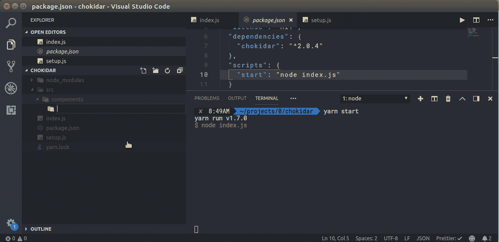

# 如何自动创建文件，并节省时间与魔术脚手架

> 原文：<https://www.freecodecamp.org/news/how-to-create-files-automatically-and-save-time-with-magic-scaffolding-8dcd1b31483/>

**在我们开始之前:**本文使用 JavaScript / Node.js 示例代码，但是您可以使用合适的工具将这些概念移植到任何语言中。

### 激动人心的介绍

您是否发现自己在项目中一遍又一遍地创建相同的文件？

我也是。

#### 我的手指受伤了！

我并不惊讶。你抢了机器人的工作。

重复创建相同的文件既无聊又没必要。

#### TLDR？我明白了——这是一个演示



Magical automation — as promised.

#### 给我看看代码

我尊重你的紧迫感——我就开门见山了。

### 代码

我们希望自动创建文件，这就是为什么你们今天都来了。首先，我们需要确定我们想要创建的文件。

我最近创建了很多 React 组件，所以我的设置围绕着它——但是你可以对任何东西进行调整。

我把这个分成了四个步骤。现在告诉你，这样你就可以管理你的期望。如果你不能处理任何超过三步的事情，那么我们就有麻烦了...

#### 第一步:模板

一次搞定就能获利。

我们需要模板。我使用了[模板文字](https://developers.google.com/web/updates/2015/01/ES6-Template-Strings)，但是用任何你觉得有意义的方式来做——要有创造性。

这些是我每次创建 React 组件时创建的文件:

1.  **index.jsx**
2.  **{Component}.test.js**
3.  **{组件}。萨斯**

**注:** {Component}暗指[字符串插值](https://en.wikipedia.org/wiki/String_interpolation#Examples)。

我用 [Jest](https://jestjs.io/docs/en/tutorial-react) 进行测试，并使用 [create-react-app](https://github.com/facebook/create-react-app) 样板文件。我知道现在很多人更喜欢[CSS-in-JS](https://alligator.io/react/css-in-js-roundup-styling-react-components/)——但是嘿。请在评论中告诉我你喜欢什么。

不管怎样，我们开始吧:

```
const templates = {

  index: name => `// @flow
import React from 'react';
import './${name}.css';
// TODO: write rest of ${name} component
const ${name} = () => (
  <div className="${name.toLowerCase()}">
    <span>rest of component</span>
  </div>
);
export default ${name};`,

  test: name => `// TODO: TDD
import { shallow, render } from 'enzyme';
import renderer from 'react-test-renderer';
import React from 'react';
import ${name} from '.';
const component = <${name} />;
describe('The ${name} component', () => {
  it('renders correctly', () => {
    const wrapper = render(component);
    expect(wrapper.hasClass('${name.toLowerCase()}')).toBeTruthy();
    const tree = renderer.create(component).toJSON();
    expect(tree).toMatchSnapshot();
  });
});`,

  sass: name => `.${name.toLowerCase()}
  background: initial`,
};
```

这是你将在这里看到的最混乱的代码——pinky promise。

因此，我们有一个具有三个属性的对象:index、test 和 sass。每个都承载一个函数，该函数接受一个名称并返回一个插入了该名称的模板。似乎是合法的。

#### 第二步:我们来做一些函数吧！

我们使用与 Node 打包在一起的 [fs 模块](https://nodejs.org/api/fs.html#fs_file_system)。太棒了。它做很多事情。

我们将使用一些[箭头函数](https://developer.mozilla.org/en-US/docs/Web/JavaScript/Reference/Functions/Arrow_functions)和一点点[函数编程](https://mostly-adequate.gitbooks.io/mostly-adequate-guide/)。不要害怕，顺其自然吧。

双箭头函数语法称为[curry](https://stackoverflow.com/questions/32782922/what-do-multiple-arrow-functions-mean-in-javascript)。看起来怪怪的也没关系。当我第一次看到它时，我吓坏了，但它允许[超级酷的东西](https://mostly-adequate.gitbooks.io/mostly-adequate-guide/ch04.html#cant-live-if-livin-is-without-you)。事实上，这里有一个快速演示:

```
const fs = require('fs');

const fileExists = path => file => fs.existsSync(`${path}/${file}`);

const fileExistsInSrc = fileExists('/src'); // file => fs.existsSync(`${path}/${file}`)

fileExistsInSrc('index.js') // true || false
```

所以这就是[与](https://mostly-adequate.gitbooks.io/mostly-adequate-guide/ch04.html#cant-live-if-livin-is-without-you)[部分申请](https://stackoverflow.com/questions/218025/what-is-the-difference-between-currying-and-partial-application)的同时——这也是[关闭](https://developer.mozilla.org/en-US/docs/Web/JavaScript/Closures)。

希望没有人因为一些技术问题把我叫出来，但是如果你觉得有必要的话，请在评论里骚扰我。

让我们继续:

```
const fs = require('fs');

const fileExists = path => file => fs.existsSync(`${path}/${file}`);

const writeToPath = path => (file, content) => {
  const filePath = `${path}/${file}`;

  fs.writeFile(filePath, content, err => {
    if (err) throw err;
    console.log("Created file: ", filePath);
    return true;
  });
};
```

首先我们要求 [**fs**](https://nodejs.org/api/fs.html#fs_file_system) 。我们在生活中需要它。

然后我们将 **fileExists** 声明为[函数表达式](https://developer.mozilla.org/en-US/docs/Web/JavaScript/Reference/Operators/function)。

最后，我们有另一个函数表达式叫做 **writeToPath。**它采用**路径**并返回另一个函数，该函数接受一个**文件**字符串和该文件的**内容**。然后，它写入文件或抛出一个错误(最坏的情况)。

你理解对了吗？我们正在创建一些文件。

#### 第三步:会见乔基达

有趣的事实:这是一个印度单词。

> **乔基达尔**——(*印度*)守夜人、看守人、看门人；居住在“chowki”、警察局或警卫室的人。

不过，我们正在谈论的是 [npm 包](https://github.com/paulmillr/chokidar)。它是基于我们的新朋友 [fs](https://nodejs.org/api/fs.html#fs_class_fs_fswatcher) 的，你可以用它做很多有趣的事情。

它像鹰一样为我们看着我们的文件。

不完全像鹰。

它不是一只鸟。

一点都不喜欢。

无论如何，这是代码…

```
const chokidar = require("chokidar");

const watcher = chokidar
  .watch("src/components/**", { ignored: /node_modules/ })
  .on("addDir", (path, event) => {
    const name = path.replace(/.*\/components\//, "");
    const goodToGo = /^[^\/_]*$/.test(name);
    if (goodToGo) createFiles(path, name);
  });
```

首先我们需要它。

接下来我们定义我们想看什么。我在观察 **src/components** 目录，但是你可以观察任何一组路径。你甚至可以传递一个[路径数组](https://github.com/paulmillr/chokidar#api)。如果你认不出 **src/components/**** 中的 ****** 部分——它被称为 [glob 模式](https://en.wikipedia.org/wiki/Glob_%28programming%29)。

之后，我们定义我们想要监听的事件。我只监听添加一个带有**的目录。on("addDir")** 但是你也可以收听[其他事件](https://github.com/paulmillr/chokidar#methods--events)。

接下来，让我们通过替换组件名称前的任何内容来提取组件名称:

```
src/components/Header/components/Title
```

成为

```
Title
```

最后，我们将检查组件名是否通过了这个正则表达式:

```
/^[^\/_]*$/
```

因此，只要它没有正斜杠或下划线，就可以运行。这避免了错误地污染 __tests__ 文件夹或嵌套的/目录。

#### 第四步:是时候制作一些文件了！

您到达了最后一步。恭喜你！非常棒。

下一个函数恰当地命名为 **createFiles** 。

它有点乱——可以重构。

如果下面的代码冒犯了你，我提前道歉。

让我们开始吧:

```
function createFiles(path, name) {
  const files = {
    index: "index.jsx",
    test: `${name}.test.js`,
    sass: `${name}.sass`
  };

  if (name !== "components") {
    const writeFile = writeToPath(path);
    const toFileMissingBool = file => !fileExists(path)(file);
    const checkAllMissing = (acc, cur) => acc && cur;

    const noneExist = Object.values(files)
      .map(toFileMissingBool)
      .reduce(checkAllMissing);

    if (noneExist) {
      console.log(`Detected new component: ${name}, ${path}`);
      Object.entries(files).forEach(([type, fileName]) => {
        writeFile(fileName, templates[type](name));
      });
    }
  }
}
```

所以在顶部，我们声明了 **files** 对象——这是一个文件名字符串列表，我们将 **name** 参数注入其中。你可能已经注意到它和**模板**对象有相同的键。这很重要。

**if** 语句对于我的设置来说非常具体。如果新文件夹名为组件，我不想创建我的文件**。我只在组件子文件夹**中创建组件**。**

*   **writeFile** 是我们的函数 **writeToPath** [部分应用](https://stackoverflow.com/questions/218025/what-is-the-difference-between-currying-and-partial-application)。这是一个函数，当用文件名和一些内容调用时，它在给定的路径中创建一个文件。
*   **toFileMissingBool** 接受一个文件名，如果该文件在给定的路径中不存在，则返回 true。我知道函数的名字很奇怪，但是我保证用几行代码会更有意义。
*   **checkAllMissing** 是我们要传递给 [**reduce**](https://developer.mozilla.org/en-US/docs/Web/JavaScript/Reference/Global_Objects/Array/Reduce) 的一个函数。它接受两个布尔值，如果都为真，则返回真。这就是[布尔代数](https://benmccormick.org/2018/03/27/cs-basics-boolean/)。我们也在使用 [**减少**](https://developer.mozilla.org/en-US/docs/Web/JavaScript/Reference/Global_Objects/Array/Reduce) 数组**的方法。不要害怕减少。它超级酷，在这种情况下真的很有用。**

**先说变量**不存在**。如果为真，那么我们想要创建的文件都不存在于新文件夹中。这个想法是，你不能仅仅因为一个文件夹没有测试文件或 sass 文件就乱动它。也许那个文件夹不需要。**

```
`const noneExist = Object.values(files)
  .map(toFileMissingBool)      
  .reduce(checkAllMissing);`
```

**这就是为什么我创建了上面那些奇怪命名的函数。**

**我们**将**文件**中的值**映射到一个**布尔值**，它表示该文件是否丢失。然后，我们使用布尔值和**的**数组将**简化为单个**布尔值**，该值表示所有文件是否存在。****

**所以如果它们都是**真，**那么**不存在**也是**真。**但如果有一个**为假，**则**不存在**将为**假**。**

**我希望你都明白了。有点拗口。**

**最后一位代码:**

```
`Object.entries(files).forEach(([type, fileName]) => {
  writeFile(fileName, templates[type](name)); 
});`
```

**我们获取键(**类型)**和值**(文件名)**，并用相关模板的内容在给定路径中编写一个文件。**

#### **[鳍。](https://www.quora.com/What-does-fin-mean-at-the-end-of-a-film-or-story?share=1)**

**

“Big sea turtle swimming through the ocean at Kaputas Beach” by [Randall Ruiz](https://unsplash.com/@ruizra?utm_source=medium&utm_medium=referral) on [Unsplash](https://unsplash.com?utm_source=medium&utm_medium=referral)** 

**那张海龟的照片代表了你现在一切都自动化后的自由感。**

**如果你想要自动创建 react 组件的全部代码，[在这里](https://gist.github.com/Bamblehorse/6ad136c83e6fd2ea62375fa92d843a14)。**

**让我知道你的想法——保持联系。**

**如果你发现任何错误，告诉我。**

**在 [Twitter](https://twitter.com/Bamblehorse) 、 [Medium](https://medium.com/@Bamblehorse) 或 [Github](https://github.com/Bamblehorse) 上关注我。**