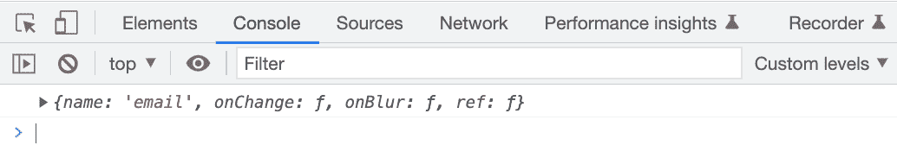
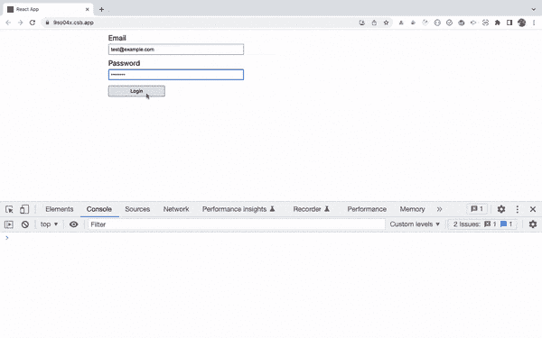
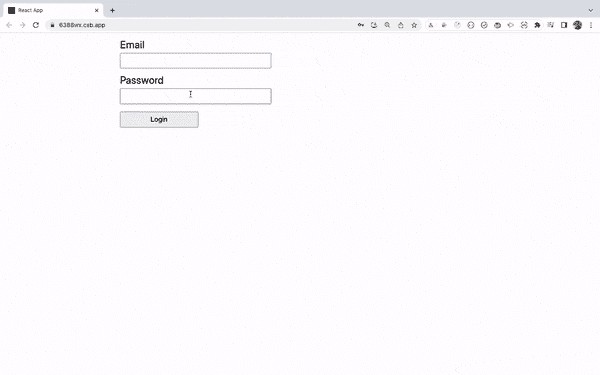
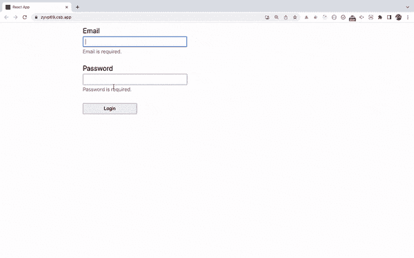
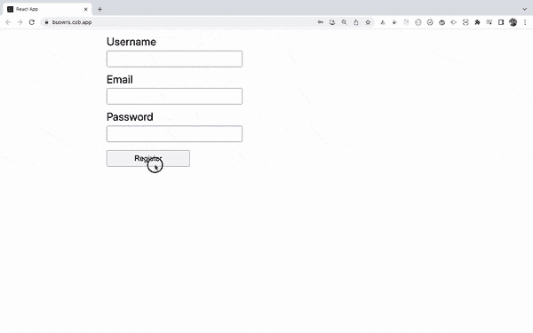
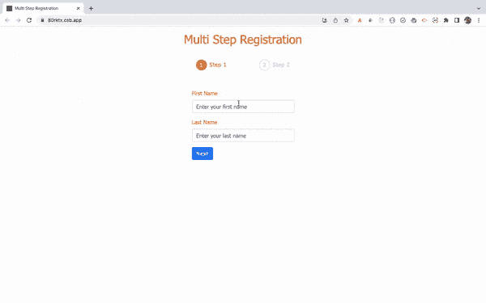
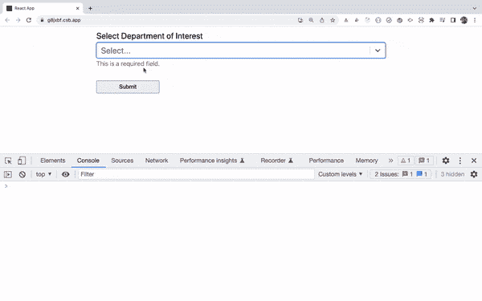
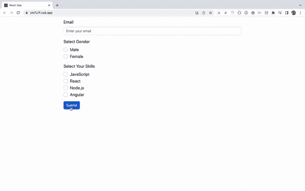
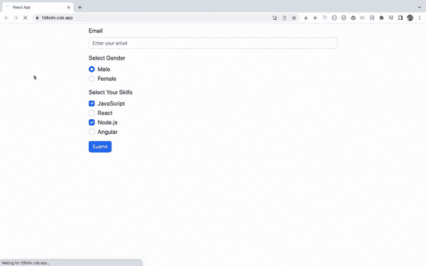

# 如何使用 react-hook-form 在 React 中创建表单

> 原文：<https://www.freecodecamp.org/news/how-to-create-forms-in-react-using-react-hook-form/>

在 React 中创建表单是一项复杂的任务。它包括处理所有的输入状态及其变化，并在表单提交时验证输入。

对于简单的表单，事情通常是可以管理的。但是随着表单变得越来越复杂，需要添加各种验证，这就变成了一项复杂的任务。

因此，我们可以使用最流行的 React 库， [react-hook-form](https://react-hook-form.com/) ，而不是手动编写所有代码和处理带有验证逻辑的复杂表单。

与 [formik](https://formik.org/) 、 [react final form](https://final-form.org/react/) 等相比，它是最流行的创建表单的 React 库，我在所有的客户项目中都使用它。

在本文中，我们将详细探讨如何使用 [react-hook-form](https://react-hook-form.com/) 库。

所以让我们开始吧。

## 为什么 react-hook-form 库是 react 中最流行的表单库

以下是为什么`react-hook-form`是创建 React 表单的流行选择的一些原因。

*   与备选方案相比，应用程序中重新渲染的次数更少，因为它使用引用而不是状态。
*   与`formik`、`react-final-form`和其他替代方案相比，您需要编写的代码量更少。
*   `react-hook-form`与用于模式验证的`yup`库很好地集成，因此您可以组合自己的验证模式。
*   与其他替代方案相比，安装时间更短。

查看 [react-hook-form](https://react-hook-form.com/) 网站获取更详细的对比。

## 如何不使用库创建表单

在使用`react-hook-form`库创建表单之前，让我们不使用任何库创建一个简单的表单。

看看下面的代码:

```
import React, { useState } from "react";
import "./styles.css";

export default function App() {
  const [state, setState] = useState({
    email: "",
    password: ""
  });

  const handleInputChange = (event) => {
    const { name, value } = event.target;
    setState((prevProps) => ({
      ...prevProps,
      [name]: value
    }));
  };

  const handleSubmit = (event) => {
    event.preventDefault();
    console.log(state);
  };

  return (
    <div className="App">
      <form onSubmit={handleSubmit}>
        <div className="form-control">
          <label>Email</label>
          <input
            type="text"
            name="email"
            value={state.email}
            onChange={handleInputChange}
          />
        </div>
        <div className="form-control">
          <label>Password</label>
          <input
            type="password"
            name="password"
            value={state.password}
            onChange={handleInputChange}
          />
        </div>
        <div className="form-control">
          <label></label>
          <button type="submit">Login</button>
        </div>
      </form>
    </div>
  );
} 
```

这里有一个[代码沙盒演示](https://codesandbox.io/s/login-form-zird0r?file=/src/App.js)。

在上面的代码中，我们只有两个输入字段，即`email`和`password`以及一个提交按钮。

每个输入字段都添加了一个`value`和`onChange`处理程序，因此我们可以根据用户的输入更新状态。

此外，我们还添加了一个`handleSubmit`方法，将表单中输入的数据显示到控制台。

这看起来不错。但是，如果我们需要添加验证，如必填字段验证、最小长度验证、密码验证、电子邮件字段验证，并显示相应的错误消息，该怎么办呢？

随着输入字段及其验证数量的增加，代码将变得更加复杂和冗长。

## 如何安装 react-hook-form

在任何应用程序中，显示表单都是非常常见的需求。

所以让我们来学习为什么以及如何使用 react-hook-form。为此，我们将创建一个新的 React 应用程序。

通过从终端运行以下命令创建一个新的 React 项目:

```
create-react-app demo-react-hook-form
```

项目创建完成后，删除`src`文件夹中的所有文件，并在`src`文件夹中创建新的`index.js`和`styles.css`文件。

要安装`react-hook-form`库，从终端执行以下命令:

```
npm install react-hook-form@7.38.0

OR

yarn add react-hook-form@7.38.0
```

这里，我们正在安装版本`react-hook-form`库的版本`7.38.0`，这是在撰写本文时的最新版本。

## 如何创建初始页面

打开`src/index.js`文件，在其中添加以下内容:

```
import React from "react";
import ReactDOM from "react-dom/client";
import App from "./App";

const root = ReactDOM.createRoot(document.getElementById("root"));
root.render(<App />); 
```

请注意，上面的代码使用 React 版本的语法来呈现应用程序。

如果您使用的 React 版本低于 18(您可以从`package.json`文件中确认)，那么在您的`src/index.js`文件中添加以下代码。

```
import React from 'react';
import ReactDOM from 'react-dom';
import App from './App';

ReactDOM.render(<App />, document.getElementById('root'));
```

现在，打开`src/styles.css`文件，将[中的内容添加到](https://gist.github.com/myogeshchavan97/2e0b00d38f8f927799d8180906e9dde3)中。

现在，在`src`文件夹中创建一个名为`App.js`的新文件，内容如下:

```
import React from "react";
import "./styles.css";

export default function App() {
  return (
    <div className="App">
      <form>
        <div className="form-control">
          <label>Email</label>
          <input type="text" name="email" />
        </div>
        <div className="form-control">
          <label>Password</label>
          <input type="password" name="password" />
        </div>
        <div className="form-control">
          <label></label>
          <button type="submit">Login</button>
        </div>
      </form>
    </div>
  );
}
```

这里，我们刚刚在表单中添加了电子邮件和密码字段。

## 如何用 react-hook-form 创建基本窗体

`react-hook-form`库提供了一个`useForm`钩子，我们可以用它来处理表单。

像这样导入`useForm`钩子:

```
import { useForm } from 'react-hook-form';
```

你可以像这样使用`useForm`钩子:

```
const {
  register,
  handleSubmit,
  formState: { errors },
} = useForm();
```

这里，

*   `register`是`useForm`钩子提供的功能。我们可以将它分配给每个输入字段，这样`react-hook-form`就可以跟踪输入字段值的变化
*   `handleSubmit`是提交表单时我们可以调用的函数
*   `errors`是`formState`对象中的嵌套属性，它将包含验证错误(如果有的话)

现在，用下面的代码替换`App.js`文件的内容:

```
import React from "react";
import { useForm } from "react-hook-form";
import "./styles.css";

export default function App() {
  const {
    register,
    handleSubmit,
    formState: { errors }
  } = useForm();

  const onSubmit = (data) => {
    console.log(data);
  };

  return (
    <div className="App">
      <form onSubmit={handleSubmit(onSubmit)}>
        <div className="form-control">
          <label>Email</label>
          <input type="text" name="email" {...register("email")} />
        </div>
        <div className="form-control">
          <label>Password</label>
          <input type="password" name="password" {...register("password")} />
        </div>
        <div className="form-control">
          <label></label>
          <button type="submit">Login</button>
        </div>
      </form>
    </div>
  );
} 
```

在上面的代码中，我们通过向每个`register`函数传递一个唯一的名称，向从`useForm`钩子获得的每个输入字段添加了一个注册函数，如下所示:

```
{...register("email")}
```

我们使用了 spread 操作符，这样`react-hook-form`将会展开所有需要的事件处理程序，比如`onChange`、`onBlur`以及该输入字段的其他道具。

如果您在组件中添加一个`console.log({ ...register("email") });`，您将看到它返回的内容，如下所示:



我们还添加了传递给`handleSubmit`方法的`onSubmit`函数，如下所示:

```
<form onSubmit={handleSubmit(onSubmit)}>
...
```

注意，您需要向为每个输入字段添加的`register`函数传递一个惟一的名称，以便`react-hook-form`可以跟踪变化的数据。

当我们提交表单时，`handleSubmit`函数将处理表单提交。它会将用户输入的数据发送到`onSubmit`函数，我们在这里将用户数据记录到控制台。

```
const onSubmit = (data) => {  
 console.log(data);
};
```

现在，通过运行`npm start`或`yarn start`命令启动应用程序，您将看到以下屏幕:



这里有一个[代码沙盒演示](https://codesandbox.io/s/login-form-forked-9so04x?file=/src/App.js)。

如您所见，当我们提交表单时，用户输入的详细信息显示在控制台中。

此外，与没有`react-hook-form`的代码(我们在本文开头的[代码沙箱演示](https://codesandbox.io/s/login-form-zird0r?file=/src/App.js)中看到的)相比，这段代码要简单得多。

这是因为我们不必为每个输入字段添加`value`和`onChange`处理程序，也没有必要自己管理应用程序状态。

## 如何向表单添加验证

现在，让我们向输入字段添加必填字段和最小长度验证。

要添加验证，我们可以将一个对象作为第二个参数传递给`register`函数，如下所示:

```
<input
  type="text"
  name="email"
  {...register("email", {
    required: true
  })}
/>

<input
  type="password"
  name="password"
  {...register("password", {
    required: true,
    minLength: 6
  })}
/>
```

这里，对于电子邮件字段，我们指定必填字段验证。对于密码字段，我们指定必填字段和最小 6 个字符长度验证。

当验证失败时，来自`useForm`钩子的`errors`对象将用验证失败的字段填充。

所以我们将使用`errors`对象来显示定制错误消息。

打开`App.js`文件，将其内容替换为以下内容:

```
import React from "react";
import { useForm } from "react-hook-form";
import "./styles.css";

export default function App() {
  const {
    register,
    handleSubmit,
    formState: { errors }
  } = useForm();

  const onSubmit = (data) => {
    console.log(data);
  };

  return (
    <div className="App">
      <form onSubmit={handleSubmit(onSubmit)}>
        <div className="form-control">
          <label>Email</label>
          <input
            type="text"
            name="email"
            {...register("email", {
              required: true,
              pattern: /^[^@ ]+@[^@ ]+\.[^@ .]{2,}$/
            })}
          />
          {errors.email && errors.email.type === "required" && (
            <p className="errorMsg">Email is required.</p>
          )}
          {errors.email && errors.email.type === "pattern" && (
            <p className="errorMsg">Email is not valid.</p>
          )}
        </div>
        <div className="form-control">
          <label>Password</label>
          <input
            type="password"
            name="password"
            {...register("password", {
              required: true,
              minLength: 6
            })}
          />
          {errors.password && errors.password.type === "required" && (
            <p className="errorMsg">Password is required.</p>
          )}
          {errors.password && errors.password.type === "minLength" && (
            <p className="errorMsg">
              Password should be at-least 6 characters.
            </p>
          )}
        </div>
        <div className="form-control">
          <label></label>
          <button type="submit">Login</button>
        </div>
      </form>
    </div>
  );
} 
```

如果您现在检查应用程序，您将看到以下屏幕:



这里有一个[代码沙盒演示](https://codesandbox.io/s/login-form-with-validations-6388wx?file=/src/App.js)。

正如您所看到的，一旦我们提交表单，然后尝试在输入字段中输入值，每个输入字段都会立即出现验证错误。

如果任何输入字段有任何错误，`errors`对象将被填入我们用来显示自定义错误消息的错误类型，如下所示:

```
{errors.email && errors.email.type === "required" && (
    <p className="errorMsg">Email is required.</p>
)}
{errors.email && errors.email.type === "pattern" && (
    <p className="errorMsg">Email is not valid.</p>
)}
```

这里，根据错误的类型，我们显示不同的错误消息。

使用 [ES11 可选链接操作符](https://developer.mozilla.org/en-US/docs/Web/JavaScript/Reference/Operators/Optional_chaining)，您可以像这样进一步简化上面的代码:

```
{errors.email?.type === "required" && (
    <p className="errorMsg">Email is required.</p>
)}
{errors.email?.type === "pattern" && (
    <p className="errorMsg">Email is not valid.</p>
)}
```

以类似的方式，我们添加了密码字段验证。

此外，如您所见，当我们提交表单时，如果输入字段有任何验证错误，每个输入字段都会自动聚焦。

此外，只要存在验证错误，就不会提交表单。如果您检查浏览器控制台，您会看到只有当表单有效并且没有错误时，才会打印出`console.log`语句。

所以使用`react-hook-form`减少了我们必须编写的代码量。验证也是响应性的，所以一旦字段变得有效，错误消息就会立即消失。

但是随着每个字段验证数量的增加，条件检查和错误消息代码仍然会增加。因此，我们可以进一步重构代码，使其更加简单。

看看下面的代码:

```
import React from "react";
import { useForm } from "react-hook-form";
import "./styles.css";

export default function App() {
  const {
    register,
    handleSubmit,
    formState: { errors }
  } = useForm();

  const onSubmit = (data) => {
    console.log(data);
  };

  return (
    <div className="App">
      <form onSubmit={handleSubmit(onSubmit)}>
        <div className="form-control">
          <label>Email</label>
          <input
            type="text"
            name="email"
            {...register("email", {
              required: "Email is required.",
              pattern: {
                value: /^[^@ ]+@[^@ ]+\.[^@ .]{2,}$/,
                message: "Email is not valid."
              }
            })}
          />
          {errors.email && <p className="errorMsg">{errors.email.message}</p>}
        </div>
        <div className="form-control">
          <label>Password</label>
          <input
            type="password"
            name="password"
            {...register("password", {
              required: "Password is required.",
              minLength: {
                value: 6,
                message: "Password should be at-least 6 characters."
              }
            })}
          />
          {errors.password && (
            <p className="errorMsg">{errors.password.message}</p>
          )}
        </div>
        <div className="form-control">
          <label></label>
          <button type="submit">Login</button>
        </div>
      </form>
    </div>
  );
} 
```

在上面的代码中，我们更改了电子邮件和密码验证代码。

对于电子邮件输入字段，我们更改了之前的代码:

```
 {...register("email", {
     required: true,
     pattern: /^[^@ ]+@[^@ ]+\.[^@ .]{2,}$/
 })}
```

到下面的代码:

```
{...register("email", {
    required: "Email is required.",
    pattern: {
        value: /^[^@ ]+@[^@ ]+\.[^@ .]{2,}$/,
        message: "Email is not valid."
    }
})}
```

这里，我们已经直接提供了在添加验证本身时想要显示的错误消息。

所以我们不再需要为每次验证增加额外的检查。我们使用`errors`对象中可用的`message`属性为每个输入字段显示错误消息，如下所示:

```
{errors.email && <p className="errorMsg">{errors.email.message}</p>}
```

因此，通过这样做，代码被进一步简化，这使得将来添加额外的验证变得容易。

注意，如果有验证错误，onSubmit 处理程序将不会被执行，相应的输入字段将自动聚焦(这是一件好事)。

这里有一个更新的[代码沙盒演示](https://codesandbox.io/s/login-form-with-validations-simplified-7o4y0k?file=/src/App.js)。

## 如何添加多重验证

您甚至可以通过添加一个`validate`对象为输入字段提供多个验证。如果您需要像这样执行复杂的验证，这很有用:

```
 <input
    type="password"
    name="password"
    {...register("password", {
        required: true,
        validate: {
            checkLength: (value) => value.length >= 6,
            matchPattern: (value) =>
            /(?=.*\d)(?=.*[a-z])(?=.*[A-Z])(?!.*\s)(?=.*[!@#$*])/.test(
                value
            )
        }
    })}
/>
```

为了显示错误消息，我们这样使用它:

```
{errors.password?.type === "required" && (
    <p className="errorMsg">Password is required.</p>
)}
{errors.password?.type === "checkLength" && (
    <p className="errorMsg">
    	Password should be at-least 6 characters.
    </p>
)}
{errors.password?.type === "matchPattern" && (
    <p className="errorMsg">
    	Password should contain at least one uppercase letter, lowercase
letter, digit, and special symbol.
    </p>
)}
```

这里有一个[代码沙盒演示](https://codesandbox.io/s/login-form-with-validations-multiple-zyvp69?file=/src/App.js)。



## 如何重置表单值

有时，我们需要在某个动作之后重置/清除用户输入的数据。

例如，一旦提交了表单，我们希望显示成功消息，然后清除表单数据，这样用户就不会再次提交相同的数据。

在这种情况下，我们可以调用由`useForm`钩子返回的`reset`函数来清除表单数据。

```
const { reset } = useForm(); 
```

这里有一个[代码沙盒演示](https://codesandbox.io/s/reset-form-buowrs?file=/src/App.js)。



`reset`函数还接受一个可选对象，您可以在其中传递希望表单数据重置的值:

```
reset({
    username: "Alex",
    email: "alex@example.com",
    password: "Test@123"
});
```

这里，用户名、电子邮件或密码应该与传递给`register`函数的名称相匹配，因此相应的输入字段将被设置为传递的值。

## 如何使用默认值设置初始表单值

[useForm](https://react-hook-form.com/api/useform/) 钩子接受一个选项列表，其中一个是`defaultValues`。

使用`defaultValues`,我们可以设置表单元素的初始值，并在从一个页面移动到另一个页面时重新设置它们，如下所示:

```
const { user } = props;
const {
    register,
    handleSubmit,
    formState: { errors }
} = useForm({
   defaultValues: {
      first_name: user.first_name,
      last_name: user.last_name
    }
});

// JSX

<Form.Control
    type="text"
    {...register("first_name")}
/>

<Form.Control
    type="text"
    {...register("last_name")}
/> 
```

在上面的代码中，对于`register`函数，我们传递了`first_name`作为名称。这意味着在`defaultValues`中我们使用相同的名字来设置初始值。

因此，为了正确设置输入值，您需要使用与使用`defaultValues`设置初始值的`register`函数相同的名称。

这里有一个[代码沙盒演示](https://codesandbox.io/s/nice-khorana-80rktx?file=/src/components/FirstStep.js)。



## 如何在其他库上使用 react-hook-form

有时，我们可能会使用一些外部库，如 [react-select](https://react-select.com/home) 来允许在下拉列表中进行多重选择。

在这种情况下，我们不能直接添加`register`函数来显示选择下拉菜单。因此，如果我们想添加`react-hook-form`验证而不编写自己的代码和处理函数，我们可以像这样使用`react-hook-form`中的`Controller`组件:

```
import React from "react";
import { useForm, Controller } from "react-hook-form";
import Select from "react-select";
import "./styles.css";

const departments = [
  { value: "Computer-Science", label: "Computer Science" },
  { value: "Physics", label: "Physics" },
  { value: "Chemistry", label: "Chemistry" },
  { value: "Mathematics", label: "Mathematics" }
];

export default function App() {
  const {
    control,
    handleSubmit,
    formState: { errors }
  } = useForm();

  const onSubmit = (data) => {
    console.log(data);
  };

  return (
    <div className="App">
      <form onSubmit={handleSubmit(onSubmit)}>
        <div className="form-control">
          <label>Select Department of Interest</label>
          <Controller
            name="department"
            control={control}
            rules={{ required: true }}
            render={({ field }) => (
              <Select {...field} isMulti options={departments} />
            )}
          />
          {errors.department && (
            <p className="errorMsg">This is a required field.</p>
          )}
        </div>
        <div className="form-control">
          <label></label>
          <button type="submit">Submit</button>
        </div>
      </form>
    </div>
  );
} 
```

这里有一个[代码沙盒演示](https://codesandbox.io/s/react-hook-form-controller-g8jxbf?file=/src/App.js)。

正如你在上面的代码中看到的，我们在顶部导入了`Controller`组件:

```
import { useForm, Controller } from "react-hook-form";
```

和`control`从`useForm`这样挂钩:

```
const {
    control,
    handleSubmit,
    formState: { errors }
  } = useForm();
```

注意，我们在这里没有使用`register`函数。

常规使用 [react-select](https://react-select.com/home) 库来允许多重选择是这样的:

```
import Select from "react-select";

// use
<Select isMulti options={options} />
```

但是要将它与`react-hook-form`一起使用，我们需要将它包装在`Controller`组件中:

```
<Controller
    name="department"
    control={control}
    rules={{ required: true }}
    render={({ field }) => (
       <Select {...field} isMulti options={options} />
    )}
 />
```

这里我们要给`Controller`中的`name`道具一个唯一的值。

验证是作为`rules`属性的一部分添加的，我们使用`render`属性来呈现`Select`下拉列表。



## 如何在 react-hook-form 中使用其他输入类型

在这一节中，我们将看到如何使用单选按钮和复选框与`react-hook-form`。

看看下面的代码:

```
import React from "react";
import { Button, Form } from "react-bootstrap";
import { useForm } from "react-hook-form";
import "./styles.css";

export default function App() {
  const {
    register,
    handleSubmit,
    formState: { errors }
  } = useForm();

  const onSubmit = (data) => {
    console.log(data);
  };

  return (
    <div className="container">
      <form onSubmit={handleSubmit(onSubmit)}>
        <Form.Group className="mb-3" controlId="email">
          <Form.Label>Email</Form.Label>
          <Form.Control
            type="email"
            placeholder="Enter your email"
            {...register("email", {
              required: "Please enter your email",
              pattern: {
                value: /^[^@ ]+@[^@ ]+\.[^@ .]{2,}$/,
                message: "Please enter a valid email"
              }
            })}
          />
          {errors.email && <p className="errorMsg">{errors.email.message}</p>}
        </Form.Group>
        <Form.Group className="mb-3" controlId="gender">
          <Form.Label>Select Gender</Form.Label>
          <Form.Check
            type="radio"
            label="Male"
            value="male"
            {...register("gender", {
              required: "Please select your gender"
            })}
          />
          <Form.Check
            type="radio"
            label="Female"
            value="female"
            {...register("gender")}
          />
          {errors.gender && <p className="errorMsg">{errors.gender.message}</p>}
        </Form.Group>
        <Form.Group className="mb-3" controlId="skills">
          <Form.Label>Select Your Skills</Form.Label>
          <Form.Check
            type="checkbox"
            label="JavaScript"
            value="JavaScript"
            {...register("skills", {
              required: "Please select at-least one skill"
            })}
          />
          <Form.Check
            type="checkbox"
            label="React"
            value="react"
            {...register("skills")}
          />
          <Form.Check
            type="checkbox"
            label="Node.js"
            value="nodejs"
            {...register("skills")}
          />
          <Form.Check
            type="checkbox"
            label="Angular"
            value="angular"
            {...register("skills")}
          />
          {errors.skills && <p className="errorMsg">{errors.skills.message}</p>}
        </Form.Group>
        <label></label>
        <Button type="submit" variant="primary">
          Submit
        </Button>
      </form>
    </div>
  );
} 
```

这里有一个[代码沙盒演示](https://codesandbox.io/s/react-hook-form-other-inputs-zm7u7f?file=/src/App.js)。

在上面的代码中，我使用了 [react-bootstrap](https://react-bootstrap.github.io/) 来让 UI 看起来更好，所以`Form.Check`是一个`react-bootstrap`组件。

您需要记住的要点是，我们没有为一组单选按钮和复选框的`register`函数指定相同的名称，如下所示:

```
<Form.Check
    type="radio"
    label="Male"
    value="male"
    {...register("gender", {
        required: "Please select your gender"
    })}
/>
<Form.Check
    type="radio"
    label="Female"
    value="female"
    {...register("gender")}
/>
```

在上面的代码中，我们给了`gender`作为单选按钮的名称，给了`skills`作为所有复选框的名称，如下所示:

```
<Form.Check
    type="checkbox"
    label="JavaScript"
    value="JavaScript"
    {...register("skills", {
        required: "Please select at-least one skill"
    })}
/>
<Form.Check
    type="checkbox"
    label="React"
    value="react"
    {...register("skills")}
/>
<Form.Check
    type="checkbox"
    label="Node.js"
    value="nodejs"
    {...register("skills")}
/>
<Form.Check
    type="checkbox"
    label="Angular"
    value="angular"
    {...register("skills")}
/>
```

另外，请注意，只为第一个单选按钮或复选框添加了必填字段验证。因为我们使用了相同的名称，所以不需要为每个单选按钮或复选框添加相同的验证。



## 如何设置单选按钮和复选框的初始值

有时我们可能有预先选择的单选按钮或复选框，需要在页面加载时显示，在这种情况下，我们可以再次使用`useForm`钩子的`defaultValues`选项。

看看下面的代码:

```
import React from "react";
import { Button, Form } from "react-bootstrap";
import { useForm } from "react-hook-form";
import "./styles.css";

const initialValues = {
  gender: "male",
  skills: {
    JavaScript: true,
    react: false,
    nodejs: true,
    angular: false
  }
};

export default function App() {
  const {
    register,
    handleSubmit,
    formState: { errors }
  } = useForm({
    defaultValues: {
      gender: initialValues.gender,
      skills: Object.keys(initialValues.skills).filter(
        (item) => initialValues.skills[item] === true
      )
    }
  });

  const onSubmit = (data) => {
    console.log(data);
  };

  return (
    <div className="container">
      <form onSubmit={handleSubmit(onSubmit)}>
        <Form.Group className="mb-3" controlId="email">
          <Form.Label>Email</Form.Label>
          <Form.Control
            type="email"
            placeholder="Enter your email"
            {...register("email", {
              required: "Please enter your email",
              pattern: {
                value: /^[^@ ]+@[^@ ]+\.[^@ .]{2,}$/,
                message: "Please enter a valid email"
              }
            })}
          />
          {errors.email && <p className="errorMsg">{errors.email.message}</p>}
        </Form.Group>
        <Form.Group className="mb-3" controlId="gender">
          <Form.Label>Select Gender</Form.Label>
          <Form.Check
            type="radio"
            label="Male"
            value="male"
            {...register("gender", {
              required: "Please select your gender"
            })}
          />
          <Form.Check
            type="radio"
            label="Female"
            value="female"
            {...register("gender")}
          />
          {errors.gender && <p className="errorMsg">{errors.gender.message}</p>}
        </Form.Group>
        <Form.Group className="mb-3" controlId="skills">
          <Form.Label>Select Your Skills</Form.Label>
          <Form.Check
            type="checkbox"
            label="JavaScript"
            value="JavaScript"
            {...register("skills", {
              required: "Please select at-least one skill"
            })}
          />
          <Form.Check
            type="checkbox"
            label="React"
            value="react"
            {...register("skills")}
          />
          <Form.Check
            type="checkbox"
            label="Node.js"
            value="nodejs"
            {...register("skills")}
          />
          <Form.Check
            type="checkbox"
            label="Angular"
            value="angular"
            {...register("skills")}
          />
          {errors.skills && <p className="errorMsg">{errors.skills.message}</p>}
        </Form.Group>
        <label></label>
        <Button type="submit" variant="primary">
          Submit
        </Button>
      </form>
    </div>
  );
} 
```

这里有一个[代码沙盒演示](https://codesandbox.io/s/react-hook-form-other-inputs-initial-values-t38s9v?file=/src/App.js)。

在上面的代码中，我们有一个`initialValues`对象，它包含我们希望在初始页面加载时设置的值:

```
const initialValues = {
  gender: "male",
  skills: {
    JavaScript: true,
    react: false,
    nodejs: true,
    angular: false
  }
};
```

正如我们可以拥有多个技能一样，`skills`是如上图所示的一个对象。因此，如果单选按钮的值为`male`，我们希望显示它被选中，并且我们希望只显示那些在`skills`对象中值为`true`的复选框。

因此，对于`defaultValues`选项，我们使用`filter`方法遍历`skills`对象，找出值为`true`的技能，如下所示:

```
const {
    register,
    handleSubmit,
    formState: { errors }
  } = useForm({
    defaultValues: {
      gender: initialValues.gender,
      skills: Object.keys(initialValues.skills).filter(
        (item) => initialValues.skills[item] === true
      )
    }
  });
```

由于`JavaScript`和`nodejs`的值是`true`，在`filter`方法之后的`skills`数组将变成`["JavaScript", "nodejs"]`，因此`defaultValues`对象将如下所示:

```
useForm({
    defaultValues: {
        gender: 'male',
        skills: ["JavaScript", "nodejs"]
    }
});
```

因此，在加载页面时，默认情况下只会选择/勾选`male`性别和`JavaScript`和`Node.js`技能。

注意，`skills`对象中使用的大小写必须与复选框指定的`value`匹配。

所以即使复选框的标签是`Node.js`，它的值是`nodejs`，所以我们使用`nodejs`作为`initialValues`对象中的键。

下面是它在页面加载时的样子的演示。



就是这样！您已经学习了如何使用 react-hook-form 在 react 中更容易地构建复杂的表单。

## 感谢阅读！

如果你想从头开始详细学习 Redux，并与[完整的点餐应用](https://www.youtube.com/watch?v=2zaPDfCKAvM)一起构建 3 个应用，请查看我的[掌握 Redux](https://master-redux.yogeshchavan.dev/) 课程。

在本课程中，您将学到:

*   基本和高级冗余
*   如何管理数组和对象的复杂状态
*   如何使用多个减速器管理复杂的冗余状态
*   如何调试 Redux 应用程序
*   如何在 React 中使用 Redux 使用 react-redux 库让你的 app 反应性。
*   如何使用 redux-thunk 库处理异步 API 调用
*   使用 Redux 构建 3 个不同的应用程序

还有更多。

最后，我们将从头开始构建一个完整的[订餐应用](https://www.youtube.com/watch?v=2zaPDfCKAvM)，集成 stripe 以接受支付，并将其部署到生产中。

********想要了解关于 JavaScript、React、Node.js 的最新常规内容吗？[在 LinkedIn 上关注我](https://www.linkedin.com/in/yogesh-chavan97/)。********