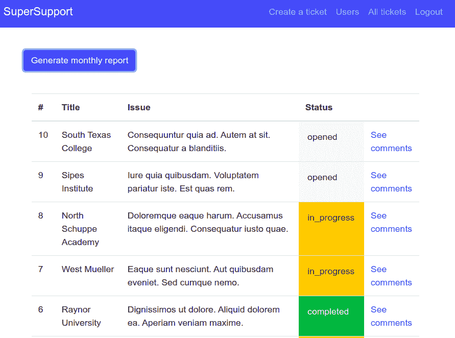

# 如何在 React 中创建 PDF 报告

> 原文：<https://www.freecodecamp.org/news/how-to-create-pdf-reports-in-react/>

在本文中，我们将构建一个基于 API 调用数据生成 PDF 文档的按钮(如上所示)。

几天前，我构建了一个完整的 CRM 应用程序来管理客户和支持代理之间的通信。

我需要一种方法，让代理以 PDF 文件的形式生成已关闭票据的摘要。在网上搜索了一个简单的方法后，我敢说这篇文章会告诉你最简单的方法。

我们开始吧，好吗？

## **安装包**

首先，让我们安装我们需要的软件包。

```
npm i jspdf jspdf-autotable 
```

## 定义一个函数来生成 pdf

接下来，让我们定义一个函数，我们可以在任何地方调用它来为我们生成 PDF。我添加了很多注释来帮助你理解每一行是怎么回事。

```
// services/reportGenerator.js

import jsPDF from "jspdf";
import "jspdf-autotable";
// Date Fns is used to format the dates we receive
// from our API call
import { format } from "date-fns";

// define a generatePDF function that accepts a tickets argument
const generatePDF = tickets => {
  // initialize jsPDF
  const doc = new jsPDF();

  // define the columns we want and their titles
  const tableColumn = ["Id", "Title", "Issue", "Status", "Closed on"];
  // define an empty array of rows
  const tableRows = [];

  // for each ticket pass all its data into an array
  tickets.forEach(ticket => {
    const ticketData = [
      ticket.id,
      ticket.title,
      ticket.request,
      ticket.status,
      // called date-fns to format the date on the ticket
      format(new Date(ticket.updated_at), "yyyy-MM-dd")
    ];
    // push each tickcet's info into a row
    tableRows.push(ticketData);
  });

  // startY is basically margin-top
  doc.autoTable(tableColumn, tableRows, { startY: 20 });
  const date = Date().split(" ");
  // we use a date string to generate our filename.
  const dateStr = date[0] + date[1] + date[2] + date[3] + date[4];
  // ticket title. and margin-top + margin-left
  doc.text("Closed tickets within the last one month.", 14, 15);
  // we define the name of our PDF file.
  doc.save(`report_${dateStr}.pdf`);
};

export default generatePDF; 
```

## 创建一个组件来保存要呈现的票证

现在，让我们创建一个简单的组件来获取并保存状态票。

```
import React, { useEffect, useState } from "react";
import generatePDF from "../services/reportGenerator";

const Tickets = () => {

  const [tickets, setTickets] = useState([]);

  useEffect(() => {
    const getAllTickets = async () => {
      try {
        const response = await axios.get("http://localhost:3000/tickets");
        setTickets(response.data.tickets);
      } catch (err) {
        console.log("error");
      }
    };
    getAllTickets();
  }, []);

const reportTickets = tickets.filter(ticket => ticket.status === "completed");

  return (
    <div>
      <div className="container mb-4 mt-4 p-3">
        <div className="row">
          {user.user.role === "user" ? (
            <> </>
          ) : (
            <button
              className="btn btn-primary"
              onClick={() => generatePDF(reportTickets)}
            >
              Generate monthly report
            </button>
          )}
        </div>
      </div>
      <TicketsComponent tickets={tickets} />
    </div>
  );
};

export default Tickets; 
```

几点关于我们的 **`<Tickets />`** 的分量。当我们的组件加载时，我们向**http://localhost:3000/tickets**发出请求来获取我们所有的票。然后我们将它们保存到 **`tickets`** 状态。最后，我们将它们作为道具传递给 **`<TicketsComponent />`** 来渲染 DOM 中的门票。

我们还有一个 **`reportTickets`** 变量，它过滤我们的票，只得到状态为 **`completed`** 的票。

注意，我们还创建了**生成月度报告**按钮，单击该按钮将调用我们之前定义的 **`generatePDF()`** 函数。

## 创建一个组件以在表中显示票据

接下来，让我们定义我们的 **`<TicketsComponent />`** ，它将负责在一个漂亮的表格中显示我们的门票。请记住，它从 **`<Tickets />`** 组件接受要显示为道具的门票。

```
import React from "react";
import { Link } from "react-router-dom";

const TicketsComponent = ({ tickets }) => {

// a function that assigns bootstrap styling classes based on 
// the status of the ticket
  const assignColorToTicketStatus = ticket => {
    if (ticket.status === "completed") {
      return "p-3 mb-2 bg-success text-white";
    } else if (ticket.status === "in_progress") {
      return "p-3 mb-2 bg-warning text-dark";
    } else if (ticket.status === "opened") {
      return "p-3 mb-2 bg-light text-dark";
    }
  };
  return (
    <div className="container">
      {tickets.length === 0 ? (
        "You currently have no tickets created"
      ) : (
        <table className="table">
          <thead>
            <tr>
              <th scope="col">#</th>
              <th scope="col">Title</th>
              <th scope="col">Issue</th>
              <th scope="col">Status</th>
              <th scope="col"></th>
            </tr>
          </thead>
          <tbody>
            {tickets.map(ticket => (
              <tr key={ticket.id}>
                <td>{ticket.id}</td>
                <td>{ticket.title}</td>
                <td>{ticket.request}</td>
                <td className={assignColorToTicketStatus(ticket)}>
                  {ticket.status}
                </td>
                <td>
                  <Link to={`/ticket/${ticket.id}`}>See comments</Link>
                </td>
              </tr>
            ))}
          </tbody>
        </table>
      )}
    </div>
  );
};

export default TicketsComponent; 
```

现在，让我们看看我们的应用程序目前是什么样子。我们州有 10 张票，但为了方便起见，我在这里展示 6 张。



如你所见，我们有许多不同状态的票。我们还有**生成月度报告**按钮，点击后会导出 PDF 文件。

仅此而已。您应该在浏览器中下载一个 PDF 文件，文件名格式为 ***report_dddmmyyyy*** 。

如果这篇文章对你有所帮助，请在 twitter 上打个招呼。