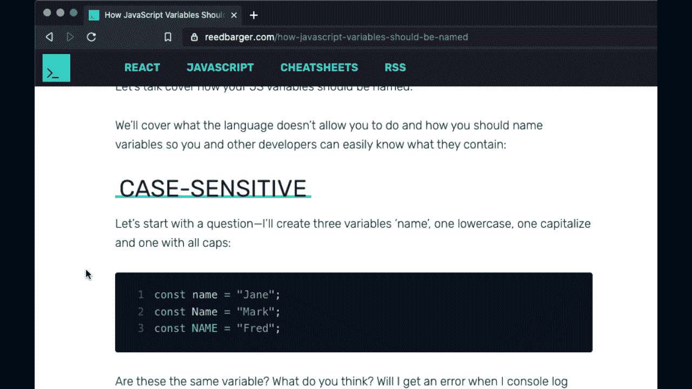
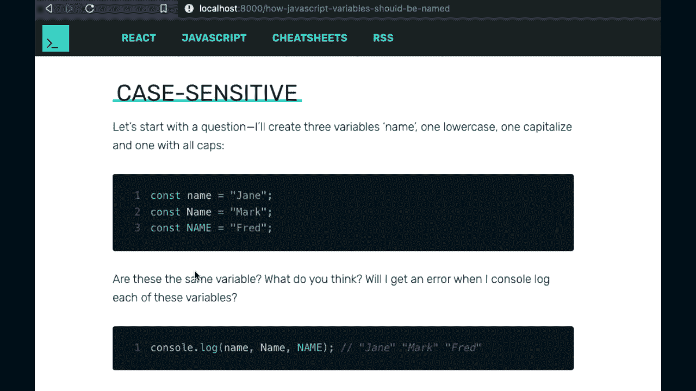
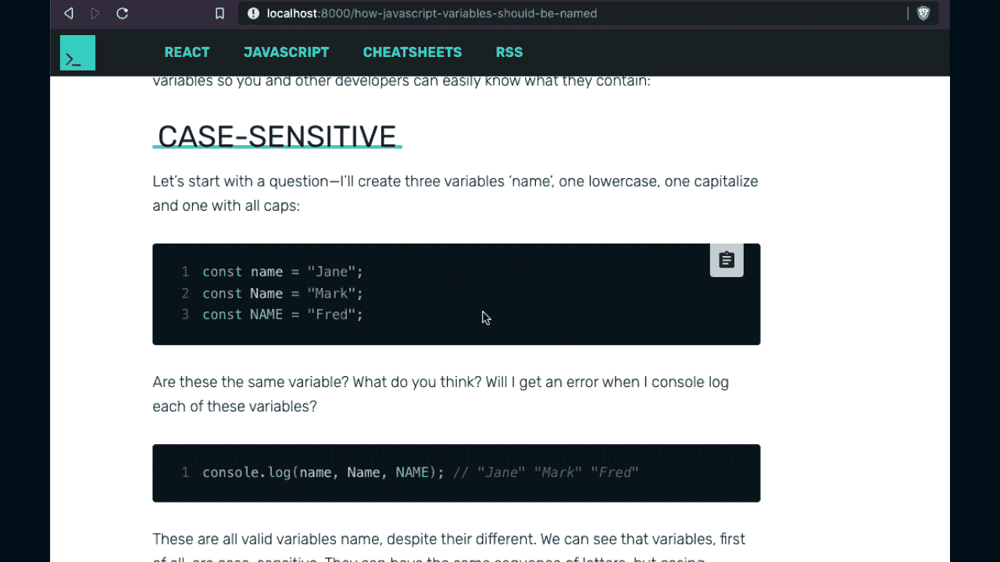
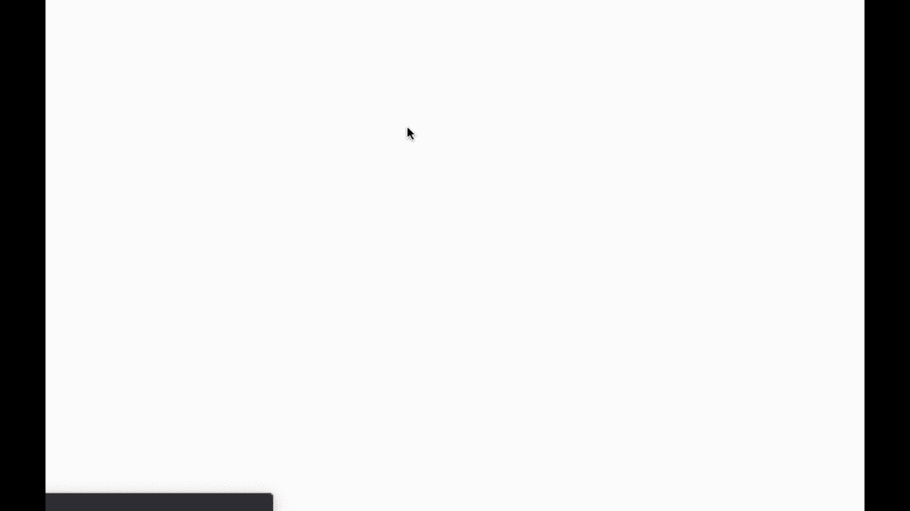
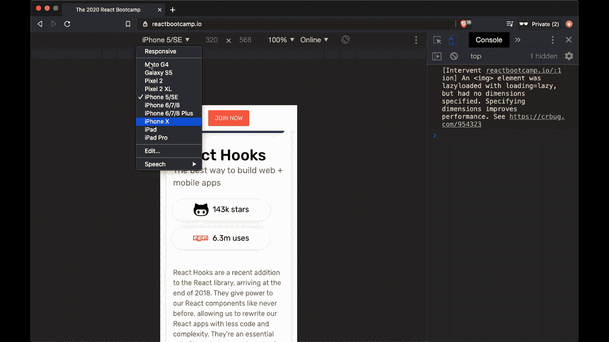
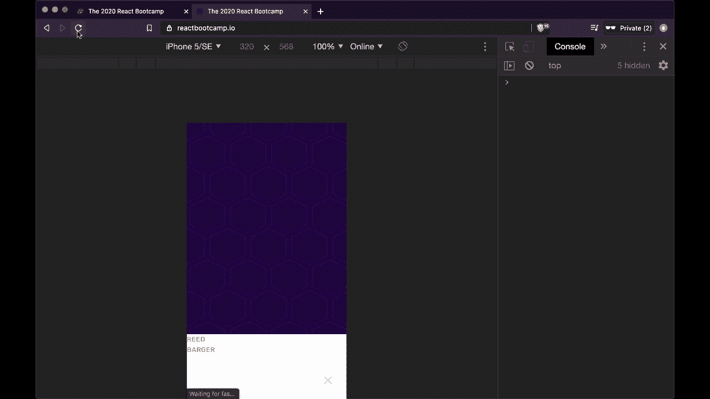

# 如何构建自己的 React 钩子:一步一步的指南

> 原文：<https://www.freecodecamp.org/news/how-to-create-react-hooks/>

自定义 React 挂钩是一个重要的工具，可以让您向 React 应用程序添加特殊的、独特的功能。

在许多情况下，如果您想在应用程序中添加某个特性，您可以简单地安装一个第三方库来解决您的问题。但是如果这样的库或者钩子不存在，你怎么办？

作为一名 React 开发人员，学习创建定制挂钩来解决问题或在自己的 React 项目中添加缺失特性的过程非常重要。

在这个分步指南中，我将通过分解我为自己的应用程序创建的三个钩子，向您展示如何创建自己的自定义 React 钩子，以及它们是为了解决什么问题而创建的。

> 想学习如何在构建有趣的真实应用程序时创建自定义的 React 挂钩吗？查看 [**反应训练营**](https://bit.ly/the-react-bootcamp) 。

## 1.使用 CopyToClipboard 挂钩

在我过去的网站上，[reedbarger.com](https://reedbarger.com)，我允许用户在一个叫做`react-copy-to-clipboard`的软件包的帮助下从我的文章中复制代码。

用户只需将鼠标悬停在代码片段上，单击剪贴板按钮，代码就会被添加到他们计算机的剪贴板上，使他们能够在任何他们喜欢的地方粘贴和使用代码。



然而，我没有使用第三方库，而是想用我自己定制的 React 钩子重新创建这个功能。正如我创建的每个自定义 react 挂钩一样，我把它放在一个专用文件夹中，通常称为`utils`或`lib`，专门用于我可以在我的应用程序中重用的函数。

我们将把这个钩子放在一个名为 useCopyToClipboard.js 的文件中，我将创建一个同名的函数。

有多种方法可以将一些文本复制到用户的剪贴板上。我更喜欢为此使用一个库，它使这个过程更可靠，叫做`copy-to-clipboard`。

它导出一个函数，我们称之为`copy`。

```
// utils/useCopyToClipboard.js
import React from "react";
import copy from "copy-to-clipboard";

export default function useCopyToClipboard() {} 
```

接下来，我们将创建一个函数，用于复制任何想要添加到用户剪贴板的文本。我们将这个函数称为`handleCopy`。

### 如何制作 handleCopy 函数

在函数中，我们首先需要确保它只接受字符串或数字类型的数据。我们将设置一个`if-else`语句，它将确保类型不是字符串就是数字。否则，我们将在控制台记录一个错误，告诉用户您不能复制任何其他类型。

```
import React from "react";
import copy from "copy-to-clipboard";

export default function useCopyToClipboard() {
  const [isCopied, setCopied] = React.useState(false);

  function handleCopy(text) {
    if (typeof text === "string" || typeof text == "number") {
      // copy
    } else {
      // don't copy
      console.error(
        `Cannot copy typeof ${typeof text} to clipboard, must be a string or number.`
      );
    }
  }
} 
```

接下来，我们获取文本并将其转换为字符串，然后将它传递给`copy`函数。从那里，我们将`handleCopy`函数从钩子返回到应用程序中我们喜欢的任何地方。

一般来说，`handleCopy`功能会连接到一个按钮的`onClick`上。

```
import React from "react";
import copy from "copy-to-clipboard";

export default function useCopyToClipboard() {
  function handleCopy(text) {
    if (typeof text === "string" || typeof text == "number") {
      copy(text.toString());
    } else {
      console.error(
        `Cannot copy typeof ${typeof text} to clipboard, must be a string or number.`
      );
    }
  }

  return handleCopy;
} 
```

此外，我们需要一些表示文本是否被复制的状态。为了创建它，我们将在钩子的顶部调用`useState`，并创建一个新的状态变量`isCopied`，其中 setter 将被称为`setCopy`。

最初，该值为假。如果文本复制成功，我们将设置`copy`为真。否则，我们将把它设置为 false。

最后，我们将从一个数组中的钩子返回`isCopied`和`handleCopy`。

```
import React from "react";
import copy from "copy-to-clipboard";

export default function useCopyToClipboard(resetInterval = null) {
  const [isCopied, setCopied] = React.useState(false);

  function handleCopy(text) {
    if (typeof text === "string" || typeof text == "number") {
      copy(text.toString());
      setCopied(true);
    } else {
      setCopied(false);
      console.error(
        `Cannot copy typeof ${typeof text} to clipboard, must be a string or number.`
      );
    }
  }

  return [isCopied, handleCopy];
} 
```

### 如何使用 useCopyToClipboard

我们现在可以在任何我们喜欢的组件中使用`useCopyToClipboard`。

在我的例子中，我将使用它和一个复制按钮组件，该组件接收我们的代码片段的代码。

为了实现这一点，我们需要做的就是在按钮上添加一个点击按钮。并在一个名为 handle 的函数的返回中复制了要求它作为文本的代码。一旦被复制，它就是真的。我们可以显示一个不同的图标，表示复制成功。

```
import React from "react";
import ClipboardIcon from "../svg/ClipboardIcon";
import SuccessIcon from "../svg/SuccessIcon";
import useCopyToClipboard from "../utils/useCopyToClipboard";

function CopyButton({ code }) {
  const [isCopied, handleCopy] = useCopyToClipboard();

  return (
    <button onClick={() => handleCopy(code)}>
      {isCopied ? <SuccessIcon /> : <ClipboardIcon />}
    </button>
  );
} 
```

### 如何添加重置间隔

我们可以对代码做一个改进。正如我们当前编写的钩子一样，`isCopied`将始终为真，这意味着我们将始终看到成功图标:



如果我们想在几秒钟后重置我们的状态，您可以将一个时间间隔传递给`useCopyToClipboard`。让我们添加该功能。

回到我们的钩子中，我们可以创建一个名为`resetInterval`的参数，它的默认值是`null`，这将确保如果没有参数传递给它，状态不会重置。

然后，我们将添加`useEffect`来说明如果文本被复制，并且我们有一个重置间隔，我们将在该间隔之后使用`setTimeout`将`isCopied`设置回 false。

此外，如果我们的组件钩子正在被卸载(意味着我们的状态不再需要更新)，我们需要清除这个超时。

```
import React from "react";
import copy from "copy-to-clipboard";

export default function useCopyToClipboard(resetInterval = null) {
  const [isCopied, setCopied] = React.useState(false);

  const handleCopy = React.useCallback((text) => {
    if (typeof text === "string" || typeof text == "number") {
      copy(text.toString());
      setCopied(true);
    } else {
      setCopied(false);
      console.error(
        `Cannot copy typeof ${typeof text} to clipboard, must be a string or number.`
      );
    }
  }, []);

  React.useEffect(() => {
    let timeout;
    if (isCopied && resetInterval) {
      timeout = setTimeout(() => setCopied(false), resetInterval);
    }
    return () => {
      clearTimeout(timeout);
    };
  }, [isCopied, resetInterval]);

  return [isCopied, handleCopy];
} 
```

最后，我们可以做的最后一个改进是将`handleCopy`包装在`useCallback`钩子中，以确保每次重新呈现时不会重新创建它。

### 决赛成绩

这样，我们就有了最后一个钩子，它允许状态在给定的时间间隔后被重置。如果我们传递一个给它，我们应该会看到如下的结果。

```
import React from "react";
import ClipboardIcon from "../svg/ClipboardIcon";
import SuccessIcon from "../svg/SuccessIcon";
import useCopyToClipboard from "../utils/useCopyToClipboard";

function CopyButton({ code }) {
  // isCopied is reset after 3 second timeout
  const [isCopied, handleCopy] = useCopyToClipboard(3000);

  return (
    <button onClick={() => handleCopy(code)}>
      {isCopied ? <SuccessIcon /> : <ClipboardIcon />}
    </button>
  );
} 
```



## 2.使用页面底部挂钩

在 React 应用中，有时知道用户何时滚动到页面底部是很重要的。

在无限滚动的应用程序中，比如 Instagram，一旦用户点击页面底部，你就需要获取更多的帖子。



让我们看看如何为类似的用例创建一个 usePageBottom 钩子，比如创建一个无限滚动。

我们首先在 utils 文件夹中创建一个单独的文件 usePageBottom.js，然后添加一个同名的函数(hook ):

```
// utils/usePageBottom.js
import React from "react";

export default function usePageBottom() {} 
```

接下来，我们需要计算用户点击页面底部的时间。我们可以通过来自`window`的信息来确定这一点。为了访问它，我们需要确保调用钩子的组件已经安装，所以我们将使用带有空依赖数组的`useEffect`钩子。

```
// utils/usePageBottom.js
import React from "react";

export default function usePageBottom() {
  React.useEffect(() => {}, []);
} 
```

当窗口的`innerHeight`值加上文档的`scrollTop`值等于`offsetHeight`时，用户将会滚动到页面的底部。如果这两个值相等，结果将为真，并且用户已经滚动到页面底部:

```
// utils/usePageBottom.js
import React from "react";

export default function usePageBottom() {
  React.useEffect(() => {
    window.innerHeight + document.documentElement.scrollTop === 
    document.documentElement.offsetHeight;
  }, []);
} 
```

我们将把这个表达式的结果存储在一个变量`isBottom`中，并且我们将更新一个名为`bottom`的状态变量，我们最终将从我们的钩子返回这个变量。

```
// utils/usePageBottom.js
import React from "react";

export default function usePageBottom() {
  const [bottom, setBottom] = React.useState(false);

  React.useEffect(() => {
    const isBottom =
      window.innerHeight + document.documentElement.scrollTop ===
      document.documentElement.offsetHeight;
    setBottom(isButton);
  }, []);

  return bottom;
} 
```

然而，我们的代码是行不通的。为什么不呢？

问题在于，每当用户滚动时，我们都需要计算`isBottom`。因此，我们需要监听带有`window.addEventListener`的滚动事件。我们可以通过创建一个用户滚动时调用的本地函数来重新评估这个表达式，这个函数叫做`handleScroll`。

```
// utils/usePageBottom.js
import React from "react";

export default function usePageBottom() {
  const [bottom, setBottom] = React.useState(false);

  React.useEffect(() => {
    function handleScroll() {
      const isBottom =
        window.innerHeight + document.documentElement.scrollTop 
        === document.documentElement.offsetHeight;
      setBottom(isButton);
    }
    window.addEventListener("scroll", handleScroll);
  }, []);

  return bottom;
} 
```

最后，因为我们有一个更新状态的事件侦听器，所以我们需要处理用户离开页面并且组件被移除的事件。我们需要删除我们添加的滚动事件侦听器，这样我们就不会试图更新一个不再存在的状态变量。

我们可以通过从`useEffect`和`window.removeEventListener`一起返回一个函数来做到这一点，在这里我们传递一个对同一个`handleScroll`函数的引用。我们结束了。

```
// utils/usePageBottom.js
import React from "react";

export default function usePageBottom() {
  const [bottom, setBottom] = React.useState(false);

  React.useEffect(() => {
    function handleScroll() {
      const isBottom =
        window.innerHeight + document.documentElement.scrollTop 
        === document.documentElement.offsetHeight;
      setBottom(isButton);
    }
    window.addEventListener("scroll", handleScroll);
    return () => {
      window.removeEventListener("scroll", handleScroll);
    };
  }, []);

  return bottom;
} 
```

现在我们可以简单地在任何函数中调用这段代码，我们想知道我们是否已经到达页面底部。

在我的 Gatsby 站点中，我有一个标题，当我减小页面尺寸时，我希望显示更少的链接。



要做到这一点，我们可以使用媒体查询(CSS)，或者我们可以使用一个自定义的 React 挂钩来给出页面的当前大小，并在我们的 JSX 中隐藏或显示链接。

之前，我使用的是 a 库中的一个名为`react-use`的钩子。我没有带来整个第三方库，而是决定创建自己的钩子来提供窗口的尺寸，包括宽度和高度。我把这个钩子叫做`useWindowSize`。

### 如何创建挂钩

首先，我们将创建一个新文件。js 在我们的 utilities (utils)文件夹中，与钩子的名字相同`useWindowSize`。我将在导出自定义钩子的同时导入 React(以使用钩子)。

```
// utils/useWindowSize.js

import React from "react";

export default function useWindowSize() {} 
```

现在，因为我在一个服务器呈现的 Gatsby 站点中使用它，所以我需要获得窗口的大小。但我们可能无法访问它，因为我们在服务器上。

为了检查并确保我们不在服务器上，我们可以查看类型`window`是否不等于字符串`undefined`。

在这种情况下，我们可以返回到浏览器的默认宽度和高度，比如说，对象中的 1200 和 800:

```
// utils/useWindowSize.js

import React from "react";

export default function useWindowSize() {
  if (typeof window !== "undefined") {
    return { width: 1200, height: 800 };
  }
} 
```

### 如何从窗口获得宽度和高度

假设我们在客户端上，并且可以获得窗口，我们可以通过与`window`交互来使用`useEffect`钩子执行一个副作用。我们将包含一个空的 dependencies 数组，以确保只在组件(调用这个钩子的组件)挂载后才调用 effect 函数。

为了找出窗口的宽度和高度，我们可以添加一个事件监听器并监听`resize`事件。每当浏览器大小改变时，我们可以更新一个状态(用`useState`创建)，我们称之为`windowSize`，更新它的设置者是`setWindowSize`。

```
// utils/useWindowSize.js

import React from "react";

export default function useWindowSize() {
  if (typeof window !== "undefined") {
    return { width: 1200, height: 800 };
  }

  const [windowSize, setWindowSize] = React.useState();

  React.useEffect(() => {
    window.addEventListener("resize", () => {
      setWindowSize({ width: window.innerWidth, height: window.innerHeight });
    });
  }, []);
} 
```

当调整窗口大小时，将调用回调函数，并且用当前窗口尺寸更新`windowSize`状态。为此，我们将宽度设为`window.innerWidth`，高度设为`window.innerHeight`。

### 如何添加 SSR 支持

然而，我们这里的代码将无法工作。这是因为钩子的一个关键规则是它们不能被有条件地调用。因此，在调用之前，我们不能在我们的`useState`或`useEffect`钩子上有条件。

因此，为了解决这个问题，我们将有条件地设置`useState`的初始值。我们将创建一个名为`isSSR`的变量，它将执行同样的检查来查看窗口是否不等于字符串`undefined`。

我们将使用一个三元组来设置宽度和高度，首先检查我们是否在服务器上。如果是，我们将使用默认值，如果不是，我们将使用`window.innerWidth`和`window.innerHeight`。

```
// utils/useWindowSize.js

import React from "react";

export default function useWindowSize() {
  // if (typeof window !== "undefined") {
  // return { width: 1200, height: 800 };
  // }
  const isSSR = typeof window !== "undefined";
  const [windowSize, setWindowSize] = React.useState({
    width: isSSR ? 1200 : window.innerWidth,
    height: isSSR ? 800 : window.innerHeight,
  });

  React.useEffect(() => {
    window.addEventListener("resize", () => {
      setWindowSize({ width: window.innerWidth, height: window.innerHeight });
    });
  }, []);
} 
```

最后，我们需要考虑何时卸载组件。我们需要做什么？我们需要移除我们的 resize 监听器。

### 如何移除调整大小事件侦听器

可以通过从 useEffectand 返回一个函数来实现。我们将用`window.removeEventListener`删除监听器。

```
// utils/useWindowSize.js

import React from "react";

export default function useWindowSize() {
  // if (typeof window !== "undefined") {
  // return { width: 1200, height: 800 };
  // }
  const isSSR = typeof window !== "undefined";
  const [windowSize, setWindowSize] = React.useState({
    width: isSSR ? 1200 : window.innerWidth,
    height: isSSR ? 800 : window.innerHeight,
  });

  React.useEffect(() => {
    window.addEventListener("resize", () => {
      setWindowSize({ width: window.innerWidth, height: window.innerHeight });
    });

    return () => {
      window.removeEventListener("resize", () => {
        setWindowSize({ width: window.innerWidth, height: window.innerHeight });
      });
    };
  }, []);
} 
```

但是我们需要对同一个函数的引用，而不是我们这里的两个不同的函数。为此，我们将为两个监听器创建一个名为`changeWindowSize`的共享回调函数。

最后，在钩子的末尾，我们将返回我们的`windowSize`状态。仅此而已。

```
// utils/useWindowSize.js

import React from "react";

export default function useWindowSize() {
  const isSSR = typeof window !== "undefined";
  const [windowSize, setWindowSize] = React.useState({
    width: isSSR ? 1200 : window.innerWidth,
    height: isSSR ? 800 : window.innerHeight,
  });

  function changeWindowSize() {
    setWindowSize({ width: window.innerWidth, height: window.innerHeight });
  }

  React.useEffect(() => {
    window.addEventListener("resize", changeWindowSize);

    return () => {
      window.removeEventListener("resize", changeWindowSize);
    };
  }, []);

  return windowSize;
} 
```

### 决赛成绩

要使用钩子，我们只需要在我们需要的地方导入它，调用它，并在我们想要隐藏或显示某些元素的地方使用宽度。

在我的情况下，这是在 500 像素的标志。在这里，我想隐藏所有其他链接，只显示“立即加入”按钮，就像您在上面的示例中看到的那样:

```
// components/StickyHeader.js

import React from "react";
import useWindowSize from "../utils/useWindowSize";

function StickyHeader() {
  const { width } = useWindowSize();

  return (
    <div>
      {/* visible only when window greater than 500px */}
      {width > 500 && (
        <>
          <div onClick={onTestimonialsClick} role="button">
            <span>Testimonials</span>
          </div>
          <div onClick={onPriceClick} role="button">
            <span>Price</span>
          </div>
          <div>
            <span onClick={onQuestionClick} role="button">
              Question?
            </span>
          </div>
        </>
      )}
      {/* visible at any window size */}
      <div>
        <span className="primary-button" onClick={onPriceClick} role="button">
          Join Now
        </span>
      </div>
    </div>
  );
} 
```

这个钩子可以在任何服务器渲染的 React 应用上工作，比如 Gatsby 和 Next.js。

## 3.使用设备检测钩

我正在为我的一门课程创建一个新的登录页面，我在移动设备上遇到了一个非常奇怪的错误。在台式电脑上，样式看起来很棒。

但是当我在手机上看的时候，一切都乱了套，坏了。



我追踪这个问题到一个名为`react-device-detect`的库，我用它来检测用户是否有移动设备。如果是这样，我会删除标题。

```
// templates/course.js
import React from "react";
import { isMobile } from "react-device-detect";

function Course() {
  return (
    <>
      <SEO />
      {!isMobile && <StickyHeader {...courseData} />}
      {/* more components... */}
    </>
  );
} 
```

问题是这个库不支持服务器端渲染，而这是 Gatsby 默认使用的。所以我需要创建自己的解决方案来检查用户何时在移动设备上。为此，我决定定制一个名为`useDeviceDetect`的钩子。

### 我是如何创造钩子的

我在我的 utils 文件夹中为这个钩子创建了一个同名的单独文件 useDeviceDetect.js。由于钩子只是可共享的 JavaScript 函数，它利用了 React 钩子，所以我创建了一个名为`useDeviceDetect`的函数并导入了 React。

```
// utils/useDeviceDetect.js
import React from "react";

export default function useDeviceDetect() {} 
```

### 如何从窗口获取用户代理

我们可以通过 userAgent 属性(位于 window 的 navigator 属性上)来确定是否可以获得有关用户设备的信息。

由于作为 API /外部资源与窗口 API 交互会被归类为副作用，我们需要在`useEffect`钩子内访问用户代理。

```
// utils/useDeviceDetect.js
import React from "react";

export default function useDeviceDetect() {
  React.useEffect(() => {
    console.log(`user's device is: ${window.navigator.userAgent}`);
    // can also be written as 'navigator.userAgent'
  }, []);
} 
```

一旦组件安装完毕，我们可以使用`typeof navigator`来确定我们是在客户机上还是在服务器上。如果我们在服务器上，我们就无法访问窗口。`typeof navigator`将等于字符串`undefined`，因为它不在那里。否则，如果我们在客户端，我们将能够获得我们的用户代理属性。

我们可以使用三元组来表示所有这些，以获得 userAgent 数据:

```
// utils/useDeviceDetect.js
import React from "react";

export default function useDeviceDetect() {
  React.useEffect(() => {
    const userAgent =
      typeof navigator === "undefined" ? "" : navigator.userAgent;
  }, []);
} 
```

### 如何检查用户代理是否是移动设备

`userAgent`是一个字符串值，如果他们使用移动设备，它将被设置为以下设备名称中的任何一个:

Android、黑莓、iPhone、iPad、iPod、Opera Mini、IEMobile 或 WPDesktop。

我们所要做的就是获取我们得到的字符串，并使用带有正则表达式的`.match()`方法来查看它是否是这些字符串中的任何一个。我们将它存储在一个名为`mobile`的局部变量中。

我们将用 useState 钩子将结果存储在 state 中，我们将赋予它一个 false 的初始值。为此，我们将创建一个相应的状态变量`isMobile`，设置者将是`setMobile`。

```
// utils/useDeviceDetect.js
import React from "react";

export default function useDeviceDetect() {
  const [isMobile, setMobile] = React.useState(false);

  React.useEffect(() => {
    const userAgent =
      typeof window.navigator === "undefined" ? "" : navigator.userAgent;
    const mobile = Boolean(
      userAgent.match(
        /Android|BlackBerry|iPhone|iPad|iPod|Opera Mini|IEMobile|WPDesktop/i
      )
    );
    setMobile(mobile);
  }, []);
} 
```

因此，一旦我们得到了`mobile`值，我们将把它设置为状态。最后，我们将从钩子返回一个对象，这样，如果我们想为这个钩子添加更多的功能，我们可以在将来添加更多的值。

在对象中，我们将添加`isMobile`作为属性和值:

```
// utils/useDeviceDetect.js
import React from "react";

export default function useDeviceDetect() {
  const [isMobile, setMobile] = React.useState(false);

  React.useEffect(() => {
    const userAgent =
      typeof window.navigator === "undefined" ? "" : navigator.userAgent;
    const mobile = Boolean(
      userAgent.match(
        /Android|BlackBerry|iPhone|iPad|iPod|Opera Mini|IEMobile|WPDesktop/i
      )
    );
    setMobile(mobile);
  }, []);

  return { isMobile };
} 
```

### 决赛成绩

回到登录页面，我们可以执行钩子，简单地从被析构的对象中获取属性，并在需要的地方使用它。

```
// templates/course.js
import React from "react";
import useDeviceDetect from "../utils/useDeviceDetect";

function Course() {
  const { isMobile } = useDeviceDetect();

  return (
    <>
      <SEO />
      {!isMobile && <StickyHeader {...courseData} />}
      {/* more components... */}
    </>
  );
} 
```

## 结论

正如我试图通过这些例子来说明的那样，当第三方库有所欠缺时，定制的 React 钩子可以给我们工具来修复我们自己的问题。

我希望这篇指南能让你更好地了解何时以及如何创建自己的 React 钩子。您可以在自己的项目中随意使用这些钩子和上面的代码，作为您自定义 React 钩子的灵感。

## 喜欢这篇文章吗？加入 React 训练营

**[React 训练营](http://bit.ly/join-react-bootcamp)** 将你应该知道的关于学习 React 的一切打包成一个全面的包，包括视频、备忘单，外加特殊奖励。

获得数百名开发人员已经使用的内部信息，以掌握 React、找到他们梦想的工作并掌控他们的未来:

[](http://bit.ly/join-react-bootcamp) 
*打开时点击此处通知*