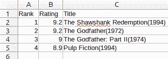
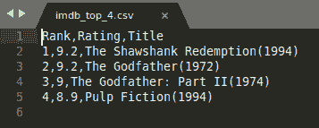
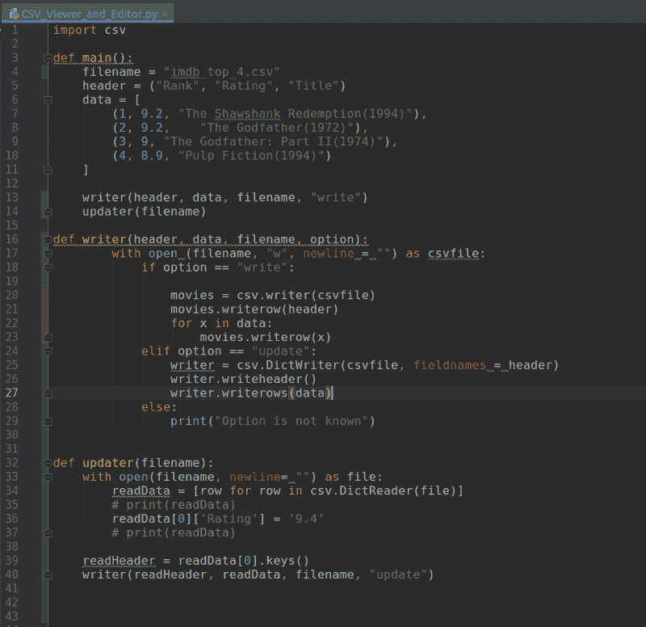

# 如何使用 Python 创建、读取、更新和搜索 Excel 文件

> 原文：<https://www.freecodecamp.org/news/how-to-create-read-update-and-search-through-excel-files-using-python-c70680d811d4/>

本文将详细介绍如何使用 Excel 文件，以及如何用 Python 修改特定数据。

首先，我们将学习如何通过读、写和更新来处理 CSV 文件。然后，我们将了解如何读取文件、按工作表过滤文件、搜索行/列以及更新 xlsx 文件的单元格。

让我们从最简单的电子表格格式开始:CSV。

### 第 1 部分 CSV 文件

CSV 文件是逗号分隔值文件，其中纯文本数据以表格格式显示。它们可以用于任何电子表格程序，如 Microsoft Office Excel、Google Spreadsheets 或 LibreOffice Calc。

然而，CSV 文件与其他电子表格文件不同，因为它们不允许您保存单元格、列、行或公式。它们的限制是每个文件只允许一张表。本文第一部分的计划是向您展示如何使用 Python 3 和标准库模块 CSV 创建 CSV 文件。

本教程将以两个 GitHub 存储库和一个实际使用本教程第二部分代码的实时 web 应用程序结束(但为了特定目的进行了更新和修改)。

### 写入 CSV 文件

首先，打开一个新的 Python 文件并导入 Python CSV 模块。

```
import csv
```

#### CSV 模块

CSV 模块包括所有内置的必要方法。其中包括:

*   csv .阅读器
*   csv.writer
*   csv。字典阅读器
*   csv。词典作者
*   以及其他等等

在本指南中，我们将重点介绍 writer、DictWriter 和 DictReader 方法。这些允许您编辑、修改和操作 CSV 文件中存储的数据。

在第一步中，我们需要定义文件名，并将其保存为一个变量。我们应该对标题和数据信息做同样的事情。

```
filename = "imdb_top_4.csv"
header = ("Rank", "Rating", "Title")
data = [
(1, 9.2, "The Shawshank Redemption(1994)"),
(2, 9.2, "The Godfather(1972)"),
(3, 9, "The Godfather: Part II(1974)"),
(4, 8.9, "Pulp Fiction(1994)")
]
```

现在我们需要创建一个名为 *writer* 的函数，它将接受三个参数:*头*、*数据*和*文件名*。

```
def writer(header, data, filename):
  pass
```

下一步是修改 *writer* 函数，使其创建一个保存来自*头*和*数据*变量的数据的文件。这是通过从*头*变量中写入第一行，然后从*数据*变量中写入四行来完成的(因为列表中有四个元组，所以有四行)。

```
def writer(header, data, filename):
  with open (filename, "w", newline = "") as csvfile:
    movies = csv.writer(csvfile)
    movies.writerow(header)
    for x in data:
      movies.writerow(x)
```

> 官方 Python 文档描述了 csv.writer 方法是如何工作的。我强烈建议你花一分钟来阅读它。

瞧啊！您创建了第一个名为 imdb_top_4.csv 的 CSV 文件。用您喜欢的电子表格应用程序打开该文件，您应该会看到类似这样的内容:



Using LibreOffice Calc to see the result.

如果您选择在其他应用程序中打开该文件，结果可能如下所示:



Using SublimeText to see the result.

### 更新 CSV 文件

要更新这个文件，你应该创建一个名为 *updater* 的新函数，它只接受一个名为 *filename* 的参数。

```
def updater(filename):
    with open(filename, newline= "") as file:
        readData = [row for row in csv.DictReader(file)]
        # print(readData)
        readData[0]['Rating'] = '9.4'
        # print(readData)

    readHeader = readData[0].keys()
    writer(readHeader, readData, filename, "update")
```

该函数首先打开在*文件名*变量中定义的文件，然后将从文件中读取的所有数据保存在名为 *readData* 的变量中。第二步是硬编码新值，并将其放置在 *readData[0]['Rating']* 位置，而不是旧值。

该函数的最后一步是通过添加一个新参数 *update* 来调用 *writer* 函数，该参数将告诉该函数您正在进行更新。

> csv。DictReader 在官方 Python 文档[这里](https://docs.python.org/3/library/csv.html#dialects-and-formatting-parameters)有更多解释。

为了让*编写器*使用一个新参数，你需要在定义*编写器*的任何地方添加一个新参数。回到您第一次调用*编写器*函数的地方，添加“write”作为新参数:

```
writer(header, data, filename, "write")
```

就在 writer 函数下面，调用 *updater* 并将*文件名*参数传递给它:

```
writer(header, data, filename, "write")
updater(filename)
```

现在您需要修改*编写器*函数，以获取一个名为*选项*的新参数:

```
def writer(header, data, filename, option):
```

从现在开始，我们希望收到两个不同的*写入器*功能选项(*写入和更新*)。因此，我们应该添加两个 if 语句来支持这个新功能。*第一部分“if option ==”下的函数写:“*你已经知道了。您只需要添加代码的" *elif option == "update":* 部分和 *else* 部分，如下所示:

```
def writer(header, data, filename, option):
        with open (filename, "w", newline = "") as csvfile:
            if option == "write":

                movies = csv.writer(csvfile)
                movies.writerow(header)
                for x in data:
                    movies.writerow(x)
            elif option == "update":
                writer = csv.DictWriter(csvfile, fieldnames = header)
                writer.writeheader()
                writer.writerows(data)
            else:
                print("Option is not known")
```

**好极了！**大功告成！

现在，您的代码应该如下所示:



The code.

您也可以在此处找到代码:

[https://github.com/GoranAviani/CSV-Viewer-and-Editor](https://github.com/GoranAviani/CSV-Viewer-and-Editor)

在本文的第一部分，我们已经了解了如何处理 CSV 文件。我们已经创建并更新了一个这样的文件。

### 第 2 部分 xlsx 文件

几个周末以来，我一直在做这个项目。我已经开始着手这项工作，因为我的公司需要这种解决方案。我的第一个想法是直接在我公司的系统中构建这个解决方案，但是那样我就没有什么可写的了，嗯？

我使用 Python 3 和 *openpyxl* 库构建了这个解决方案。我之所以选择 *openpyxl* 是因为它代表了创建、加载、更新、重命名和删除工作表的完整解决方案。它还允许我们读写行和列，合并或取消合并单元格，或者创建 Python excel 图表等。

### Openpyxl 术语和基本信息

*   Workbook 是 Openpyxl 中 Excel 文件的名称。
*   工作簿由工作表组成(默认为 1 张工作表)。图纸按其名称引用。
*   一个工作表由从数字 1 开始的行(水平线)和从字母 a 开始的列(垂直线)组成。
*   行和列形成网格，并形成可能包含一些数据(数值或字符串值)或公式的单元格。

> Openpyxl 有很好的文档，我建议你看一下这里的。

第一步是打开您的 Python 环境并在您的终端中安装 *openpyxl* :

```
pip install openpyxl
```

接下来，将 *openpyxl* 导入到您的项目中，然后将工作簿加载到*文件*变量中。

```
import openpyxl

theFile = openpyxl.load_workbook('Customers1.xlsx')
print(theFile.sheetnames)
currentSheet = theFile['customers 1']
print(currentSheet['B4'].value)
```

如您所见，这段代码按名称打印所有工作表。然后，它选择名为“customers 1”的工作表，并将其保存到一个 *currentSheet* 变量中。在最后一行，代码打印位于“customers 1”表的 B4 位置的值。

这段代码工作正常，但它很难编码。为了使其更加动态，我们将编写代码来:

*   *读取文件*
*   *获取所有工作表名称*
*   *循环浏览所有表单*
*   在最后一步中，代码将打印位于工作簿中每个找到的工作表的 B4 字段中的值。

```
import openpyxl

theFile = openpyxl.load_workbook('Customers1.xlsx')
allSheetNames = theFile.sheetnames

print("All sheet names {} " .format(theFile.sheetnames))

for x in allSheetNames:
    print("Current sheet name is {}" .format(x))
    currentSheet = theFile[x]
    print(currentSheet['B4'].value)
```

这比以前更好，但它仍然是一个硬编码的解决方案，它仍然假设您要寻找的值在 B4 单元格中，这很傻:)

我希望您的项目需要在 Excel 文件的所有工作表中搜索特定的值。为此，我们将在“ABCDEF”范围内再添加一个 for 循环，然后简单地打印单元格名称及其值。

```
import openpyxl

theFile = openpyxl.load_workbook('Customers1.xlsx')
allSheetNames = theFile.sheetnames

print("All sheet names {} " .format(theFile.sheetnames))

for sheet in allSheetNames:
    print("Current sheet name is {}" .format(sheet))
    currentSheet = theFile[sheet]
    # print(currentSheet['B4'].value)

    #print max numbers of wors and colums for each sheet
    #print(currentSheet.max_row)
    #print(currentSheet.max_column)

    for row in range(1, currentSheet.max_row + 1):
        #print(row)
        for column in "ABCDEF":  # Here you can add or reduce the columns
            cell_name = "{}{}".format(column, row)
            #print(cell_name)
            print("cell position {} has value {}".format(cell_name, currentSheet[cell_name].value))
```

我们通过为范围中的行引入“*”来实现这一点..*“循环。for 循环的范围定义为从第 1 行的单元格到工作表的最大行数。第二个 for 循环在预定义的列名“ *ABCDEF* 中进行搜索。在第二个循环中，我们将显示单元格的完整位置(列名和行号)和一个值。

然而，在本文中，我的任务是找到一个名为“telephone”的特定列，然后遍历该列的所有行。为此，我们需要修改代码，如下所示。

```
import openpyxl

theFile = openpyxl.load_workbook('Customers1.xlsx')
allSheetNames = theFile.sheetnames

print("All sheet names {} " .format(theFile.sheetnames))

def find_specific_cell():
    for row in range(1, currentSheet.max_row + 1):
        for column in "ABCDEFGHIJKL":  # Here you can add or reduce the columns
            cell_name = "{}{}".format(column, row)
            if currentSheet[cell_name].value == "telephone":
                #print("{1} cell is located on {0}" .format(cell_name, currentSheet[cell_name].value))
                print("cell position {} has value {}".format(cell_name, currentSheet[cell_name].value))
                return cell_name

for sheet in allSheetNames:
    print("Current sheet name is {}" .format(sheet))
    currentSheet = theFile[sheet]
```

修改后的代码会遍历每个工作表的所有单元格，就像以前一样，行范围是动态的，列范围是特定的。该代码循环遍历单元格，并查找包含文本“电话”的单元格。一旦代码找到了特定的单元格，它就会通知用户文本所在的单元格。该代码对 Excel 文件中所有工作表内的每个单元格都这样做。

下一步是遍历该特定列的所有行并打印值。

```
import openpyxl

theFile = openpyxl.load_workbook('Customers1.xlsx')
allSheetNames = theFile.sheetnames

print("All sheet names {} " .format(theFile.sheetnames))

def find_specific_cell():
    for row in range(1, currentSheet.max_row + 1):
        for column in "ABCDEFGHIJKL":  # Here you can add or reduce the columns
            cell_name = "{}{}".format(column, row)
            if currentSheet[cell_name].value == "telephone":
                #print("{1} cell is located on {0}" .format(cell_name, currentSheet[cell_name].value))
                print("cell position {} has value {}".format(cell_name, currentSheet[cell_name].value))
                return cell_name

def get_column_letter(specificCellLetter):
    letter = specificCellLetter[0:-1]
    print(letter)
    return letter

def get_all_values_by_cell_letter(letter):
    for row in range(1, currentSheet.max_row + 1):
        for column in letter:
            cell_name = "{}{}".format(column, row)
            #print(cell_name)
            print("cell position {} has value {}".format(cell_name, currentSheet[cell_name].value))

for sheet in allSheetNames:
    print("Current sheet name is {}" .format(sheet))
    currentSheet = theFile[sheet]
    specificCellLetter = (find_specific_cell())
    letter = get_column_letter(specificCellLetter)

    get_all_values_by_cell_letter(letter) 
```

这是通过添加一个名为 *get_column_letter* 的函数来实现的，该函数查找一列的一个字母。找到该列的字母后，我们遍历该特定列的所有行。这是通过*get _ all _ values _ by _ cell _ letter*函数完成的，该函数将打印这些单元格的所有值。

### 包扎

**Bra gjort！在这之后，你可以做很多事情。我的计划是建立一个在线应用程序，将所有取自文本框的瑞典电话号码标准化，并为用户提供从同一个文本框复制结果的可能性。我计划的第二步是扩展 web 应用程序的功能，以支持 Excel 文件的上传，处理这些文件中的电话号码(将其标准化为瑞典格式)，并将处理后的文件提供给用户。**

我已经完成了这两项任务，你可以在我的*Incodaq.com*网站的工具页面上看到它们:

> [https://tools.incodaq.com/](https://tools.incodaq.com/)

本文第二部分的代码也可以在 GitHub 上找到:

> [https://github . com/GoranAviani/Manipulate-Excel-spreadsheets](https://github.com/GoranAviani/Manipulate-Excel-spreadsheets)

感谢您的阅读！在我的个人主页上查看更多类似的文章:[https://medium.com/@goranaviani](https://medium.com/@goranaviani)和我在 GitHub 页面上创建的其他有趣的东西:[https://github.com/GoranAviani](https://github.com/GoranAviani)