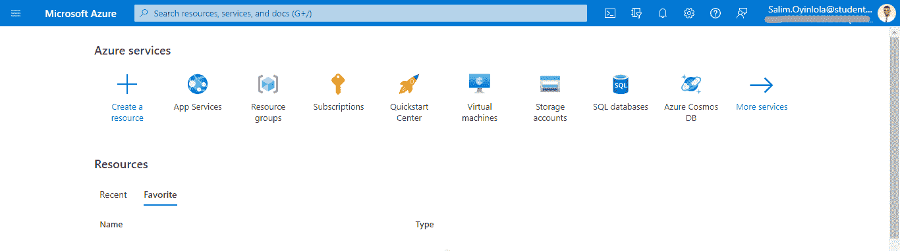
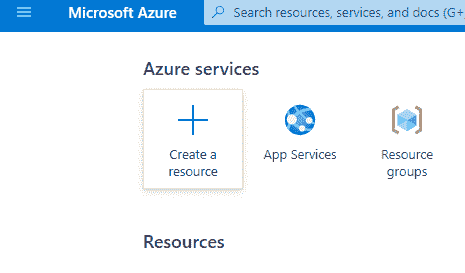
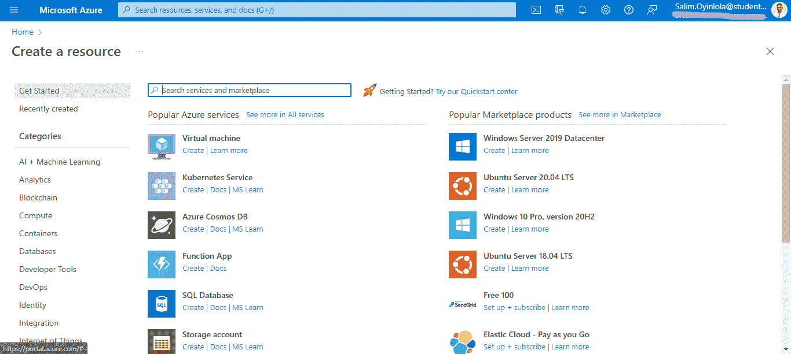
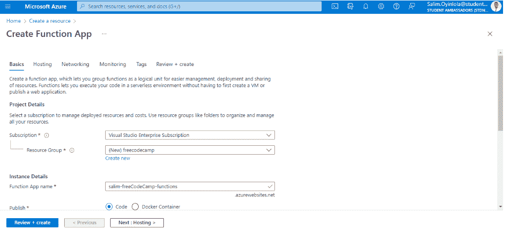
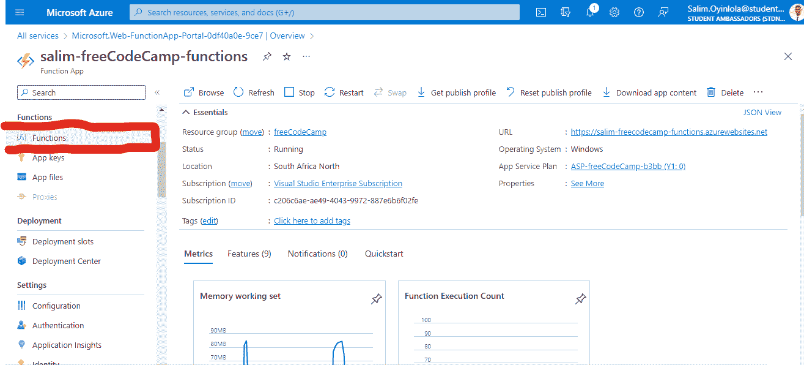
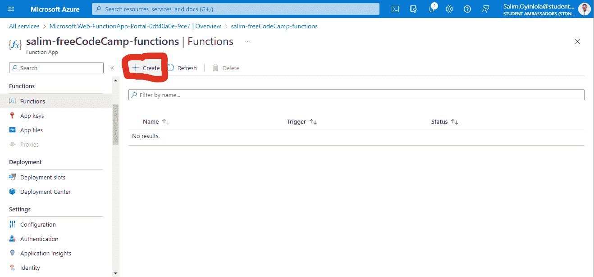
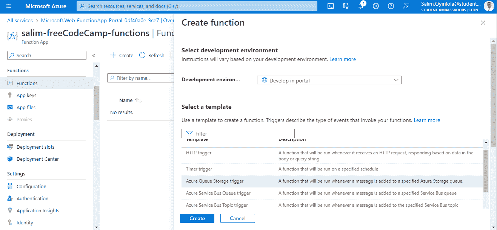
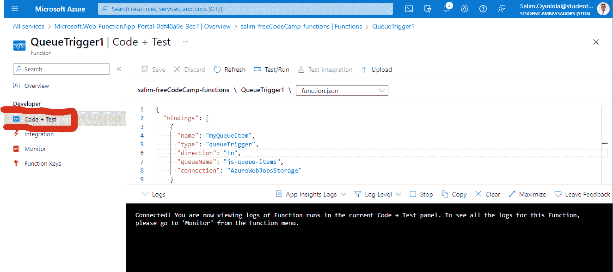
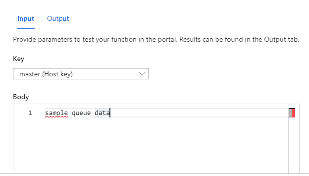
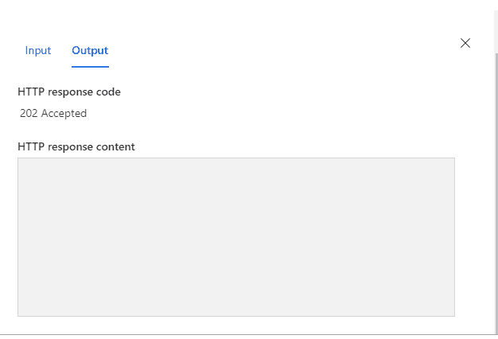

# 如何用 Azure 函数创建无服务器逻辑

> 原文：<https://www.freecodecamp.org/news/how-to-create-serverless-logic-with-azure-functions/>

## 什么是无服务器计算？

你可以将无服务器计算视为一种功能即服务，或者是托管在云平台上的微服务。

在这种设置中，您的业务逻辑作为功能运行，您不必手动创建或扩展基础设施。云平台(这里是微软 Azure)管理基础设施。这意味着你的应用会根据负载自动伸缩。

微软 Azure 有几种方法来构建这种架构。两种最常见的方法是 Azure Logic 应用程序和 Azure 函数，我们将在本教程中重点介绍这两种方法。

## 什么是 Azure 函数？

Azure functions 是一个无服务器的应用平台。它使开发人员能够托管无需提供基础设施即可执行的业务逻辑。

Azure 函数提供了内在的可扩展性，用户只需为他们使用的资源付费。同样需要注意的是，你可以用自己选择的语言编写你的函数代码，包括 C#、F#、JavaScript、Python 和 PowerShell Core。

对 NuGet 和 NPM 这样的包管理器的支持也包括在内，所以您可以在您的业务逻辑中使用流行的库。

本教程结束时，您将能够:

*   在 Azure 门户中创建一个 Azure 功能 app。
*   使用触发器练习一个函数。
*   从 Azure 门户监控和测试您的 Azure 功能。

### 先决条件

您将需要一个有效且活跃的 Microsoft Azure 帐户来学习本教程。您可以使用以下任一方式:

*   免费 Azure 试用版:使用这个选项，你将从 200 美元的 Azure 信用开始，除了免费服务之外，还有 30 天的使用时间。
*   学生专用 Azure】:此优惠仅适用于学生。有了这个选项，您将从 100 美元的 Azure 信用开始，无需信用卡，并且在拥有信用的同时可以免费访问流行的服务。

## 步骤 1–创建你的 Azure 函数应用

要托管无需提供基础设施即可执行的业务逻辑，您需要创建您的 Azure Function 应用程序。

在你创建了一个有效且活跃的微软 Azure 账户后，你将导航到 [Azure 门户](https://portal.azure.com/)。



The User Interface of the Microsoft Azure portal



点击`Create a resource`按钮。



Menu showing "Function App" option

在菜单中，您会看到`Function App`出现。点击`Create`按钮创建一个功能 app。然后你会看到`Create Function App`窗格。

如果`Function App`按钮没有出现，在*类别*列表中选择`Compute`，然后在窗格中选择`Function App`。



Enter details for the function app

此时，在点击`Review + create`按钮之前，在`Basics`选项卡上输入项目详情。

`Subscription`选项可能因您而异。这将取决于您可用的 Azure 订阅。

对于`Resource group`选项，如果您熟悉 Azure 并且已经创建了一个，请选择一个预先创建的。否则，使用`Create new`按钮创建一个新的。

资源组只是意味着将你的 Azure 帐户上的类似服务组合在一起，这样更容易管理。

对于`Function App name`选项，输入一个全球唯一的应用程序名称，它将成为您的服务的基本 URL 的一部分。我的名字叫`salim-freeCodeCamp-functions`。

对于`Publish`选项，选择`Code`。

对于`Runtime Slack`选项，选择`Node.js`，这是我们在本教程中用来实现函数示例的语言。保留默认的`Version`选项。

在`Region`选项中填入离你最近的地理位置。区域是一组充当服务器的物理数据中心。因为我在尼日利亚，所以我选择了`South Africa North`。

对于`Operating System`，已经根据你对运行时的选择推荐给你了。

对于`Plan`选项，选择`Consumption (Serverless)`。您选择的计划决定了您的应用程序如何扩展、启用哪些功能以及如何定价。

此时，您可以点击`Review + create`按钮。

验证和部署过程通常需要三到五分钟的时间。一旦 Azure function 的验证和部署过程完成，您就可以验证您的 Azure Function 应用程序正在运行。

## 步骤 2–验证您的 Azure Function 应用程序正在运行

部署过程完成后，选择`Go to resource`。将出现您的函数的函数应用程序面板。在`Essentials`部分，选择`URL`链接，在浏览器中打开它。


The URL takes the look shown here

将出现一个默认的 Azure 网页，并显示一条消息，说明您的 Functions 应用程序已启动并正在运行。


## 步骤 3–使用 Azure 函数按需运行您的代码

现在您已经创建了一个函数应用程序，您将构建、配置和执行该函数。要做到这些，你需要理解两个概念——触发器和绑定。

Azure 函数是事件驱动的，所以它们响应事件而运行。启动一个功能的事件被称为**触发器**、**和**，一个功能必须配置一个触发器。

Azure 支持一系列服务的触发器，包括:

*   Blob 存储:当检测到新的或更新的 blob 时，启动一个函数。
*   HTTP:用 HTTP 请求启动一个函数。
*   定时器:按时间表启动一个功能。
*   事件网格:当从事件网格接收到一个事件时启动一个函数。
*   Microsoft Graph 事件:启动一个函数以响应来自 Microsoft Graph 的传入 webhook。该触发器的每个实例可以对一种 Microsoft Graph 资源类型做出反应。

另一方面，绑定是将数据和服务连接到函数的声明性方式。绑定与各种数据源交互，这有助于确保您不必在函数中编写连接到数据源和管理连接的代码。作为绑定代码的一部分，平台会为您处理这种复杂性。

每个绑定都有一个方向——您的代码从*输入*绑定读取数据，并将数据写入*输出*绑定。每个函数可以有零个或多个绑定来管理该函数处理的输入和输出数据。

总之，触发器是一种输入绑定，可以启动某些代码的执行。微软 Azure 提供了许多[绑定](https://learn.microsoft.com/en-us/azure/azure-functions/functions-triggers-bindings#supported-bindings)来连接不同的存储和消息服务。

要在 Azure 函数上按需运行您的代码，您必须创建您的函数，以便使用预定义的模板在函数应用程序中运行您的代码。

为此，点击功能应用程序主页左侧菜单栏上的`Function`标签。



Functions tag on menu bar

然后点击`+ Create`按钮，使用模板创建要使用的功能。



Create template button

在将其他所有内容保留为默认设置的同时，您将选择本教程的`Azure Queue Storage trigger`模板。每当有消息添加到指定的 Azure 存储队列时，都会运行该触发器。



点击`Create`创建功能。

从模板创建函数时，会创建几个文件，包括配置文件`function.json`和源代码文件`index.js`。导航到左边的`Code + Test`按钮。在下拉列表中选择`function.json`文件。代码将采用如下所示的形式:



用下面块中的代码替换该代码:

```
{
  "bindings": [
    {
      "name": "order",
      "type": "queueTrigger",
      "direction": "in",
      "queueName": "myqueue-items",
      "connection": "MY_STORAGE_ACCT_APP_SETTING"
    },
    {
      "name": "$return",
      "type": "table",
      "direction": "out",
      "tableName": "outTable",
      "connection": "MY_TABLE_STORAGE_ACCT_APP_SETTING"
    }
  ]
}
```

在其核心，这个代码块仅仅意味着当一个消息被添加到名为`myqueue-items`的队列中时，该函数将被触发，返回值将被运行到`outTable`中。

保存，然后*测试/运行*该功能。

点击`Test/Run`按钮，您将看到如下所示的页面。



将该关键点保留为默认主体关键点，但编辑主体。将其更改为以下输入:

```
{
	"name": Azure
}
```

运行时，您将看到以下输出:



这意味着您的函数运行良好，因为结果会自动出现在**输出选项卡**中。上图是空白的，因为实际上没有向该功能添加业务逻辑。

### 如何测试你的 Azure 功能

一般来说，有两种方法可以测试你的 Azure 功能——手动和在 Azure 门户中。

你刚才做的是通过 Azure 门户。您可以通过触发已配置的触发器来手动启动功能。

例如，如果您正在使用 HTTP 触发器，那么您可以使用一个工具，比如 Postman 或 cURL，向您的函数端点 URL 发起一个 HTTP 请求，这个请求可以从函数定义( **Get function URL** )中获得。

## 结论

在本教程中，您已经看到了无服务器计算是在云中托管业务逻辑代码的一个很好的选择。您已经看到，使用 Azure Functions 等无服务器产品，您可以用自己选择的语言编写业务逻辑。

此外，值得注意的是，使用无服务器计算解决方案不仅可以避免基础设施的过度分配(因为它们可以按需创建和销毁)，而且它们还是事件驱动的。事件驱动，即它们仅在响应事件(称为“触发器”)时运行，例如将消息添加到队列中，或接收 HTTP 请求。

最后，如果你喜欢这篇文章并想看更多，我在 [Twitter](https://twitter.com/SalimOpines) 上分享我的文章。