# 如何创建微妙的动画文本开头

> 原文：<https://www.freecodecamp.org/news/how-to-create-subtle-animated-text-openings-eb901d3a886e/>

你有没有见过微妙的文本开头，想知道它们是如何产生的？

外面有这么多这样的东西，几乎不可能解释它们是如何工作的。

然而，让我们挑选一个例子，让我告诉你如何重新创建它。

我已经做出了选择，下面是我们将要构建的内容:


[The Demo](https://codepen.io/ohansemmanuel/full/QmjxJr/)

这是一个虚构的创意公司的开幕仪式。你可以在这里[查看结果](https://codepen.io/ohansemmanuel/full/QmjxJr/)。

你看到闪光了，对吧？您还可以看到动画是如何交错的——不是一次制作整个文本的动画，而是文本中每个单词的时间都不同？

我会告诉你如何重现这些。

笑一笑。你会喜欢的！

### 介绍

没有人喜欢难看的标记。事实上，我们不会写太多的标记。让我们重新制作这个动画。

首先，拿起你的连帽衫(如果你有的话)，戴上你的开发帽(你必须有一顶)。

现在，让我一步一步地向您介绍这个过程。说实话，这并不难。

#### 1.介绍所需的简单标记。

```
<section class="opening">  <h1 class="opening-text">    We are a creative agency  </h1></section>
```

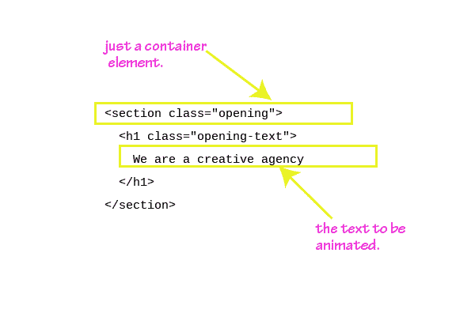

#### 2.放一张像样的背景图。

```
.opening {  background-image: url('https://preview.ibb.co/cBVBf7/fantasy_3146946_1280.jpg')  }
```

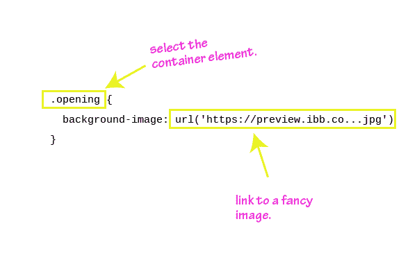

下面是这样的结果:

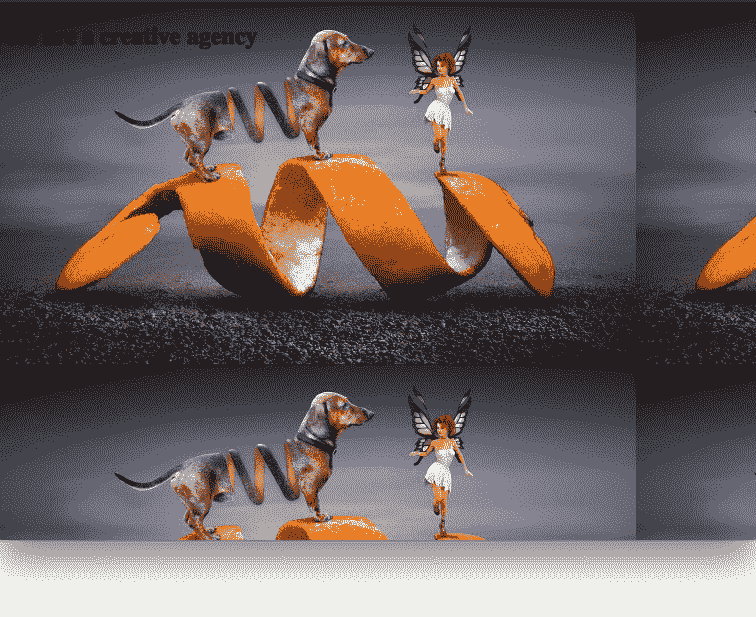

We started from nothing. Here we are!

结果看起来很尴尬，因为背景图像是重复的。

#### 3.停止重复，使背景图像更漂亮。

```
.opening {  height: 100vh;  background: linear-gradient(rgba(0,0,0,0.1), rgba(0,0,0,0.9)), url('https://preview.ibb.co/hkXMDS/fantasy_3146946_1920.jpg') no-repeat 50% 0%/cover;  }
```

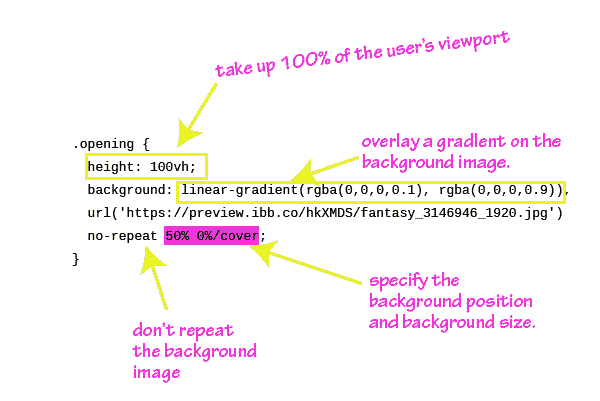

This looks cluttered :(

如果你不理解上面的代码，它的前提是**多重背景可以通过 CSS** 添加到一个元素中。这些背景应该用逗号隔开。在上面的例子中，`linear-gradient`代表一个背景，`url(..)`代表另一个背景。一个添加线性渐变，另一个是图像。

看一下上面的插图。现在应该更有意义了。

还在迷茫？当我们进行时，在评论区问我任何问题。

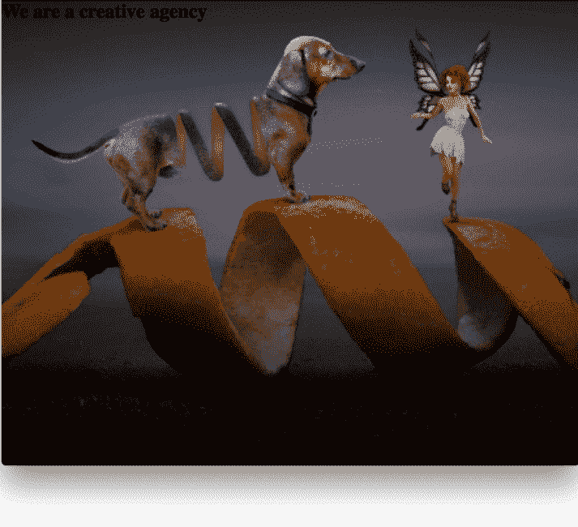

Here’s the result! => The background image is now overlaid with a subtle gradient. Pretty cool, huh?

#### 4.将文本内容放在中间。

用 Flexbox！

```
.opening {  ...  display: flex;  justify-content: center;  align-items: center;}
```

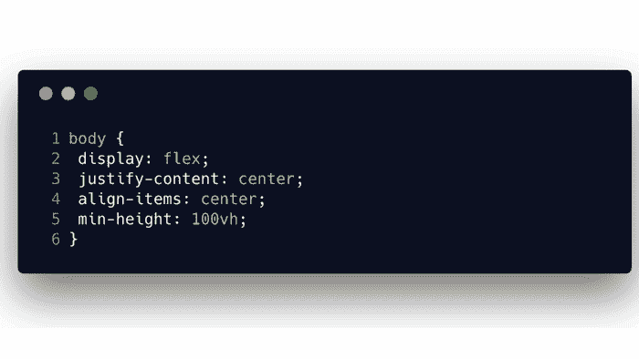

I copied this image from another article of mine, in case you don’t know [how Flexbox works](https://medium.freecodecamp.org/understanding-flexbox-everything-you-need-to-know-b4013d4dc9af). Pick the necessary part.

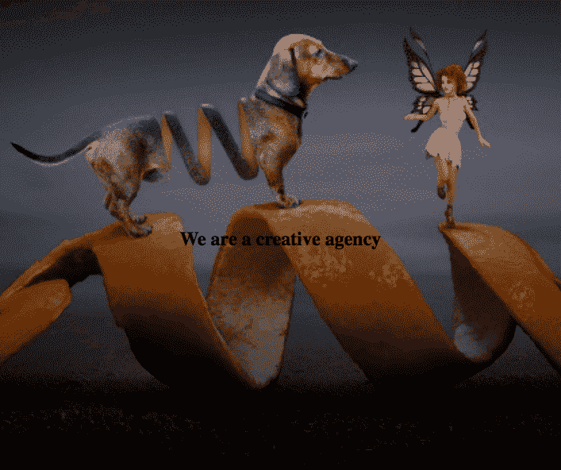

The text is now perfectly centered. Hurray!

#### 5.在我们制作动画之前，让文字看起来更漂亮。

```
.opening-text {  margin: 0;  color: rgba(255,255,255,0.6);  text-transform: uppercase;  font-size: 3.6rem;  text-align: center;}
```

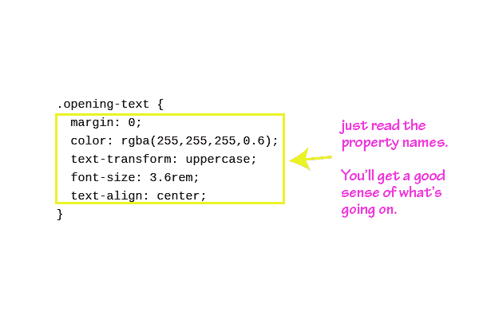

You’ve got this!

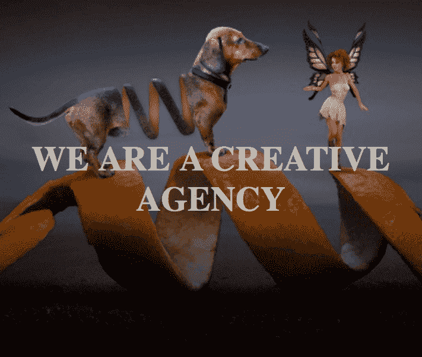

Hey! We’re making progress. Looking good?

#### 6.准备动画！

如果你看一下最终的结果，你会注意到句子中的每个单词都被动画化到场景中。我们需要一种方法将单词分解成单独的元素。

让我们用 JavaScript 来处理这个问题。

简而言之，这是我们想要做的事情的图形表示。

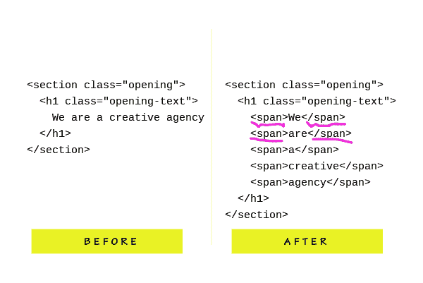

We need to wrap each word within a <span> element.

现在你明白手头的任务了。

这是代码。我希望您对一些 JavaScript 感到满意，因为我将向您展示一些。

```
const textNode = document.querySelector('.opening-text');const splitTextArr = textNode.innerText.split(" ");
```

```
let finalMarkup = "";splitTextArr.forEach(buildMarkup);function buildMarkup(text, index) {  let spanText;
```

```
 (index === 2) ?   spanText = "<span>" + text + "</span><br />" :   spanText = "<span>" + text + "</span> ";    return finalMarkup += spanText;}/** Substitute the previous content for the new markup with span elements */textNode.innerHTML = finalMarkup;
```

这不是太难理解，但是我已经说明了正在发生的事情。

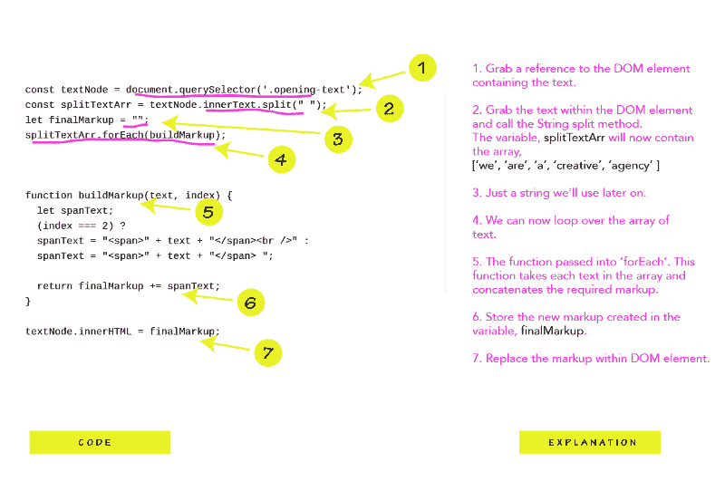

Makes a little more sense now?

注意:在`buildMarkup`函数中，我在第三个单词后添加了一个`<br` / >标签。这将确保文本分解，而不是停留在一行。

#### 7.编写关键帧

```
@keyframes hide {    from { opacity: 1; }    to { opacity: 0; }}@keyframes glow {    from { text-shadow: 0 0 14rem white; }    to { text-shadow: 0 0 0 white; }}
```

为了最终的效果，我们需要两种不同的动画。一个是`hide`动画，另一个是`glow`动画。

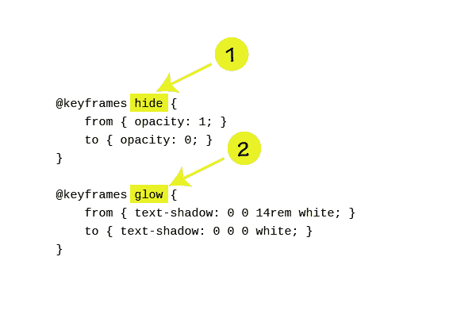

如果你不熟悉 CSS 动画是如何工作的，参加我的[高级 CSS 课程](https://www.educative.io/collection/5191711974227968/5641332169113600)是显而易见的。简而言之，动画很大程度上是由`keyframes`驱动的。

在关键帧块中，定义元素属性随时间的变化。

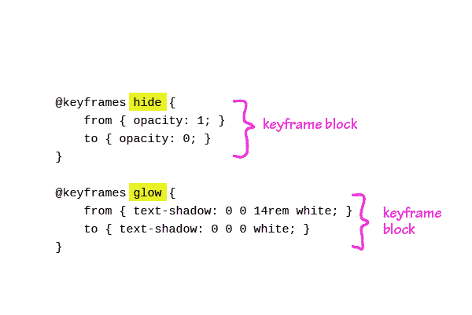

参见上面的代码。即使你不太了解 CSS 动画，我相信你也能理解它。

#### 8.将动画应用于元素

```
.opening-text span {  opacity: 0;  animation:     hide 8s ease-in-out infinite,     glow 8s ease-in-out infinite;}
```

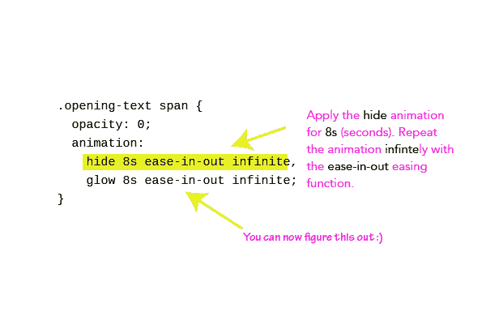

Here we are!

好看吗？

这里有一点解释。

CSS `text-shadow`属性用于在文本上创建闪光效果。如果你不知道`text-shadow`如何工作，看看 [codrops](https://tympanus.net/codrops/css_reference/text-shadow/) 参考。尽管我已经写了很多年的 CSS 了，我也查阅了它来复习。

我们在一起！

#### 9.最后，抵消一个微妙的惊人效果的动画。

```
.opening-text span:nth-child(6n) {    animation-delay: 900ms; }.opening-text span:nth-child(6n-1) {    animation-delay: 700ms; }.opening-text span:nth-child(6n-3) {    animation-delay: 600ms; }.opening-text span:nth-child(6n-4) {    animation-delay: 300ms; }.opening-text span:nth-child(6n-5) {    animation-delay: 0s; }
```

在将每个单词包装在一个`span`元素中之后，`.opening-text`现在包含了六个元素。使用`nth-child`选择器瞄准每个目标。在上面的选择器中替换`n = 1`。你会找到窍门的。

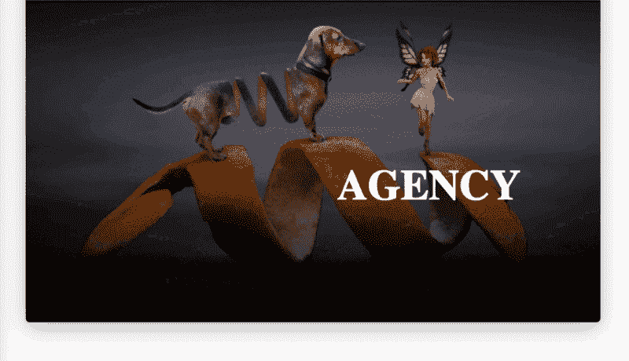

我变懒了，但是我确信如果你花更多的时间调整这些值，你会有一个更漂亮的动画。

是啊，我们做到了？

#### 被困在什么地方了？

请在评论中告诉我，我很乐意帮忙。

### 准备好成为职业选手了吗？

我已经创建了一个免费的 CSS 指南，让你的 CSS 技能立即得到提高。[获取免费电子书](https://pages.convertkit.com/0c2c62e04a/60e5d19f9b)。


Seven CSS Secrets you didn’t know about