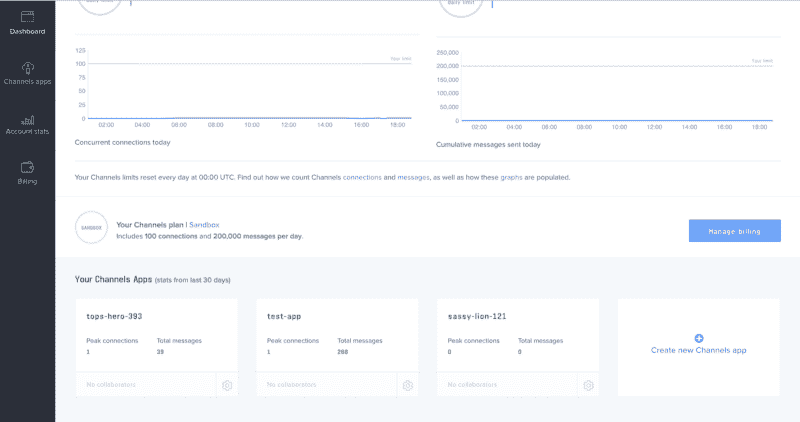
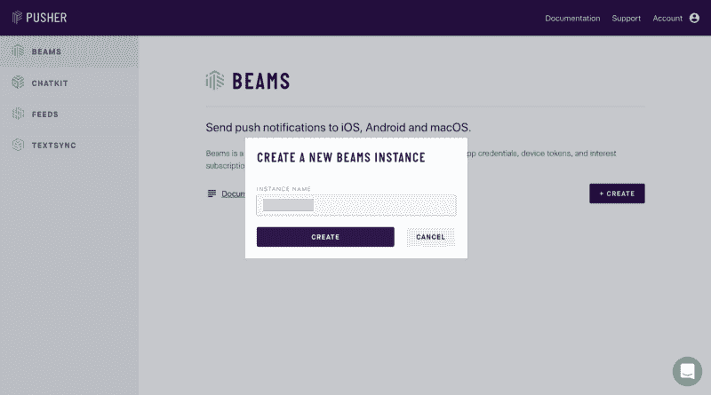
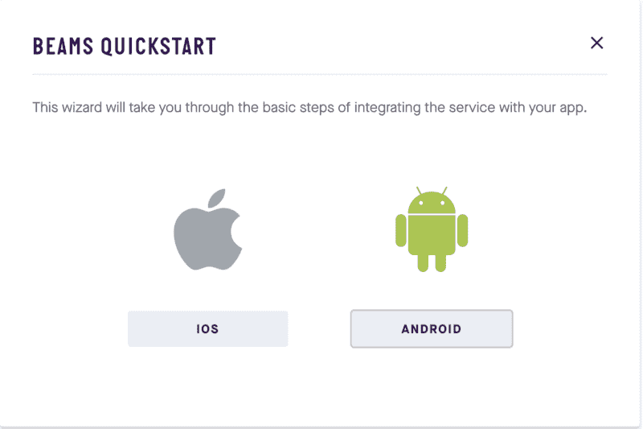

# 如何使用 Swift 和 Laravel 创建加密跟踪应用程序的后端

> 原文：<https://www.freecodecamp.org/news/how-to-create-the-backend-of-a-crypto-tracking-app-using-swift-and-laravel-1d9122bc290b/>

作者:尼奥·伊戈达罗

# 如何使用 Swift 和 Laravel 创建加密跟踪应用程序的后端

#### 第一部分


Photo by [André François McKenzie](https://unsplash.com/photos/aUHr4gcQCCE?utm_source=unsplash&utm_medium=referral&utm_content=creditCopyText) on [Unsplash](https://unsplash.com/search/photos/cryptocurrency?utm_source=unsplash&utm_medium=referral&utm_content=creditCopyText)

> 您需要在您的机器上安装以下软件:Xcode、Laravel CLI、SQLite 和 Cocoapods。熟悉 Xcode IDE 会有所帮助。

### 介绍

加密货币已经是并且仍然是今年最大的趋势之一。随着比特币等货币达到创纪录高位，新公司创造代币和产品，这显示了加密货币的潜在价值。然而，加密货币的价格是不稳定的，可以随时下跌或上涨，所以关注这些变化总是一个好主意。

在本文中，我们将构建一个应用程序来跟踪加密市场的变化。该应用程序将专注于 BTC 和瑞士联邦理工学院，并允许应用程序的用户设置最低和最高金额时，他们希望被告知硬币的当前价格。该应用程序将使用 Swift、Laravel、Pusher Channels 和 Pusher Beams 构建。

### 先决条件

要跟进，您需要满足以下要求:

*   安装在您机器上的 Xcode 。
*   Xcode IDE 的知识。
*   使用 [Laravel 框架](https://laravel.com/)的基础知识。
*   关于 [Swift 编程语言](http://developer.apple.com/swift)的基础知识。
*   安装在您机器上的 Laravel CLI 。
*   安装在您机器上的 SQLite。[安装指南](https://www.tutorialspoint.com/sqlite/sqlite_installation.htm)。
*   安装在您机器上的 Cocoapods 。
*   [推梁](https://pusher.com/beams)和[通道](https://pusher.com/channels)应用。

### 我们将会建造什么

我们将从使用 Laravel 构建应用程序的后端开始。然后，我们将使用 Swift 构建 iOS 应用程序。如果您想测试推送通知，那么您需要在一个活动设备上运行该应用程序。

### 客户端应用程序将如何工作

对于客户端应用程序，iOS 应用程序，我们将创建一个简单的列表，显示可用的货币和美元的当前价格。每当加密货币的价格发生变化时，我们将使用推送渠道触发一个事件，以便更新价格。

从应用程序中，您将能够设置一个最小和最大的价格变化时，你想得到提醒。例如，您可以配置应用程序，当一个以太网(ETH)的价格低于 500 美元时，向应用程序发送推送通知。你也可以配置应用程序在比特币价格超过 5000 美元时接收通知。

### 后端应用程序将如何工作

对于后端应用程序，我们将使用 Laravel，我们将创建允许用户更新设置和加载设备设置的端点。API 将负责检查加密货币的当前价格，并在价格变化时发送渠道更新和 Beams 通知。

然而，因为价格的变化不太容易预测，所以我们将模拟货币的变化，这样我们就可以预览应用程序的运行情况。我们还将使用 Laravel 中的[任务调度](https://laravel.com/docs/5.6/scheduling)来触发对当前货币价格的检查。

在生产环境中，我们将调度器设置为一个 cronjob，但是因为我们正在开发中，所以我们将手动运行命令来触发价格变化。

### 应用程序的外观

当我们完成应用程序时，下面是应用程序的外观:


让我们开始吧。

### 设置推杆梁和通道

#### 设置推动器通道

登录到您的[推杆仪表板](https://dashboard.pusher.com)。如果您没有帐户，请创建一个。您的仪表板应该如下所示:



创建新的频道应用程序。你可以通过点击右下角的大**创建新频道应用**卡来轻松完成。创建新应用程序时，会为您提供密钥。保管好它们，因为你很快就会需要它们。

#### 设置推杆梁

接下来，登录到新的[推杆仪表板](https://dash.pusher.com/)，在这里我们将创建一个推杆梁实例。如果您还没有帐户，您应该注册。点击工具条上的 **Beams** 按钮，然后点击 **Create** ，这将弹出**创建一个新的 Beams 实例**。命名为`cryptoalat`。



创建实例后，您将看到一个快速入门指南。选择 **IOS** 快速入门，并按照向导进行操作。



当您完成创建 Beams 应用程序时，您将获得一个实例 ID 和一个密钥，我们稍后会用到它们。

### 设置您的后端应用程序

在您的终端中，运行下面的命令来创建一个新的 Laravel 项目:

```
$ laravel new cryptoapi
```

这个命令将创建一个新的 Laravel 项目，并安装所有需要的 Laravel 依赖项。

接下来，让我们安装一些特定于项目的依赖项。打开`composer.json`文件，并在`require`属性中添加以下依赖项:

```
// File: composer.json
    "require": {
        [...]

        "neo/pusher-beams": "^1.0",
        "pusher/pusher-php-server": "~3.0"
    },
```

现在运行下面的命令来安装这些依赖项。

```
$ composer update
```

安装完成后，在您选择的文本编辑器中打开项目。 [Visual Studio 代码](https://code.visualstudio.com/)挺好看的。

### 设置我们的推杆梁库

我们要做的第一件事是设置我们刚刚用 composer 拉进来的[推杆光束库](https://github.com/neoighodaro/pusher-beams)。要进行设置，打开`.env`文件并添加以下键:

```
PUSHER_BEAMS_SECRET_KEY="PUSHER_BEAMS_SECRET_KEY"
    PUSHER_BEAMS_INSTANCE_ID="PUSHER_BEAMS_INSTANCE_ID"
```

您应该用设置 Beams 应用程序时获得的键替换`PUSHER_BEAMS_*`占位符。

接下来，打开`config/broadcasting.php`文件并滚动，直到看到`connections`键。在那里，您将拥有`pusher`设置，将以下内容添加到`pusher`配置:

```
'pusher' => [
        // [...]

        'beams' => [
            'secret_key' => env('PUSHER_BEAMS_SECRET_KEY'),
            'instance_id' => env('PUSHER_BEAMS_INSTANCE_ID'),
        ],
    ],
```

### 设置我们的推送渠道库

下一步是建立推销渠道。Laravel 自带对推送通道的支持，所以我们不需要做太多的设置。

打开`.env`文件并更新以下键:

```
BROADCAST_DRIVER=pusher

    // [...]

    PUSHER_APP_ID="PUSHER_APP_ID"
    PUSHER_APP_KEY="PUSHER_APP_KEY"
    PUSHER_APP_SECRET="PUSHER_APP_SECRET"
    PUSHER_APP_CLUSTER="PUSHER_APP_CLUSTER"
```

在上面你设置了`BROADCAST_DRIVER`到`pusher`，然后对于其他的`PUSHER_APP_*`键，用从你的推杆仪表板得到的键替换占位符。这就是我们为这个应用程序设置推送通道所需要做的全部工作。

### 构建后端应用程序

现在我们已经设置了所有的依赖项，我们可以开始构建应用程序了。我们将从创建路线开始。然而，我们不是创建控制器来挂接路由，而是将逻辑直接添加到路由中。

#### 设置数据库、迁移和模型

因为我们将使用数据库，所以我们需要设置将要使用的数据库。为了简单起见，我们将使用 SQLite。在`database`目录下创建一个空的`database.sqlite`文件。

打开`.env`文件并替换:

```
DB_CONNECTION=mysql
    DB_HOST=127.0.0.1
    DB_PORT=3306
    DB_DATABASE=homestead
    DB_USERNAME=homestead
    DB_PASSWORD=secret
```

随着

```
DB_CONNECTION=sqlite
    DB_DATABASE=/full/path/to/your/database.sqlite
```

接下来，让我们为`devices`表创建一个迁移。我们将使用此表来存储设备及其通知设置。这将帮助我们了解向哪些设备发送推送通知。

运行以下命令创建迁移和模型:

```
$ php artisan make:model Device -m
```

> *`-m`标志将指示 artisan 沿着模型创建一个迁移。*

该命令将生成两个文件，迁移文件在`database/migrations`目录中，模型在`app`目录中。让我们首先编辑迁移文件。

打开`database/migrations`目录下的`*_create_devices_table.php`迁移文件，将内容替换为:

```
<?php

    use Illuminate\Support\Facades\Schema;
    use Illuminate\Database\Schema\Blueprint;
    use Illuminate\Database\Migrations\Migration;

    class CreateDevicesTable extends Migration
    {
        /**
         * Run the migrations.
         *
         * @return void
         */
        public function up()
        {
            Schema::create('devices', function (Blueprint $table) {
                $table->increments('id');
                $table->string('uuid')->unique();
                $table->float('btc_min_notify')->default(0);
                $table->float('btc_max_notify')->default(0);
                $table->float('eth_min_notify')->default(0);
                $table->float('eth_max_notify')->default(0);
            });
        }

        /**
         * Reverse the migrations.
         *
         * @return void
         */
        public function down()
        {
            Schema::dropIfExists('devices');
        }
    }
```

在`up`方法中，我们已经定义了`devices`表的结构。我们有`uuid`字段，它将是每个注册设备的唯一字符串。我们有两个`btc_notify`字段，用于保存 BTC 的最低和最高价格，在这一点上设备应该得到通知。这同样适用于* `eth_*_notify`字段。

要运行迁移，请运行以下命令:

```
$ php artisan migrate
```

打开`app/Device.php`模型，用下面的代码替换内容:

```
<?php
    namespace App;

    use Illuminate\Database\Eloquent\Model;
    use Illuminate\Notifications\Notifiable;

    class Device extends Model
    {
        use Notifiable;

        public $timestamps = false;

        protected $fillable = [
            'uuid', 
            'btc_min_notify', 
            'btc_max_notify', 
            'eth_min_notify', 
            'eth_max_notify',
        ];

        protected $cast = [
            'btc_min_notify' => 'float',
            'btc_max_notify' => 'float',
            'eth_min_notify' => 'float',
            'eth_max_notify' => 'float'
        ];

        public function scopeAffected($query, string $currency, $currentPrice)
        {
            return $query->where(function ($q) use ($currency, $currentPrice) {
                $q->where("${currency}_min_notify", '>', 0)
                  ->where("${currency}_min_notify", '>', $currentPrice);
            })->orWhere(function ($q) use ($currency, $currentPrice) {
                $q->where("${currency}_max_notify", '>', 0)
                  ->where("${currency}_max_notify", '<', $currentPrice);
            });
        }
    }
```

在上面的模型中，我们已经将`$timestamps`属性设置为`false`以确保口才不会试图更新`created_at`和`updated_at`字段，这是正常的行为。

我们还有`scopeAffected`方法，它是[雄辩作用域](https://laravel.com/docs/5.6/eloquent#local-scopes)的一个例子。我们用它来获取货币价格发生变化后受影响的设备。因此，例如，如果 BTC 的价格下降，该方法将检查设备和设置，以查看需要通知这一变化的设备。

> *局部作用域允许您定义通用的约束集，您可以在整个应用程序中轻松地重用这些约束集。例如，您可能需要经常检索所有被认为“受欢迎”的用户。要定义一个范围，在雄辩模型方法前面加上`scope`。- [拉勒维尔文档](https://laravel.com/docs/5.6/eloquent#local-scopes)。*

当我们需要知道发送推送通知到什么设备时，我们将在我们的应用程序中使用这个范围。

#### 创建路线

打开`routes/api.php`文件，用以下代码替换文件内容:

```
// File: routes/api.php
    <?php
    use App\Device;
    use Illuminate\Http\Request;
```

接下来，让我们添加第一条路线。将下面的代码附加到 routes 文件中:

```
// File: routes/api.php
    Route::get('/settings', function (Request $request) {
        return Device::whereUuid($request->query('u'))->firstOrFail()['settings'];
    });
```

在上面的路线中，我们返回在`u`查询参数中提供的设备设置。这意味着如果一个注册的设备点击`/settings`端点并通过`u`参数传递设备 UUID，该设备的设置将被返回。

接下来，在同一个 routes 文件中，将以下内容粘贴到文件的底部:

```
Route::post('/settings', function (Request $request) {
        $settings = $request->validate([
            'btc_min_notify' => 'int|min:0',
            'btc_max_notify' => 'int|min:0',
            'eth_min_notify' => 'int|min:0',
            'eth_max_notify' => 'int|min:0',
        ]);

        $settings = array_filter($settings, function ($value) { return $value > 0; });

        $device = Device::firstOrNew(['uuid' => $request->query('u')]);
        $device->fill($settings);
        $saved = $device->save();

        return response()->json([
            'status' => $saved ? 'success' : 'failure'
        ], $saved ? 200 : 400);
    });
```

以上，我们已经为`POST /settings`路线定义了路线。此路线将设置保存到数据库中。如果该设置尚不存在，它将创建一个新条目；如果存在，它将更新现有条目。

路线就这些了。

#### 创建作业、事件和通知程序

接下来，我们需要创建一个 [Laravel 作业](https://laravel.com/docs/5.6/queues#creating-jobs)，它将每隔一段时间运行一次，以检查货币价格是否有变化。

运行以下命令创建新的 Laravel 作业:

```
$ php artisan make:job CheckPrices
```

这将在`app`目录中创建一个新的`CheckPrices`类。打开该类并用以下内容替换其内容:

```
<?php

    namespace App\Jobs;

    use App\Device;
    use Illuminate\Bus\Queueable;
    use Illuminate\Queue\SerializesModels;
    use Illuminate\Queue\InteractsWithQueue;
    use Illuminate\Contracts\Queue\ShouldQueue;
    use Illuminate\Foundation\Bus\Dispatchable;
    use App\Events\CurrencyUpdated;
    use App\Notifications\CoinPriceChanged;

    class CheckPrices implements ShouldQueue
    {
        use Dispatchable, InteractsWithQueue, Queueable, SerializesModels;

        protected $supportedCurrencies = ['ETH', 'BTC'];

        /**
         * Execute the job.
         *
         * @return void
         */
        public function handle()
        {
            $payload = $this->getPricesForSupportedCurrencies();

            if (!empty($payload)) {
                $this->triggerPusherUpdate($payload);
                $this->triggerPossiblePushNotification($payload);
            }
        }

        private function triggerPusherUpdate($payload)
        {
            event(new CurrencyUpdated($payload));
        }

        private function triggerPossiblePushNotification($payload)
        {
            foreach ($this->supportedCurrencies as $currency) {
                $currentPrice = $payload[$currency]['current'];

                $currency = strtolower($currency);

                foreach (Device::affected($currency, $currentPrice)->get() as $device) {
                    $device->notify(new CoinPriceChanged($currency, $device, $payload));
                }
            }
        }

        public function getPricesForSupportedCurrencies(): array
        {
            $payload = [];

            foreach ($this->supportedCurrencies as $currency) {
                if (config('app.debug') === true) {
                    $response = [
                        $currency => [
                            'USD' => (float) rand(100, 15000)
                        ]
                    ];
                } else {
                    $url = "https://min-api.cryptocompare.com/data/pricehistorical?fsym={$currency}&tsyms=USD&ts={$timestamp}";

                    $response = json_decode(file_get_contents($url), true);
                }

                if (json_last_error() === JSON_ERROR_NONE) {
                    $currentPrice = $response[$currency]['USD'];

                    $previousPrice = cache()->get("PRICE_${currency}", false);

                    if ($previousPrice == false or $previousPrice !== $currentPrice) {
                        $payload[$currency] = [
                            'current' => $currentPrice,
                            'previous' => $previousPrice,
                        ];
                    }

                    cache()->put("PRICE_${currency}", $currentPrice, (24 * 60 * 60));
                }
            }

            return $payload;
        }
    }
```

在上面的类中，我们实现了`ShouldQueue`接口。这使得作业能够并且将会被排队。在生产服务器中，对作业进行排队可以提高应用程序的速度，因为它会对可能需要一段时间才能执行的作业进行排队，以便以后执行。

这门课我们有四种方法。第一种是`handle`法。这个函数在作业执行时被自动调用。在这个方法中，我们获取可用货币的价格，然后检查价格是否发生了变化。如果有，我们发布一个推送通道事件，然后根据用户的设置检查是否有任何设备需要通知。如果有，我们向该设备发送推送通知。

我们有触发`CurrencyUpdated`事件的`triggerPusherUpdate`方法。我们将在下一节创建这个事件。我们还有一个`triggerPossiblePushNotification`方法，它获取应该被通知货币变化的设备列表，然后使用我们将在下一节创建的`CoinPriceChanged`类通知用户。

最后，我们有`getPricesForSupportedCurrencies`方法，它只获取货币的当前价格。在这个方法中，我们有一个模拟当前货币价格的调试模式。

为了确保我们刚刚创建的这个类被正确调度，打开`app/Console/Kernel.php`文件，在`schedule`方法中，将以下代码添加到`schedule`方法中:

```
$schedule->job(new \App\Jobs\CheckPrices)->everyMinute();
```

现在，每次我们运行命令`php artisan schedule:run`时，这个`schedule`方法中的所有作业都会运行。通常，在生产环境中，我们需要添加 schedule 命令作为 cronjob，但是，我们将手动运行该命令。

接下来要做的是创建通知程序和事件。在您的终端中，运行以下命令:

```
$ php artisan make:event CurrencyUpdated    $ php artisan make:notification CoinPriceChanged
```

这将在`Events`和`Notifications`目录中创建一个类。

在[事件](https://laravel.com/docs/5.6/events)类中，`CurrencyUpdated`粘贴以下代码:

```
<?php

    namespace App\Events;

    use Illuminate\Broadcasting\Channel;
    use Illuminate\Queue\SerializesModels;
    use Illuminate\Foundation\Events\Dispatchable;
    use Illuminate\Broadcasting\InteractsWithSockets;
    use Illuminate\Contracts\Broadcasting\ShouldBroadcast;

    class CurrencyUpdated implements ShouldBroadcast
    {
        use Dispatchable, InteractsWithSockets, SerializesModels;

        public $payload;

        public function __construct($payload)
        {
            $this->payload = $payload;
        }

        public function broadcastOn()
        {
            return new Channel('currency-update');
        }

        public function broadcastAs()
        {
            return 'currency.updated';
        }
    }
```

在上面的事件类中，我们有`broadcastOn`方法来指定我们想要在其上广播事件的推送通道。我们还有`broadcastAs`方法，它指定了我们想要广播给通道的事件的名称。

在`CoinPriceChanged` [通知](https://laravel.com/docs/5.6/notifications)类中，用以下代码替换内容:

```
<?php

    namespace App\Notifications;

    use App\Device;
    use Illuminate\Bus\Queueable;
    use Neo\PusherBeams\PusherBeams;
    use Neo\PusherBeams\PusherMessage;
    use Illuminate\Notifications\Notification;

    class CoinPriceChanged extends Notification
    {
        use Queueable;

        private $currency;
        private $device;
        private $payload;

        public function __construct(string $currency, Device $device, array $payload)
        {
            $this->currency = $currency;
            $this->device = $device;
            $this->payload = $payload;
        }

        public function via($notifiable)
        {
            return [PusherBeams::class];
        }

        public function toPushNotification($notifiable)
        {
            $currentPrice = $this->payload[strtoupper($this->currency)]['current'];

            $previousPrice = $this->payload[strtoupper($this->currency)]['current'];

            $direction = $currentPrice > $previousPrice ? 'climbed' : 'dropped';

            $currentPriceFormatted = number_format($currentPrice);

            return PusherMessage::create()
                    ->iOS()
                    ->sound('success')
                    ->title("Price of {$this->currency} has {$direction}")
                    ->body("The price of {$this->currency} has {$direction} and is now \${$currentPriceFormatted}");
        }

        public function pushNotificationInterest()
        {
            $uuid = strtolower(str_replace('-', '_', $this->device->uuid));

            return "{$uuid}_{$this->currency}_changed";
        }
    }
```

在上面的类中，我们有使用 Pusher Beams 库准备推送通知的`toPushNotification`类。我们还有`pushNotificationInterest`方法，它根据货币和设备 ID 设置推送通知的名称。

这就是后端的全部内容，现在只需运行下面的命令来启动服务器:

```
$ php artisan serve
```

这将启动一个 PHP 服务器，并运行我们的应用程序。另外，如果您需要手动触发货币变化，请运行以下命令:

```
$ php artisan schedule:run
```

既然我们已经完成了后端，我们可以使用 Swift 和 Xcode 创建应用程序。

### 结论

在本文的这一部分，我们已经为加密货币警报应用程序创建了后端。[在下一部分](https://pusher.com/tutorials/cryptocurrency-tracking-swift-laravel-part-2)中，我们将看到如何创建应用程序来使用我们刚刚在这一部分中创建的 API。

该应用程序的源代码可在 [GitHub](https://github.com/neoighodaro/cryptocurrency-alert-ios-app) 上获得。

本文首发于 [pusher。](https://pusher.com/tutorials/cryptocurrency-tracking-swift-laravel-part-1)