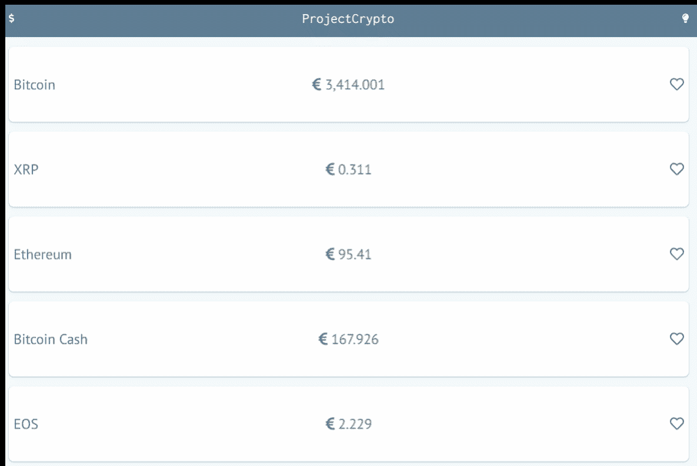

# 如何使用 CSS 变量为 Angular 7 应用程序创建主题

> 原文：<https://www.freecodecamp.org/news/how-to-create-themes-for-your-angular-7-apps-using-css-variables-69251690e9c5/>

在本帖中，我们将使用 Angular 7 和 CSS 变量构建一个超级简单的加密货币列表应用程序。

### 目录

*   [设计](#42d3)
*   [项目设置](#868f)
*   [代码](#8b88)
*   [结论、回购和进一步阅读](#5106)



What we’re aiming for

### 设计

如果你只是为了代码而来，请随意[跳过这一节](#868f)。

我用 [Figma](https://www.figma.com/) 设计了这个简单的应用。

#### 色彩设计

我们的配色方案由*前景*、*背景*、*原色*和*误差*色组成。每个颜色组都有几种较浅和较深的基色变体。

对于我们的亮/暗主题，前景和背景颜色将简单地交换。

[https://www.figma.com/embed?embed_host=oembed&url=https://www.figma.com/proto/03NzSIaXxIYwk8DdLe5d5Jhr/project-crypto?node-id=1:4](https://www.figma.com/embed?embed_host=oembed&url=https://www.figma.com/proto/03NzSIaXxIYwk8DdLe5d5Jhr/project-crypto?node-id=1:4)

#### 成分

接下来是创建组件。由于我们的应用程序非常小，我们只有几个组件。

导航组件，它将让我们的用户切换主题。

[https://www.figma.com/embed?embed_host=oembed&url=https://www.figma.com/proto/03NzSIaXxIYwk8DdLe5d5Jhr/project-crypto?node-id=1:2](https://www.figma.com/embed?embed_host=oembed&url=https://www.figma.com/proto/03NzSIaXxIYwk8DdLe5d5Jhr/project-crypto?node-id=1:2)

将显示硬币信息的*磁贴*组件。

[https://www.figma.com/embed?embed_host=oembed&url=https://www.figma.com/proto/03NzSIaXxIYwk8DdLe5d5Jhr/project-crypto?node-id=2:60](https://www.figma.com/embed?embed_host=oembed&url=https://www.figma.com/proto/03NzSIaXxIYwk8DdLe5d5Jhr/project-crypto?node-id=2:60)

把这些放在一起，我们得到了我们的目标设计。

[https://www.figma.com/embed?embed_host=oembed&url=https://www.figma.com/proto/03NzSIaXxIYwk8DdLe5d5Jhr/project-crypto?node-id=1:3](https://www.figma.com/embed?embed_host=oembed&url=https://www.figma.com/proto/03NzSIaXxIYwk8DdLe5d5Jhr/project-crypto?node-id=1:3)

[https://www.figma.com/embed?embed_host=oembed&url=https://www.figma.com/proto/03NzSIaXxIYwk8DdLe5d5Jhr/project-crypto?node-id=2:53](https://www.figma.com/embed?embed_host=oembed&url=https://www.figma.com/proto/03NzSIaXxIYwk8DdLe5d5Jhr/project-crypto?node-id=2:53)

#### 项目设置

我们将使用 Angular CLI 搭建我们的应用程序。首先，我们需要安装它。

```
npm install -g @angular/cli
```

然后创建我们的应用程序。

```
ng new project-crypto
```

最后，生成一个模块来保存我们的主题逻辑。

```
cd project-crypto 
```

```
ng generate module theme 
```

### 密码

好了，好东西来了。

#### 定义 CSS 变量

让我们从定义初始 CSS 变量开始。我们可以设置它们来反映我们的灯光主题。因为我们希望我们的主题是全局的，所以我用`:root`选择器定义了它，它将匹配`html`元素。如果您愿意，可以在这里使用`body`或其他高级元素。

```
@import url("https://fonts.googleapis.com/css?family=PT+Sans:400,700");
@import url("https://fonts.googleapis.com/css?family=Inconsolata:400,700");

:root {
  /* Colors */
  --foreground-default: #08090a;
  --foreground-secondary: #41474d;
  --foreground-tertiary: #797c80;
  --foreground-quaternary: #f4faff;
  --foreground-light: #41474d;

  --background-default: #f4faff;
  --background-secondary: #a3b9cc;
  --background-tertiary: #5c7d99;
  --background-light: #ffffff;

  --primary-default: #5dfdcb;
  --primary-dark: #24b286;
  --primary-light: #b2ffe7;

  --error-default: #ef3e36;
  --error-dark: #800600;
  --error-light: #ffcecc;

  /* Shadows */
  --background-tertiary-shadow: 0 1px 3px 0 rgba(92, 125, 153, 0.5);
}

body {
  background: var(--background-default);
}

html,
body {
  margin: 0;
  padding: 0;
  font-family: "PT Sans", sans-serif;
}
```

#### 定义主题

接下来，让我们在 TypeScript 中定义我们的主题。这些稍后将用于通过角度服务切换主题。

在我们新创建的`theme`模块下，创建一个新文件:`theme.ts`

```
export interface Theme {
  name: string;
  properties: any;
}

export const light: Theme = {
  name: "light",
  properties: {
    "--foreground-default": "#08090A",
    "--foreground-secondary": "#41474D",
    "--foreground-tertiary": "#797C80",
    "--foreground-quaternary": "#F4FAFF",
    "--foreground-light": "#41474D",

    "--background-default": "#F4FAFF",
    "--background-secondary": "#A3B9CC",
    "--background-tertiary": "#5C7D99",
    "--background-light": "#FFFFFF",

    "--primary-default": "#5DFDCB",
    "--primary-dark": "#24B286",
    "--primary-light": "#B2FFE7",

    "--error-default": "#EF3E36",
    "--error-dark": "#800600",
    "--error-light": "#FFCECC",

    "--background-tertiary-shadow": "0 1px 3px 0 rgba(92, 125, 153, 0.5)"
  }
};

export const dark: Theme = {
  name: "dark",
  properties: {
    "--foreground-default": "#5C7D99",
    "--foreground-secondary": "#A3B9CC",
    "--foreground-tertiary": "#F4FAFF",
    "--foreground-quaternary": "#E5E5E5",
    "--foreground-light": "#FFFFFF",

    "--background-default": "#797C80",
    "--background-secondary": "#41474D",
    "--background-tertiary": "#08090A",
    "--background-light": "#41474D",

    "--primary-default": "#5DFDCB",
    "--primary-dark": "#24B286",
    "--primary-light": "#B2FFE7",

    "--error-default": "#EF3E36",
    "--error-dark": "#800600",
    "--error-light": "#FFCECC",

    "--background-tertiary-shadow": "0 1px 3px 0 rgba(8, 9, 10, 0.5)"
  }
};
```

我们可以在这里添加任意多的主题。现在，让我们坚持光和暗的主题。

#### 创建主题服务

我们的服务将负责:**跟踪活动主题**，以及**基于活动主题更新 CSS 变量**。

我们可以使用 CLI 来生成我们的新服务。下`/src/app/theme`运行

```
ng generate service theme
```

```
import { Injectable } from "@angular/core";
import { Theme, light, dark } from "./theme";

@Injectable({
  providedIn: "root"
})
export class ThemeService {
  private active: Theme = light;
  private availableThemes: Theme[] = [light, dark];

  getAvailableThemes(): Theme[] {
    return this.availableThemes;
  }

  getActiveTheme(): Theme {
    return this.active;
  }

  isDarkTheme(): boolean {
    return this.active.name === dark.name;
  }

  setDarkTheme(): void {
    this.setActiveTheme(dark);
  }

  setLightTheme(): void {
    this.setActiveTheme(light);
  }

  setActiveTheme(theme: Theme): void {
    this.active = theme;

    Object.keys(this.active.properties).forEach(property => {
      document.documentElement.style.setProperty(
        property,
        this.active.properties[property]
      );
    });
  }
}
```

这里需要注意一些事情:

1.  我们导入刚刚创建的主题定义，在第 2 行。
2.  第 34–39 行更新了主题中定义的 CSS 变量。这基本上是奇迹发生的地方。
3.  因为在这个示例应用程序中，我们只有两个主题，所以我添加了一些方便的功能来直接将主题设置为亮和暗。您可以使用`getAvailableThemes`和`setActiveTheme`函数根据用户输入动态改变主题。

#### 成分

艰难的工作完成了。现在我们只需要把我们的积木放在一起。嗯，实际上，首先我们需要创建构建模块？。让我们创建组件。

我们将从**导航**组件开始。同样，我们可以使用 Angular CLI 给我们一个良好的开端。

```
ng generate component nav
```

```
import { Component, OnInit } from "@angular/core";
import {
  faLightbulb as faSolidLightbulb,
  faDollarSign,
  IconDefinition
} from "@fortawesome/free-solid-svg-icons";
import { faLightbulb as faRegularLightbulb } from "@fortawesome/free-regular-svg-icons";
import { ThemeService } from "src/app/theme/theme.service";

@Component({
  selector: "app-nav",
  templateUrl: "./nav.component.html",
  styleUrls: ["./nav.component.css"]
})
export class NavComponent implements OnInit {
  faLightbulb: IconDefinition;
  faDollarSign = faDollarSign;

  constructor(
    private themeService: ThemeService
  ) {}

  ngOnInit() {
    this.setLightbulb();
  }

  setLightbulb() {
    if (this.themeService.isDarkTheme()) {
      this.faLightbulb = faRegularLightbulb;
    } else {
      this.faLightbulb = faSolidLightbulb;
    }
  }

  toggleTheme() {
    if (this.themeService.isDarkTheme()) {
      this.themeService.setLightTheme();
    } else {
      this.themeService.setDarkTheme();
    }

    this.setLightbulb();
  }
}
```

注意:我对导航条上的图标使用了 Awesome 字体。如果你想做同样的事情，你将需要[为 Angular](https://fontawesome.com/how-to-use/on-the-web/using-with/angular) 安装字体牛逼。

我们的导航组件的逻辑非常简单。我们根据初始化时的主题设置图标(第 22 行)。然后我们设置一个事件处理程序来切换主题。你可以在下面的 HTML 中看到它的用法。

```
<nav>
  <fa-icon [icon]="faDollarSign"></fa-icon>
  <h5 class="title secondary-font">ProjectCrypto</h5>
  <fa-icon [icon]="faLightbulb" (click)="toggleTheme()"></fa-icon>
</nav>
```

```
nav {
  height: 4rem;
  display: flex;
  align-items: center;
  padding-left: 1rem;
  padding-right: 1rem;
  background-color: var(--background-tertiary);
  color: var(--foreground-quaternary);
  font-size: 1rem;
}

nav .title {
  margin-left: auto;
  margin-right: auto;
}
```

关于导航组件 CSS 的注释:

1.  第 7 行和第 8 行是这里最重要的。这两行代码使用了我们之前定义的 CSS 变量，并使这个组件可主题化。

接下来，**平铺**组件。

```
<div class="container">
  <h5 class="name">{{ name }}</h5>
  <h5 class="price">
    <fa-icon [icon]="currencyIcon"></fa-icon>
    {{ price | number }}
  </h5>
  <fa-icon
    [icon]="faHeart"
    (click)="onToggleFavourite()"
    class="favouriteIcon icon"
    [ngClass]="{ isFavourite: isFavourite }"
  ></fa-icon>
</div>
```

```
.container {
  display: grid;
  grid-template-columns: 0.5fr 1fr 0.5fr;
  align-items: center;
  border-radius: 0.5rem;
  background: var(--background-light);
  color: var(--foreground-tertiary);
  padding-left: 0.5rem;
  padding-right: 0.5rem;
  margin-bottom: 1rem;
  min-height: 8rem;
  box-shadow: var(--background-tertiary-shadow);
}

.container .name {
  justify-self: start;
}

.container .price {
  justify-self: center;
}

.container .icon {
  justify-self: end;
}

.favouriteIcon {
  font-size: 1.5rem;
}

.isFavourite {
  color: var(--primary-default);
}
```

注意事项:

1.  我们的 tile 组件的 TypeScript 没有任何主题逻辑，所以我在这里省略了它。
2.  第 6、7、12 和 32 行使我们的 tile 组件可主题化。

### 结论、回购和进一步阅读

就是这样！现在，您已经创建了组件和主题。您可以将这些组件添加到您的基础应用程序组件中，用一些测试数据将一切连接起来。

你可以在这里找到回购[。](https://github.com/stephan-mclean/project-crypto)

点击了解更多关于 CSS 变量[的信息。](https://medium.freecodecamp.org/everything-you-need-to-know-about-css-variables-c74d922ea855)

感谢阅读！