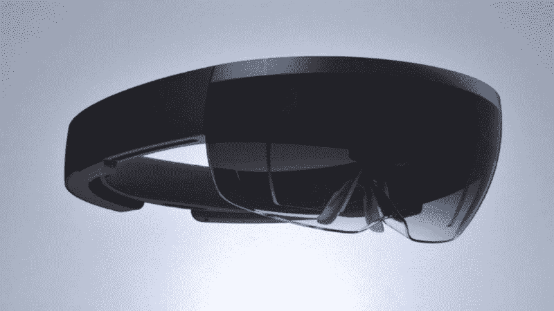
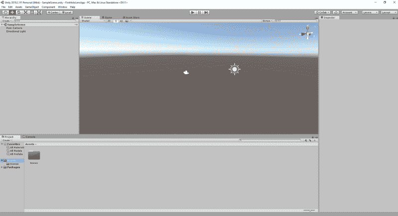
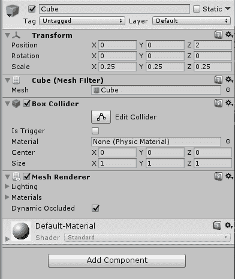
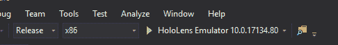
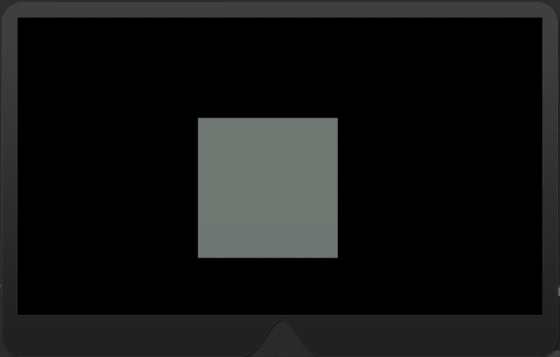
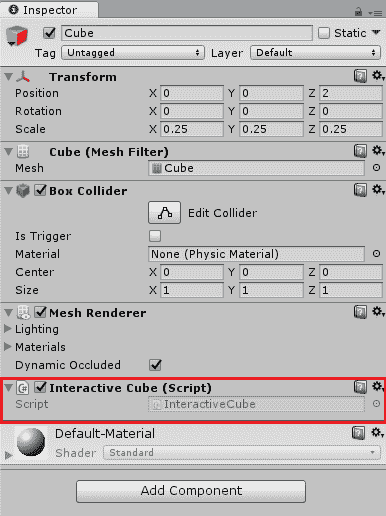
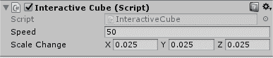

# 如何使用 Unity 创建您的第一个 HoloLens 应用程序

> 原文：<https://www.freecodecamp.org/news/how-to-create-your-first-hololens-app-with-unity-1afa364843d4/>

马克斯·哈德斯顿

# 如何使用 Unity 创建您的第一个 HoloLens 应用程序



Microsoft HoloLens. Image credit [https://www.flickr.com/photos/jiff01/15867880743](https://www.flickr.com/photos/jiff01/15867880743)

微软的 HoloLens 非常棒。我在今年夏天的实习中被介绍给它，并且我已经为它开发了一个爆炸。

HoloLens 应用程序是使用 DirectX 和 C++或 Unity 和 C#创建的。我发现用 Unity 安装并运行一个应用程序通常更快更容易。

在本文中，我们将为 HoloLens 开发设置 Unity，创建一个交互式立方体，并旋转 HoloLens 模拟器，以便您可以看到您的创作。这篇文章是为 Unity 的完全初学者准备的，所以如果你有使用编辑器的经验，我建议你浏览一下微软的教程。

### 先决条件

1.  装有 2018 年 4 月更新的 Windows 10 电脑
2.  你可以在这里下载全息透镜模拟器
3.  [Visual Studio 2017](https://developer.microsoft.com/en-us/windows/downloads) —社区版就可以
4.  [Unity](https://store.unity.com/download) —确保添加了窗口。安装过程中的. NET 脚本后端组件
5.  全息工具

你可以在这里找到完整的源代码。

### 建立

打开团结。如果这是您第一次使用编辑器，系统会提示您登录或注册。我推荐 Unity Personal，除非你打算将你的应用货币化。

登录后，创建一个新项目并输入名称。项目完成初始设置后，您应该会看到这个屏幕。



Unity editor at first startup

右键单击左下角的资产文件夹。导航到导入包->自定义包，打开我们之前下载的 HoloToolKit unity 文件。将出现一个 Unity 弹出窗口，单击“All”并导入资产。

接下来，我们将创建我们的场景。选择文件->新场景，并将其保存为主场景。

Unity 需要一个特殊的配置来为 HoloLens 构建一个项目。幸运的是，HoloToolKit 有实用程序脚本来为我们做这种配置。在顶部工具栏上，选择混合现实工具包->配置->应用混合现实项目设置。使用默认值。配置完成后，应用混合现实场景设置。删除平行光游戏对象。

厉害！到目前为止，我们已经导入了 HoloToolKit，并为 HoloLens 开发设置了 Unity。在下一节，我将向你介绍 Unity 的基础知识，之后我们将在屏幕上渲染一个立方体。

### 让自己熟悉编辑器

这是编辑器此时应该显示的样子。请注意三个封闭区域:


左边的红色区域是场景层次面板。在这里我们可以添加新的**游戏对象**，并获得当前应用程序的高级概览。一个[游戏对象](https://docs.unity3d.com/ScriptReference/GameObject.html)是所有 Unity 实体的基类。它们可以是立方体等物理对象，也可以是场景中输入管理器等脚本的集合。

底部蓝色区域包含资产菜单和控制台。“资源”菜单就像它听起来的那样——它包含运行应用程序所需的 C#脚本、材质、预设和网格。

右边的绿色区域是检查菜单。在这里你可以添加和修改游戏对象的组件。[组件](https://docs.unity3d.com/ScriptReference/Component.html)是组成游戏对象行为的东西。它们决定了其父代的外观、交互性和物理特性。

### 创建多维数据集

现在我们将让我们的第一个游戏对象呈现在屏幕上。在场景层次面板中，右键单击并选择 3D 对象->立方体。编辑器中应该会出现一个立方体。

双击“层次中”面板中的“立方体”,在右侧检查器面板中将位置更改为(0，0，2)。将刻度设置为(. 25，. 25，. 25)。您的检查器面板应该如下所示:



Cube inspector panel

不错！让我们完成构建步骤，这样我们就可以在 HoloLens 模拟器中看到我们的立方体。

在 Unity 中，选择文件->构建设置。构建弹出窗口应该会出现，所以点击构建按钮。在文件夹弹出窗口中，创建一个名为 App 的新文件夹，并选择它作为构建目标。

生成完成后，打开 App 文件夹中的 Visual Studio 解决方案。将调试选项更改为 Release、x86，并将 HoloLens 模拟器作为目标。您的选项栏应该如下所示:



Debug options for HoloLens emulator

运行该解决方案，在模拟器启动和应用程序加载之后，您应该会在屏幕上看到您的多维数据集。



Cube in the emulator

### 使立方体具有交互性

既然我们已经知道了如何将一个立方体放入我们的应用程序，让我们让这个立方体实际上做一些事情。当我们凝视立方体时，它会旋转，当我们单击立方体时，它会变大。

导航回 Unity，并在“资源”面板中创建新脚本，名为 InteractiveCube。要创建新脚本，请右键单击“资源”面板，然后选择“创建”->“C #脚本”。

要将脚本添加到立方体中，请确保立方体被选中，并将脚本拖放到检查器面板上。它应该是这样的:



双击 assets 选项卡中的脚本，应该会出现一个 Visual Studio 实例。

导入 HoloToolkit。Unity.InputModule 放在我们脚本的顶部，并使 InteractiveCube 扩展 IFocusable 和 IInputClickHandler。我们的代码应该是这样的:

```
using HoloToolkit.Unity.InputModule;
```

```
public class InteractiveCube : MonoBehaviour, IFocusable, IInputClickHandler {...} 
```

通过扩展 IFocuable 和 IInputClickHandler 接口，我们的脚本组件允许父 GameObject 订阅焦点和单击事件。

当我们凝视立方体时，让它旋转。IFocusable 接口要求我们实现两个公共 void 方法:OnFocusEnter 和 OnFocusExit。创建一个私有布尔字段，并将其命名为 Rotating。当我们聚焦立方体时，将其设置为 true，当我们的焦点退出时，将其设置为 false。我们的代码应该是这样的:

```
public bool Rotating;
```

```
public void OnFocusEnter(){    Rotating = true;}
```

```
public void OnFocusExit(){    Rotating = false;}
```

我们将在 Update()中进行实际的旋转。Update()是一个特殊的 Unity 方法，每一帧都会调用它。若要控制旋转的速度，请添加一个名为 RotationSpeed 的公共浮点字段。组件中的任何公共字段都可以在 Unity 编辑器中进行调整和初始化。

```
public float RotationSpeed;
```

```
void Update() {    if (Rotating)        transform.Rotate(Vector3.Up * Time.deltaTime            * RotationSpeed);}
```

在 Unity 中，变换用于控制游戏对象的物理属性，如大小、旋转和位置。我们以每秒一度乘以速度的速度围绕 y 轴旋转父游戏对象。

要使多维数据集响应 click 事件，请添加 IInputClickHandler 所需的 OnInputClicked 方法。创建名为 ScaleChange 的公共 Vector3 变量。在 OnInputClicked 方法中，我们将通过 ScaleChange 增加立方体的比例。

```
public Vector3 ScaleChange;
```

```
public void OnInputClicked(InputClickedEventData eventData) {    transform.localScale += ScaleChange;}
```

现在我们已经完成了脚本，导航回 Unity。确保选择了立方体对象，并将速度和比例变化变量分别设置为 50 和(. 025，. 025，. 025)。随意尝试不同的价值观！我们的脚本应该是这样的:



厉害！我们已经完成了 InteractiveCube 脚本。从 Unity 编辑器构建您的应用程序，并从 Visual Studio 运行解决方案。

### 摘要

在本演练中，您学习了如何为 HoloLens 开发设置 Unity、创建交互式 GameObject 以及在模拟器中运行您的应用程序。

如果你喜欢 HoloLens 开发，我鼓励你去看看微软学院的教程。他们详细介绍了各种 HoloLens 的关键概念，并带你创建一些非常酷的应用程序。

如果你喜欢这篇文章或有反馈，请在下面留下评论！