# 如何免费创建自己的 auto direct message Twitter bot？

> 原文：<https://www.freecodecamp.org/news/how-to-create-your-own-auto-direct-message-twitter-bot-for-free-e851265ce730/>

优素福·埃尔·阿齐齐

# 如何免费创建自己的 auto direct message Twitter bot？


Create your own auto direct message Twitter Bot

在 Twitter 上为你的新粉丝创建欢迎信息是让更多人关注你的推文和链接的第一步。你可能知道，有许多在线服务可以帮助你向你的新粉丝发送自动直接消息。但是我认为在线服务对一个创建机器人的简单工具收取 5-15 美元的费用是疯狂的，而你可以免费创建自己的机器人。

在本文中，我将介绍我自己构建的 Twitter 机器人，它向我在 Twitter 上的新粉丝发送欢迎消息。我还会向你展示这六个月来它是如何对我非常有效的。

到本文结束时，您将能够构建自己的 Twitter auto DM，从创建消息到部署机器人，全部免费！

本文由两部分组成。在第一部分中，我一步一步地描述了脚本是如何工作的，以及如何轻松地使用其他 Twitter bot 服务。第二部分是一步一步的教程，告诉您如何部署和使用 bot，甚至不需要了解 Node.js。

### 你需要什么？

为了开发这个机器人，我们需要:

*   Node.js 已安装
*   [Twit](https://github.com/ttezel/twit) :节点的 Twitter API 客户端(REST &流 API)
*   [Github 账户](https://github.com/)
*   [推特账号](https://twitter.com/)
*   用于部署机器人的 Heroku 帐户。

如果您不熟悉 Nodejs，或者您不是程序员，那么您可以从 GitHub 分支这个项目，并将其作为您自己的项目使用。

让我们开始吧。

### Secont 1:使用 Node.js

如果您已经将项目克隆到您的计算机上，您将看到以下结构:

```
$ cd twitter-bot$ tree .   .├── config.js├── index.js├── LICENSE├── package.json├── Procfile├── README.md└── src    ├── AutoDM.js    └── Twit.js
```

如您所见，该项目是一个简单的 Node.js 应用程序，以 index.js 文件作为入口点:

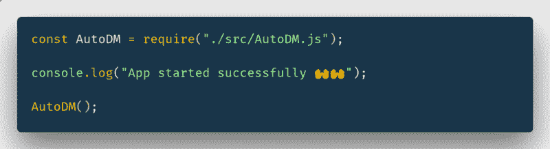

infex.js file

索引文件是一个简单的脚本，它导入并调用`AutoDM`函数。

为了让应用程序更有趣，我添加了一条简单的消息，显示应用程序何时成功启动。

正如我已经提到的，我使用 Twit 包来连接 Twitter API。为此，我们需要创建一个简单的 Twitter 应用程序，并使用您的应用程序配置初始化 Twit 实例，如下所示:

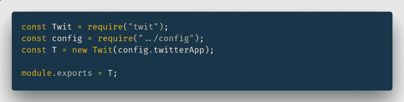

Twit.js file

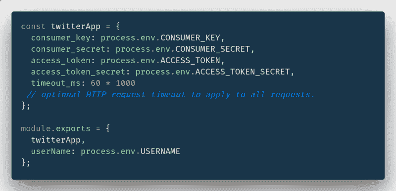

config.js file

`process.env.XXXXXXX`是一个环境变量，我们需要在部署步骤中将其添加到 Heroku 应用程序中。

现在有趣的部分是创建 AutoDM 函数:

如下图所示，`AutoDM`是一个简单的箭头函数。它监听来自 twitter API 的流`follow`事件，并执行 SendMessage 函数。

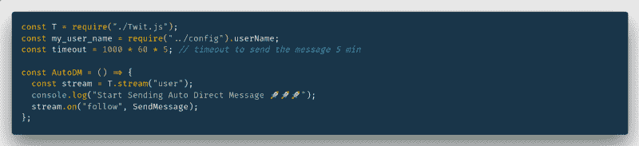

AutoDM.js file

`sendMessge`函数获取关注您的用户(`screen_name`)作为参数。我们需要创建一个带有`screen_name`的对象和一条文本消息。然后，我们向 Twitter API 发送一个 post 请求，将 DM 发送到`@screen_name`，如下所示:

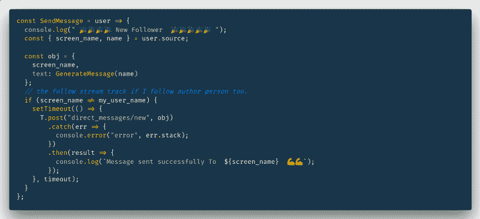

SendMessge Function

现在，想想你想如何介绍自己。您可以修改现有的`GenerateMessage`函数来创建您自己的欢迎消息。不要忘了在里面添加一些客套话——这会增加用户点击你的链接或者回复你的信息的机会。

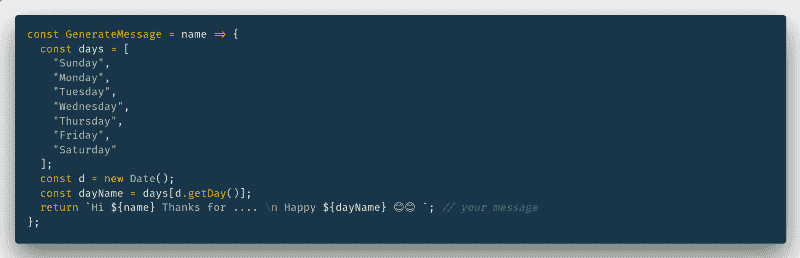

GenerateMessge Function

很容易，不是吗？你可以从 [Github repo](https://github.com/yjose/twitter-bot) 中读到更多代码。

也许你不相信这个项目的文件结构，或者为什么我们不能只用一个简单的文件来做这些事情。你有理由怀疑，但是我们正在使用这个项目结构来简化对项目的贡献。通过在一个新文件中导出一个类似 autoDM 的函数，并在索引文件中调用它，您可以轻松地创建一个简单的 Twitter 服务，如 following 或 retweeting。因此，如果您有任何开发新服务的想法，请随时创建 PRs 或请求新服务。

### 创建自己的 Twitter 机器人？

#### 第一步:Github。

在 GitHub[https://github.com/yjose/twitter-bot](https://github.com/yjose/twitter-bot)分叉项目回购。可以给回购打个星，表示支持。

现在，通过更新`GenerateMessage`函数定制您的欢迎消息，并提交您的更改。

#### 步骤 2:推特

创建一个 Twitter 应用。转到[https://apps.twitter.com/](https://apps.twitter.com/)，点击按钮`Create New App`，然后完成如下所有字段:

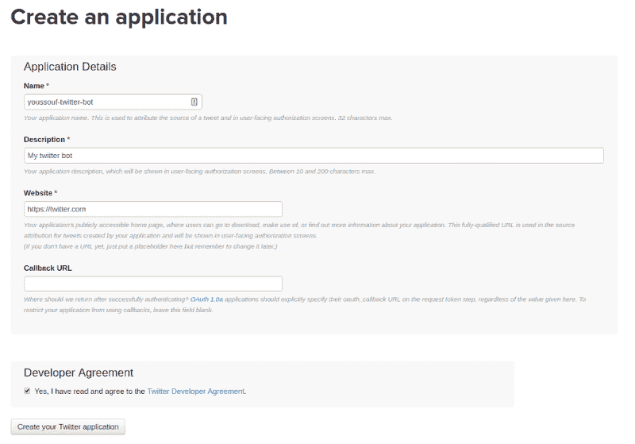

转到`Permissions`部分，通过选中选项`Read,Write and Access direct messages`为应用程序提供发送直接消息的权限。

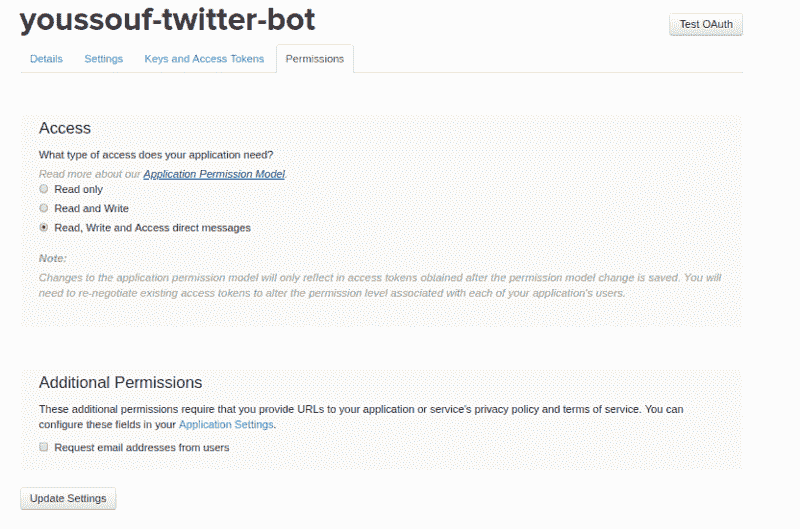

转到标签`Key and Access Tokens`，然后点击页面底部的`Generate Access Token` 按钮。

现在复制你所有的钥匙`Consumer Key`、`Consumer Secret`、`Access Token`和`Access Token Secret`。我们需要稍后将它们全部添加为 Heroku vars。

#### 第三步:Heroku

*   创建一个 [Heroku 账号](https://dashboard.heroku.com/)。免费的！
*   连接到你的 Heroku 账户，点击`New`按钮，然后点击`Create new App`选项，创建一个新的应用。
*   选择您的应用程序名称，然后点击`Create App`

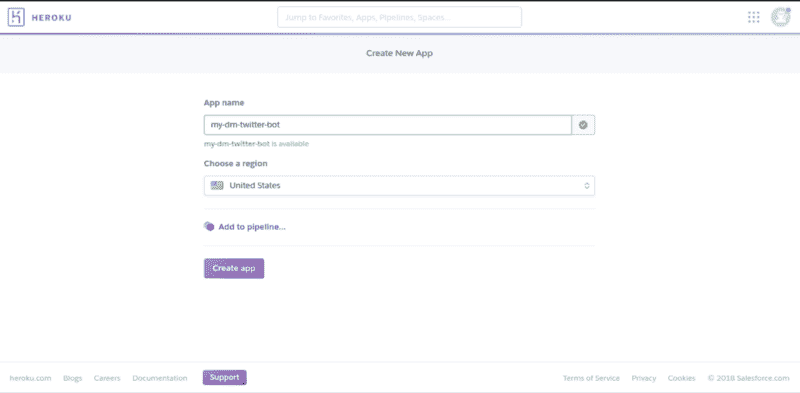

选择 Github 作为部署方法，然后单击 connect 按钮。

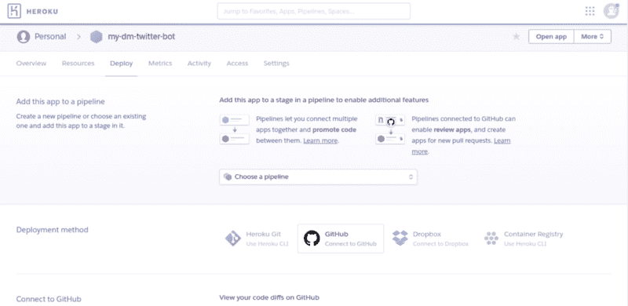

键入您的 bot repo 名称:在您的情况下为“twitter-bot”。

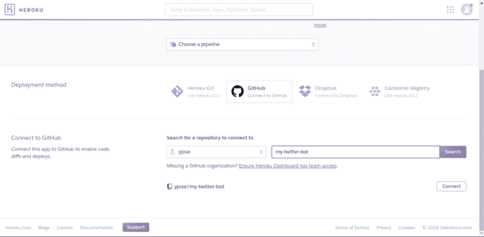

现在您需要在选项卡设置上将所有键添加为 Heroku 变量，并配置变量部分。

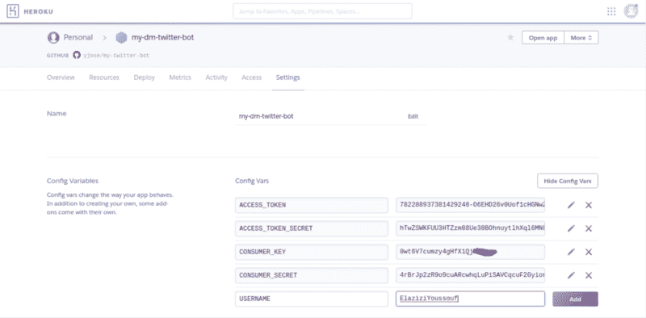

返回部署部分，单击`enable automatic deploys`，然后单击`deploy branch`按钮，首次部署您的应用程序。

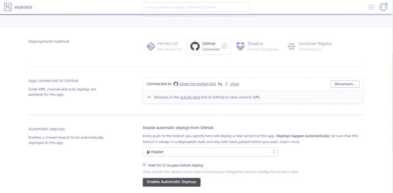

转到参考资料部分，激活 worker dyno，并禁用 web dyno。

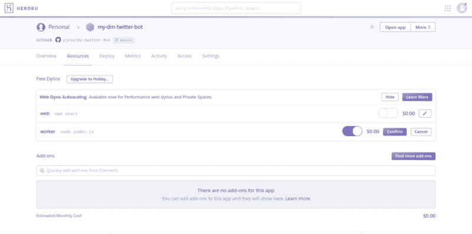

要了解您的应用程序是否已成功启动，请单击页面右上角的`more`按钮，然后单击`view logs`选项。您会发现一个简单的控制台，其输出类似于这个屏幕截图。我有了一些新的关注者，消息已经成功发送？。

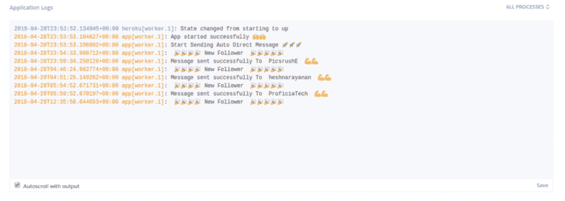

### 现场演示

为了确保项目完美运行，你只需要 [**关注**](https://twitter.com/ElaziziYoussouf) 我和我的推特机器人会给你发送欢迎信息？。

如果你在执行本教程时有任何问题，请在评论中告诉我。

感谢阅读！如果你认为其他人应该阅读这篇文章并使用这个项目，请为我鼓掌，发微博，并分享这篇文章。

记得在 Medium 上关注我，这样你就可以得到关于我未来帖子的通知。

> ***阅读更多故事【https://elazizi.com/】T2***