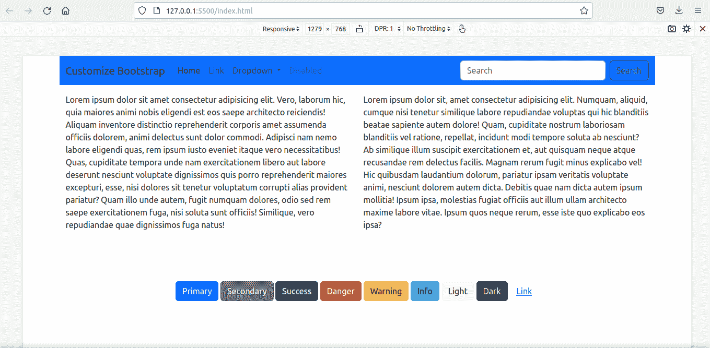
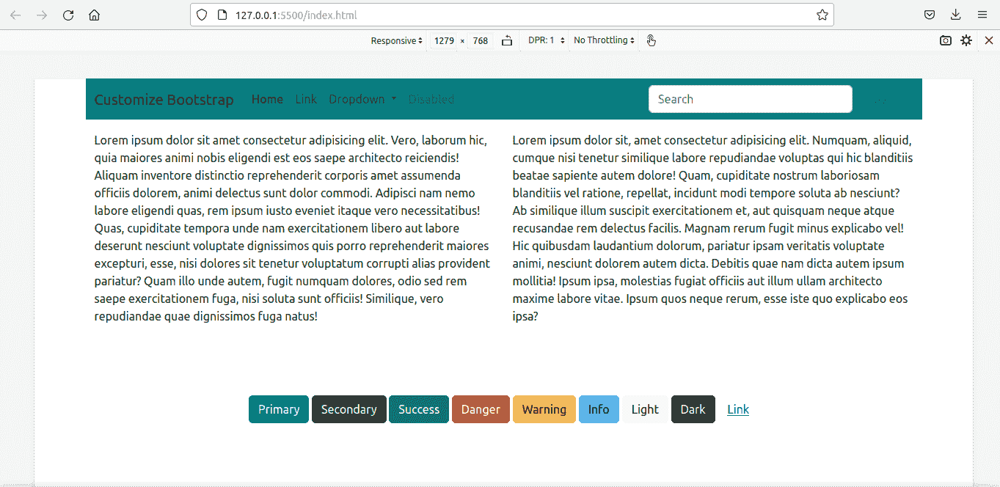
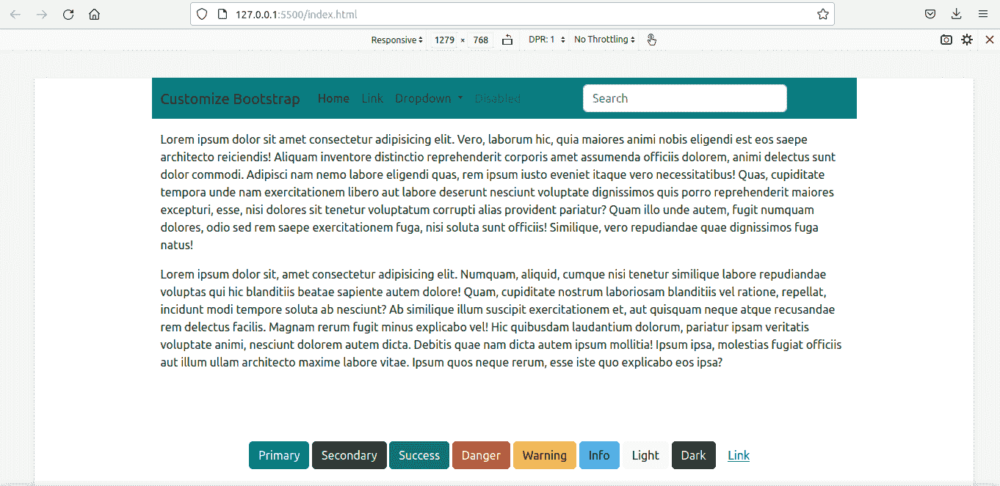

# 如何用 Sass 定制引导程序

> 原文：<https://www.freecodecamp.org/news/how-to-customize-bootstrap-with-sass/>

Bootstrap 是一个很棒的 CSS 框架，可以帮助你创建时尚的网站。

一些开发人员和团队发现用 Bootstrap 编写的代码比普通 CSS 更容易维护，所以他们更喜欢 Bootstrap 而不是普通 CSS。

但是如果每个人都使用 Bootstrap 的默认风格，那么每个网站看起来都一样——很快，互联网就会变得非常乏味。幸运的是，Bootstrap 也是高度可定制的。

## 如何定制引导程序

如果您是初学者，可以使用定制的 CSS 样式表定制 Bootstrap。CSS 特异性在这里很重要。您编写定制的 CSS，具有相同或更高的特异性，并在链接到原始引导 CSS 的行之后的 index.html 的 head 部分中链接到它。

```
<!-- index.html -->
<head>

    <link rel="stylesheet" href="./node_modules/bootstrap/dist/css/bootstrap.min.css">
    <!-- custom CSS should come after Bootstrap CSS -->
    <link rel="stylesheet" href="./custom.css"

</head> 
```

对于小的调整，这是可以的。但是对于较大的项目，这可能很耗时，并且可能有许多冗余的样式声明。所以必须有另一种更干净的方法。

### 如何通过 Bootstrap 使用 Sass

解决方案是使用 Sass——一种 CSS 预处理器。Sass 在用于网页之前被编译成 CSS。

在 Bootstrap 版本 3.x 之前，您可以在 CSS 预处理程序之间进行选择:Less 或 Sass。但是从版本 4 开始，Bootstrap 只使用 Sass。Bootstrap 4 和 5 框架的源代码完全是用 Sass 编写的，这证明了 Sass 已经变得多么成熟。

你可能听说过这样一句口号，“Sass 就是拥有超能力的 CSS”。如果你想学习 Sass，[官方](https://sass-lang.com)网站是一个极好的资源。你也可以参考 freeCodeCamp 上的其他教程，比如这个关于[如何用 CSS](https://www.freecodecamp.org/news/how-to-use-sass-with-css/) 使用 Sass 的教程，或者这个关于[如何用 Bootstrap 5](https://www.freecodecamp.org/news/learn-bootstrap-5-and-sass-by-building-a-portfolio-website/) 使用 Sass 的视频课程。

Sass 有两种语法。旧的使用缩进，新的 SCSS 语法(SCSS 时髦的 CSS)使用类似 CSS 的花括号。

SCSS 是 CSS 的超集。所以用. scss 扩展名保存的 css 代码(或者夹杂着 CSS 的 SCSS)也是有效的 Sass 代码。

在本教程中，我们将使用 SCSS 版本。无论是缩进式的 Sass 还是类似 CSS 的 SCSS，Sass 编译器都会将其转换成普通的 CSS，以便在浏览器上使用。

### 在本教程中，我们要做的是

1.  我们将改变 Bootstrap 附带的主要和次要主题颜色。
2.  我们还将更改引导程序使用的默认媒体断点。

一旦我们能做到这些，做其他定制就变得容易了。

### 先决条件

1.  带有 npm 或 yarn 的 Node.js
2.  一个代码编辑器，最好是 VS 代码。
3.  对 Sass 的基本理解

官网下载 Bootstrap:[https://getbootstrap.com](https://getbootstrap.com)

因为我们已经安装了 Node.js，所以我将使用 npm 版本。

`npm i bootstrap`

我们还需要安装 Sass 编译器。我们可以从[他们的网站](https://sass-lang.com)获得官方的 dart-sass 版本。无论您使用的是 Windows、Mac 还是 Linux，您只需要下载 dart-sass 包，将其解压缩，并将其添加到 path(环境变量)中。

有一个 npm sass 包。此外，还有一个超过 200 万次安装的 *Live Sass 编译器* VS 代码扩展。您可以随意使用您喜欢的任何 Sass 编译器。

这里，我们将使用 npm 包:sass。

下载 Bootstrap 和 Sass 编译器后，在`node-modules`目录中，有一个名为`bootstrap`的文件夹。

里面还有三个文件夹:`dist`、`js`、`scss`。

所有编译好的 CSS 都在`dist`里，Bootstrap JavaScript 代码在`js`里，所有 Sass 文件都在`scss`文件夹里。

### 如何更改主要和次要主题颜色

对于定制，我们的想法是重写。scss 文件并重新编译它们。

官方引导文档建议尽可能不要更改核心引导文件。因此，我们将创建一个 custom.scss 样式表。

我们将在 custom.scss 文件中导入所有引导程序。

```
//custom.scss

@import "../node_modules/bootstrap/scss/bootstrap"; 
```

在 Bootstrap 中，变量以`!default`(一个 Sass 标志)为后缀。`!default`标志告诉编译器只有在值未定义时才设置该值。

因此，我们在@import 指令之前设置变量，以便以后编译器设置我们的值而不是默认值。

```
//custom.scss

$primary: teal;
$secondary: green;

@import "../node_modules/bootstrap/scss/bootstrap"; 
```

我们还需要一个 HTML 文件来预览结果。

```
<!-- index.html -->
<!DOCTYPE html>
<html lang="en">
<head>
    <meta charset="UTF-8">
    <meta http-equiv="X-UA-Compatible" content="IE=edge">
    <meta name="viewport" content="width=device-width, initial-scale=1.0">
    <title>Welcome! Customize Bootstrap with Sass</title>
    <link rel="stylesheet" href="./node_modules/bootstrap/dist/css/bootstrap.min.css"
</head>
<body>
 <div class="container" >
 <div class="row">
    <nav class="navbar navbar-expand-lg navbar-light bg-primary">
        <div class="container-fluid">
          <a class="navbar-brand" href="#">Customize Bootstrap</a>
          <button class="navbar-toggler" type="button" data-bs-toggle="collapse" data-bs-target="#navbarSupportedContent" aria-controls="navbarSupportedContent" aria-expanded="false" aria-label="Toggle navigation">
            <span class="navbar-toggler-icon"></span>
          </button>
          <div class="collapse navbar-collapse" id="navbarSupportedContent">
            <ul class="navbar-nav me-auto mb-2 mb-lg-0">
              <li class="nav-item">
                <a class="nav-link active" aria-current="page" href="#">Home</a>
              </li>
              <li class="nav-item">
                <a class="nav-link" href="#">Link</a>
              </li>
              <li class="nav-item dropdown">
                <a class="nav-link dropdown-toggle" href="#" id="navbarDropdown" role="button" data-bs-toggle="dropdown" aria-expanded="false">
                  Dropdown
                </a>
                <ul class="dropdown-menu" aria-labelledby="navbarDropdown">
                  <li><a class="dropdown-item" href="#">Action</a></li>
                  <li><a class="dropdown-item" href="#">Another action</a></li>
                  <li><hr class="dropdown-divider"></li>
                  <li><a class="dropdown-item" href="#">Something else here</a></li>
                </ul>
              </li>
              <li class="nav-item">
                <a class="nav-link disabled" href="#" tabindex="-1" aria-disabled="true">Disabled</a>
              </li>
            </ul>
            <form class="d-flex">
              <input class="form-control me-2" type="search" placeholder="Search" aria-label="Search">
              <button class="btn btn-outline-success" type="submit">Search</button>
            </form>
          </div>
        </div>
      </nav>
<div class="container">
<div class="row">

  <div class="col-xl pt-3">
    Lorem ipsum dolor sit amet consectetur adipisicing elit. Vero, laborum hic, quia maiores animi nobis eligendi est eos saepe architecto reiciendis! Aliquam inventore distinctio reprehenderit corporis amet assumenda officiis dolorem, animi delectus sunt dolor commodi. Adipisci nam nemo labore eligendi quas, rem ipsum iusto eveniet itaque vero necessitatibus! Quas, cupiditate tempora unde nam exercitationem libero aut labore deserunt nesciunt voluptate dignissimos quis porro reprehenderit maiores excepturi, esse, nisi dolores sit tenetur voluptatum corrupti alias provident pariatur? Quam illo unde autem, fugit numquam dolores, odio sed rem saepe exercitationem fuga, nisi soluta sunt officiis! Similique, vero repudiandae quae dignissimos fuga natus!
    </div>

  <div class="col-xl pt-3 ">
    Lorem ipsum dolor sit, amet consectetur adipisicing elit. Numquam, aliquid, cumque nisi tenetur similique labore repudiandae voluptas qui hic blanditiis beatae sapiente autem dolore! Quam, cupiditate nostrum laboriosam blanditiis vel ratione, repellat, incidunt modi tempore soluta ab nesciunt? Ab similique illum suscipit exercitationem et, aut quisquam neque atque recusandae rem delectus facilis. Magnam rerum fugit minus explicabo vel! Hic quibusdam laudantium dolorum, pariatur ipsam veritatis voluptate animi, nesciunt dolorem autem dicta. Debitis quae nam dicta autem ipsum mollitia! Ipsum ipsa, molestias fugiat officiis aut illum ullam architecto maxime labore vitae. Ipsum quos neque rerum, esse iste quo explicabo eos ipsa?
    </div>

</div>
</div>

<div class="mt-5 pt-5 mb-5 text-center">
  <button type="button" class="btn btn-primary">Primary</button>
  <button type="button" class="btn btn-secondary">Secondary</button>
  <button type="button" class="btn btn-success">Success</button>
  <button type="button" class="btn btn-danger">Danger</button>
  <button type="button" class="btn btn-warning">Warning</button>
  <button type="button" class="btn btn-info">Info</button>
  <button type="button" class="btn btn-light">Light</button>
  <button type="button" class="btn btn-dark">Dark</button>
  <button type="button" class="btn btn-link">Link</button>
</div>

 </div>

 </div>

</body>
</html> 
```

我们还没有汇编 Sass。要查看默认样式，运行 *Live Server* 。

如果没有安装 Live Server，你可以从 VS 代码扩展市场下载免费的扩展。

这就是我们所看到的:



是时候编译我们的自定义 Sass 文件了。

编译语法很简单:指定用冒号分隔的源和目标文件夹。

我在一个名为`custom_scss`的文件夹中有我的 custom.scss 文件。

`sass custom_scss/custom.scss:assets/css/custom_bootstrap.css`

重新编译后，我们在`assets/css/custom_bootstrap.css`文件中有了定制的引导。

我们将使用这个定制的引导样式表，而不是默认的引导文件。

```
<!-- index.html -->
<head>

<link rel="stylesheet" href="./assets/css/custom_bootstrap.css"> `

</head> 
```

然后再次运行 *Live 服务器*。

我们用我们的新风格定制网页。



### 如何更改网格断点

我们现在将自定义媒体断点。此外，我们还必须重新定义集装箱的最大宽度。

最简单的方法是简单地覆盖变量:

```
$primary: teal;
$secondary:green;

$grid-breakpoints: (
  xs: 0,
  sm: 576px,
  md: 768px,
  lg: 992px,
  xl: 1280px,
  xxl: 1600px
);

$container-max-widths: (
  sm: 540px,
  md: 720px,
  lg: 960px,
  xl: 1220px,
  xxl: 1520px
);

@import '../node_modules/bootstrap/scss/bootstrap' 
```

由于这将违反 DRY 原则(不要重复自己)，使用`map-merge()`函数是一个更好的选择。

我们必须首先在 custom.scss 文件中导入函数，以使`map.merge()`可用。

我们还必须导入变量，因为$grid-breakpoints(将在函数中使用)是在那里定义的。

```
//custom.scss

$primary: teal;
$secondary: green;

@import '../node_modules/bootstrap/scss/functions';
@import '../node_modules/bootstrap/scss/variables'; 
```

这是代码:

```
//custom.scss

$primary: teal;
$secondary: green;

//We have to import the functions first to use map.merge()

@import '../node_modules/bootstrap/scss/functions';

// We have to import the variables beforehand to 
//use the variable $grid-breakpoints.
// Otherwise, compiler will show error - '$grid-breakpoints 
//undefined.'

@import '../node_modules/bootstrap/scss/variables';

$new-breakpoints: (
    xl: 1280px,
    xxl:1600px
);

$grid-breakpoints: map-merge($grid-breakpoints, $new-breakpoints);

$new-container-max-widths: (
  xl: 1220px,
  xxl:1520px
);

$container-max-widths: map-merge($container-max-widths, $new-container-max-widths);

@import "../node_modules/bootstrap/scss/bootstrap"; 
```

我们再次编译，用最新的文件代替旧的文件。

`<link rel="stylesheet" href="./assets/css/custom_bootstrap.css">`

这是最后的结果:



不仅仅是主题颜色和媒体断点。边框、间距、框阴影、字体、图标...你可以定制任何东西。

我已经把上面的代码都放在这个 GitHub [repo](https://github.com/vinod-vms/Customize_Bootstrap_with_Sass) 里了。

为了进一步探索，官方 Bootstrap [文档](https://getbootstrap.com/docs/5.0/getting-started/introduction/)在这方面是一个极好的资源。

## 结论

在本教程中，我向您展示了如何使用 Sass 来定制 Bootstrap。

即使我们在一个使用 React with Bootstrap 的项目中，想法也是一样的。创建一个自定义。scss 文件，进行定制，导入引导程序，重新编译，然后链接到定制文件来代替原始引导程序文件。

快乐学习！