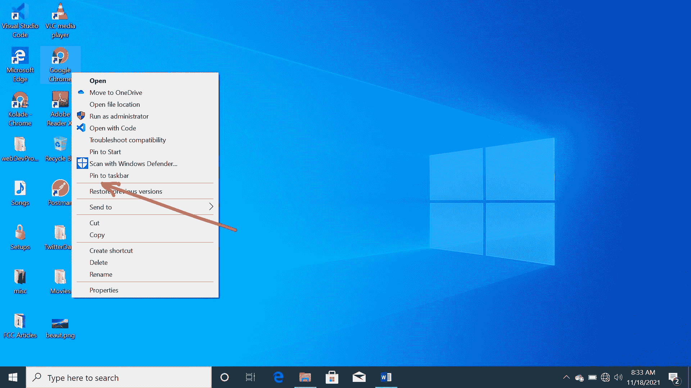
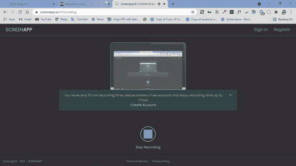

# 如何自定义 Windows 10 任务栏以提高工作效率

> 原文：<https://www.freecodecamp.org/news/how-to-customize-your-windows10-taskbar-for-productivity/>

在电脑桌面上，您可以使用任务栏来帮助您监控应用程序、检查电池寿命等等。

能够自定义任务栏的功能对于提高您的工作效率至关重要。它不仅仅是监控应用程序。

在本指南中，我将向你展示几种你可以自定义任务栏来提高工作效率的方法。

## 如何将应用程序固定到 Windows 的任务栏

就像你可以在桌面上创建快捷方式一样，你可以将应用程序固定在任务栏上，以便轻松启动它们。通过这种方式，您将能够一键启动您的固定应用程序。

要将应用程序固定到任务栏，右键单击应用程序并选择“固定到任务栏”

现在您可以一键启动固定到任务栏的应用程序。

## 如何用任务栏偷看你的桌面

你可以通过将鼠标悬停在任务栏的最右侧来查看桌面上正在发生的事情。

**按照下面的步骤去做:**

**第一步**:右击任务栏上的空白区域，选择“任务栏设置”。

**第二步**:开启“当你将鼠标移动到任务栏末端的‘显示桌面按钮’时，使用 Peek 预览桌面”。

现在任何时候你悬停在任务栏的最右端，你都会看到桌面:

## 如何自动隐藏任务栏

您可以隐藏任务栏，直到您需要它并将光标移向它。这将使您屏幕上的内容显示得更宽。

**自动隐藏任务栏:**

**第一步**:右击任务栏上的空白部分，选择“任务栏设置”。

**第二步**:开启“桌面模式下自动隐藏任务栏”。

现在你可以看到它是如何工作的:

## 如何隐藏搜索框或在任务栏上显示搜索图标

您可以隐藏任务栏上的搜索框，为锁定的应用程序腾出更多空间。

请记住，如果你想直接搜索你的电脑而不点击任何东西，你应该保留默认设置——“显示搜索框”。

**步骤 1** :右击任务栏上的空白部分，悬停在“搜索”上。

**第二步**:选择“隐藏”隐藏搜索栏，或者选择“搜索图标”显示搜索图标，而不是框。

## 如何改变任务栏的位置

任务栏不一定总是在屏幕底部。如果你想的话，你可以移动它。

**第一步**:右击任务栏上的空白区域，选择“任务栏设置”。

**第二步:**在“屏幕上的任务栏位置”下，点击方框，选择你想要的任务栏位置。

## 结论

在本文中，您了解了一些自定义任务栏的方法，以帮助您提高工作效率。

感谢您的阅读。如果你觉得这篇文章有用，请与你的朋友和家人分享。