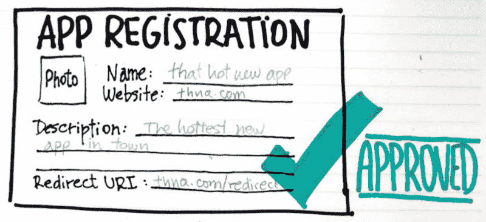
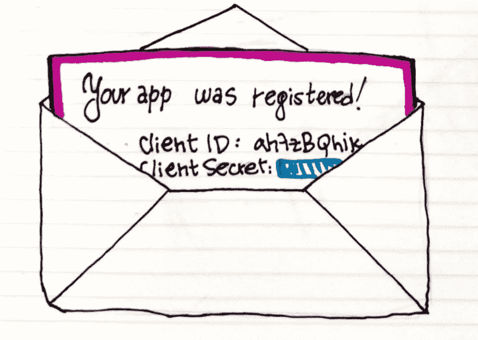
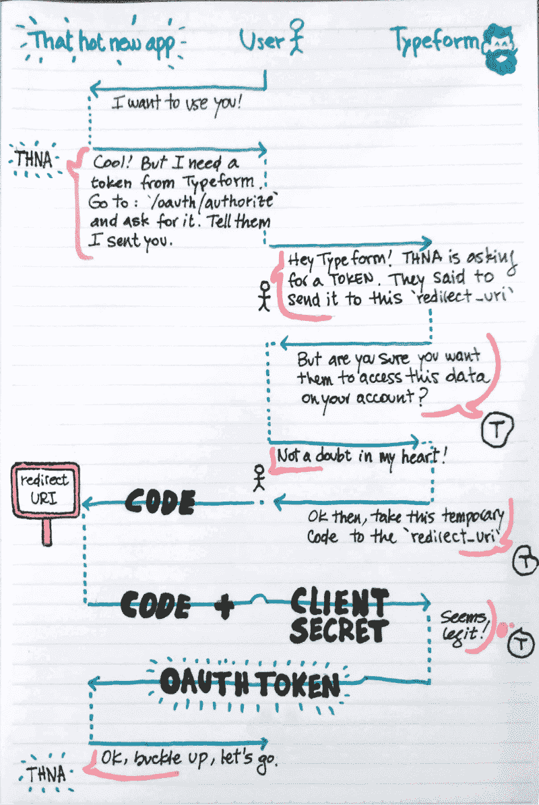

# 如何跳 OAuth 舞:一个循序渐进的教训

> 原文：<https://www.freecodecamp.org/news/how-to-dance-the-oauth-a-step-by-step-lesson-fd2364d89742/>

安娜贝拉·斯皮内利

# 如何跳 OAuth 舞:一个循序渐进的教训


Five, six, seven, eight!

大多数时候，我试图学习新的东西并付诸实践，我很快就开始觉得自己迷失在无数的舞蹈动作中。我拼命想找到正确的做事方式，但并不真正明白发生了什么，也不明白我怎么会出现在房间的错误一边…

只是试着做些事情直到成功。

也许是因为我的学习过程的方式，或者也许指南和教程是针对更有经验或技术的人。但是，在我思考完这个问题之后，我总是觉得应该有一个简单的指南来理解关键概念**和**，从而更容易将它们应用到项目中。

所以这一次，我决定停止许愿，用我最后学到的东西，自己去创造。

那就是 OAuth 2.0。

### OAuth 是什么？

先说基础:OAuth 代表**开放授权**。这是一个应用程序或网站可以从另一个网站访问私人用户数据的过程。

这个网站通常只作为一个可信的身份提供者工作。它向请求应用程序提供一些关于你的基本信息，以便应用程序可以创建一个档案。这样，你就不必填写无聊的注册表格和处理另一个密码了？

你已经使用这个至少无数次了，事实上你每次点击“用脸书/谷歌/ GitHub / …”的时候都会用到它。接下来，你会看到一个同意屏幕，上面显示你允许**that-hot-new-app.com**阅读(有时，写下)你的(比如说)脸书个人资料中的哪些信息。之后，由于 that-hot-new-app.com 的**信任脸书提供的身份，他们可以使用收到的数据在他们的数据库上为你创建一个档案。**

that-hot-new-app.com 和脸书的交流通常到此结束。这就是为什么如果你在脸书改变你的个人资料图片，它不会在整个互联网上改变。他们只是从来没有回到脸书，并要求更新数据。

### 当木琴节奏开始演奏时…

构建这种机制还有另一个目的，一个更有潜力的目的:使用身份提供者作为**服务提供者**(以持续的方式)。这意味着定期与 it 部门沟通，为您的用户提供增强的功能。

一个很好的例子是 [**重温**](https://www.relive.cc/) ，这是一种与不同运动跟踪应用程序连接的服务，可以创建你跑步或骑行的地球视图视频。每次你完成一项活动，review 都会提示你创建一个视频。如果你说是，他们会处理它，并通知你什么时候可以在社交媒体上炫耀…我是说分享？

这两种用法在技术上真的没有区别。这就是为什么**你应该谨慎**使用社交媒体或谷歌/Gmail 账户登录。

这听起来可能很可怕，但真的没什么好害怕的。请记住，您正在授权**that-hot-new-app.com**访问您的信息，这些信息在同意屏幕上有详细说明，可能会重复出现。注意你授予的权限，并确保当你不再信任别人时知道如何禁用它们。

例如，如果你正在使用你的谷歌账户访问**that-hot-new-app.com**，但不想再允许这样做，只需转到你的[谷歌账户设置](https://myaccount.google.com/security#connectedapps)并禁用他们的访问。

所有主要的身份提供者都对此提供控制。

### 好吧，但是你怎么跳 OAuth 舞？

在你登陆**【that-hot-new-app.com】**甚至点击“用*`YourFavoriteIdentityProvider`*登录”之前，有人——可能是开发者——必须在提供商的网站上创建一个应用程序。**

**这是一种注册**that-hot-new-app.com**的方式，以便以后，提供商知道谁在请求私人数据。**

**在这一步，开发人员将设置一些关于应用程序的信息，如应用程序的名称或网站，以及最重要的是**重定向 URI** 。提供商(如谷歌或脸书)将使用这个来联系请求应用程序，并告诉他们用户说*是*？**

**

I promise you won't have to write it by hand, we pride ourselves on our paperlessness.** 

**一旦应用程序被注册，提供商将给予**that-hot-new-app.com**一个**客户端 Id** 和一个**客户端秘密**，它们将在他们之间的通信中使用。它们有点像应用程序的用户名和密码。**

**

You'll get the clientID and clientSecret right after you click on Save application** 

**将你的客户秘密保存在一个安全的地方，不要与陌生人分享，这一点非常重要。如果有人获得访问权，他们可以代表你向提供商请求私人用户数据，然后利用这些数据作恶！**

**我们不想那样。**

#### **手放在腰上或肩上**

**除了设置所有这些东西之外，开发人员还必须弄清楚提供商允许访问什么类型的数据，以及这些数据是如何分段的。**

**这些“段”被称为**范围**，它们定义了访问权限，通常分为读/写类别。所以，例如，【that-hot-new-app.com】*可以请求为“ **profile:read** ”和“**contacts:read**”scopes。这意味着他们可以读取提供商分配给“个人资料”和“联系人”部分的任何内容。其他内容将无法访问，例如您的帖子或您喜欢的内容。***

***好吧，现在为了让事情变得简单，让我们说**that-hot-new-app.com**是一个与 [**Typeform**](https://www.typeform.com/) 整合的网站，这是一个创建漂亮和智能表单的服务，也是我工作的公司。你肯定想了解现在最热门的事情，而且要快，所以在他们的网站上，你点击“用 Typeform 登录”,就可以直接开始行动了。下一步是什么？***

***这里有一个自制的，有机的，不含胆固醇的图表，可以作为整个事情的地图。这看起来可能有点复杂，但是不要担心，接下来我们将检查每一步。***

***

Colorful notes bring joy to my heart*** 

### ***授权:OAuth 舞蹈的第一步***

***所以，你采取主动，点击“用 Typeform 连接”。在这里，that-hot-new-app.com(*THNA*从现在开始，因为我已经厌倦了写破折号分隔的单词)将把您发送到 Typeform 的 authorize 端点(`/oauth/authorize`)并提供:***

*   **他们的客户端 Id(记住，那是 THNA 的用户名)**
*   **他们期望的范围(或访问权限)**
*   **并且他们再次重定向 URI(当我们设置整个事情时，Typeform 已经知道了，但是我们再次发送它作为额外的安全层)**

**该 URL 将类似于以下内容:**

```
**`https://api.typeform.com/oauth/authorize?client_id=yourClientId&scope=accounts:read+forms:read+results:read`**
```

**Typeform 将使用这些信息来生成一个同意屏幕，在那里您可以查看您授权 **THNA** 查看和做什么样的事情。**

****

**一旦你**通读了你同意**的内容，并愉快地点击“允许”，Typeform 将把你发送到一个临时的重定向 URI，就像这样:**

```
**`https://that-hot-new-app.com/auth/redirect?code=xxxXXXxxxXXXxxx`**
```

### **Token:去 tangOAuth 需要两个人？**

**所有这些来来回回的感觉就像有人带你去跳探戈，对吗？**

**OAuth 舞蹈的第二步是当 **THNA** 收到那个代码，并把它换成一个 **OAuth 令牌**。**

**所以 **THNA** 将代码和重定向 URI 一起再次发送回 Typeform(是的，又一次！)，以及客户端密码(那是 app 的密码！).**

**作为对跳得好的舞蹈的奖励， **THNA** 将获得一个闪亮的 OAuth 令牌✨，它可以用它来代表用户与 Typeform 进行交互，也就是…你！**

#### **和我在一起，和我一起摇摆**

**从现在开始，在每一个由 THNA 代表你输入表单的请求中，他们必须包含一个带有访问令牌的 T2 授权头。有了它，Typeform(或任何其他提供者)可以识别:**

*   **谁在索要数据(本例中， **THNA** *)***
*   **关于谁的数据(你！)**
*   **还要确保他们有正确的**授权**来访问那些数据(只有你同意的)。**

### **准备好去舞池了吗？**

**所以现在你知道了 OAuth 舞蹈技术的所有步骤和旋转，你应该准备好创造你自己的编舞，我的意思是，整合，让互联网成为一个更好的地方。**

**你真实的绘画，封面照片由 [Unsplash](https://unsplash.com/?utm_source=unsplash&utm_medium=referral&utm_content=creditCopyText) 上的 [Gez Xavier Mansfield](https://unsplash.com/photos/I_mkJxsx8kA?utm_source=unsplash&utm_medium=referral&utm_content=creditCopyText) 拍摄。**