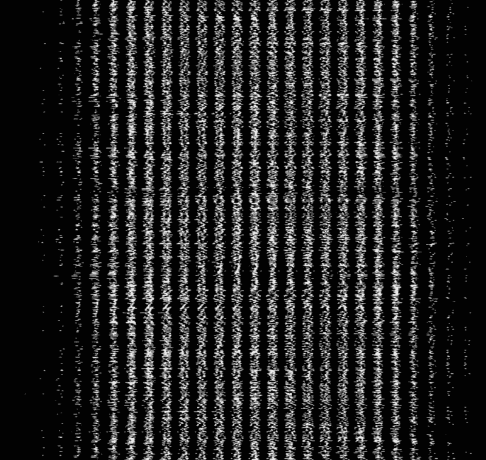

# 如何在 Tensorflow.js 中处理 MNIST 影像数据

> 原文：<https://www.freecodecamp.org/news/how-to-deal-with-mnist-image-data-in-tensorflow-js-169a2d6941dd/>

作者:凯文·斯科特

# 如何在 Tensorflow.js 中处理 MNIST 影像数据


> 有一个笑话说，80%的数据科学在清理数据，20%的数据科学在抱怨清理数据…数据清理在数据科学中所占的比例比局外人想象的要高得多。实际上，训练模型通常是机器学习者或数据科学家所做工作的相对较小的一部分(不到 10%)。
> 
> ——[安东尼·戈德布鲁姆，卡格尔的首席执行官](https://www.theverge.com/2017/11/1/16589246/machine-learning-data-science-dirty-data-kaggle-survey-2017)

操纵数据是任何机器学习问题的关键步骤。本文将以 Tensorflow.js (0.11.1) 的 [MNIST 为例，逐行遍历处理数据加载的代码。](https://github.com/tensorflow/tfjs-examples/blob/master/mnist/data.js)

### MNIST 的例子

```
18 import * as tf from '@tensorflow/tfjs';1920 const IMAGE_SIZE = 784;21 const NUM_CLASSES = 10;22 const NUM_DATASET_ELEMENTS = 65000;2324 const NUM_TRAIN_ELEMENTS = 55000;25 const NUM_TEST_ELEMENTS = NUM_DATASET_ELEMENTS - NUM_TRAIN_ELEMENTS;2627 const MNIST_IMAGES_SPRITE_PATH =28     'https://storage.googleapis.com/learnjs-data/model-builder/mnist_images.png';29 const MNIST_LABELS_PATH =30     'https://storage.googleapis.com/learnjs-data/model-builder/mnist_labels_uint8';`
```

首先，代码导入 Tensorflow [(确保您正在编译代码！)](https://thekevinscott.com/tensorflowjs-hello-world/)，并建立一些常数，包括:

*   `IMAGE_SIZE`–图像的大小(宽和高为 28x28 = 784)
*   `NUM_CLASSES`–标签类别数(一个数字可以是 0-9，所以有 10 个类别)
*   `NUM_DATASET_ELEMENTS`–图像总数(65，000)
*   `NUM_TRAIN_ELEMENTS`–训练图像的数量(55，000)
*   `NUM_TEST_ELEMENTS`–测试图像的数量(10，000，又名余数)
*   `MNIST_IMAGES_SPRITE_PATH`&`MNIST_LABELS_PATH`–图像和标签的路径

这些图像被连接成一个巨大的图像，看起来像:



#### `MNISTData`

接下来，从第 38 行开始，是`MnistData`，一个公开以下函数的类:

*   `load`–负责异步加载图像和标记数据
*   `nextTrainBatch`–加载下一批训练
*   `nextTestBatch`–装载下一个测试批次
*   `nextBatch`–返回下一批的通用函数，取决于它是在训练集还是测试集中

出于入门的目的，本文将只通过`load`函数。

#### `load`

```
44 async load() {45   // Make a request for the MNIST sprited image.46   const img = new Image();47   const canvas = document.createElement('canvas');48   const ctx = canvas.getContext('2d');
```

`async` [是 Javascript](https://thekevinscott.com/tensorflowjs-hello-world/#async-and-await) 中一个相对较新的语言特性，为此你需要一个 transpiler。

`Image`对象是一个本地 DOM 函数，表示内存中的图像。它在加载图像时提供回调，并访问图像属性。`canvas`是另一个 DOM 元素，它通过`context`提供了对像素数组和处理的简单访问。

因为这两个都是 DOM 元素，所以如果您在 Node.js(或 Web Worker)中工作，您将无法访问这些元素。[另一种方法见下文](https://medium.com/p/169a2d6941dd#636b)。

#### `imgRequest`

```
49 const imgRequest = new Promise((resolve, reject) => {50   img.crossOrigin = '';51   img.onload = () => {52     img.width = img.naturalWidth;53     img.height = img.naturalHeight;
```

该代码初始化了一个新的承诺，一旦图像加载成功，该承诺将被解析。这个例子没有明确地处理错误状态。

`crossOrigin`是一个`img`属性，允许跨域加载图像，并在与 DOM 交互时避开 CORS(跨源资源共享)问题。`naturalWidth`和`naturalHeight`是指加载图像的原始尺寸，用于在执行计算时确保图像尺寸正确。

```
55     const datasetBytesBuffer =56     new ArrayBuffer(NUM_DATASET_ELEMENTS * IMAGE_SIZE * 4);5758     const chunkSize = 5000;59     canvas.width = img.width;60     canvas.height = chunkSize;
```

该代码初始化一个新的缓冲区，以包含每个图像的每个像素。它将图像总数乘以每个图像的大小，再乘以通道数(4)。

我**相信**说`chunkSize`是用来防止 UI 一次加载太多数据到内存中，尽管我不是 100%确定。

```
62     for (let i = 0; i < NUM_DATASET_ELEMENTS / chunkSize; i++) {63       const datasetBytesView = new Float32Array(64         datasetBytesBuffer, i * IMAGE_SIZE * chunkSize * 4,65         IMAGE_SIZE * chunkSize);66       ctx.drawImage(67         img, 0, i * chunkSize, img.width, chunkSize, 0, 0, img.width,68         chunkSize);6970       const imageData = ctx.getImageData(0, 0, canvas.width, canvas.height);
```

这段代码遍历 sprite 中的每个图像，并为该迭代初始化一个新的`TypedArray`。然后，上下文图像获取绘制的图像块。最后，使用 context 的`[getImageData](https://developer.mozilla.org/en-US/docs/Web/API/CanvasRenderingContext2D/getImageData)`函数将绘制的图像转换成图像数据，该函数返回一个表示底层像素数据的对象。

```
72       for (let j = 0; j < imageData.data.length / 4; j++) {73         // All channels hold an equal value since the image is grayscale, so74         // just read the red channel.75         datasetBytesView[j] = imageData.data[j * 4] / 255;76       }77     }
```

我们遍历像素，除以 255(一个像素的最大可能值)将值固定在 0 和 1 之间。只有红色通道是必要的，因为它是灰度图像。

```
78     this.datasetImages = new Float32Array(datasetBytesBuffer);7980     resolve();81   };82   img.src = MNIST_IMAGES_SPRITE_PATH;83 });
```

这一行获取缓冲区，将其重新转换为保存像素数据的新的`TypedArray`，然后解析承诺。最后一行(设置`src`)实际上开始加载图像，这启动了函数。

起初让我困惑的一件事是`TypedArray`与其底层数据缓冲区相关的行为。您可能会注意到`datasetBytesView`在循环中被设置，但从不返回。

在幕后，`datasetBytesView`正在引用缓冲区`datasetBytesBuffer`(用它初始化)。当代码更新像素数据时，它间接地编辑了缓冲区本身的值，这些值又在第 78 行被重新转换成一个新的`Float32Array`。

#### 从 DOM 外部获取图像数据

如果你在 DOM 中，你应该使用 DOM。浏览器(通过`canvas`)负责计算图像的格式，并将缓冲数据转换成像素。但是如果您在 DOM 之外工作(比方说，在 Node.js 或 Web Worker 中)，您将需要一种替代方法。

`fetch`提供了一种机制`response.arrayBuffer`，它允许你访问文件的底层缓冲区。我们可以用它来手动读取字节，完全避开 DOM。下面是编写上述代码的另一种方法(这段代码需要`fetch`，可以在 Node 中用类似`[isomorphic-fetch](https://github.com/matthew-andrews/isomorphic-fetch)`的东西填充):

```
const imgRequest = fetch(MNIST_IMAGES_SPRITE_PATH).then(resp => resp.arrayBuffer()).then(buffer => {  return new Promise(resolve => {    const reader = new PNGReader(buffer);    return reader.parse((err, png) => {      const pixels = Float32Array.from(png.pixels).map(pixel => {        return pixel / 255;      });      this.datasetImages = pixels;      resolve();    });  });});
```

这将返回特定图像的数组缓冲区。在写这篇文章时，我首先尝试自己解析传入的缓冲区，但我不推荐这样做。(如果你*对这样做感兴趣，[这里有一些关于如何读取 png 的数组缓冲区的信息](http://www.libpng.org/pub/png/spec/1.2/PNG-Structure.html)。)相反，我选择对[使用`pngjs`](https://github.com/arian/pngjs) ，它为您处理`png`解析。当处理其他图像格式时，您必须自己找出解析函数。*

### 仅仅触及表面

理解数据操作是 JavaScript 中机器学习的重要组成部分。通过理解我们的用例和需求，我们可以使用一些关键的函数来根据我们的需要正确地格式化我们的数据。

Tensorflow.js 团队正在不断更改 Tensorflow.js 中的底层数据 API。随着 API 的发展，这将有助于满足我们更多的需求。这也意味着随着 Tensorflow.js 的不断发展和改进，跟上 API 的[发展是值得的。](https://github.com/tensorflow/tfjs)

最初发表于[thekevinscott.com](https://thekevinscott.com/dealing-with-mnist-image-data-in-tensorflowjs)

特别感谢阿里·齐尔尼克。