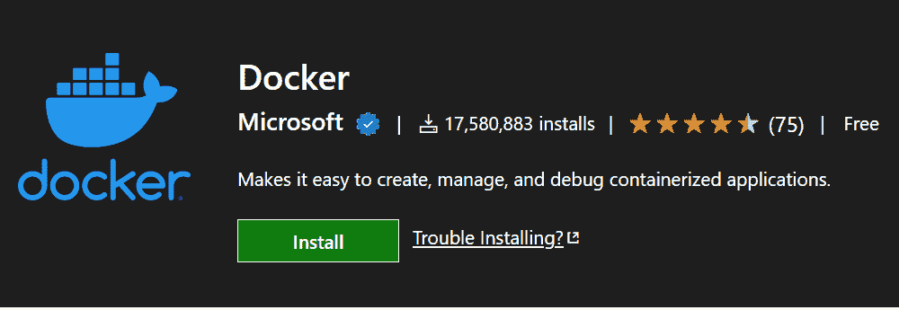
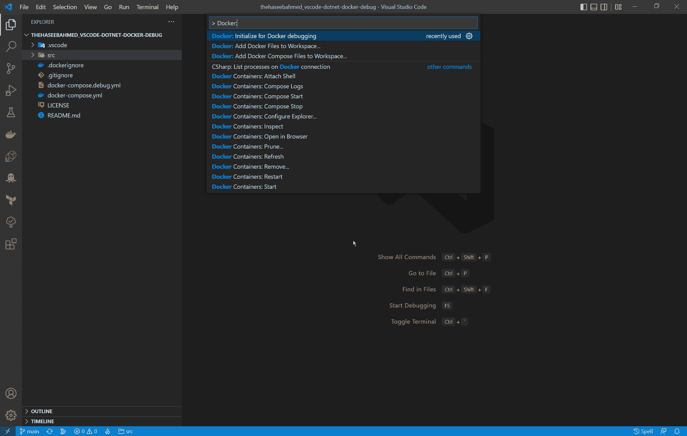
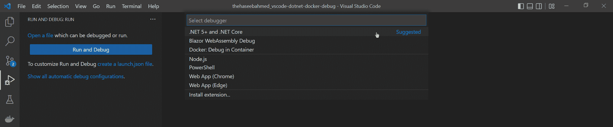
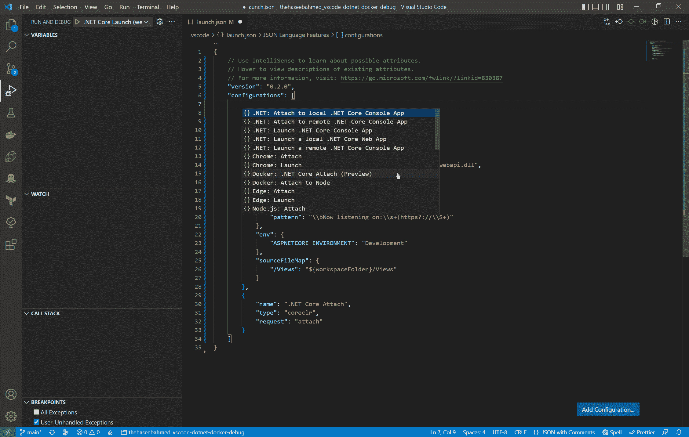
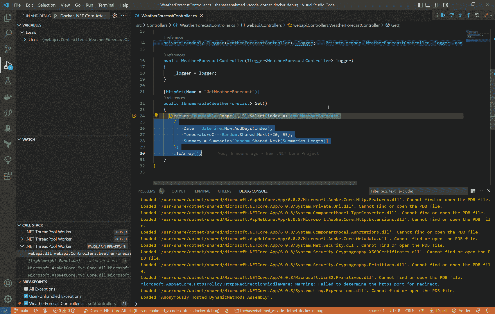

# 如何调试 Dockerized？VS 代码中的. NET 核心应用程序

> 原文：<https://www.freecodecamp.org/news/how-to-debug-dockerized-net-core-apps-in-vs-code/>

我最近转到 VS 代码来开发一个 dockerized。网芯 app。但是我随后意识到，关于调试的最新文章并不多。VS 代码中的 NET 核心应用程序。


Source: GIPHY

所以，我在这里，写这篇文章。我希望它能帮助像我一样的人调试他们的 dockerized。VS 代码中的 NET 核心应用程序。

在本文中，我们将讨论以下内容:

1.  Docker 的 VS 代码扩展
2.  VS 代码启动配置
3.  如何调试。本地 Docker 上的 NET core 应用程序

# Docker 的 VS 代码扩展



尽管调试 containerzied 并不真的需要扩展(对于你这种铁杆极简主义者来说)。NET 核心应用程序，我仍然建议你安装微软的 Docker 扩展。它将使在 VS 代码中创建、管理和调试容器化的应用程序变得容易。

老实说，自从我开始使用扩展后，我就不再使用 Docker 桌面了。

# VS 代码启动配置

现在，为了调试 dockerized。NET 核心应用程序，我们将需要创建一个 VS 代码启动配置。

在本节中，我将讨论两种启动配置:一种用于 docker run，另一种用于 docker compose。

稍后，我们还将研究最终的发布配置并了解它们，以便我们知道自己在做什么。

## Docker 运行启动配置

如果你安装了微软的 Docker 扩展，这应该很容易。

首先，在 VS 代码中按“Ctrl + P”并键入`> Docker:`



接下来，选择“Docker:初始化 Docker 调试”。

然后选择”。NET:ASP.NET 核心”作为您的应用平台。选择“Linux”作为您的操作系统。

瞧！您现在应该有一个“Docker”。NET Core Launch”启动配置。

请注意，Docker 扩展将会覆盖您现有的 Docker 文件。如果您不允许，它将不会创建启动配置。我建议您备份 docker 文件，让扩展名覆盖它，然后恢复您的原始文件。

## Docker 编写启动配置

现在我们都知道现实生活中的应用从来没有那么简单！您可能有一个 DB 容器、一个 app 容器和一些其他容器，它们都通过 docker-compose 配置连接在一起。

如果是这种情况，下面是创建发布配置的方法。

首先，在 VS 代码中打开您的工作区。如果您已经有了现有的发布配置，您可以跳过下一部分。

接下来，按“Ctrl + Shift + D”切换到“运行和调试选项卡”。

点击“创建一个 launch.json 文件”并选择”。NET 5+和。NET Core”(这将创建一个基本的启动配置，以便在没有 Docker 的情况下运行应用程序)。



现在，当您的 launch.json 文件打开时，单击编辑器右下角的 Add Configuration 按钮。

选择“Docker:。NET Core Attach (Preview)”从打开的下拉菜单中选择。



它应该添加一个名为“Docker:”的新配置。网络核心附加(预览)”。

瞧啊。现在，您已经准备好调试您的 dockerized。VS 代码中的 NET 核心应用。

## 如何理解发布配置

在开始调试我们的应用程序之前，让我们更深入地研究一下启动配置，以了解它们是如何工作的。

中应该有两个文件。vscode 文件夹，位于工作区的根目录中。

```
{
    "version": "2.0.0",
    "tasks": [
        {
            "type": "docker-build",
            "label": "docker-build: debug",
            "dependsOn": [
                "build"
            ],
            "dockerBuild": {
                "tag": "webapi:dev",
                "target": "base",
                "dockerfile": "${workspaceFolder}/src/Dockerfile",
                "context": "${workspaceFolder}",
                "pull": true
            },
            "netCore": {
                "appProject": "${workspaceFolder}/src/webapi.csproj"
            }
        },
        {
            "type": "docker-run",
            "label": "docker-run: debug",
            "dependsOn": [
                "docker-build: debug"
            ],
            "dockerRun": {},
            "netCore": {
                "appProject": "${workspaceFolder}/src/webapi.csproj",
                "enableDebugging": true
            }
        }
    ]
}
```

tasks.json

首先，让我们看一下 tasks.json 文件。该文件包含一些启动配置可能需要的任务列表，以便正确启动应用程序。

我们要看的任务是“docker-run: debug”。这是使用“Docker”启动时调用的任务。NET Core Launch”配置(我们将在后面看到)。

这项任务有三个我们需要了解的属性:

*   netCore.appProject:这个属性是。NET Core 应用程序特定的，只是指向你的应用程序的项目文件。
*   netCore.enableDebugging:这是另一个。NET Core 特定于应用程序的属性，它告诉 VS 代码启动具有调试功能的应用程序。
*   dependsOn:这是一个通用属性，定义一个任务的执行是否依赖于其他任务。

其次，我们需要理解“docker-build: debug”任务是做什么的。

除了 netCore 和 dependsOn 属性之外，它还有一个 dockerBuild 对象，该对象控制由 VS 代码运行以启动 docker run 应用程序的`docker build`命令。

dockerBuild 对象的属性与传递给`docker build`命令的参数非常相似。

你可以在这里阅读所有 dockerBuild 对象属性[，在这里](https://code.visualstudio.com/docs/containers/reference#_dockerbuild-object-properties)阅读一般任务[。](https://code.visualstudio.com/docs/editor/tasks)

```
{
  "version": "0.2.0",
  "configurations": [
    {
      "name": "Docker .NET Core Attach",
      "type": "docker",
      "request": "attach",
      "platform": "netCore",
      "sourceFileMap": {
        "/src": "${workspaceFolder}/src"
      }
    },
    {
      "name": "Docker .NET Core Launch",
      "type": "docker",
      "request": "launch",
      "preLaunchTask": "docker-run: debug",
      "netCore": {
        "appProject": "${workspaceFolder}/src/webapi.csproj"
      }
    }
  ]
}
```

launch.json

现在，让我们看一下 launch.json 文件，所有的启动配置都在这个文件中。

虽然这些属性中的大多数都是标准的，但我们关心的是“Docker”中的“sourceFileMap”。网络核心连接”配置。

为了调试。NET 核心应用程序构建在 VS 代码机器之外的机器上(在这种情况下是 Docker)，VS 代码需要理解如何将当前工作空间映射到构建机器层次结构。

例如，如果我的项目是从 Linux 中的“/src”文件夹构建的，该属性将告诉 VS 代码在所有文件路径中用“${workspaceFolder}/src”替换“/src”。如果这种映射不正确，VS 代码将会命中断点，但是会给出一个文件(正在调试的)不存在的错误。

你可以在[这里](https://code.visualstudio.com/docs/editor/debugging#_launchjson-attributes)阅读更多关于 launch.json 属性的细节。

# 如何调试。本地 Docker 上的 NET Core 应用程序



## 码头运行

现在我们已经弄清楚了发布配置，这应该很容易！只需按照下面的步骤。

首先，按“Ctrl + Shift + D”切换到“运行和调试选项卡”。

然后选择“Docker。NET Core Launch”并按绿色的 play 图标进行调试。

## 复合坞站

调试 Docker 合成容器略有不同。在附加 VS 代码调试器之前，必须确保 Docker 编写容器已经在运行。

一旦它们启动，请遵循以下步骤:

首先，按“Ctrl + Shift + D”切换到“运行和调试选项卡”。

然后选择“Docker:。NET Core Attach (Preview)”并按绿色播放图标进行调试。

就是，它！我希望这能对你有所帮助。如果您有任何问题或对任何事情感到困惑，您可以联系我，或者在 [GitHub](https://github.com/thehaseebahmed/vscode-dotnet-docker-debug) 上查看示例项目。

编码快乐！

这篇文章是我的[编码系列](https://blog.thehaseebahmed.com/series/coding)的一部分。你也可以在那里找到其他对你的日常发展有用的文章。