# 如何使用浏览器开发工具调试渐进式 Web 应用程序

> 原文：<https://www.freecodecamp.org/news/how-to-debug-progressive-web-apps-using-browser-developer-tools-bad1cd3db784/>

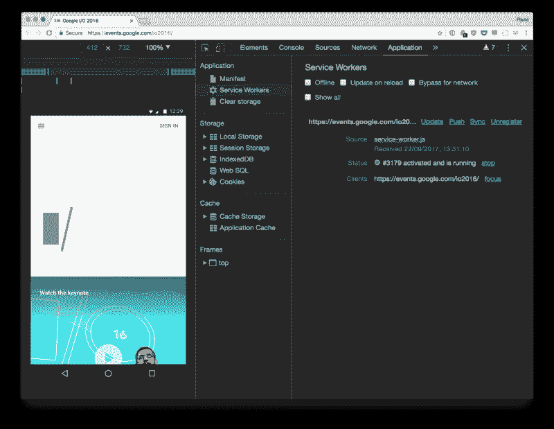

> 对学习 JavaScript 感兴趣？在 jshandbook.com 获得我的电子书

本教程解释了 Chrome 和 Firefox 开发工具显示哪些工具可以帮助您调试渐进式 Web 应用程序。

> 关于这个主题和新的浏览器 API，有很多东西需要学习。我在我的[博客上发表了很多关于前端开发](https://flaviocopes.com)的相关内容，不要错过！？

### 什么是渐进式网络应用？

重要的事情先来。一个[渐进式网络应用](https://www.writesoftware.org/course/progressive-web-apps) (PWA)是一个可以基于设备支持提供**额外功能**的应用，例如:

*   离线工作的能力
*   推送通知
*   近乎原生的应用外观和速度
*   资源的本地缓存

但在不支持最新技术的设备上，它仍能像普通网站一样正常运行。

### Chrome 开发者工具概述

先说 Chrome。一旦你[打开开发工具](https://developer.chrome.com/devtools#access)，你会看到几个面板。您可能熟悉其中的许多面板，如控制台、元素或网络。您每天在构建网站或 web 应用程序时都会用到这些工具。

**应用程序**面板是最新的，但是包含一些熟悉的工具。2016 年夏天，资源选项卡更名为“应用”。这将通常区分 web 应用程序和网页的所有功能组合在一起。我们将很快详细检查它。

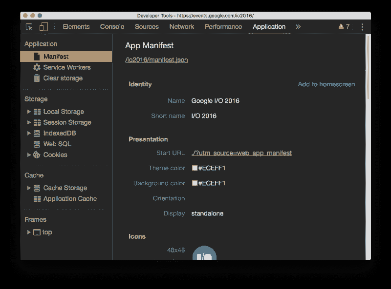

### 真实世界的例子

本教程将对 https://events.google.com/io2016/的渐进式网络应用进行探索。你可以打开 Chrome 并执行这里详述的完全相同的步骤，而无需在本地进行任何设置。

### 模拟设备

我们先启用 Chrome DevTools **设备模式**。这为您提供了在浏览器中模拟设备的选项。我们选择 Android 设备，因为目前 pwa 仅在 Android 上显示其全部潜力。 [Safari 开始支持服务人员](https://webkit.org/status/#?search=service)对于 iOS 和 Safari 桌面支持来说，这似乎是朝着正确方向迈出的一步。


### 详细的应用程序面板

应用程序面板集合了许多对渐进式 Web 应用程序至关重要的元素。

#### 显示

清单解锁了向用户提供**添加到主屏幕**选项的能力。它提供了一系列关于应用程序在设备上安装后应该如何运行的细节。如果您定义清单的方式有任何问题，它会报告这个问题。

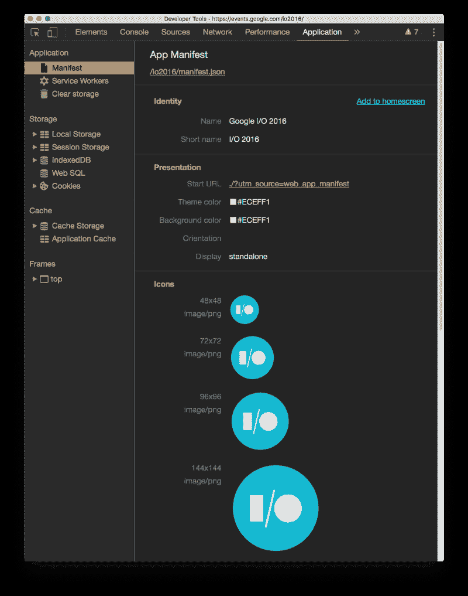

在这里，您可以看到应用程序的名称、主屏幕的简称、图标预览以及演示文稿的一些详细信息:

*   **启动 URL** :当用户从主屏幕启动 web 应用程序时，设备将加载的 URL。您可以在分析中添加活动标识符来划分 PWA 访问。
*   **主题颜色**:表示你的站点的主题。Chrome 用它来给一些浏览器 UI 元素上色，比如地址栏。这可以使用 meta 标签`<meta name="theme-colo` r" >对每个页面进行定制，但是在清单中指定它可以在应用程序从主屏幕启动时提供一个站点范围的主题颜色。

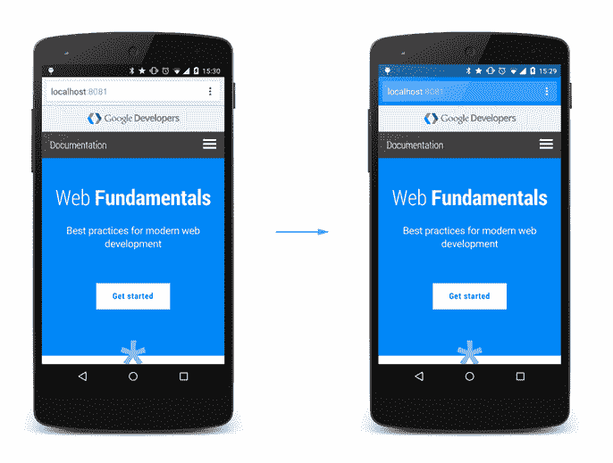

Example usage of the theme color option in the manifest to change the browser UI colors

*   **背景颜色**:在清单中指定 web 应用程序的背景颜色允许浏览器在 CSS 可用之前就在加载屏幕中显示这个颜色。这为用户带来了更好的体验。一旦 CSS 可用，这个值就会被实际的 web 应用程序样式覆盖。
*   **方位**:指定默认方位，可以是`any`、`natural`、`landscape`、`portrait`以及[屏幕方位 API 工作草案](https://www.w3.org/TR/screen-orientation/#orientationlocktype-enum)中详细说明的其他选项中的任意值。
*   **显示**:定义应用如何呈现。有效值为`fullscreen`，以整个显示尺寸打开应用程序。`standalone`显示设备标准状态栏和系统后退按钮。`minimal-ui`至少为用户提供了后退、前进和重新加载按钮。并且`browser`显示了包括地址栏的普通浏览器 UI。

在 Manifest 选项卡的顶部，单击`manifest.json`链接会将我们带到 **Sources 面板**，这里有清单的完整源代码。

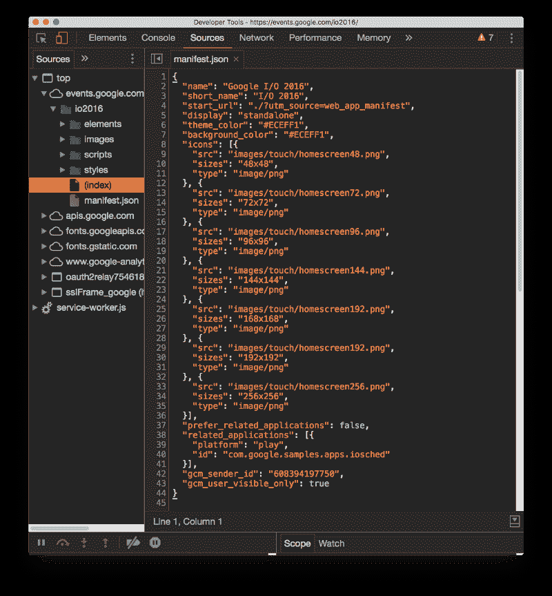

The manifest.json file source code

清单允许您定义许多其他字段。建议直接看 [Web App 清单工作草案](https://www.w3.org/TR/appmanifest)了解更多。

这个屏幕上的最后一个非常重要的东西是**添加到主屏幕**链接。在 Chrome 桌面上，它触发浏览器将应用程序添加到货架上。在手机上，它会提示安装应用程序(将图标添加到主屏幕):

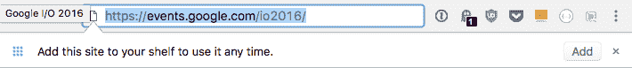

#### 服务人员

列表中的下一个是“服务人员”选项卡。[服务工作者](https://www.writesoftware.org/topic/service-workers)是使 PWA 能够离线工作的技术。它们允许您拦截网络请求，并使用缓存 API 在本地存储资源。

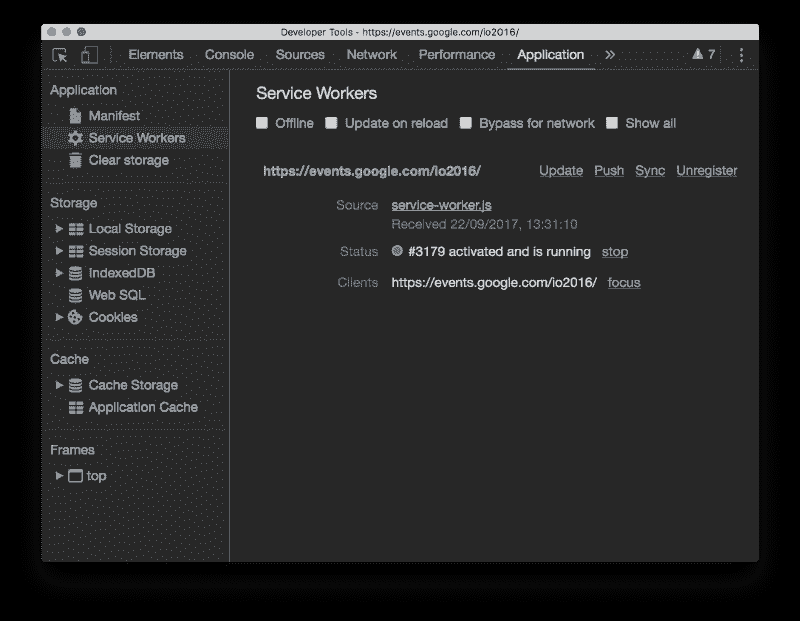

在该屏幕中，您可以通过启用**离线**复选框，在选项卡中**强制离线模式**:

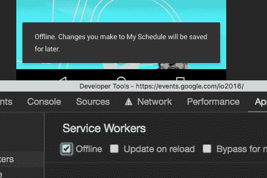

Forced offline mode, reflected in the app

除了**网络节流**之外，还可以在设备模式屏幕中强制离线。

**重载时更新**在调试时非常有用。服务人员在第一次加载时将**和**安装在设备上。它们直到服务工作者代码改变时才被更新，所以它们不像常规资源。

但是即使你更新了服务工作者，它也不会被网页使用，直到旧的服务工作者可以被移除——也就是说，直到用户关闭了所有指向 web 应用的标签页。此复选框强制更新。

**网络旁路**允许您完全关闭服务人员启用的缓存。当你想从网络直接访问时，这可以防止应用程序使用缓存的资源。同样，在调试时非常有用。

**显示所有**是一个选项，可以快速访问安装在设备上的**所有**维修工人。

每个服务人员都列出了一个状态指示器，您可以停止和重新启动该指示器。通过单击文件名，您可以使用内置的 JavaScript 调试器检查源代码并挂钩到它:

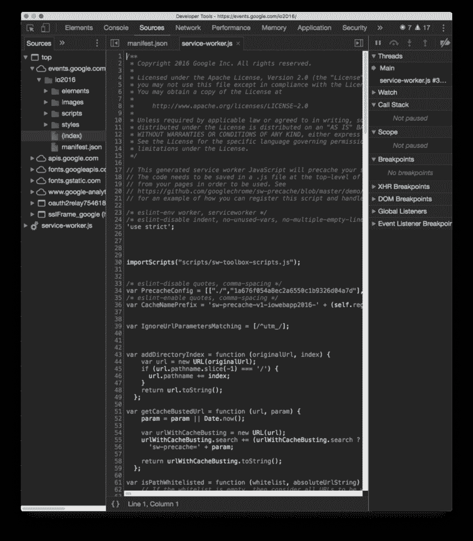

您可能使用最多的是服务人员生命周期事件模拟。您可以强制以下事件:

*   **更新**将强制更新服务工作者
*   **推送**模拟推送事件
*   **Sync** 模拟一个后台同步事件，允许用户离线执行操作，一旦在线就将它们传送给服务器
*   **取消注册**取消注册服务工作者，因此您可以从一个干净的状态开始

#### 清理存储

“清除存储空间”选项卡显示您的 web 应用程序使用的总存储空间大小、剩余的存储空间，并允许您挑选要清除的存储空间。

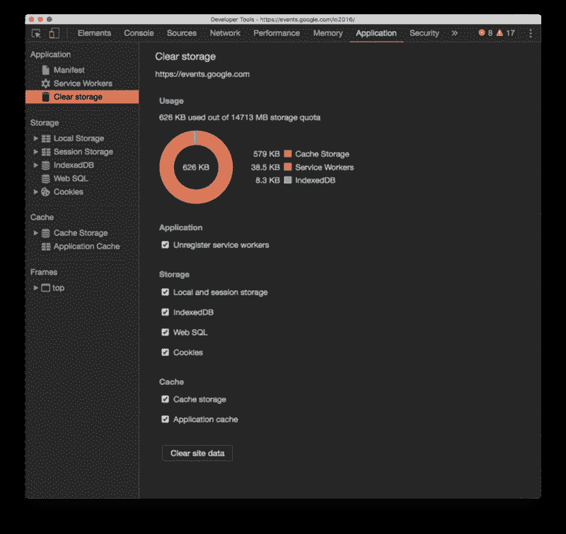

#### 储存；储备

存储选项卡包含与常用的存储选项交互的工具，如**本地/会话存储**、**索引数据库**和**cookie**。这并不是服务人员所独有的，所以我在这里就不赘述了。

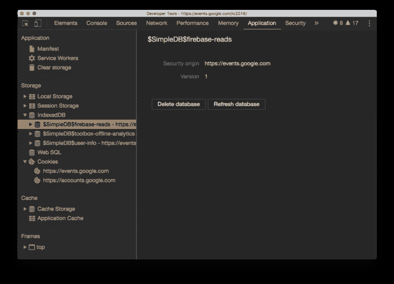

#### 隐藏物

忽略应用程序缓存选项卡(这是一项已被弃用的技术),**缓存存储**选项卡对服务人员来说至关重要。它显示了使用缓存 API 存储的资源内容，这是服务工作者规范的一部分。不限于服务人员使用。

Google Chrome 缓存存储演示是一个很好的方式来看看当你添加一个项目到缓存时会发生什么。

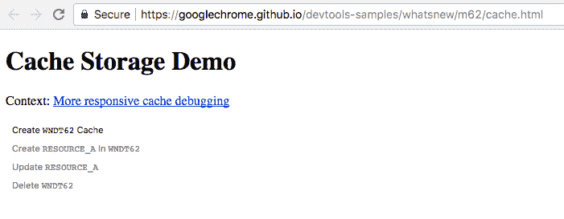

起初，根本不使用缓存:

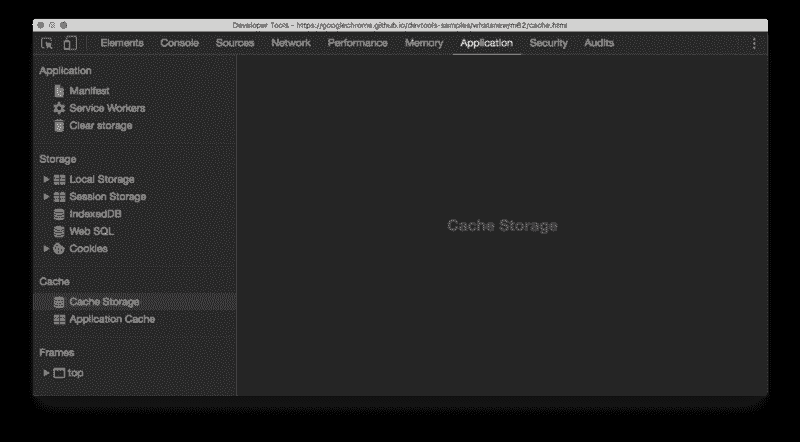

按下**创建 WNDT62** 缓存按钮触发缓存的创建:

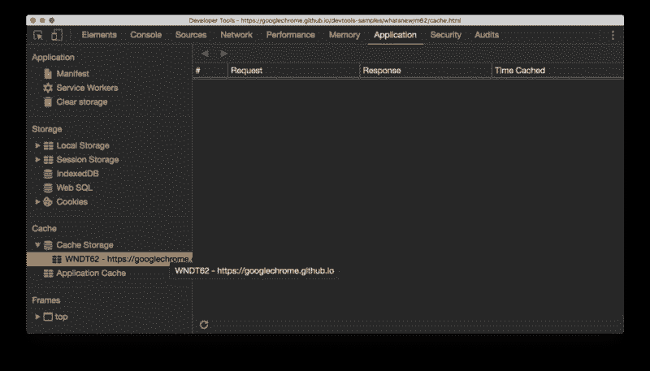

然后 WNDT62 中的 **Create RESOURCE_A** 将一个项目添加到缓存中:

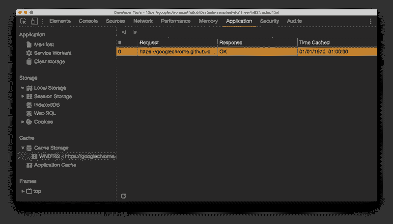

按**更新资源 _A** 增加主体值，我们可以使用:

```
caches.open('WNDT62').then(function(cache) {  return cache.match('RESOURCE_A').then((res) => {    res.text().then(body => console.log(body));  })})
```

每次按 Update RESOURCE_A 时，返回的值都会递增。

按 Delete WNDT62 移除缓存，释放被资源占用的空间，恢复应用的初始状态。

当使用缓存 API 加载由服务工作者缓存的资源时，DevTools 的网络面板显示它来自服务工作者:

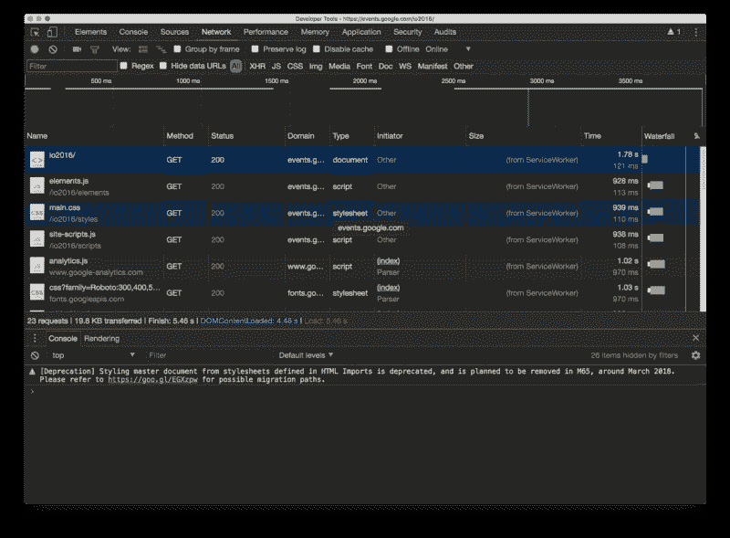

### 火狐怎么样？

Firefox 对渐进式网络应用程序和服务人员有很大的支持。但是它的开发者工具并不像 Chrome 开发工具那样突出显示它们。尽管如此，它们仍然在那里，在“工作人员”菜单下。

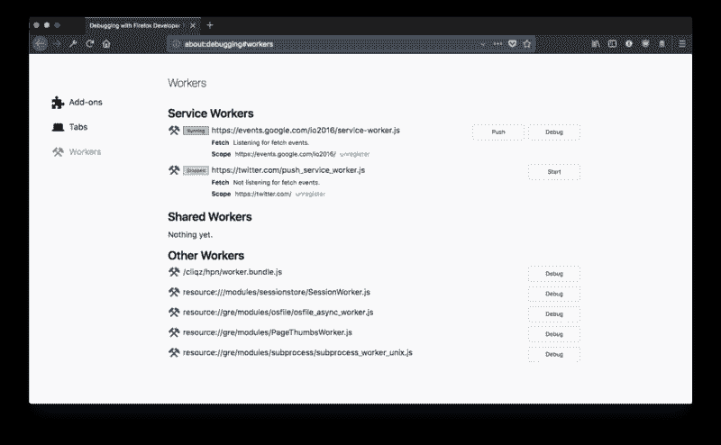

在这里，您可以注销任何服务工作者，并在调试器中为任何类型的工作者(也包括 Web 工作者)打开工作者代码。您还可以触发 Push API `push`事件来调试 Push 事件。

你不能像 Chrome 那样模拟事件或强制更新或绕过服务人员。我希望这能很快在 Firefox 中实现，以获得更简单的测试体验。

就像在 Chrome 中一样，当服务人员在开发者工具的网络面板中使用[缓存 API](https://www.writesoftware.org/topic/cache-api) 缓存资源时，它会在已传输列下面列出`service worker`:

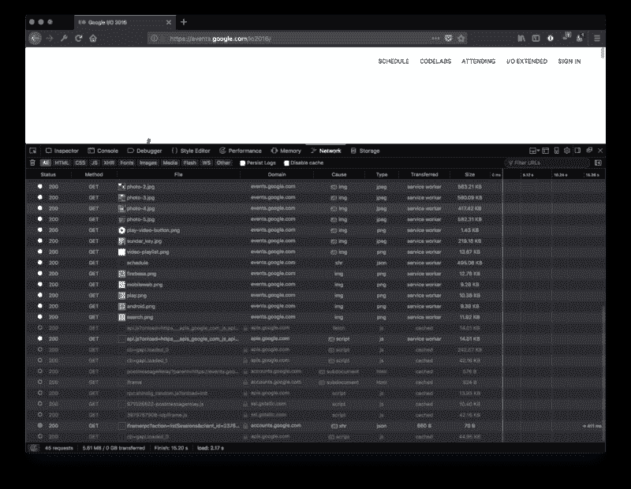

### 包扎

渐进式网络应用程序是让移动网络变得更好的转折点之一，并为用户提供原生应用程序之外的良好体验。

浏览器，尤其是 Chrome，提供了很好的工具。

谷歌还提供了 [Lighthouse](https://developers.google.com/web/tools/lighthouse/) 作为其浏览器工具的一部分，可以单独安装在 Chrome DevTools 中。它提供自动检查，以确保您的 web 应用程序是以最佳方式构建的，并包括对服务人员的支持。一个非常有用的工具，不要错过。

如果你喜欢这篇文章，请给我一些掌声，让更多的人看到它。谢谢！

> 对学习 JavaScript 感兴趣？在 jshandbook.com 获得我的电子书