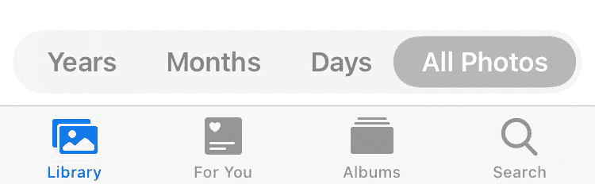
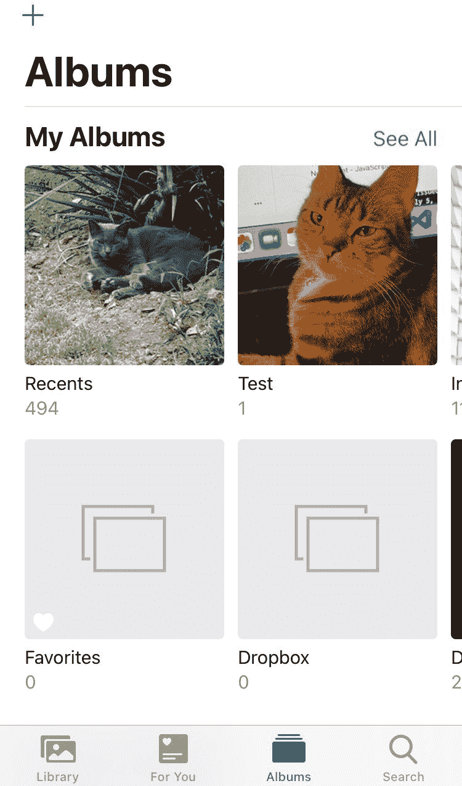
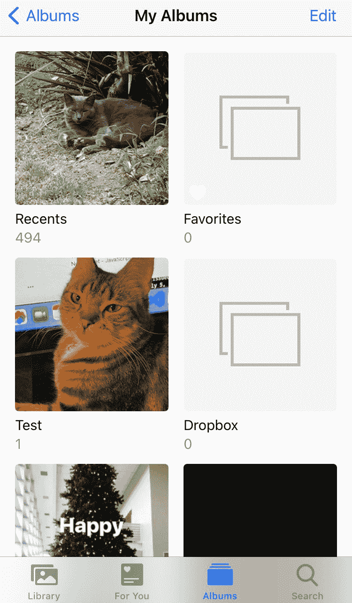
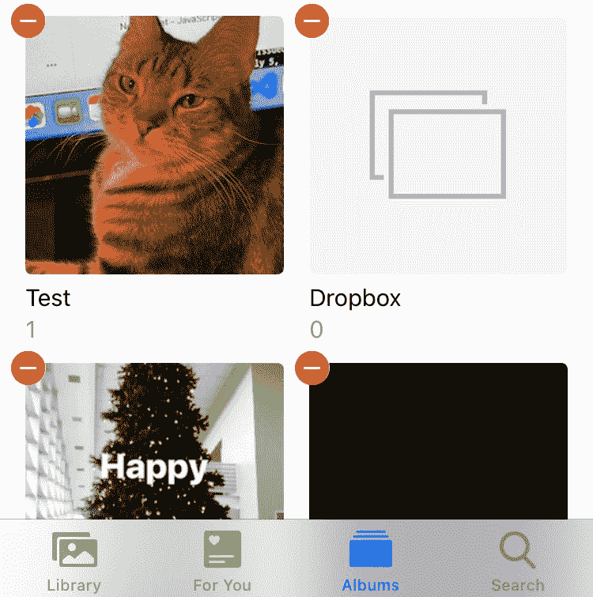
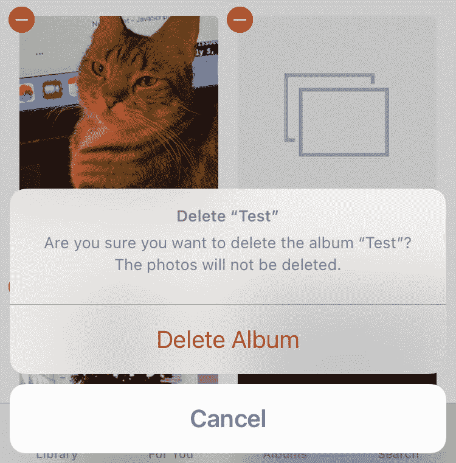

# 如何删除 iPhone 上的相册

> 原文：<https://www.freecodecamp.org/news/how-to-delete-albums-on-iphone/>

如果你想删除 iPhone 上的相册，只需要几个简单的步骤。

在这篇短文中，我将带你完成从 iPhone 中删除相册的六个步骤。

### 第一步:打开手机上的照片应用程序

首先，你需要打开照片应用程序。

### 第二步:转到相册

接下来，进入“照片”中的“相册”标签。

### 第三步:点击“查看全部”

要查看您所有的相册，您需要点击右上角的“查看全部”按钮

### 第四步:编辑相册

然后，您将点击位于右上角的编辑。

### 第五步:选择你想删除的相册

点击您想要删除的相册上的红色圆圈虚线。这将选择它。

### 步骤 6:删除相册

点击红色的删除相册文本，相册将被删除。

需要注意的是，如果你删除了一个相册，它不会删除你手机里的照片。

如果你想删除一张照片，那么你需要从库中选择照片，然后点击右下角的垃圾桶图标。

## 为什么我无法删除手机中的所有相册？

iPhone 上的某些专辑您无法移除。如果你按照上面的步骤操作，你会注意到在最近或收藏的专辑上面没有红色的破折号。

这些是 iPhone 上已经有的默认专辑。其他默认相册如截图和自拍也不能删除。

您只能删除自己在手机上创建的相册。