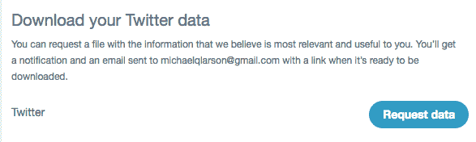
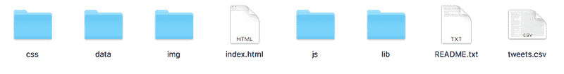
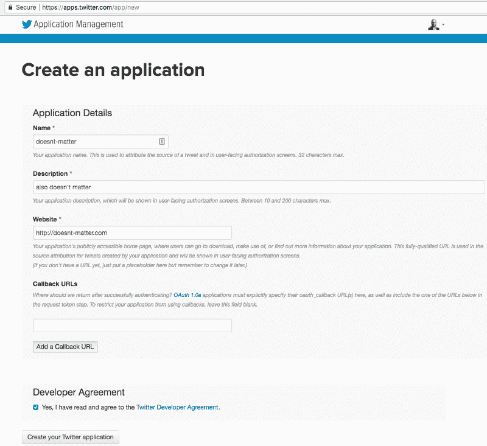
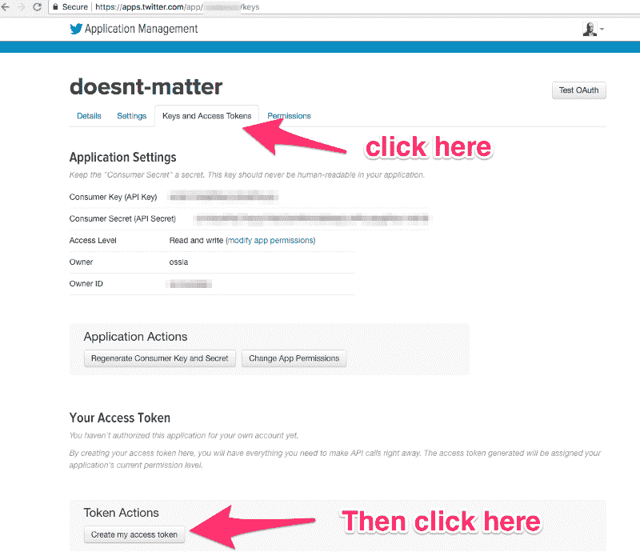
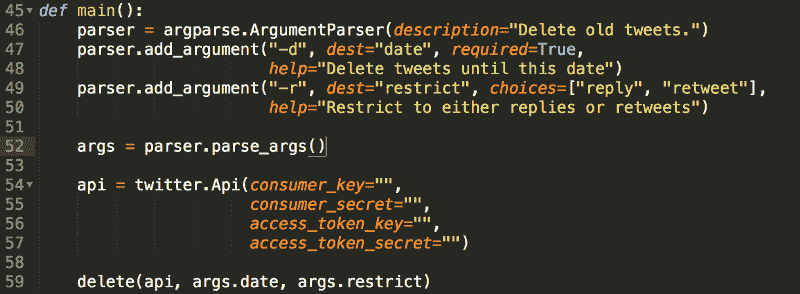
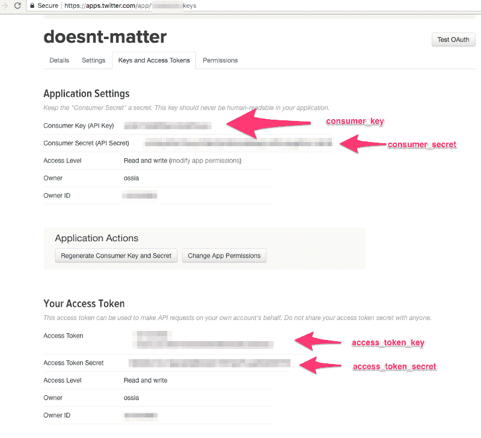
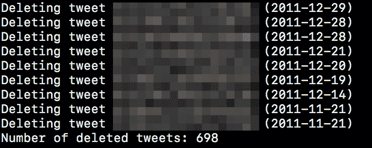

# 如何批量免费删除你过去的推文，从过去的自己手中拯救你的职业生涯

> 原文：<https://www.freecodecamp.org/news/how-to-delete-your-past-tweets-in-bulk-and-for-free-save-yourself-from-your-past-self-f8844cdbda2/>

> “谁控制了过去，谁就控制了未来。**控制**现在的**控制过去的**—乔治·奥威尔

詹姆斯·古恩站在世界之巅。他刚刚执导了过去十年中最好的两部动作喜剧电影。他的两部银河护卫队电影都受到了评论家和观众的一致好评。


但这不足以将他从过去的自己中拯救出来。

原来，在他职业生涯的早期，Gunn 曾在 Twitter 上发布过一些令人震惊的“笑话”。(我不会在这里分享它们——你最好不要读它们。)

那时，冈恩是一个默默无闻的低成本恐怖电影制作人。这些有问题的推文在他的推特历史中潜伏了多年，没有人阅读或关心它们。

也就是说，直到一些记者决定挖出他的丑闻，并挖掘出推文让全世界看到。

他在迪斯尼的老板们立即决定与葛恩“断绝商业关系”。

所以在几个小时内，葛恩从明星导演变成了好莱坞的弃儿。都是因为 2012 年的几条推特。

### 控制你的过去

在本教程中，我将向你展示如何从 Twitter 上下载你所有的旧推文，然后快速删除尽可能多的推文，而不会与任何人分享你的任何数据。

几分钟前我自己做了这个。

当然，我喜欢未来的历史学家审视我的推文的想法，他们会问:“昆西·拉森到底是什么样的人？”但我更不喜欢有人在我的推特上挖消息，然后挑一条我听起来像个混蛋的推特。

如果你允许他们访问你的 Twitter 账户，你会发现有很多服务会帮你删除你的推文(也许还会给你一些钱)。

与这些服务分享我的 Twitter 账户让我感到不舒服。事实上，创建这样一个“删除推文”服务让我觉得这是一件邪恶的天才之举。“哦，你有什么要隐瞒的，是吗？”

但是我们可以把这些脏活交给数码狗仔队。

相反，本教程将向你展示如何使用一个简单的 Python 脚本，免费批量删除你在某个日期之前的所有推文。

你可能会觉得你过去的每条微博都是一片特殊而独特的雪花。如果你有这种感觉，你可能想要手动浏览你的旧推文，删除那些让你尴尬的旧推文。

但是如果你像我一样有成千上万条推文，那将花费你很多时间。

请注意，删除旧推文根本不会影响你的推特粉丝，除了删除一些他们实在太忙而没有时间回去阅读的内容。(Twitter 上每分钟都有 35 万条新推文产生。没人有时间做那个！)

我们开始吧！

### 步骤 1:如何为你所有的推文创建个人备份

你需要做的第一件事是备份你所有的推文。Twitter 允许你轻松地将你过去的所有推文导出到一个方便的 CSV 文件中。

在他们的设置中导航到 Twitter 的“你的 Twitter 数据”部分。这里有一个直接链接。

Twitter 会要求您确认密码。然后点击页面底部的“请求数据”。



Twitter 在几分钟内给我发来了一个漂亮的 zip 文件。

如果你想阅读你将要删除的旧推文，一定要备份这个 zip 文件。

然后解压文件夹。该文件夹如下所示:



你可以在浏览器中打开 index.html，你会看到一个很好的用户界面，你可以按月份和年份滚动浏览你的推文。

注意，本教程的最后一步需要`tweets.csv`文件。

### 步骤 2:安装 Python 库

对于这一步，我将假设您使用的是 MacOS。如果有人想为这一步创建一个清晰的 Linux 或 Windows 分步说明列表，请在下面的评论中分享它们。我在这里把它们加起来，算你的。？

进入命令行并运行以下命令来克隆存储库:

```
git clone git@github.com:QuincyLarson/delete-tweets.git
```

进入新创建的目录:

```
cd delete-tweets
```

确保您安装了 PIP(Python 包管理器):

```
curl https://bootstrap.pypa.io/get-pip.py -o get-pip.py
```

现在您可以安装库的所有依赖项了:

```
pip install -r requirements.txt
```

请注意，您可能需要在开始时使用“sudo”来运行其中的一些命令，以使它们正常工作。您可能会收到一些“找不到 xyz 库”的消息。我能够忽略这些信息，并仍然让这个工作。

### 步骤 3:创建 Twitter API 密钥

去[https://apps.twitter.com/app/new](https://apps.twitter.com/app/new)并像这样填写表格:



你可以把任何东西放在这里——唯一会使用这个 Twitter 应用的人就是你。

现在，在你新创建的 Twitter 应用中，点击“密钥和访问令牌”，然后在底部，点击“创建我的访问令牌”。



现在使用你选择的可信赖的文本编辑器，打开`deletetweets.py.`



向下滚动到第 54 行。您需要手动将您的密钥复制/粘贴到这里。



保存文件并退出。

### 第四步:复制你的 tweets.csv 文件

在第一步中，你下载了你过去所有推文的个人备份。将该文件夹中的`tweets.csv`文件复制到新的删除推文文件夹中。它将替换占位符 tweets.csv 文件。

### 第四步:删除推文

现在你只需要决定一个“截止日期”——在这个日期之前，你所有的推文都会被删除。

例如，如果日期是 2013 年 10 月 1 日，那么您可以在终端中使用以下命令:

```
python deletetweets.py -d 2013-10-01
```

然后，脚本将从该日期开始，按时间倒序进行，每秒删除一条推文，直到完成。



最后，它会告诉你删除了多少条推文。

祝贺你——你已经控制了你的过去。

现在你又少了一件担心未来的事。

现在关上你的终端，继续你的生活。

你应该[在 Twitter 上关注我](https://www.twitter.com/ossia)寻找值得你花时间的实用技术。