# 如何将节点应用程序和数据库部署到 Heroku

> 原文：<https://www.freecodecamp.org/news/how-to-deploy-a-node-application-and-database-to-heroku/>

Heroku 是一个基于云的完全托管的平台即服务(PaaS ),用于构建、运行和管理应用程序。该平台非常灵活，设计为支持您和您的团队的首选开发风格，并帮助您保持专注和高效。

各种规模的开发人员、团队和企业都使用 Heroku 来部署、管理和扩展应用。无论您是在构建简单的原型还是关键业务产品，Heroku 的全托管平台都为您提供了快速交付应用的最简单途径。

通过 Heroku Runtime、Heroku Postgres (SQL)、Heroku Redis、附加组件、数据剪辑、应用程序指标、智能容器、企业级支持、GitHub 集成等功能，Heroku 让开发人员可以自由地专注于他们的核心产品，而不必分心维护服务器、硬件或基础设施。


* * *

Heroku 的核心特性之一是用你喜欢的语言(Node、Ruby、Python、Java、PHP、Go 等等)部署、管理和扩展应用。在本文中，我将向您展示如何将现有的 Node.js 应用程序部署到 Heroku——从创建 Heroku 帐户到向部署的应用程序添加数据库。

## 先决条件

在我的上一篇文章中，我写了关于“[用 Node.js 和 SlackBots.js](https://bolajiayodeji.com/building-a-slackbot-with-nodejs-and-slackbotsjs-cjz8gh7zg000exfs1tq2z5zzu) 构建 SlackBot”的文章，并且我答应写一篇后续文章来展示如何在 Heroku、Zeit 或 Netlify 上托管 SlackBot 并将其发布到 Slack 应用商店。嗯，这是后续文章，但没有“发布到 Slack 应用程序”部分。我们将在另一篇文章中讨论这个问题。

我假设您已经/知道以下内容:

*   看我的[上一篇文章](https://bolajiayodeji.hashnode.dev/building-a-slackbot-with-nodejs-and-slackbotsjs-cjz8gh7zg000exfs1tq2z5zzu)
*   建造了 [inspireNuggets SlackBot](https://github.com/BolajiAyodeji/inspireNuggetsSlackBot)
*   Git、节点和 npm 已安装
*   一个免费的 Heroku 账户
*   Heroku CLI 已安装

## 奖金

如果您还没有安装 npm、Node 和 Heroku CLI，或者还没有 Heroku 帐户，这里有一个快速奖励[是的，不客气:)。

### 安装 npm 和节点

*   [Node.js](https://nodejs.org) 是基于 [Chrome 的 V8 JavaScript 引擎](https://v8.dev/)构建的 JavaScript 运行时。
*   npm 是 Node.js 的包管理器，这是一个开源项目，旨在帮助 JavaScript 开发者轻松共享打包的代码模块。

你可以简单的在这里下载 Node.js [。别担心，npm 附带了 Node.js，所以这样做可以安装两个✨](https://nodejs.org/en/)

### 创建免费的 Heroku 帐户

请将[带到这里](https://signup.heroku.com/)并填写注册表格。这很简单。

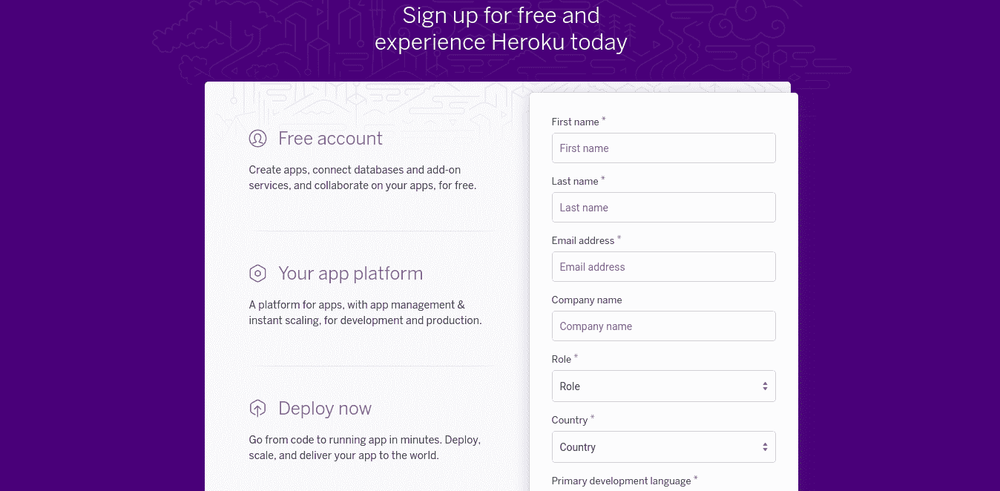

### 安装 Heroku CLI

Heroku 命令行界面(CLI)使得直接从终端创建和管理 Heroku 应用程序变得简单。这是使用 Heroku 的重要部分。[你可以决定使用 GitHub 集成特性和 Heroku Dashboard，但是你应该学习如何使用 CLI ]
Heroku CLI 需要 Git，这是一个流行的版本控制系统。如果你还没有安装 Git，我写了这篇文章来帮助你。

#### 适用于 Mac OS 的 Heroku CLI

```
brew tap heroku/brew && brew install heroku 
```

或者[下载安装程序](https://devcenter.heroku.com/articles/heroku-cli)。

#### 适用于 Ubuntu 的 Heroku CLI

```
sudo snap install --classic heroku 
```

#### 用于 Windows 的 Heroku CLI

下载 [64 位](https://cli-assets.heroku.com/heroku-x64.exe)或 [32 位](https://cli-assets.heroku.com/heroku-x86.exe)的安装程序。

#### 其他安装方法

请看[这个](https://devcenter.heroku.com/articles/heroku-cli#other-installation-methods)。

#### Heroku CLI 入门

*   验证您的安装

```
heroku --version 
```

heroku/7.30.1 linux-x64 节点-v11.14.0

*   登录你的 Heroku 账户

有两种方法可以做到这一点:

*   **基于网络的认证**

```
heroku login 
```

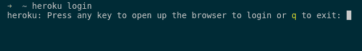

按照说明，通过您的网络浏览器登录，然后返回到您的终端。

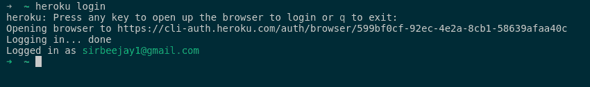

*   CLI 认证

这是一个更安全的选择，因为它会将您的电子邮件地址和 API 令牌保存到`~/.netrc`中以供将来使用。

```
heroku login -i 
```

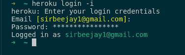

* * *

### 部署 Node.js 应用程序

我想你已经造好了懒虫机器人。如果没有，请克隆[完成的项目](https://github.com/BolajiAyodeji/inspireNuggetsSlackBot)。

该项目是一个简单的 Slackbot，为开发人员/设计师显示随机鼓舞人心的技术报价和笑话。

```
git clone https://github.com/BolajiAyodeji/inspireNuggetsSlackBot.git && cd inspireNuggetsSlackBot 
```

现在让我们将我们的应用程序部署到 Heroku？？。我将向您展示两种方法:

#### 通过 Heroku Git 部署

这是通过 Heroku CLI 完成的。

##### 核对清单

*   在您的`package.json`文件中指定将用于在 Heroku 上运行您的应用程序的 Node.js 版本。

```
"engines": {
    "node": "10.16.0"
  }, 
```

*   指定您的启动脚本。
    只需创建一个`Procfile`(没有任何文件扩展名)并添加

```
web: node index.js 
```

Heroku 首先寻找这个 Procfile。如果没有找到，Heroku 将尝试通过您的`package.json`中的启动脚本启动一个默认的 web 进程。

*   使用 heroku local 命令在本地启动您的应用程序，以确保一切正常

```
heroku local web 
```

您的应用程序现在应该在 [http://localhost:5000](http://localhost:5000) 上运行。

*   别忘了`.gitignore`

```
/node_modules
.DS_Store
/*.env 
```

##### **？让我们部署**

这是如何工作的，你已经有了在本地工作的项目，你已经把它推到了 GitHub。

*   运行`heroku create`

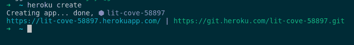

基本上，这个命令用一些随机生成的域为您创建一个新的 Heroku 应用程序，并将 Heroku 添加到您的本地 Git 存储库中。

*   现在运行`git push heroku master`

这是一个神奇的命令，它将你的应用程序推送到 Heroku，在那里安装，并在你分配的域上启动。

在上面的例子中，是[https://lit-cove-58897.herokuapp.com/](https://lit-cove-58897.herokuapp.com/)

您可以随时在 [Heroku Dashboard](https://dashboard.heroku.com/) 中更改您的应用程序设置和域

*   现在，在浏览器中访问您的应用程序

```
heroku open 
```

*   您还可以使用其中一个日志命令来查看正在运行的应用程序的信息。这在调试错误时非常有用。

```
heroku logs --tail 
```

#### 通过 GitHub 集成进行部署

您可以在 [Heroku Dashboard](https://dashboard.heroku.com) 中的应用程序的部署选项卡中配置 GitHub 集成。

##### 核对清单

*   所有之前的清单都适用于此——确保你已经将应用程序部署到 GitHub

##### **？让我们部署**

这个方法的工作原理是，你把你的整个项目推送到 GitHub，集成到 Heroku。每次推送，它都从 GitHub 部署到 Heroku。很酷吧？

*   登录您的 Heroku 仪表盘并创建一个新应用程序

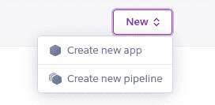

*   选择你的应用名称和地区


现在，您的应用程序已成功创建


*   单击部署选项卡并滚动到**部署方法**部分


*   点击**连接 GitHub** 按钮

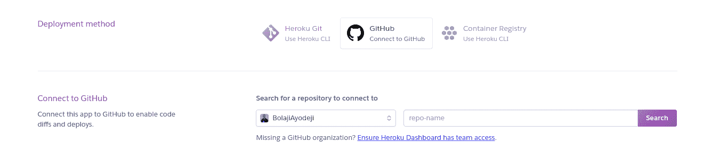

*   现在您有了**连接到 GitHub 部分**，搜索存储库并部署。

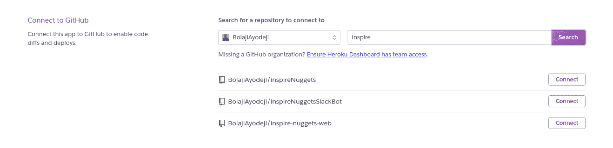

*   现在，您的应用已成功部署

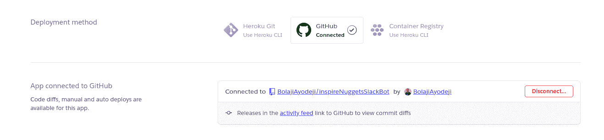

#### 自动部署

现在你的应用已经部署，但你还需要继续手动部署。您需要为 GitHub 分支启用自动部署，因此 Heroku 构建并部署所有推送至该分支。

*   滚动到**自动部署**部分

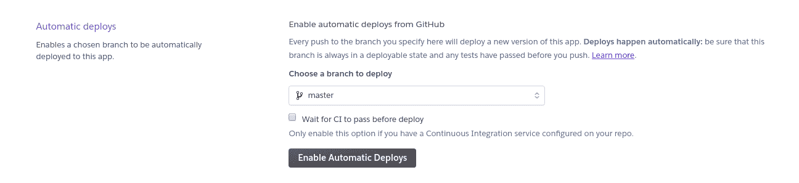

选择要部署的分支。理想情况下，这应该是`master`分支，但是根据您的喜好进行更改。

现在每推送到`master`(或者你选择的分支)都会部署这个 app 的新版本。

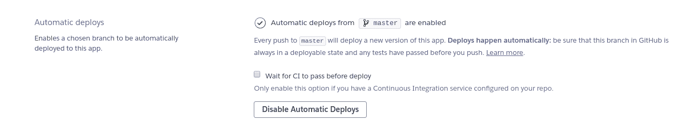

#### Node.js 构建包

在 Heroku 中，Buildpacks 是在部署应用程序时运行的脚本。它们用于安装应用程序的依赖项和配置环境。

部署应用程序后，确保将 Node.js buildpack 添加到项目中。

*   转到**设置**并滚动到**构建包部分**

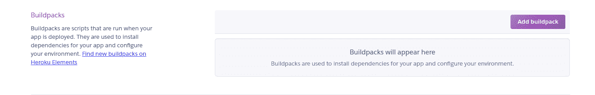

*   点击 **Add Buildpack** 按钮，在弹出的 modal 中选择 Node.js。

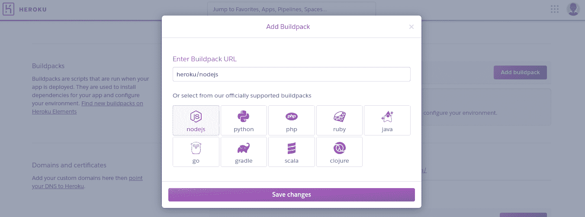

*   现在，新的 buildpack 配置将在下次部署该应用程序时使用。对你的应用做一些修改，然后推送到 GitHub——它会自动部署。

### '向您部署的应用添加数据库'

Heroku 附加市场有大量的数据存储，从 Redis 和 MongoDB 提供商，到 Postgres 和 MySQL。

Heroku 以附加服务的形式向所有客户提供三种托管数据服务:

*   Heroku Postgres
*   [英雄库编年史](https://elements.heroku.com/addons/heroku-redis)
*   [阿帕奇卡夫卡论 Heroku](https://elements.heroku.com/addons/cloudkarafka)

写这三个会让这篇文章太长。这很简单，我会添加一些链接到 Heroku 文档。

*   [Heroku Postgresql 文档](https://devcenter.heroku.com/categories/postgres-basics)
*   [英雄库编年史](https://devcenter.heroku.com/articles/heroku-redis)
*   [Heroku Docs 上的阿帕奇卡夫卡](https://devcenter.heroku.com/articles/kafka-on-heroku)

* * *

## 结论

每个 Heroku 帐户都分配了一个免费的 dyno 小时池。Heroku(免费)dynos 非常适合托管应用程序和个人项目。然而，不利的一面是，如果你的应用程序在 30 分钟内没有收到任何网络流量，它就会进入休眠状态。

您可以使用外部工具定期 ping 您的服务器，这样它就不会休眠。

以下是一些需要考虑的问题:

*   [Pingmydyno](https://www.npmjs.com/package/pingmydyno)
*   [Heroku self ping](https://www.npmjs.com/package/heroku-self-ping)
*   [Wakemydyno](http://wakemydyno.com/)
*   [卡夫芬](https://kaffeine.herokuapp.com/)

* * *

> Heroku 经过精心设计，旨在帮助开发人员尽可能提高工作效率。该平台消除了令人沮丧的障碍和平凡的任务，因此您可以在开发流程中不受干扰。无论你处于学习的哪个阶段，Heroku 都会让你更加热爱应用程序开发。-赫罗库

Heroku experience 提供服务、工具、工作流和多语言支持，所有这些都旨在提高开发人员的工作效率。使用 Heroku 有更多的意义，我希望你能探索更多，用 Heroku 创造出令人惊奇的东西。

如果你是一名学生，请注册 GitHub 学生开发者包，以获得一个免费的长达两年的 T2 爱好动态。

该包让学生可以在一个地方免费访问最好的开发工具，这样您就可以边做边学。