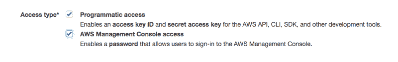
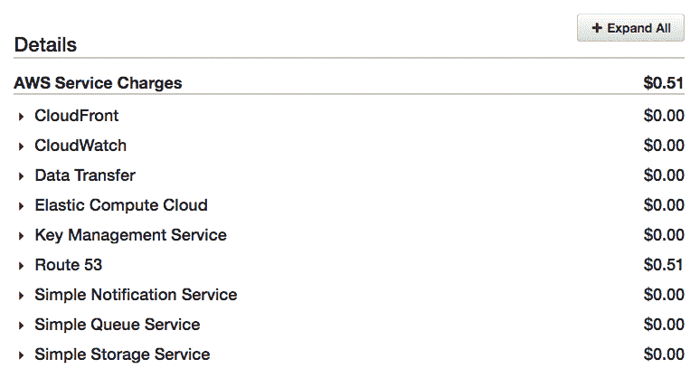
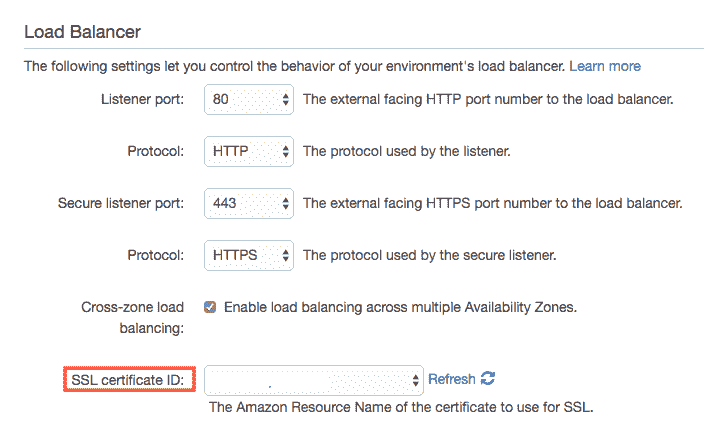

# 如何将 Node.js 应用程序部署到 AWS Elastic Beanstalk

> 原文：<https://www.freecodecamp.org/news/how-to-deploy-a-node-js-app-to-the-aws-elastic-beanstalk-f150899ed977/>

我花了大半个月的时间才弄明白如何设置一个 Amazon Web Services (AWS)帐户，配置 Node.js 应用程序进行部署，然后实际部署它。

很多人都试图破译亚马逊的文档。希望本指南能让您轻松地从本地部署到现场。

我位于洛杉矶，因此当您设置配置时，默认设置可能不完全相同。

### 先决条件

1.  基本的命令行知识
    我相信没有命令行你也能做到，但是使用命令行界面更容易
2.  AWS 帐户
3.  弹性 Beanstalk 命令行界面(EB CLI)
    安装说明如下
4.  Git 的基础知识

### 设置 AWS 帐户

你要做的第一件事是建立一个 AWS 账户。如果您已经有一个帐户，请确保您有一个拥有 API 密钥和适当访问权限的 IAM 用户。

#### **创建账户**

非常简单。创建一个帐户。注册过程应该会让你很容易地完成所有的事情。当你第一次设置一个 AWS 账户时，你将获得根用户权限。但是，安全最佳实践是创建一个单独的用户，用于定期登录。

#### **设置您的 IAM**

**注意:**我不是 AWS 身份和访问管理(I am)方面的专家。我采取的行动是为了我个人的使用情况，可能不适合您的需求。在授予用户访问权限之前，彻底检查权限。

AWS 定期发布最佳实践，从 2016 年[这里](https://aws.amazon.com/blogs/security/adhere-to-iam-best-practices-in-2016/)获取一个。

#### **设置一个组**

在为您设置用于登录的用户之前，请创建一个将管理权限的组。在我的例子中，我设置了一个超级管理员组，我将把自己放入其中，这样我就可以访问任何东西。

对于这个组，由于基本上是自己登录并访问所有内容，所以我选择 AdministratorAccess 作为权限。


有关 IAM 群组的更多信息，请点击[此处](https://docs.aws.amazon.com/IAM/latest/UserGuide/id_groups.html)。

#### **设置一个 IAM 用户**

设置用户非常简单，但是如果你遇到困难，可以查看 AWS 的 IAM 页面。他们有很多有用的视频。

请记住:

1.  给他们访问密钥权限
    (见下图)
2.  将它们分配给适当的 IAM 组



一旦您有了自己的用户设置，注销 root，然后作为新的 IAM 用户重新登录。

### 设置本地环境

现在我们已经准备好了帐户密钥，让我们开始部署。

#### 什么是弹性豆茎？

Elastic Beanstalk (EB)是设置可伸缩应用程序的一种相当简单的方法。它使用亚马逊弹性计算云(EC2)实例、亚马逊简单存储服务(S3)桶和负载平衡器来管理您的应用程序架构。

如果您因为网络需求而需要快速扩展，它会这样做。它在推送更新方面也非常惊人，因为它可以进行“滚动更新”，这允许应用程序在您更新时保持在线。干净利落。

#### 如何避免弹性豆茎花费你一吨

这只适用于仍有资格享受免费计划的新用户:

1.  你每月有 750 小时的 t2.micro EC2 时间。这将为您提供足够的时间来运行一台服务器。然而，如果你再增加一台服务器，你就要为此付费了。
2.  你可以将所有的服务器逻辑切换到 Lambda 函数，但这是另一天的话题(也有一些缺点)s.
    如果你感兴趣，看看这篇[文章](https://medium.freecodecamp.org/how-i-cut-my-aws-bill-by-90-35c937596f0c)。

#### 但是要花多少钱呢？

好问题。这是我账单的样本。这是我写这篇文章时运行的 Node.js 应用程序(EB、Cloudfront、S3 桶)。



如果你想知道免费计划结束后要花多少钱，看看这个。

### 在您的应用程序中创建一个 EB 环境

这不是 Node.js 教程，因为这超出了本文的范围。但是如果你需要一个应用程序，请查看一下[快速应用程序生成器](https://expressjs.com/en/starter/generator.html)。它至少会给你一个“你好世界”。这是我在项目中使用的`init`。

接下来，假设您已经有了一个 Node.js 应用程序，它可以在本地正常运行。

#### 设置 EB CLI

首先是让 AWS/EB CLI 运行起来，这包括安装一些工具和设置配置。

AWS 的文件比我更好地解释了这个问题，所以请点击这里查看。

**注意:**如果 API 键有问题，您可以通过编辑配置文件来验证/更改它们。

```
open ~/.aws/config
```

### 初始部署

现在我们已经把所有的工具都准备好了，下一步做什么？

```
eb init
```

当你运行这个命令时，它会问你一大堆问题:

1.  您将被要求选择一个地区。
    默认为美国西部-2:美国西部(俄勒冈州)
2.  它会问你使用哪个应用程序或创建一个新的。第一个选择应该是创建一个新的。
3.  它会问你是否要使用 AWS CodeCommit。
    我对此没有经验，但我只是在用 GitHub，所以我说没有。

#### 设置您的环境变量

这可能是我最大的痛点。我不知道是我的大脑对文件迟钝了，还是什么。一旦我弄明白了，其实真的很简单。配置文件是用 YAML ❤️.写的


YAML > JSON

当你`eb init`的时候，它会在你的根目录下创建一个文件夹`**.elasticbeanstalk**`。您真的不需要在这里搞乱任何东西，因为它应该在您第一次运行该命令时自动设置。

然而，为了拥有你的环境变量，以及你需要在启动时运行的任何其他配置，创建一个新的文件夹:`**.ebextensions**`

文件夹结构应该如下所示:

```
- .ebextensions
-- 01_yourconfig.config
- .elasticbeanstalk
-- config.yml
```

如前所述，配置文件是在 YAML 编写的。为了让您了解它们应该是什么样子，这里有一些示例:

环境变量文件:

```
# 01_envar.config
option_settings:
  aws:elasticbeanstalk:application:environment:
    PORT: 8081
    NODE_ENV: production
```

一个用于配置 Node.js 的文件:
你不需要**指定`NodeVersion`，因为它会在 EC2 实例上给你一个最新的。但这是以防万一。**

```
`# 02_nodecommand.config
option_settings:
  aws:elasticbeanstalk:container:nodejs:
    NodeCommand: "npm run start"
    NodeVersion: 8.8.1`
```

**对我来说，这是管理配置设置最简单的方法，但是它们可以在 EB 仪表板的 configuration 下进行调整。**

**如果你想知道更多，这里的是一篇关于这个话题的精彩文章。**

#### **创造环境**

```
`eb create <env-name>`
```

**然后展开**

```
`eb deploy`
```

**假设一切顺利，您的应用程序现在已经部署到“云”上了**

**用`eb open`检查一下**

### **部署更改**

**一旦你设置好了一切，推动改变就变得非常容易。**

****注意:**在推送到环境之前，必须将更改提交给 Git。**

**我第一次没有意识到，我花了很长时间才明白。不要犯同样的错误——提交那些改变！**

**因此，一旦您提交了更改，只需输入下面的命令，然后等待它自动运行。**

```
`eb deploy <env-name>`
```

### **其他方便的 EBCLI 命令**

**在终端中打开实例，这比试图记住 AWS 一开始给你的 URL 字典要容易得多:**

```
`eb open`
```

**要打开控制台:**

```
`eb console`
```

**要将日志文件直接发送到您的终端:**

```
`eb logs`
```

### **下一步是什么？**

#### **自定义域名**

**如果你运行`eb open`，你会注意到这个 URL 是一个非常长的 URL。如果你愿意，你可以用 53 号公路把它连接到你的域名。在很大程度上，这些都是标准的 DNS 记录。你可以把 DNS 管理留在你注册域名的地方，但是我发现把它放在一个地方更容易。**

#### **SSL Cert**

**为您的实例获取 SSL 证书也很容易。访问证书管理器并为您的域创建一个新证书。这也是一个简单的过程。**

****注意:**如果你计划为 Cloudfront 使用 SSL 证书，你**需要**从 N. Virginia zone 启动这个过程。您可以在屏幕的右上角更改您的区域。**

****

**一旦它被验证并准备好使用，就把它放到你的 EB 配置中。最简单的方法是到控制台并选择它。**

1.  **转到您的 EB 仪表板**
2.  **选择您的应用**
3.  **选择你的环境**
4.  **点击“配置”并选择 SSL 证书。**

****

****另一个注意事项:**如果您有一个全新的帐户，有时您可能会遇到证书管理器的问题。如果当您尝试创建证书时，它告诉您联系客户支持，那么就这样做，他们会修复它。**

### **结论**

**哇哦。多好的旅程啊。希望你是成功的，不必跑去 AWS 文档太多次。但是，如果我对自己诚实的话，我相信你至少有过一次。AWS 是一个可怕的服务，它只会一天天变大。**

**

Now you too, can yell at the Cloud** 

### **支持**

**你喜欢这篇文章吗？你想看更多吗？有多余的钱吗？查看下面的链接。每一杯咖啡都变成了另外几百行代码:)**

**[**给杰瑞德·纳特买一杯咖啡——BuyMeACoffee.com**](http://buymeacoff.ee/AXwyIxz1C)
[*洛杉矶的网络开发人员竭尽全力为开源软件做贡献，并编写优秀的教程。* buymeacoff.ee](http://buymeacoff.ee/AXwyIxz1C)**

### **资源**

**[AWS In plain English](https://www.expeditedssl.com/aws-in-plain-english)**

**[了解并爱上 AWS 弹性豆茎配置文件(。ebextensions)](https://medium.com/trisfera/getting-to-know-and-love-aws-elastic-beanstalk-configuration-files-ebextensions-9a4502a26e3c)**

**[AWS 入门](https://www.taniarascia.com/getting-started-with-aws-setting-up-a-virtual-server/)**

**acloudguru (不是免费服务，但是他们有一个免费的介绍课程，非常有用)**