# 如何使用 Docker 将 Node.js 应用程序部署到 Amazon Web Services

> 原文：<https://www.freecodecamp.org/news/how-to-deploy-a-node-js-application-to-amazon-web-services-using-docker-81c2a2d7225b/>

伊曼纽尔·优素福

# 如何使用 Docker 将 Node.js 应用程序部署到 Amazon Web Services

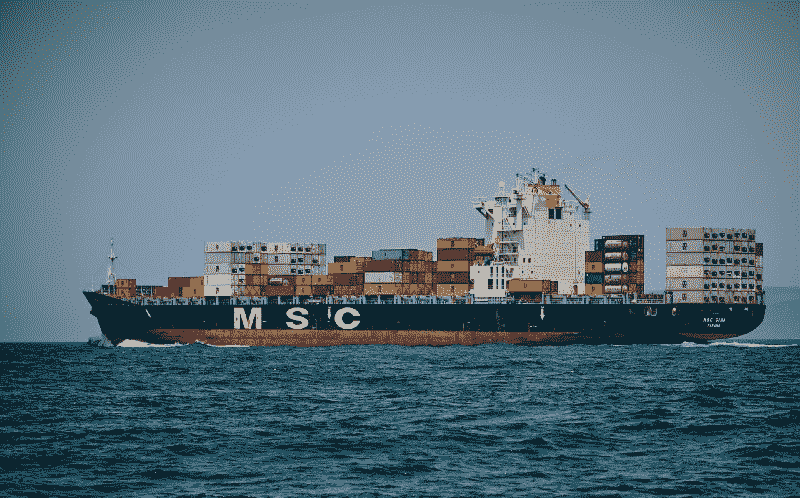

> Plug:最初发表于 Zeolearn [杂志](https://www.zeolearn.com/magazine/how-to-deploy-a-node.js-application-to-amazon-web-services-using-docker)。

> 更多有用的开发者内容，如本文，请访问 [Zeolearn 博客](https://www.zeolearn.com/magazine/how-to-deploy-a-node.js-application-to-amazon-web-services-using-docker)。该博客的特色是以 web/软件开发为中心的文章:AngularJS、ReactJS、NodeJS、Django 和数据科学(包括机器学习、数据科学、Python 和深度学习)。

#### 目录

1.简介
2。先决条件
3。Docker 和 AWS
4 快速入门。我们将部署什么
5。创建 Dockerfile 文件
6。打造码头工人形象
7。运行码头集装箱
8。创建注册表(ECR)并将应用程序映像上传到注册表
9。创建新的任务定义
10。创建集群
11。创建服务来运行它
12。结论

### 1.介绍

大多数开发人员都熟悉如何编写代码。有时，我们需要承担系统管理员或 DevOps 工程师的责任，将我们的代码库部署到生产环境中，帮助企业为客户解决问题。

在本教程中，我将向您展示如何使用 Amazon ECR(弹性容器注册中心)和 ECS(弹性容器服务)将 Node.js 应用程序 dockerize 并将其部署到 Amazon Web Service (AWS)。

### 2.先决条件

要完成本教程，您需要以下内容:

1.  **节点和 Npm** : [点击此链接](https://nodejs.org/en/)安装最新版本。
2.  Node.js 的基础知识。
3.  Docker :安装提供了 Docker 引擎，Docker CLI 客户端，以及其他很酷的东西。遵循你的操作系统的[指令](https://docs.docker.com/install/)。要检查安装是否有效，请在终端上运行以下命令:

```
docker --version
```

上面的命令应该显示版本号。如果没有，说明安装没有正确完成。

4. **AWS 账号**:注册免费等级。需要等待一段时间来验证您的电话号码和银行卡。此后，您将可以访问控制台。

5. **AWS CLI** :遵循你的操作系统的[指令](https://aws.amazon.com/cli/)。您需要安装 Python。

### 3.Docker 和 AWS 快速入门

Docker 是一款开源软件，它允许你将一个应用程序以及所需的依赖项和环境打包到一个“容器”中，你可以在任何地方运输和运行。它独立于平台或硬件，因此容器化的应用程序可以在任何环境中以隔离的方式运行。

Docker 容器解决了许多问题，例如当一个应用程序在同事的计算机上工作但不能在你的计算机上运行时，或者当你将它部署到服务器时，它在本地开发环境中工作但不能工作。

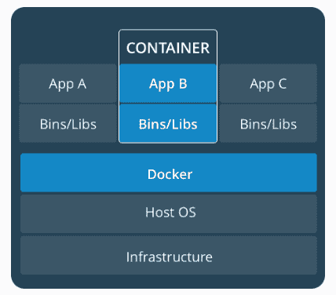

**亚马逊网络服务(AWS)** 为企业提供可靠、可扩展、廉价的云计算服务。正如我之前提到的，本教程将重点介绍 ECR 和 ECS 服务的使用。

### 4.我们将部署什么

让我们快速构建一个示例应用程序，用于本教程的目的。这将是非常简单的 Node.js 应用程序。

在您的终端中输入以下内容:

```
// create a new directory
mkdir sample-nodejs-app

// change to new directory
cd sample-nodejs-app

// Initialize npm
npm init -y

// install express
npm install express

// create an server.js file
touch server.js
```

打开`server.js`并将下面的代码粘贴到其中:

```
// server.js

const express = require('express')
const app = express()

app.get('/', (req, res) => {
    res.send('Hello world from a Node.js app!')
})

app.listen(3000, () => {
    console.log('Server is up on 3000')
})
```

使用以下内容启动应用程序:

```
node server.js
```

在 [http://localhost:3000](http://localhost:3000) 上访问它。您应该在浏览器中显示`Hello world from a Node.js app!`。GitHub 上有完整的代码。

现在让我们将非常重要的应用程序投入生产？。

### 5.创建 Dockerfile 文件

我们将通过在项目目录的基础上创建一个名为`Dockerfile`的文件来开始对应用程序进行归档。

docker 文件是构建我们图像的蓝图。然后图像变成容器，我们在里面运行我们的应用程序。

每个 Dockerfile 文件都以一个基础映像作为基础。创建 docker 文件有两种方法:

1.  使用**普通操作系统基础映像**(例如，Ubuntu OS、Debian、CentOS 等。)并在其中安装一个应用程序环境，如 Node.js 或
2.  使用**环境就绪基本映像**来获取已经安装了应用程序环境的操作系统映像。

我们将采用第二种方法。我们可以使用基于 Alpine Linux 的 Dockerhub 上的官方 Node.js 镜像。

把这个写在文档中:

```
FROM node:8-alpine
RUN mkdir -p /usr/src/app
WORKDIR /usr/src/app
COPY . .
RUN npm install
EXPOSE 3000
CMD [ "node", "server.js" ]
```

让我们一行一行地看看这里发生了什么，为什么。

```
FROM node:8-alpine
```

这里，我们使用来自 [Dockerhub](https://hub.docker.com/_/node/) (一个基本映像的存储库)的官方 Node.js 映像来构建我们的 Docker 映像。

*   用一个`[**FROM**](https://docs.docker.com/reference/builder/#from)`语句开始我们的 docker 文件。这是您指定基本图像的地方。
*   `[**RUN**](https://docs.docker.com/reference/builder/#run)`语句将允许我们执行您想要做的任何事情的命令。我们创建了一个子目录`/usr/src/app`,用于保存 docker 映像中的应用程序代码。
*   `[**WORKDIR**](https://docs.docker.com/engine/reference/builder/#workdir)`指令建立我们创建的子目录，作为`Dockerfile`中跟随它的`RUN`、`CMD`、`ENTRYPOINT`、`COPY`和`ADD`指令的工作目录。`/usr/src/app`是我们的工作目录。
*   让我们将文件从源位置复制到目标位置。我们将节点应用程序代码的内容(`server.js`和`package.json`)从当前目录复制到 docker 映像中的工作目录。
*   `[**EXPOSE**](https://docs.docker.com/engine/reference/builder/#expose)`指令通知 Docker 容器在运行时监听指定的网络端口。我们指定端口 3000。
*   最后但同样重要的是，`[**CMD**](https://docs.docker.com/reference/builder/#cmd)`语句指定了启动我们的应用程序的命令。这告诉 Docker 如何运行你的应用程序。这里我们使用`node server.js`,这是 Node.js 中文件通常的运行方式。

有了这个完整的文件，我们现在就可以构建新的 Docker 映像了。

### 6.建立码头工人形象

确保 Docker 已经启动并运行。现在我们已经定义了 Dockerfile，让我们使用`-t`构建带有标题的图像:

```
docker build -t sample-nodejs-app .
```

这将输出哈希和字母数字字符串，用于标识容器和图像，并在最后一行显示“成功构建”:

```
Sending build context to Docker daemon  1.966MB
Step 1/7 : FROM node:6-alpine
 ---> 998971a692ca
Step 2/7 : RUN mkdir -p /usr/src/app
 ---> Using cache
 ---> f1aa1c112188
Step 3/7 : WORKDIR /usr/src/app
 ---> Using cache
 ---> b4421b83357b
Step 4/7 : COPY . .
 ---> 836112e1d526
Step 5/7 : RUN npm install
 ---> Running in 1c6b36b5381c
npm WARN sample-nodejs-app@1.0.0 No description
npm WARN sample-nodejs-app@1.0.0 No repository field.
Removing intermediate container 1c6b36b5381c
 ---> 93999e6c807f
Step 6/7 : EXPOSE 3000
 ---> Running in 7419020927f1
Removing intermediate container 7419020927f1
 ---> ed4ac8a31f83
Step 7/7 : CMD [ "node", "server.js" ]
 ---> Running in c77d34f4c873
Removing intermediate container c77d34f4c873
 ---> eaf97859f909
Successfully built eaf97859f909

// dont expect the same values from your terminal.
```

### **7。运行 Docker 容器**

我们已经建立了 docker 映像。要查看以前创建的图像，请运行:

```
docker images
```

您应该会看到我们刚刚创建的基于时间的最新图像:

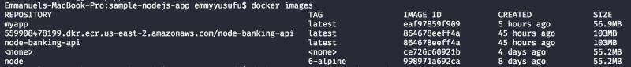

复制图像 Id。为了运行容器，我们在终端上编写:

```
docker run -p 80:3000 {image-id}

// fill with your image-id
```

默认情况下，Docker 容器可以与外界建立连接，但外界无法连接到容器。`-p`向主机接口发布所有**暴露的端口**。这里我们把 app 发布到端口 80:3000。因为我们在本地运行 Docker，所以去 [http://localhost](http://localhost) 查看。

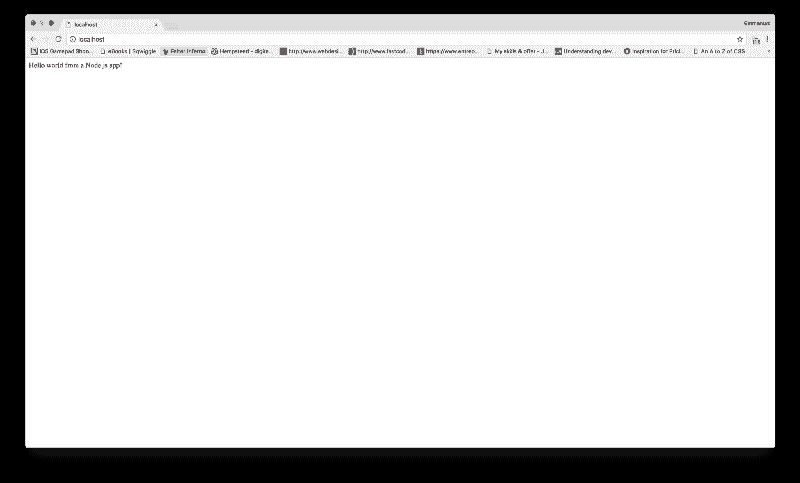

您可以随时通过键入以下命令来检查正在运行的 Docker 容器:

```
docker container ls
```

最后，您可以通过以下方式停止容器运行:

```
docker stop {image-id}
```

让 Docker 守护进程保持运行。

### 8.创建注册表(ECR)并将应用程序映像上传到其中

Amazon Elastic Container Registry(ECR)是一个完全托管的 [Docker](https://aws.amazon.com/docker/) 容器注册表，它使开发人员可以轻松地存储、管理和部署 Docker 容器映像。亚马逊 ECR 与[亚马逊弹性容器服务(ECS)](https://aws.amazon.com/ecs/) 整合，简化你的开发到生产的工作流程。

关键字“弹性”意味着您可以根据需要扩展或减少容量。

#### **步骤**:

1.  前往 [AWS 控制台](https://aws.amazon.com/)并登录。
2.  选择 EC2 容器服务并开始使用

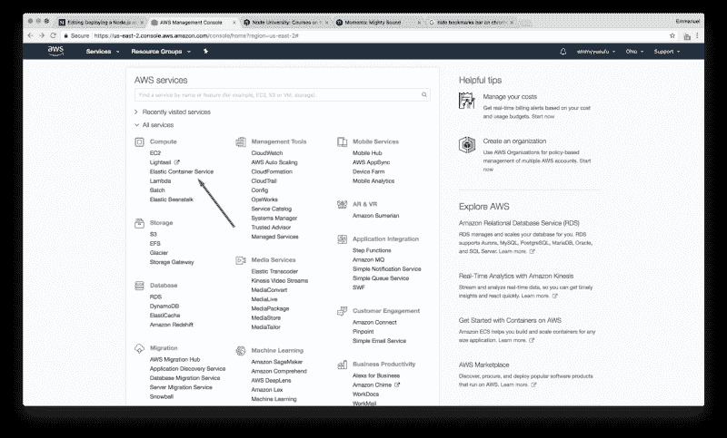

3.第一个运行页面显示，向下滚动并单击取消>进入 ECS 控制面板。

4.要确保您的 CLI 可以连接到您的 AWS 帐户，请在终端上运行:

```
aws configure
```

如果您的 AWS CLI 安装正确， [**aws 配置**](https://docs.aws.amazon.com/cli/latest/reference/configure/) 将询问以下信息:

```
$ aws configure
AWS Access Key ID [None]: accesskey
AWS Secret Access Key [None]: secretkey
Default region name [None]: us-west-2
Default output format [None]:
```

在您的用户名>访问密钥下从您的 AWS 帐户获取安全凭证。再次拧紧并正确填充。

4.创建一个新的存储库并输入一个名称(**最好与本地开发环境中的容器名称相同，以保持一致性**)。

比如用`sample-nodejs-app`。

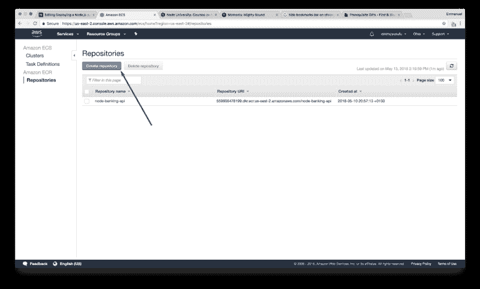

按照 AWS 控制台中的 5 个说明来构建、标记和推送 Docker 图像:

注意:下面的论点是我的，会与你的不同，所以只需按照你的控制台上概述的步骤。

1.  检索 Docker 登录命令，您可以使用该命令向您的注册表验证您的 Docker 客户端:
    **注意**:如果您收到“未知选项:-不包括电子邮件”错误，请安装最新版本的 AWS CLI。[在此了解更多信息](https://docs.aws.amazon.com/cli/latest/userguide/installing.html)。

```
aws ecr get-login --no-include-email --region us-east-2
```

2.运行上一步返回的`docker login`命令**(只是复制粘贴)**。**注意**:如果您使用的是 Windows PowerShell，请运行以下命令:

```
Invoke-Expression -Command (aws ecr get-login --no-include-email --region us-east-2)
```

它应该输出:**登录成功**。

3.使用以下命令构建 Docker 映像。有关从头构建 Docker 文件的信息，请参见此处的说明。您可以跳过这一步，因为我们的映像已经构建完毕:

```
docker build -t sample-nodejs-app .
```

4.完成构建后，用关键字(例如， **latest** )标记您的映像，这样您就可以将映像推送到这个存储库:

```
docker tag sample-nodejs-app:latest 559908478199.dkr.ecr.us-east-2.amazonaws.com/sample-nodejs-app:latest
```

5.运行以下命令将该映像推送到新创建的 AWS 存储库:

```
docker push 559908478199.dkr.ecr.us-east-2.amazonaws.com/sample-nodejs-app:latest
```

### 9.创建新的任务定义

任务的功能类似于 Docker CLI 的`docker run`命令，但适用于多个容器。他们定义:

*   容器图像(使用)
*   卷(如果有)
*   网络环境变量
*   端口映射

从 ECS 仪表板中的**任务定义**中，点击创建新任务定义(ECS)按钮:

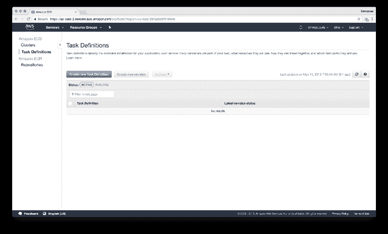

设置任务名称并使用以下步骤:

*   添加容器:sample-nodejs-app(我们推送的那个)。
*   图像:容器的 URL。我的是`559908478199.dkr.ecr.us-east-2.amazonaws.com/sample-nodejs-app`
*   软限制:512
*   对于 sample-nodejs-app，将 80(主机)映射到 3000(容器)
*   环境变量:

`NODE_ENV` : `production`

### 10.创建一个集群

集群是 AWS 容器运行的地方。它们使用类似于 EC2 实例的配置。定义以下内容:

*   集群名称:demo-nodejs-app-cluster
*   EC2 实例类型:t2.micro

*( **注意**:您根据应用程序的大小来选择实例。这里我们选择了最小的。您的选择会影响到您月底的账单金额。[点击此处](https://aws.amazon.com/ec2/pricing/on-demand/)了解更多信息)。感谢 [Nicholas Kolatsis](https://www.freecodecamp.org/news/how-to-deploy-a-node-js-application-to-amazon-web-services-using-docker-81c2a2d7225b/undefined) 指出之前选择的 m4.large 对于本教程来说很贵。*

*   实例数量:1
*   EBS 存储:22
*   密钥对:无
*   VPC:新

该过程完成后，您可以选择单击“查看集群”

### 11.创建一个服务来运行它

进入**任务定义** >点击 demo-nodejs-app >点击最新修订。

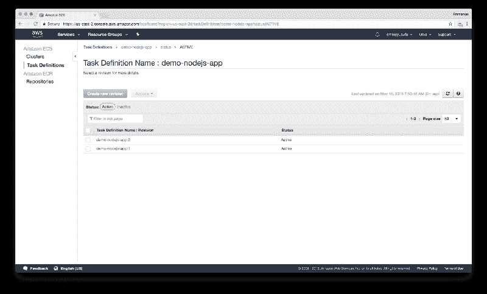

在任务定义中，单击 actions 下拉菜单并选择 Create servcie

使用以下内容:

*   发射类型:EC2
*   服务名:demo-nodejs-app-service
*   任务数量:1

跳过选项，点击**创建服务**和**查看服务**。

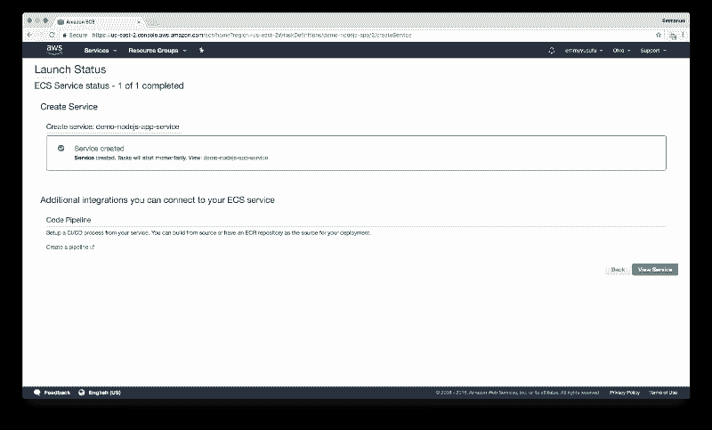

您将看到它的状态为**待定**。给它一点时间，它会显示**正在运行**。

转到 Cluster(通过我们刚刚创建的服务的链接)> EC2 instances >单击容器实例以显示公共 DNS。

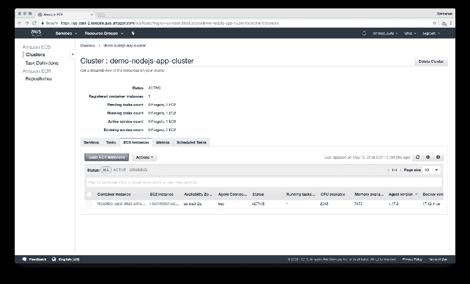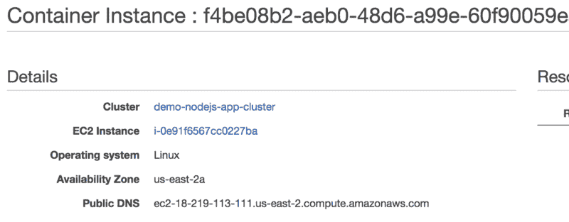

访问公共 DNS 查看我们的应用程序！我的是`[ec2–18–219–113–111.us-east-2.compute.amazonaws.com](http://ec2-18-219-113-111.us-east-2.compute.amazonaws.com/)`

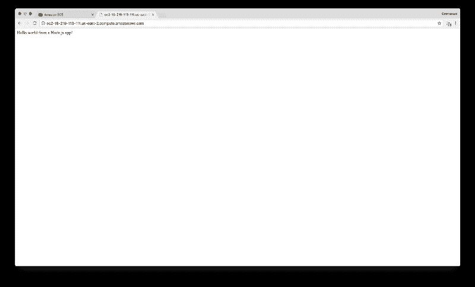

### 12.结论。

祝贺你完成这篇文章！从 [Github](https://github.com/emmyyusufu/sample-nodejs-app) 中抓取 Docker 部分的代码。

请随意支持我([devapparel.co](http://www.devapparel.co))并且看起来不错。也可以评论或分享这篇文章。感谢阅读！

> Plug:同样，要获得更多像这样的高质量内容，请访问 [Zeolearn 博客](https://www.zeolearn.com/magazine/how-to-deploy-a-node.js-application-to-amazon-web-services-using-docker)。