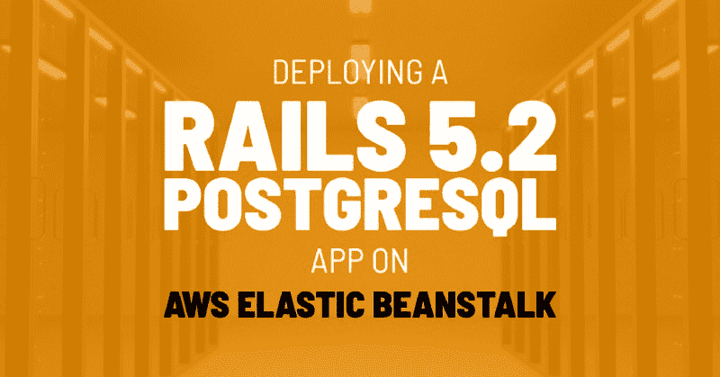

# 如何在 AWS Elastic Beanstalk 上部署 Rails 5.2 PostgreSQL 应用

> 原文：<https://www.freecodecamp.org/news/how-to-deploy-a-rails-5-2-postgresql-app-on-aws-elastic-beanstalk-34e5cec3a984/>

依进化论而论

# 如何在 AWS Elastic Beanstalk 上部署 Rails 5.2 PostgreSQL 应用



这是正式的，到目前为止，在我所有的 Rails 项目中使用 Heroku 已经把我宠坏了。由于一次推销比赛，我获得了一些 AWS 的学分，于是我决定将我的最新项目部署在[弹性豆茎](https://aws.amazon.com/elasticbeanstalk/)([AWS](https://aws.amazon.com/)‘Heroku 竞争者’)。我只想说我想念赫罗库。

唉，如果你也有类似的情况，下面是在 Elastic Beanstalk 上部署 Rails 5.2 / PostgreSQL 应用程序的分步说明。

### 安装弹性 Beanstalk CLI

我们将在本教程中使用终端。让我们从安装“弹性 Beanstalk 命令行界面”开始下面是如何在 macOS 上使用[自制软件](https://brew.sh/)来完成这项工作:

```
brew install awsebcli
```

如果你正在使用另一个平台，谷歌搜索“如何在[你的平台]上安装 awsebcli”，应该会把你引向正确的方向。

### 初始化弹性豆茎

我将假设您已经有一个 Amazon Web Services 帐户，如果还没有，请继续创建一个。现在，进入项目目录，初始化 Elastic Beanstalk:

```
cd my_projecteb init
```

然后 EB CLI 将询问您几个问题来初始化 Elastic Beanstalk 应用程序。初始化部分很简单。如果您在任何地方遇到困难，可以查看文档中的[“配置 EB CLI”](https://docs.aws.amazon.com/elasticbeanstalk/latest/dg/eb-cli3-configuration.html)页面。

### 创造新环境

正如您已经知道的，您的应用程序可以有许多环境(将它们想象成不同的配置)。例如，您可能有一个“生产”环境。这是您用于面向用户的应用程序版本的环境。但是您可能希望有另一个名为“staging”的环境在将应用推向生产环境之前，您可以在这里尝试新版本的应用。

我们可以使用下面的命令创建一个环境:

```
eb create production
```

### 展开到弹性豆茎

假设您正在使用 Git，在部署应用程序之前提交您的更改。EB CLI 部署您的最后一次提交。如果在提交之前部署，您将部署应用程序的早期版本。

提交更改后，使用以下命令进行部署:

```
eb deploy
```

到目前为止一切顺利，现在我们需要在我们的应用程序实际开始工作之前设置一些东西。

### 设置主密钥

您也可以使用 CLI 来实现这一目的，但是我更喜欢使用 web 面板来实现这一目的。以下是方法:

1.  转到 AWS，选择“服务->弹性 Beanstalk”，然后点击您的环境。
2.  打开“配置”选项卡，单击标题为“软件”的框下的“修改”
3.  在“环境属性”下，添加一个名为`RAILS_MASTER_KEY`的新键。将其值设置为“master.key”文件的内容。您可以在 Rails 应用程序的“config”目录中找到这个文件。
4.  点击页面底部的“应用”按钮。

### 设置 PostgreSQL 数据库

Elastic Beanstalk 提供了一种建立数据库的简单方法，您可以通过“配置->数据库”来实现我不喜欢使用它，因为如果您需要重建您的弹性 Beanstalk 环境，您的数据库将被删除。因此，我们将把数据库从我们的弹性 Beanstalk 环境中分离出来。

#### 在 RDS 上创建 PostgreSQL 数据库

1.  转到 AWS，选择“服务-> RDS”
2.  选择“创建数据库”
3.  选择“PostgreSQL”，然后单击“下一步”
4.  选择您的用例，“生产”或“开发/测试”，然后单击“下一步”
5.  在这里，你可以尝试不同的选择，看看估计每月费用是多少。在你的预算范围内解决一些事情。您可以从一个`db.t2.micro`实例开始，没有多 AZ 部署和一个通用 SSD。
6.  选择一个实例标识符，这是一种“名称空间”
7.  选择用户名和密码，暂时把它们放在手边，点击“下一步”
8.  在“配置高级设置”部分，重要的是安全组。选择“选择现有的 VPC 安全组”，并选择类似“…-AWSEBSecurityGroup-…”的安全组
9.  选择一个数据库名称，例如`my_app_production`。
10.  单击“创建数据库”，这需要一段时间。

#### 允许访问数据库

同时，让我们将 Postgres 访问权限添加到您的安全组中:

1.  转到 AWS，选择“服务-> EC2”
2.  单击左侧面板上的“安全组”。
3.  从上一节中选择安全组。
4.  转到“入站”选项卡，然后单击“编辑”
5.  点击“添加规则”对于“类型”，选择“PostgreSQL”，对于“源”，键入您要将此规则添加到的安全组的 ID。它应该位于“Inbound”选项卡的正上方，看起来应该像`sg-*`。
6.  点击“保存”

#### 设置生产数据库配置

现在，在您的 Rails 目录中，打开`config/database.yml`。将其更改如下:

```
# ...
```

```
production:  <<: *default  database: <%= ENV['RDS_DB_NAME'] %>  username: <%= ENV['RDS_USERNAME'] %>  password: <%= ENV['RDS_PASSWORD'] %>  host: <%= ENV['RDS_HOSTNAME'] %>  port: <%= ENV['RDS_PORT'] %>
```

#### 为弹性豆茎添加相关环境变量

我们告诉 Rails 使用上述环境变量获取生产数据库的信息。现在，我们需要确保我们的弹性 Beanstalk 环境包括这些变量:

1.  转到 AWS，选择“服务->弹性 Beanstalk”，然后点击您的环境。
2.  打开“配置”选项卡，单击标题为“软件”的框下的“修改”
3.  在“环境属性”下，添加以下键值对:
4.  `RDS_DB_NAME`:设置数据库时选择的数据库名称。
5.  `RDS_USERNAME`:设置数据库时选择的用户名。
6.  `RDS_PASSWORD`:设置数据库时选择的密码。
7.  `RDS_HOSTNAME`:转到“Services - > RDS”，您可以在数据库实例信息页面的“Connect”部分找到该信息。它被称为“端点”
8.  `RDS_PORT`:设置为 5432。
9.  点击页面底部的“应用”按钮。

之后，再次提交 Rails 应用程序目录，并运行`eb deploy`。在这样做之前，您可能需要等待几分钟，因为在更新环境变量之后，Elastic Beanstalk 会在后台做一些事情。

完成这些步骤后，您的 Rails 应用程序“应该”正在运行。

### 还是不行？

如果有任何问题，您可以在 AWS web 面板上进入您的 EB 环境，单击“Logs”，然后选择“Request Logs -> Last 100 Lines”来查看日志。但在此之前，我建议您在本地机器上使用生产环境，通过使用逗号`nd rails s RAILS_ENV=product`来运行您的 Rails 应用程序。

我会第一个承认，在部署方面，我不是最有经验的人。正如我所说的，我过去一直使用 Heroku，我可能也会在我未来的项目中使用它。在几天绞尽脑汁试图在 Elastic Beanstalk 上设置我的 Rails 应用程序后，这些步骤对我很有用，所以我想分享这些，希望能为那些和我情况相同的人节省时间。所以，对这一切要有所保留，祝你好运！

如果你喜欢这篇文章，[在 Twitter 上关注我](https://twitter.com/evrimfeyyaz)或者[注册我的时事通讯](https://evrim.us12.list-manage.com/subscribe/post?u=7d6b207df0db42f6bfcff3322&id=70b8425aa4)以便在我写新文章时得到通知。我写关于软件和创业的文章。

如果你正在寻找一个 Rails 开发人员，我现在可以远程工作。请随时拨打 hi{at}evrim.io 与我联系

*最初发布于[evrim . io](https://evrim.io/deploying-a-rails-52-postgresql-app-on-aws-elastic-beanstalk/)2018 年 11 月 28 日。*