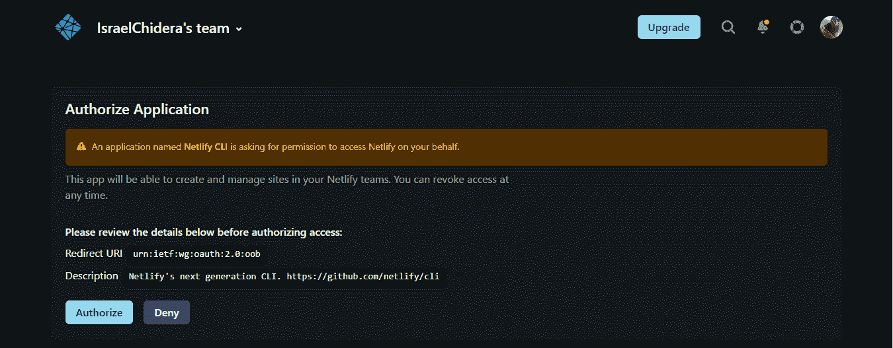
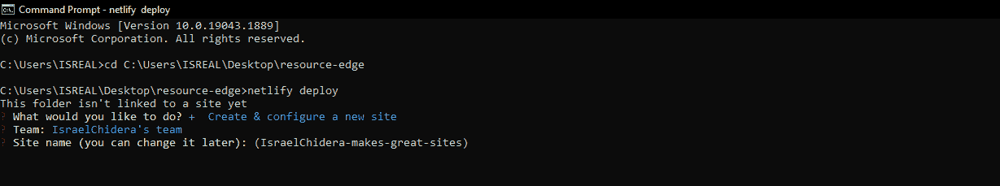
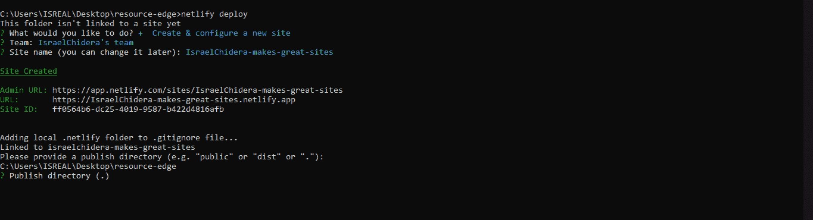

# 如何将 React 路由器应用程序部署到 Netlify 并修复“未找到页面”错误

> 原文：<https://www.freecodecamp.org/news/how-to-deploy-a-routed-react-app-to-netlify/>

当您尝试访问或刷新使用 React Router 的应用程序时，是否遇到过“找不到页面”错误？别担心，你不是一个人。

在本文中，您将学习如何部署一个使用 react-router 的 React 应用程序，而不会出现任何问题。

## 部署反应路由器应用程序的问题是

为了确保您的用户满意，您通常会在构建应用程序时优先考虑用户体验。良好的用户体验确保你的网站或应用程序易于理解，易于使用，易于导航。

如果您之前已经向 Netlify 发布了使用 React router 的 React 应用程序，您可能会注意到，在浏览您的路线时，当您刷新浏览器时，会出现一个错误( **page not found** )。这造成了糟糕的用户体验。

通过本文，您将了解如何通过 Netlify CLI 部署 React 应用程序，以及如何解决部署 react-router 应用程序的问题。

## 什么是 Netlify？

根据他们的文档“Netlify 是一个自动化现代网络项目的一体化平台”

Netlify 帮助 web 开发人员即时构建和部署他们的应用程序。这款便捷的工具取代了您的托管基础设施，有助于通过一个工作流促进您的持续集成和部署管道。它真的可以帮助你提高工作效率。

Netlify CLI(命令行界面)帮助您直接从命令行轻松构建、测试和部署应用程序。

它可以让您:

1.  在几秒钟内开始一个项目
2.  配置连续部署
3.  运行可以与其他开发人员共享的本地开发服务器
4.  全球部署您的项目

你可以用你的邮箱或 Git 账户注册一个 [Netlify 账户](http://netlify.app)。
如果你没有 Git 账户，你可以立即创建 GitHub、GitLab 或 bitbucket 账户。

因此，让我们看看如何使用 Netlify CLI 部署 react-router 应用程序。

## 如何通过 Netlify CLI 部署您的应用

要开始使用 Netlify 的 CLI，您必须在计算机上安装 Node.js。可以访问[这里](https://nodejs.org/en/download/)安装 Node.js。

然后，您可以使用以下命令开始安装 Netlify CLI:

```
npm install netlify-cli -g
```

现在您已经安装了 Netlify 的 CLI，您可以将您的应用程序部署到 Netlify。在此之前，您可能想要获得您的构建文件夹(我将在下面解释原因)。

要获取您的构建文件夹，请键入以下命令:

```
yarn run build
//or
npm run build
```

如果您之前没有登录到您的 Netlify 帐户，您可能会看到一个弹出窗口，要求获得访问 Netlify 的权限。



访问 Netlify CLI 后，您将得到一个提示，询问您想做什么。选择选项**创建并配置新站点**。您可以使用箭头键在选项之间导航。


您将获得提示，为您的应用程序选择团队和站点名称。您可以为您的应用程序输入您喜欢的名称，也可以使用默认名称，以后您可以更改该名称。



您将得到一个提示，询问要发布哪个目录。输入 **build** 作为您的部署文件夹，然后按 enter 键部署您的 React 应用程序。本教程开始时生成的构建文件夹将作为部署路径。



如果您得到的最终响应是**“如果您的草稿 URL 一切正常，请使用- prod 标志"**将它部署到您的主站点 URL 上”，那么您就在正确的轨道上。您将获得网站草稿 URL 以预览您的应用程序。

您可以通过运行以下命令部署到主站点:

```
netlify deploy --prod
```

太棒了。你现在有了你的网址。

## 如何修复“找不到页面”错误


page not found, netlify error

为了避免当您试图访问您的应用程序或在其他路线上时出现页面未找到错误，您必须为您的 react-router 应用程序设置一个重定向并重写规则。

重定向规则将帮助您的应用程序避免 404 错误。所有请求将被重定向到/index.html，而不是给出 404 错误。

要配置重定向规则，您必须在公用文件夹中创建一个扩展名不为(_redirects)的文件。

在 _redirects 文件中包含以下命令:

```
/*    /index.html  200
```

要查看应用程序中的更改，您必须使用以下命令再次部署它:

```
netlify deploy
```

## 结论

本文解释了如何使用 Netlify 的 CLI 部署 react-router 应用程序，并在访问您的路由时修复 page-not-found 错误。

我希望这篇文章对你有用。

继续建设，继续部署！