# 如何使用 Fast.io 在 3 分钟内从 Google Drive 免费部署一个静态网站

> 原文：<https://www.freecodecamp.org/news/how-to-deploy-a-static-website-for-free-in-only-3-minutes-with-google-drive/>

在这篇文章中，我将向您展示如何使用 Google Drive 或 Dropbox 这样的云存储服务，在短短 3 分钟内免费部署一个静态网站。

而且 no - fast.io 也没有付钱给我或者 freeCodeCamp 来创作这篇文章。我们和他们没有任何关系。我写这些是因为我发现他们的工具对于快速免费托管静态网站非常令人兴奋和有用。

*注:本教程中的信息现在已经过时，但本文留在这里留给后人。[这里有一些你可能会喜欢的](https://www.freecodecamp.org/news/search?query=static%20website)关于类似主题的有用文章。*

## 什么是 Fast.io？

Fast.io 是 Mediafire 创建的一个解决方案，旨在简化 web 的工作方式。简而言之，他们的目标是通过使网络更容易访问和管理来使你的生活更容易。

2019 年底上线，现在分享给大家。

## 它是如何工作的

当您使用 Fast.io 时，您将能够连接到您的云(Google Drive、DropBox 等。)，选择一个网站名称，然后只需点击几下鼠标即可部署您的内容。

如果你的内容准备好了，只需要 3 分钟就可以把你的内容放到网上，让每个人都可以访问。

一旦你的网站上线，你可以配置它，添加一个自定义域名，并连接谷歌分析，这样你就可以知道你有多少人。

我还没有提到这一点，但一旦你修改源文件，该服务会自动更新你的网站。例如，如果你正在使用 Google Drive 来分享你的内容，一旦你改变了 HTML 页面中的某些内容，它就会被更新。

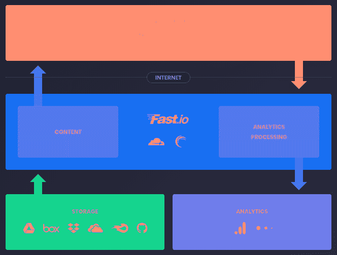

Fast.io - [How it works](https://fast.io/)

### 可用的存储提供商

如果我今天发布我的网站，以下是可用的存储提供商列表:

*   开源代码库
*   Dropbox
*   Google Drive
*   箱子
*   Mediafire
*   OneDrive

可以想象，随着新服务的增加，这个列表还会增加。但是即使是现在，你也有很多可能来托管你的静态网站。

## 竞争对手

已经有很多不同的公司允许你快速地在网上建立一个静态网站。最著名的解决方案是 GitHub Pages、Heroku 和 Netlify。

我不一定说 Fast.io 是最好的，但我喜欢部署一个基本网站的简单性。

快速提示:如果你想部署更复杂的东西——比如 Python Flask 网站——你不能用 Fast.io 来做，在这种情况下，我强烈推荐使用 Heroku。

正如我告诉你的，我将对你开诚布公。Fast.io 是针对某些任务的优秀服务。

## 什么是静态网站？

在向您展示如何部署您的网站之前，我认为有必要定义一下什么是静态网站以及它与动态网站的区别。

静态网站包含具有固定内容的网页。你的页面内容是 HTML 格式的，所有用户看到的都是一样的东西。

例如，当你想为你的网站设计一个登陆页面时，你可以使用这种类型的网站。

这和动态网站的主要区别当然是…动态部分！

当用户请求网站时，动态网站使用服务器技术来构建页面。

例如，您可以将这种类型的网站用于您的博客。每次你添加一篇新文章到你的数据库，网站都会显示出来。

## 是时候部署你的网站了

你准备好和大家分享你的页面了吗？我们开始吧！

在这一部分，我将告诉你如何点击几下鼠标就能把你的网站放到网上。我将使用一个基本的 HTML 页面，但是一旦你理解了 Fast.io 的工作原理，你就可以自由地修改一切了。

### 1)创建一个 index.html 文件

你需要用你的 HTML 代码创建一个 index.html 文件。我建议你从简单的开始，因为你可以随时更新它。

将文件保存在您的计算机上。

```
<!DOCTYPE html>
<html>
  <head>
    <title>My Static Website</title>
  </head>
  <body>
    <h1>My Static Website</h1>
    <p>
      Hello, I'm online, and everyone can see me!
    </p>
  </body>
</html>
```

Index.html example

### 2)打开 Fast.io 主页

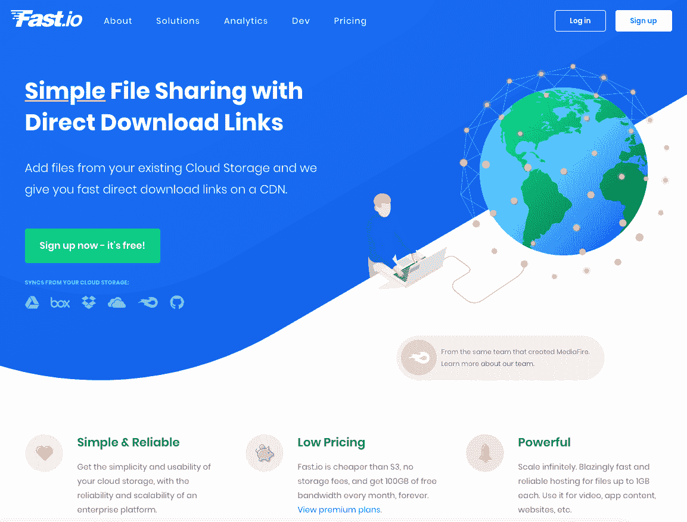

[Fast.io](https://fast.io) homepage

开始使用 Fast.io 需要做的就是打开网站。完成后，点击**“立即注册——这是免费的！”**。

### 3)配置 Google Drive

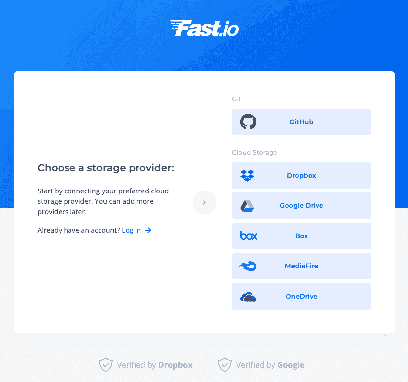

Fast.io - Storage provider

此页面在步骤 2 之后出现，允许您选择存储提供商。选择**“Google Drive”**。

如果您想与其他提供商一起创建网站，您可以稍后通过您的帐户页面进行添加。

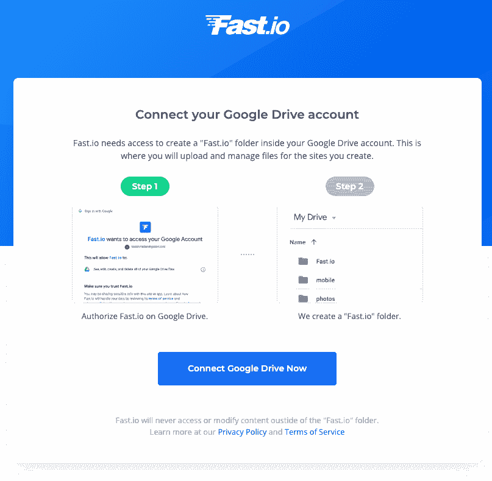

Fast.io - Connect Google Drive

Fast.io 需要访问你的 Google Drive 账户才能工作。他们将创建一个“Fast.io”文件夹来包含您的网站。点击**“立即连接 Google Drive”**。


Fast.io - Select your Google account

你需要**选择你的谷歌账户**与 Fast.io 链接。

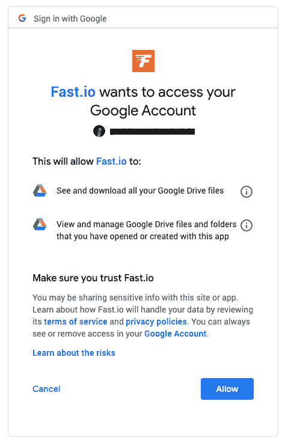

Fast.io - Allow Fast.io to access Google Drive

你需要**允许 Fast.io 访问你的谷歌账户**才能正确链接。

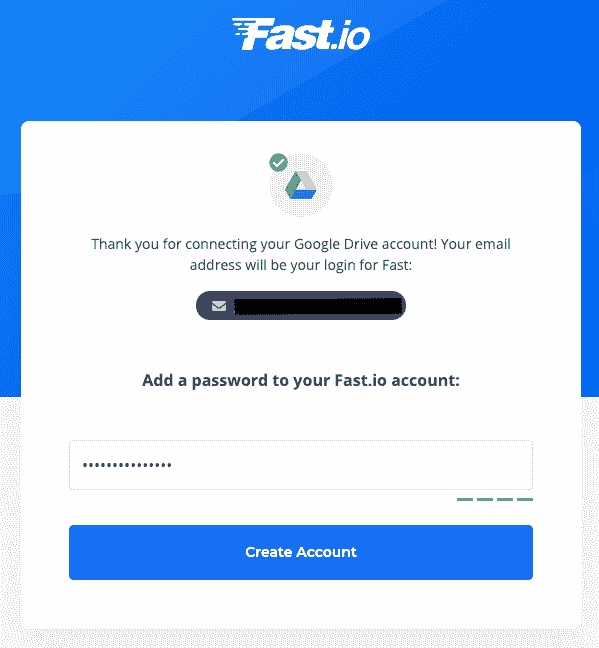

Fast.io - Create your account

您的帐户现在已经准备好了，所以只需选择一个密码，然后**点击“创建帐户”**。

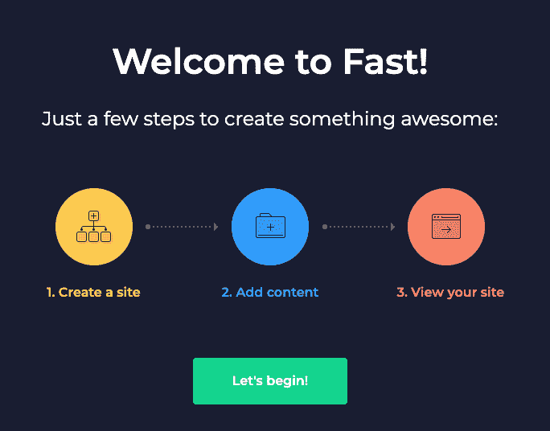

Fast.io - Welcome page

当你的帐户准备好了，一个“欢迎斋戒！”将出现页面。**点击“我们开始吧！”**。

### 4)创建你的网站

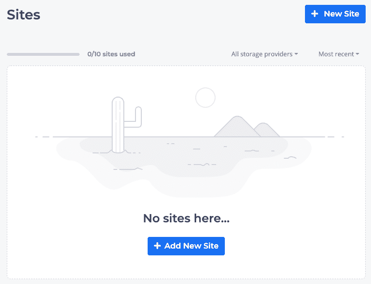

Fast.io - Dashboard

您已经准备好创建自己的网站并与大家分享了！**点击“添加新站点”**。

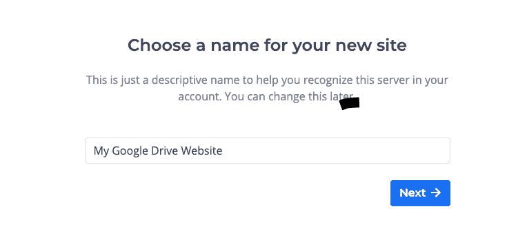

Fast.io - Choose a website name

**选择您的网站名称，并在输入框中输入**。完成后，**点击【下一步】**。

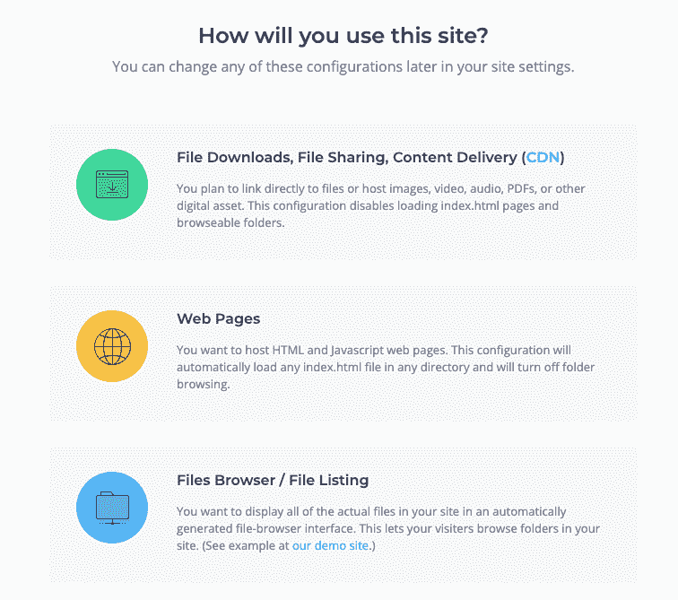

Fast.io - Choose a website type

Fast.io 允许您创建三种网站类型:文件共享网站、网页或文件浏览器网站。

在我们的例子中，我们将**选择“Web Pages”**,因为我们想要托管一个 HTML web 页面。

如果以后您想创建一个网站来共享一些文档，您必须返回到您的仪表板，创建一个新的，并选择文件下载。

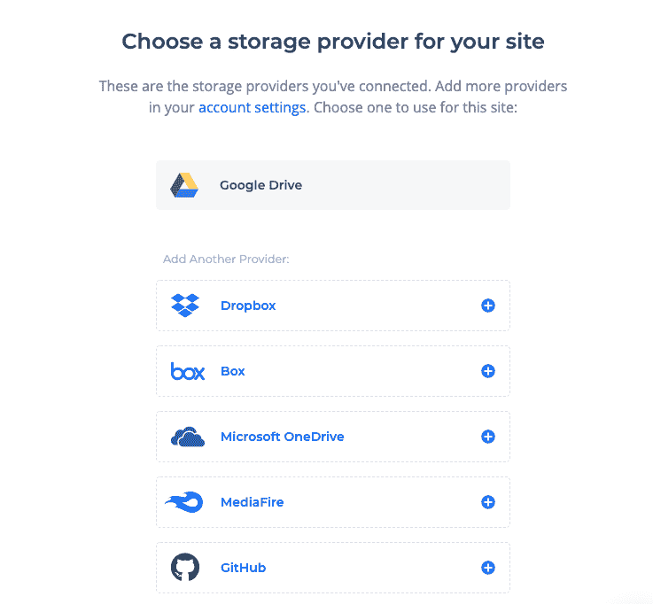

Fast.io - Choose a storage provider for your website

点击“网页”后，您需要选择您的存储提供商。**点击“Google Drive”**。

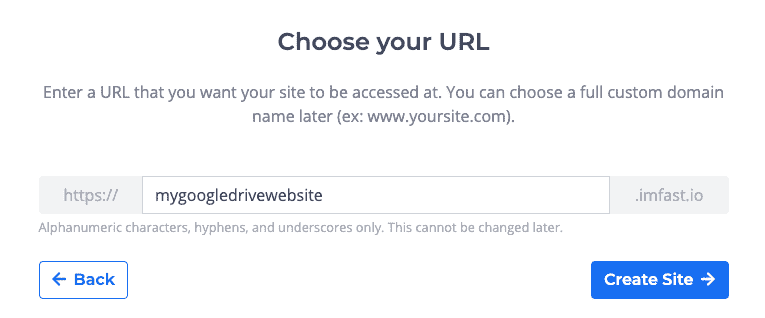

Fast.io - Choose your website URL

**选择您的网站 URL，并在输入框中输入**。完成后，**点击【创建站点】**。

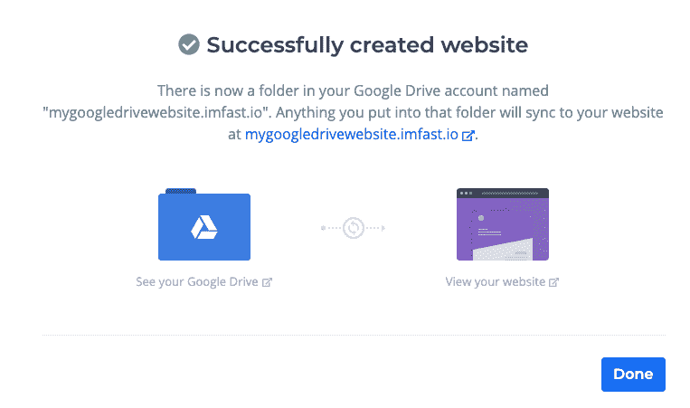

Fast.io - Successfully created website

你做到了！您的网站已上线，可通过您选择的 URL 访问。就我而言，你可以在[mygoogledrivewebsite . im fast . io](https://mygoogledrivewebsite.imfast.io)上找到我的网站

### 5)上传您的 index.html

如果你打开你的网站，你可能会注意到一个错误，因为你没有把你的 index.html 文件上传到你的 Google Drive 上。

这里有两种方法:

*   **打开你的 Google Drive，搜索 Fast.io 文件夹**，然后是你网站的文件夹(我的例子是“mygoogledrivewebsite.imfast.io”)。
*   在步骤 4 成功页面上，**点击“查看您的 Google Drive”**。

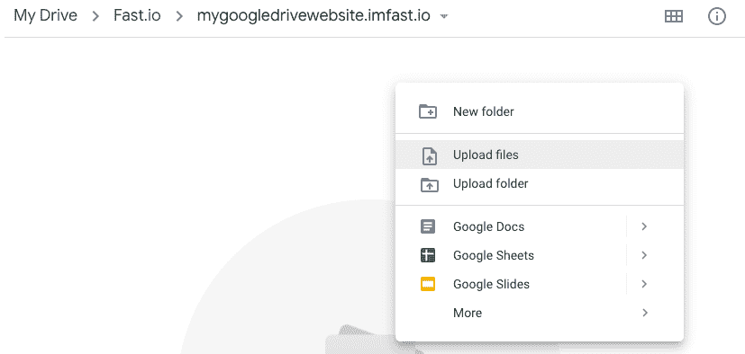

Fast.io - Google Drive before upload

完成后，**用鼠标右键单击并选择“上传文件”**。一个新窗口将会打开，**找到你的“index.html”文件——选择它**。

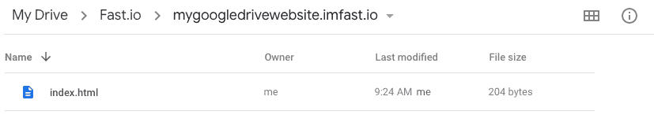

Fast.io - Google Drive after upload

在你的网站上出现改变之前等待一会儿。

### 6)庆祝！

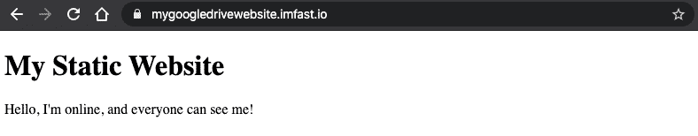

Fast.io - Website demo

把这个消息传播给你所有的朋友！您的网站是实时的，每个人都可以看到它！

？点击此处，在 Twitter 上分享吧！？

### 7)奖金

如果你很好奇，想配置一切，你可以回到你的仪表板，点击你的网站。

您将能够将您的网站链接到 Google Analytics(访问者统计)，更改您的域名(例如，mywebsite.com)，等等！

## 结论

你认为这项新服务怎么样？你觉得又快又容易吗？

如果你喜欢这篇文章，请随意分享。

如果你想要更多这样的内容，你可以[在 Twitter](https://twitter.com/gaelgthomas/) 上关注我，在那里我会发关于 web 开发、自我完善和我作为一个全栈开发人员的旅程的推文！