# 如何使用 Terraform 和 Github 操作部署 AWS 基础设施——多环境 CI/CD 指南

> 原文：<https://www.freecodecamp.org/news/how-to-deploy-aws-infrastructure-with-terraform-and-github-actions-a-practical-multi-environment-ci-cd-guide/>

最近一直在考虑开发一个完整的端到端的 greenfield DevOps 个人实验室项目。

术语“绿地软件项目”指的是一个新产品的系统开发，它需要从零开始开发，没有遗留代码。

当您从零开始并且没有约束或依赖时，可以使用这种方法。你有一个绝佳的机会从头开始构建解决方案。该项目对新的工具和架构开放。

我一直在互联网上寻找关于如何为地形化部署建立 CI/CD 管道的想法。但我找不到全面的端到端 terraform 部署说明。

我发现的大多数指南和博客文章都讨论了单一(生产)环境的部署管道。所以我选择建立我的个人实验室项目，并把它变成一篇博文。

在本文中，我将讨论从开发到生产环境的整个 Terraform 部署工作流。我也会提出我将在实验作业中用到的主题和技术。

我选择 Terraform 作为我的基础设施作为代码工具有两个原因。首先，我已经使用云形成很长时间了，并且有很多经验，所以我想获得一些关于 Terraform 的经验。

我选择 Terraform 的第二个原因是，这是一个 greenfield DevOps 项目，所以我可以选择一种现代技术来玩它。

在本文中，我将介绍 Terraform 的一些特性。让我们开始吧。

## 部署工具

在我们进入部署模式之前，我想先回顾一下我将使用的工具。

### 将（行星）地球化（以适合人类居住）

Terraform 是一个开源供应框架。这是一个跨平台的应用程序，可以在 Windows、Linux 和 macOS 上运行。

您可以通过三种方式使用 Terraform。

*   Terraform OSS(免费)
*   Terraform 云(付费 Saas 模式)
*   Terraform 企业(付费自助)

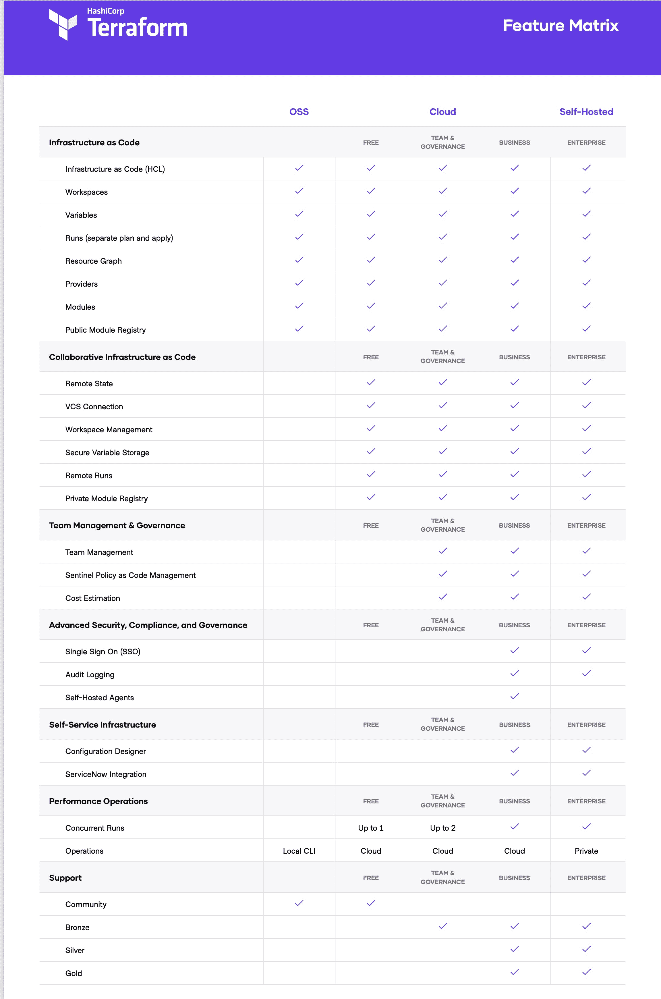

### 什么是 Terraform 云？

对于我的实验室项目，我正在利用 Terraform 云。Terraform OSS 对小团队来说是极好的，但是随着你的团队的扩大，管理 Terraform 的难度也在增加。HashiCorp 的 Terraform Cloud 是一款商业 SaaS 产品。

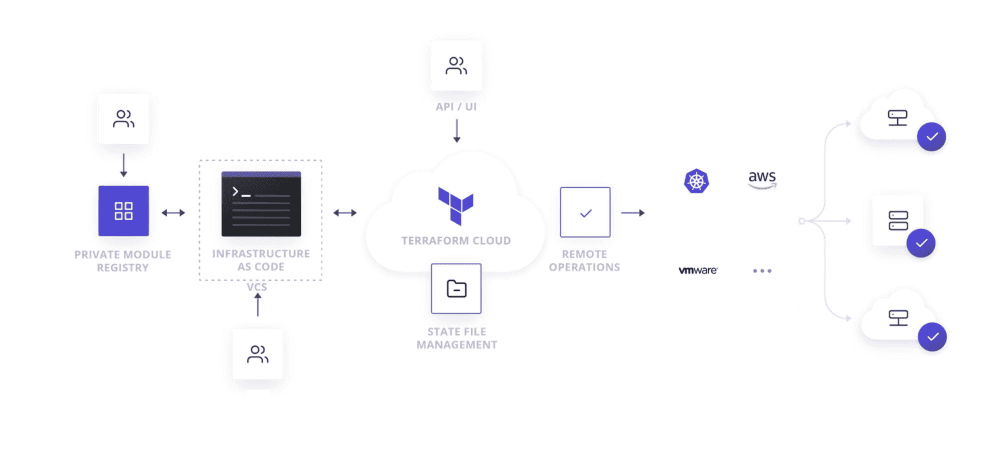

**Terraform 云产品**

*   团队的远程平台工作流程。
*   VCS 连接(GitHub、GitLab、Bitbucket)状态管理(存储、历史和锁定)
*   okta-集成单点登录(SSO ),具有完整的用户界面
*   Terraform Cloud 充当您的 Terraform state 的远程后端。
*   Terraform Cloud 整合了 Sentinel 策略即代码框架，可让您针对企业如何调配基础架构建立和实施特定策略。您可以限制计算虚拟机的数量，将重要升级限制在预定义的维护时间内，并执行各种其他任务。
*   Terraform Cloud 可以显示其整体成本的估计值，以及由建议的修改引起的任何成本变化。

### GitHub 操作(CI/CD)

您可以使用 Terraform CLI 或 Terraform 控制台从笔记本电脑部署基础架构。

如果你是一个团队成员，这可能会工作一段时间。但是这个策略不会随着你的团队规模的增长而扩展。您必须从每个人都具有可见性、控制和回滚能力的集中位置进行部署。

有许多技术可用于从集中位置(CI/CD)进行部署。我打算使用“GitOps”技术来尝试 Terraform 管道部署。

Git 存储库是 GitOps 中基础设施定义的唯一来源。对于所有的基础设施修改，GitOps 使用合并请求作为变更方法。当新代码被集成时，CI/CD 管道更新环境。GitOps 会自动覆盖任何配置偏差，例如手动修改或错误。

对于我的部署，我将使用 GitHub 操作。

GitHub Actions 让您在整个软件开发生命周期中自动化任务。GitHub 动作是事件驱动的，这意味着您可以运行一系列命令来响应特定的事件。

例如，您可以运行一个命令，在每次有人为存储库编写一个拉请求时执行测试脚本、计划脚本和应用脚本。这允许您将持续集成(CI)和持续部署(CD)功能，以及各种其他特性，直接合并到您的存储库中。

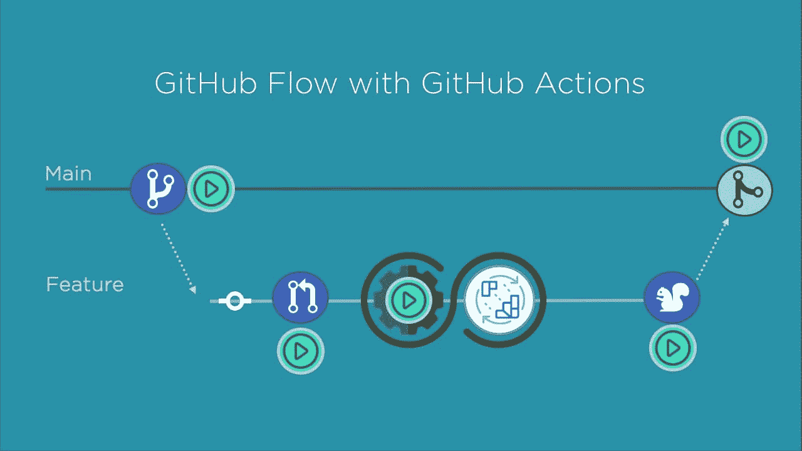

**Github 动作特性**

*   Github 动作完全集成到 Github 中，可以和其他与存储库相关的特性一起控制，比如 pull 请求和问题。
*   他们有 Docker 容器支持
*   Github Actions 对所有的库都是免费的，并且对所有的私有库每月有 2000 分钟的免费构建时间。

查看此[链接](https://docs.github.com/en/actions/learn-github-actions/understanding-github-actions)以获得 GitHub 上可用操作的更多信息。

到目前为止，我已经介绍了我将在部署管道中使用的工具和服务。现在我将研究 Terraform 目录结构。

总而言之，我将使用 Terraform Cloud 和 GitHub 操作。另一件需要注意的事情是，在本文中，我不会详细讨论如何编写 Terraform 代码。我将使用 Terraform 注册表中的代码。非常感谢你，安东·巴本科。

## 设置项目

假设您刚刚开始一项新工作，您的第一个任务是创建 VPCs。他们想让你为他们设置三个 VPC(开发->舞台->生产 VPC)。你已经决定使用 Terraform 来部署 VPC。

### 地形目录结构

您的第一步应该是创建 Terraform 的目录结构。如果您以前使用过云形成，您不需要建立目录结构，因为您不需要处理状态文件或模块。但是在使用 Terraform 时，定义目录结构是非常关键的。

首先，我将提供几个常用目录结构的示例，然后是关于我将在项目中使用的目录的信息。

**基本目录结构**

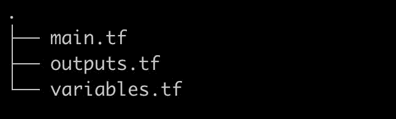

在这种安排下，您将有三个文件。您的主文件是 main.tf，这是定义所有资源的文件。

```
{
  resource "aws_vpc" "this" {

  cidr_block = var.cidr
 }
} 
```

variables.tf 是定义输入变量的地方:

```
variable "cidr" {
 description = "The CIDR block for the VPC"
 type        = string
 default     = "10.0.0.0/16"
} 
```

outputs.tf 输出值在该文件中定义:

```
output "vpc_id" {
  description = "The ID of the VPC"
  value       = concat(aws_vpc.this.*.id, [""])[0]
} 
```

如果你和一个小团队在做一个普通的项目，这种结构会很好。但是当您使用模块并在更大的项目上工作时，这种结构将不能伸缩。

### 复杂且可扩展的目录结构

您将无法使用基本目录结构来扩展您的项目或团队。

这个更大的项目需要多个栖息地和区域。您将需要一个合适的目录结构，以便使用 CI/CD 解决方案将基础设施从开发环境转移到生产环境。您可以在此结构中使用 Terraform 模块。

> 模块是可重用的 Terraform 配置，可以被其他配置调用和配置。

```
 ├── enviournments
│   ├── dev
│   │   ├── compute.tf
│   │   ├── dev.tfvars
│   │   ├── outputs.tf
│   │   ├── rds.tf
│   │   ├── s3.tf
│   │   ├── variables.tf
│   │   └── vpc.tf
│   ├── prod
│   │   ├── compute.tf
│   │   ├── outputs.tf
│   │   ├── prod.tfvars
│   │   ├── rds.tf
│   │   ├── s3.tf
│   │   ├── variables.tf
│   │   └── vpc.tf
│   └── stage
│       ├── compute.tf
│       ├── outputs.tf
│       ├── rds.tf
│       ├── s3.tf
│       ├── stage.tfvars
│       ├── variables.tf
│       └── vpc.tf
└── modules
    ├── compute
    │   ├── main.tf
    │   ├── outputs.tf
    │   └── variables.tf
    ├── rds
    │   ├── main.tf
    │   ├── outputs.tf
    │   └── variables.tf
    ├── s3
    │   ├── main.tf
    │   ├── outputs.tf
    │   └── variables.tf
    ├── security-group
    │   ├── main.tf
    │   ├── outputs.tf
    │   └── variables.tf
    └── vpc
        ├── main.tf
        ├── outputs.tf
        └── variables.tf 
```

我注意到很多项目使用这种结构。在这种情况下，每个环境的内容几乎是相同的。

但在我看来，所有环境中的内容应该是相同的。对于所有环境，我们应该使用相同的 main.tf 文件。变量可用于调整服务器数量或子网数量。

```
variable "instance_count" {
  description = "Numbers of servers count"
}

variable "instance_type" {
  description = "Instance Size (t2.micro,t2.large"
} 
```

**提议的目录结构**

像我在上一节中描述的那样，拥有单独的文件夹和单独的配置文件没有什么意义。如果您认为每个设置使用不同的文件夹有好处，您可以联系我们。

因此，下面是我为 VPC 部署建议的目录布局。

github.com/nitheesh86/network-vpc VPC

安全组:github.com/nitheesh86/network-sg

计算机-github.com/nitheesh86/compute-asg ASG

您可能想知道如何从多个存储库中引用资源。这就是 Terraform cloud workspace 派上用场的地方。我将在本文后面更详细地介绍这一点。

如果您查看上面的目录，您可能会认为它看起来像一个“基本目录结构”您可能还会问模块目录在哪里。是的，目录看起来是一样的，但是神奇的事情发生在配置文件中。

```
terraform {
  required_version = "~> 0.12"
  backend "remote" {
    hostname     = "app.terraform.io"
    organization = "xxxxxxxx"
    workspaces { prefix = "vpc-" }
  }
}

provider "aws" {
  region = "ap-south-1"
}

module "vpc" {
  source = "github.com/nitheesh86/terraform-modules/modules/vpc"

  name = var.name
  cidr = "10.0.0.0/16"

  azs             = ["ap-south-1a", "ap-south-1b", "ap-south-1c"]
  public_subnets  = ["10.0.101.0/24", "10.0.102.0/24", "10.0.103.0/24"]
  private_subnets = ["10.0.1.0/24", "10.0.2.0/24", "10.0.3.0/24"]

  enable_nat_gateway = true
  enable_vpn_gateway = true

  tags = {
    Terraform   = "true"
    Environment = var.env
  }
} 
```

我将模块与设置分开维护。我的模块都放在一个单独的存储库中。我将通过该模块的 Git repo URL 来引用它。

> 模块块中的 source 参数告诉 Terraform 在哪里可以找到所需子模块的源代码。

Terraform 支持以下模块中的源:

*   本地路径
*   地形注册表
*   开源代码库
*   Bitbucket
*   通用 Git、Mercurial 存储库
*   HTTP URLs
*   S3 水桶
*   GCS 桶

我们可以使用 Terraform 注册表作为模块源，因为我们使用的是 Terraform Cloud。然而，每个模块都需要自己的 git 存储库。例如，如果您正在发布 vpc 模块(terraform-aws-vpc ),那么您只能为那些与模块相关的 vpc 资源提供代码。安全组模块(terraform-aws-sg)需要另一个 repo。

> 每个存储库一个模块。注册表不能使用具有多个模块的组合存储库。

但是，如果您的组织有单独的网络、安全和计算团队，则值得考虑这种结构。每个团队可以独立处理他们的模块。

## 地形云组件

### 组织

在 Terraform Cloud 中，组织是团队在工作空间中协作的共享场所。组织之间可以共享远程状态设置。

例如，您可以根据一个项目或一种产品建立公司。就像如果你试图创造一个苹果产品，你可以把它命名为“苹果”“nitheeshp”是我给我的项目取的名字。

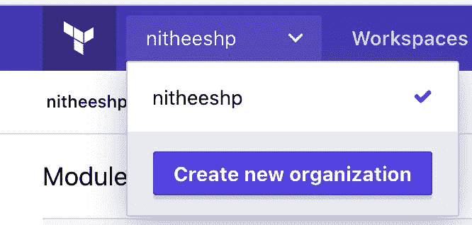

### 工作区

Terraform Cloud 使用工作区来维护基础架构集合，而不是目录。工作区与开发、试运行和生产等上下文相关。

与环境相关的地形配置、变量值和状态文件都存储在工作空间中。每个工作区都保留早期状态文件的备份。

在我的项目中，我为每个 Amazon Web Services 服务设置了一个工作区。每个工作区都可以链接到一个 Git 分支或 Git repo。

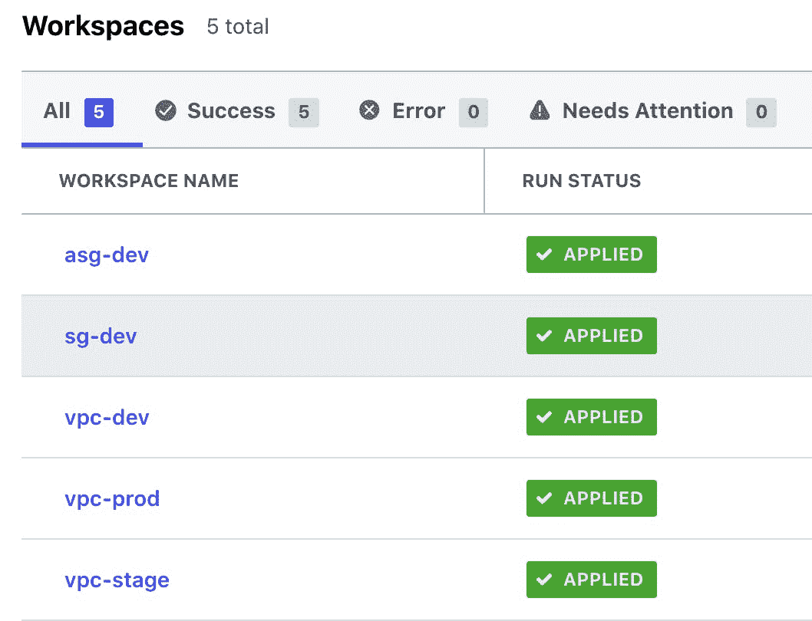

创建工作空间时，您有三种选择来设计 Terraform 工作流:

*   版本控制工作流
*   CLI 驱动的工作流
*   API 驱动的工作流

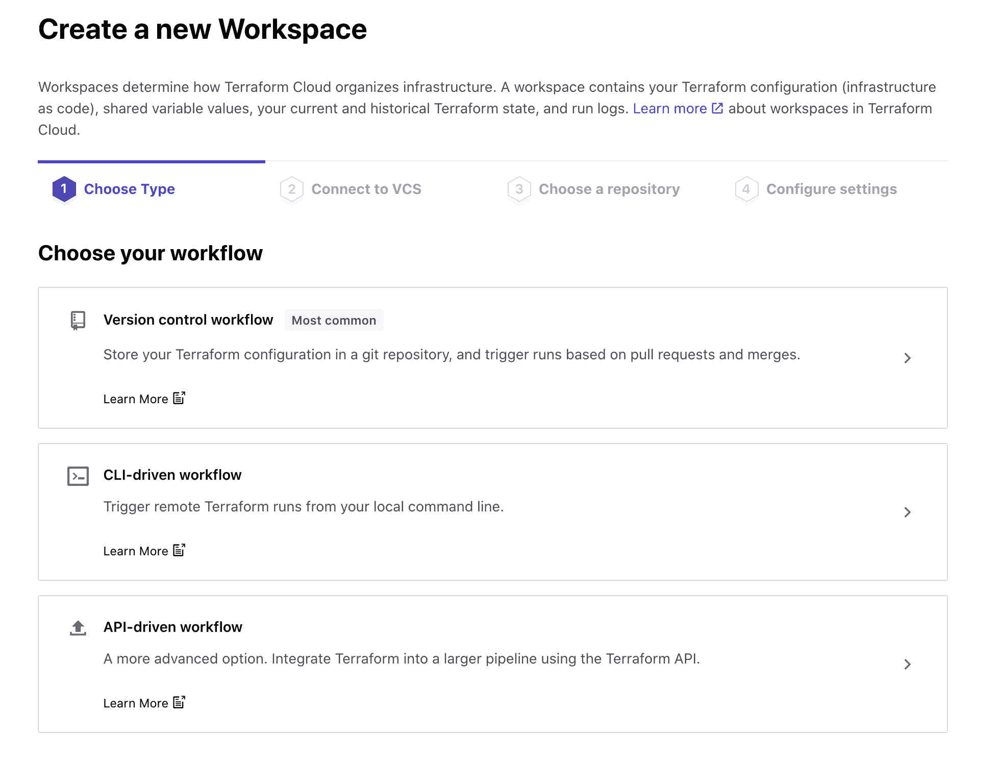

如果你看下面我的 Terraform 目录结构，你会注意到我没有为我的变量设置任何默认值。变量已在 Terraform 工作空间设置中关联。

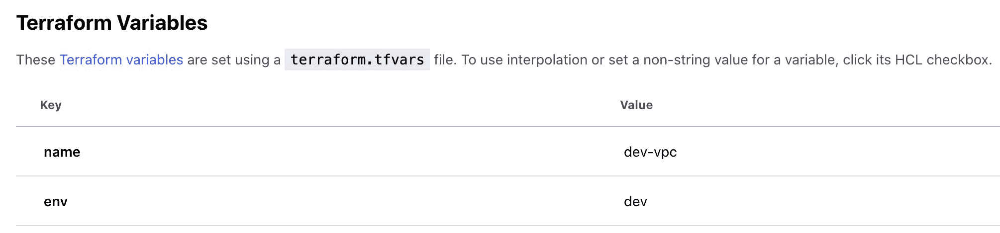

如果您查看 main.tf，您会注意到所有环境都使用相同的 Terraform cloud-config。你可能对我如何着手修改某个工作空间感到好奇。我使用的是工作区前缀。

```
terraform {
  required_version = "~> 0.12"
  backend "remote" {
    hostname     = "app.terraform.io"
    organization = "nitheeshp"
    workspaces { prefix = "vpc-" }
  }
} 
```

当您将工作空间添加到配置中时，它会提示您选择一个工作空间。举个例子:

```
$ terraform init

Initializing the backend...

Successfully configured the backend "remote"! Terraform will automatically
use this backend unless the backend configuration changes.

The currently selected workspace (default) does not exist.
  This is expected behaviour when the selected workspace did not have an
  existing non-empty state. Please enter a number to select a workspace:

  1\. dev
  2\. stage
  3\. prod

  Enter a value: 
```

将 TF WORKSPACE 环境变量设置为在 CI/CD 中使用 Terraform 时要选择的工作空间名称。

```
export TF_WORKSPACE="dev"` 
```

### 如何部署安全组

如前所述，我使用单独的 repo 和工作区部署安全组。部署安全组需要 VPC id。这就是 Terraform 数据源的用武之地。

> 数据源允许提取或计算数据，用于 Terraform 配置中的其他地方。数据源的使用允许 Terraform 配置利用在 Terraform 外部定义的信息，或者由另一个单独的 Terraform 配置定义的信息。

```
data "terraform_remote_state" "vpc" {
  backend = "remote"

  config = {
    organization = "nitheeshp"
    workspaces = {
     name = "vpc-${var.env}"
    }
  }
}

provider "aws" {
  region = "ap-south-1"
}

module "elb_sg" {
  source = "terraform-aws-modules/security-group/aws"

  name        = "${var.env}-elb-sg"
  description = "elb security group."
  vpc_id      = data.terraform_remote_state.vpc.outputs.vpc_id

  egress_with_cidr_blocks = [
    {
      from_port   = 0
      to_port     = 65535
      protocol    = "all"
      description = "Open internet"
      cidr_blocks = "0.0.0.0/0"
    }
  ] 
```

如您所见，我正在从 vpc-dev 工作区获取 VPC id。

```
vpc_id      = data.terraform_remote_state.vpc.outputs.vpc_id 
```

### GitHub 操作

如上所述，我们还将在部署管道中使用 GitHub 动作。

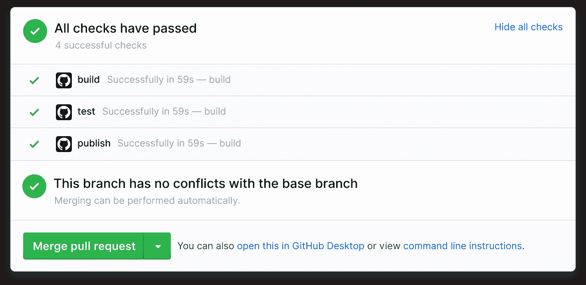

GitHub Actions 简化了所有 CI/CD 工作流程的自动化。您可以直接从 GitHub 存储库中构建、测试和部署代码。您还可以按照您希望的方式进行代码审查、分支管理和问题分类。Github Actions 提供免费计划。

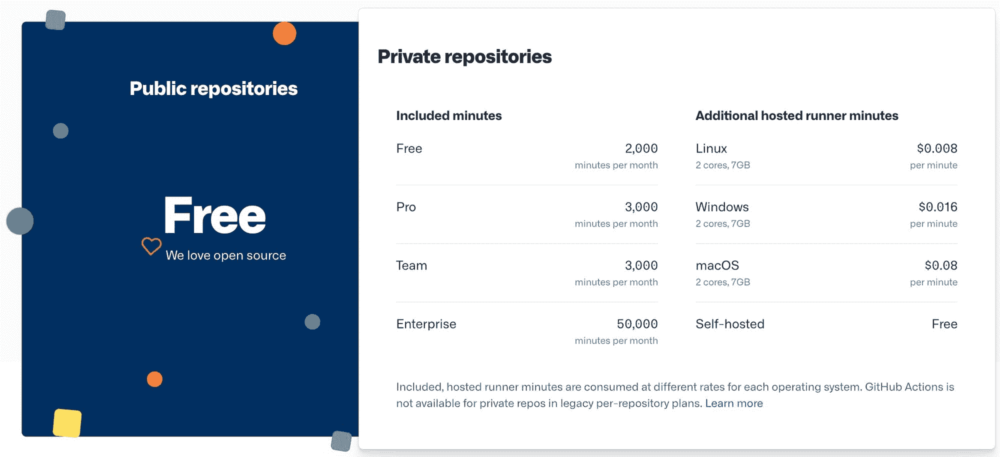

## GitOps 和 Terraform 工作流

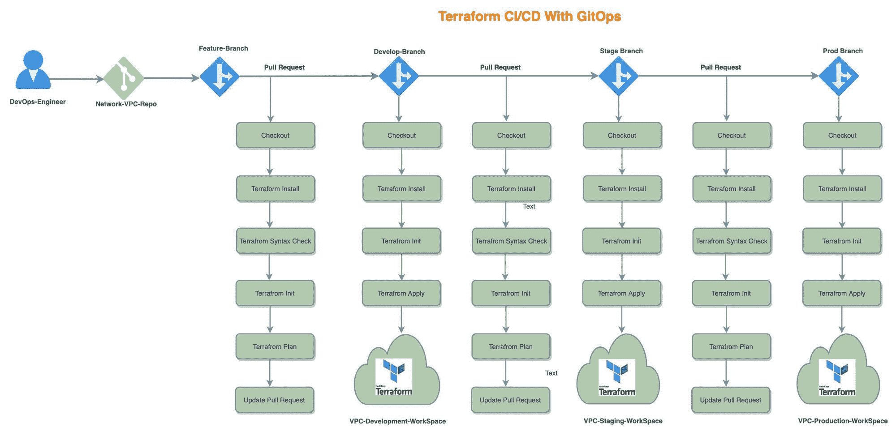

*   每个服务都有自己的存储库(网络 VPC、网络安全组、计算 ASG、计算 EC2)
*   我做了三个分支(开发、阶段和产品)。每个分支都反映了我们的一个实际基础设施环境或工作场所平台。
*   当开发运维工程师开始对基础架构进行修改时，工作流就开始了。
*   DevOps 工程师从主(生产)分支开发一个特性分支
*   进行更改，并向分支机构的开发团队提交一个拉取请求。

我为每个分支做了单独的工作流程(terraform-develop.yml，terraform-stage.yml，terraform-prod.yml)。工作流是您添加到存储库中的过程。

工作流由一个或多个可由事件计划或触发的作业组成。您可以使用工作流来创建、测试、打包、发布或部署 GitHub 项目。

GitWorkFlow 将:

*   检出特征分支代码。
*   检查语法。
*   初始化 Terraform。
*   为每个拉取请求生成一个计划。
*   当 pull 请求与 develop 分支合并时，它将资源部署到开发环境中。
*   部署变更开发分支。
*   再次创建拉取请求以暂存分支，同样创建拉取请求以生产分支。

如果你想看的话，下面是这个项目的 GitHub repos:

*   github.com/nitheesh86/network-vpc
*   github.com/nitheesh86/network-sg
*   github.com/nitheesh86/terraform-modules

我很想更多地了解你们的地形部署方法。如果你想分享它们并进一步讨论，请与我联系。