# 如何使用 Render 免费部署 Node.js 应用程序

> 原文：<https://www.freecodecamp.org/news/how-to-deploy-nodejs-application-with-render/>

多年来，Heroku 一直是托管您的全栈应用程序的优秀平台。freeCodeCamp 在早期大量使用 Heroku 就像无数开源项目一样。

但这可能会改变，因为 Heroku 正在结束其慷慨的免费等级。

您可能已经收到 Heroku 的电子邮件，通知您从 2022 年 11 月 28 日开始，您将无法在平台上免费托管任何应用程序，您现在需要购买付费计划。


如果你想免费托管静态网站或网络应用，你可能会使用我在[这篇文章](https://www.freecodecamp.org/news/how-to-deploy-react-router-based-app-to-netlify/)中解释的 [Netlify](https://www.netlify.com/) ，但对于后端应用。也就是说，没有多少免费平台能像 Heroku 一样提供同样的感觉和部署便利性。

因此在本文中，我们将学习如何在 [Render](https://render.com/) 上部署带有 Express server 的 Node.js 应用程序。它是 Heroku 的免费替代品，具有类似的简单部署过程。

所以让我们开始吧。

## 部署应用程序之前要做什么

从您使用 Heroku 的经验中，您可能知道，部署的每个应用程序都运行在 Heroku 随机分配的特定端口上。您可以使用`process.env.PORT`变量来访问它。

渲染平台也是如此。

因此，您需要确保不是为启动 Express 服务器提供硬编码的端口值，而是像这样使用`process.env.PORT`变量:

```
const express = require("express");
const app = express();
const PORT = process.env.PORT || 3030;

// your code

app.listen(PORT, () => {
  console.log(`server started on port ${PORT}`);
}); 
```

## **如何从 GitHub 存储库部署应用程序进行渲染**

现在，一旦完成了与端口相关的更改，就该部署应用程序了。

我已经有了[这个 GitHub 库](https://github.com/myogeshchavan97/github-repos-nodejs-api)，我将部署它进行渲染。这个 GitHub 存储库代码只是以 JSON 格式显示了排名靠前的存储库列表和每个存储库的星号。

所以让我们开始吧。

[Render](https://render.com/) 提供多种报名方式，如下图所示:


注册并登录到您的帐户后，您将看到一个如下所示的控制面板:

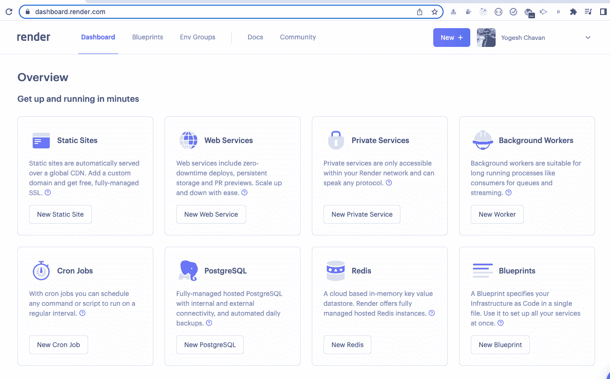

要部署 Node.js 应用程序，单击`Web Services`选项下的`New Web Service`按钮。

您也可以点击显示在您的个人资料图片前面的标题中的`New +`按钮，并选择`Web Service`选项。

单击后，您将看到以下屏幕:

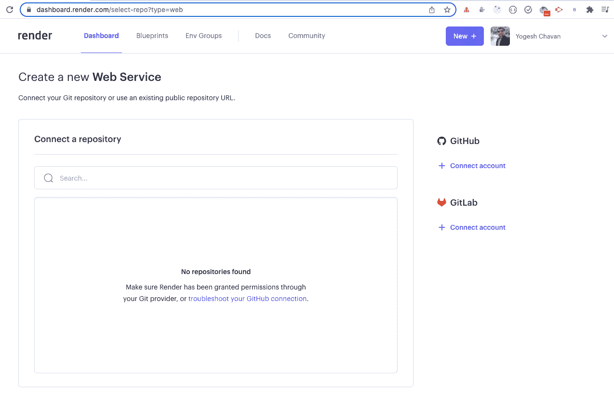

点击 GitHub 菜单下右侧显示的`Connect account`按钮。单击后，您将看到以下屏幕:

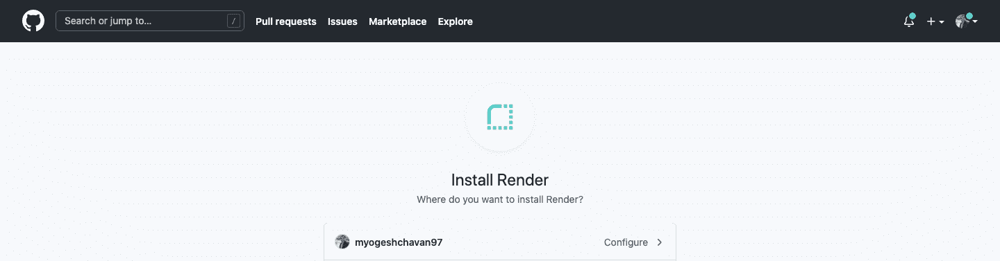

点击`Configure`链接，您可以允许选择您所有的 GitHub 存储库或者只选择选定的存储库。

我喜欢只允许访问我当前需要部署的选定存储库。所以我选择了`Only select repositories`选项。

接下来，点击选项下方显示的`Select repositories`按钮，并选择您想要部署的 GitHub 存储库。

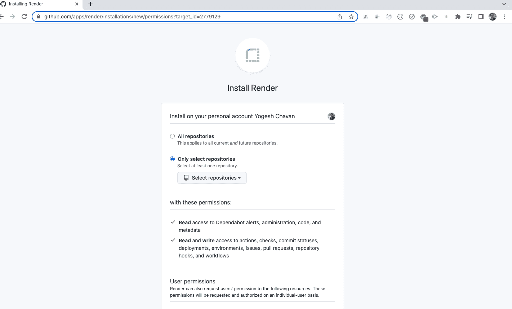

选择后，您将看到以下屏幕显示所选的存储库。

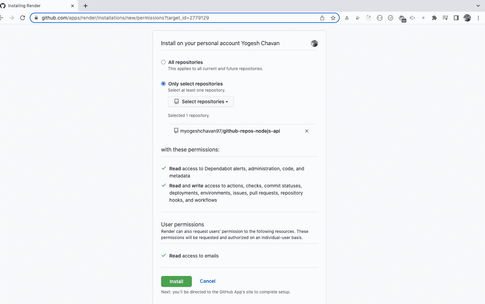

单击绿色的`Install`按钮，让渲染网站访问所选的存储库。

单击后，您将被重定向到您的控制面板，在那里您将看到您选择的存储库，如下所示:

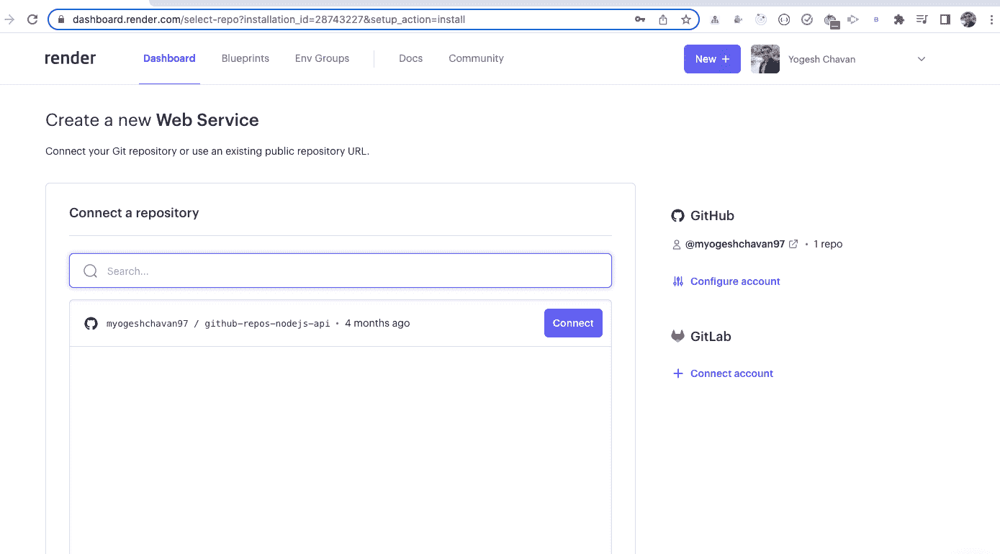

现在，点击`Connect`按钮，您将看到以下屏幕:

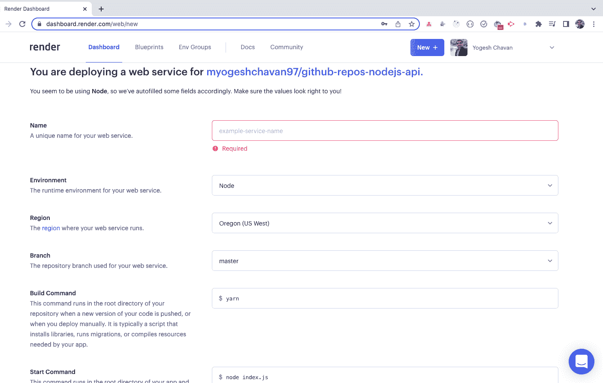

在这里，对于`Name`字段，输入一个简短的名称来标识您的网站。

**注意:**保持`Name`值简单，因为一旦应用程序被部署，它将成为您的应用程序 URL。因此，如果我输入`github-repos`作为`Name`的值，我的应用程序 URL 将变成 [`https://github-repos.onrender.com`](https://github-repos.onrender.com) 。

因此，请确保为`Name`输入一个简短且有意义的值。

输入如下所示的详细信息:

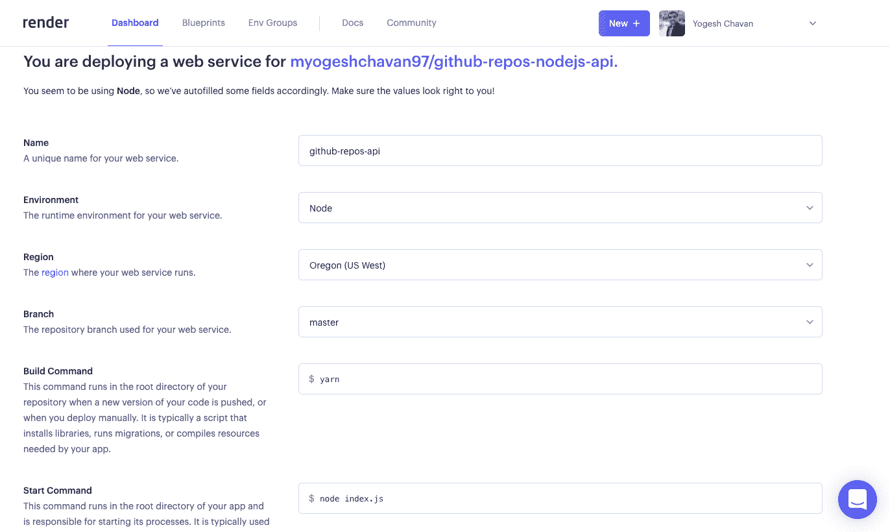

对于`Build Command`,输入`yarn`作为值，相当于`yarn install`命令。Yarn 是一个类似于 npm 但是比 npm 更快的包管理器。

对于`Start Command`，输入`node index.js`作为值，如果你的输入文件是`index.js`。

输入所有详细信息后，向下滚动，您将看到`Plans`部分，您的免费计划将被自动选择。如果未选择，您需要选择它，因为我们将免费部署该应用程序。

如果你再向下滚动一点，你会看到一个`Advanced`按钮。

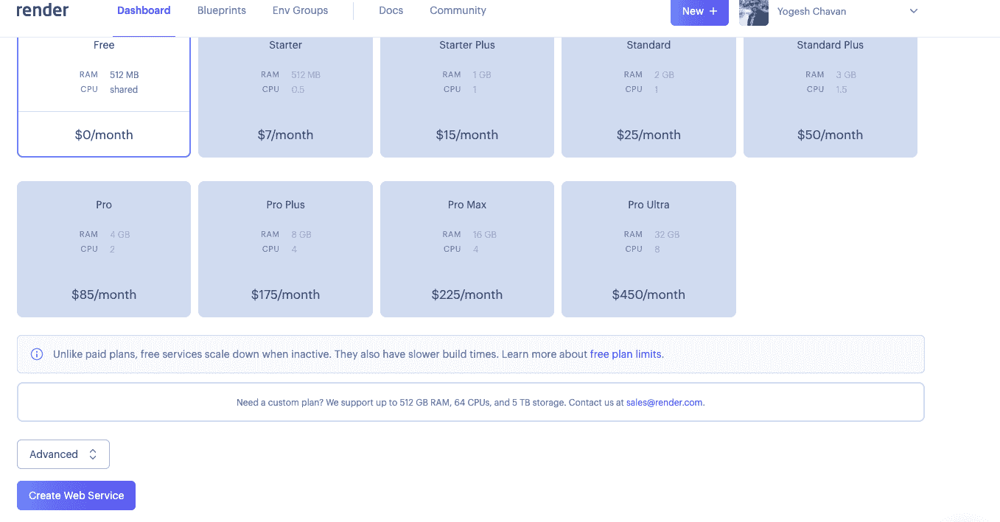

如果您的应用程序正在使用任何环境变量，您可以在如下所示的`Advanced`设置中输入它们。你也可以添加你的`.env`文件，这样你就不需要一个一个手动输入了。

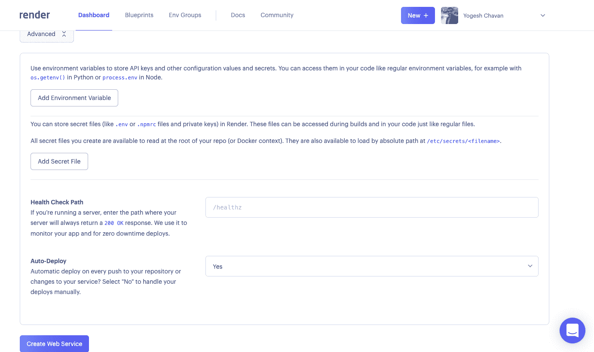

注意，`Auto-Deploy`字段有默认值`Yes`——所以一旦您将代码更改推送到 GitHub 存储库，它们将被自动部署来呈现。

如果您不想在每一个推送到 GitHub 库的代码变更上自动部署您的变更，您可以从`Auto-Deploy`下拉列表中选择`No`值。

现在，您可以单击`Create Web Service`按钮开始部署过程。

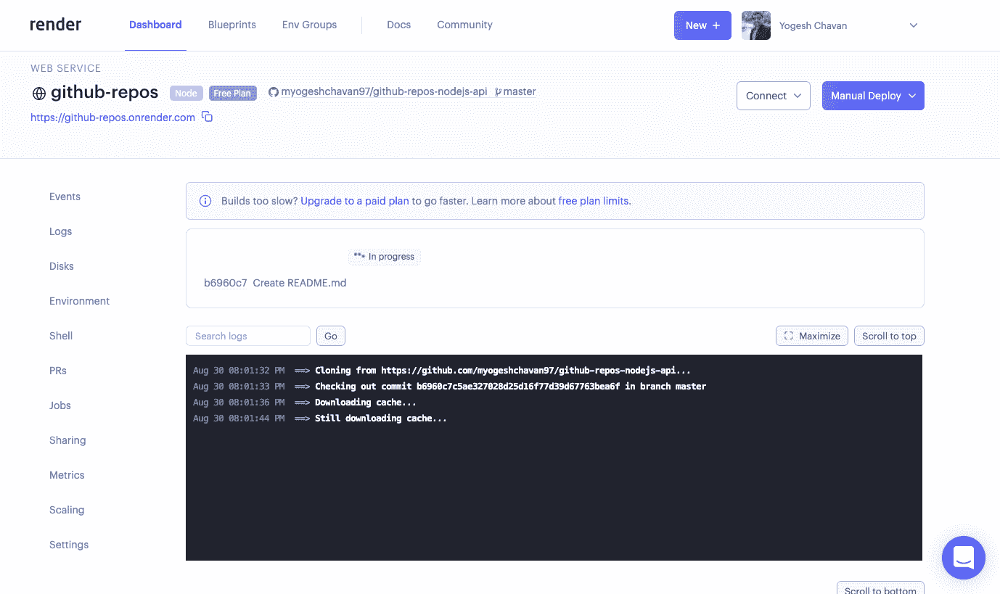

等待一段时间，直到部署正在进行。有时，如果你长时间看到“进行中”，你可能需要刷新页面。

部署完成后，您将看到您的应用程序已部署`Live`，如下所示:

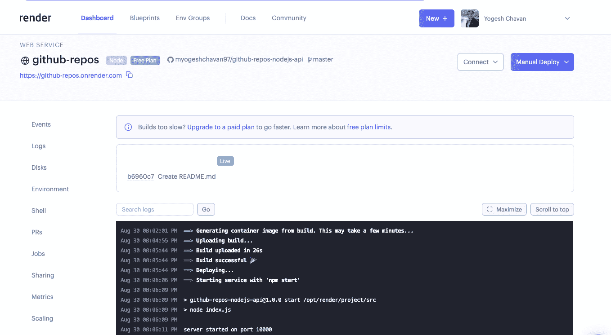

您可以单击显示在顶部的已部署应用程序 URL，如上面的屏幕截图所示。在我的例子中，应用程序 URL 是[https://github-repos.onrender.com/](https://github-repos.onrender.com/)。

当您第一次部署应用程序时，当您试图访问您部署的站点时，您可能会看到一个`Page is not working`错误。

稍等片刻，使用`Ctrl + R`或`Cmd + R(Mac)`持续刷新页面。有时渲染平台需要一些时间来启动应用程序，因为我们使用的是硬件有限的免费服务。

部署后，您将看到部署的应用程序，如下所示。

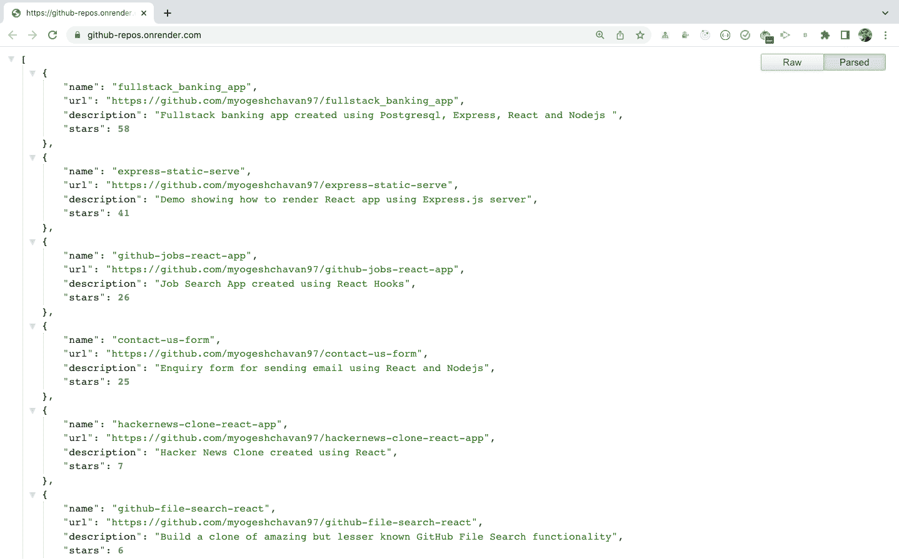

**提示:**要查看上面格式化的 JSON，你可以安装 [JSON 格式化器](https://chrome.google.com/webstore/detail/json-formatter/bcjindcccaagfpapjjmafapmmgkkhgoa?hl=en) Chrome 扩展。

正如你可能知道的，当使用 Heroku 的免费帐户时，如果没有应用程序的请求，你的应用程序每 30 分钟就会进入睡眠模式。这意味着在下一个请求到来时，加载应用程序需要一些时间。

同样，在渲染的情况下，如果没有对应用程序的请求，您的应用程序将在 15 分钟后进入睡眠模式。

### **感谢阅读！**

您可以在[这个库](https://github.com/myogeshchavan97/github-repos-nodejs-api)中找到已部署应用程序的完整 GitHub 源代码。

****这里可以看到部署应用[的现场演示。](https://github-repos.onrender.com/)****

如果你想从头开始详细学习 Redux，并与[完整的点餐应用](https://www.youtube.com/watch?v=2zaPDfCKAvM)一起构建 3 个应用，请查看我的[掌握 Redux](https://master-redux.yogeshchavan.dev/) 课程。

在本课程中，您将学到:

*   基本和高级冗余
*   如何管理数组和对象的复杂状态
*   如何使用多个减速器管理复杂的冗余状态
*   如何调试 Redux 应用程序
*   如何在 React 中使用 Redux 使用 react-redux 库让你的 app 反应性。
*   如何使用 redux-thunk 库处理异步 API 调用
*   使用 Redux 构建 3 个不同的应用程序

还有更多。

最后，我们将从头开始构建一个完整的[订餐应用](https://www.youtube.com/watch?v=2zaPDfCKAvM)，集成 stripe 以接受支付，并将其部署到生产中。

****想要了解关于 JavaScript、React、Node.js 的最新常规内容吗？[在 LinkedIn 上关注我](https://www.linkedin.com/in/yogesh-chavan97/)。****