# 如何将基于 React 路由器的应用程序部署到网络

> 原文：<https://www.freecodecamp.org/news/how-to-deploy-react-router-based-app-to-netlify/>

在本文中，我们将了解将 React 应用程序部署到 Netlify 的最流行的方法。我们还将了解部署基于路由的 React 应用程序所需的配置更改。

我喜欢 Netlify 的一点是它免费提供了许多有用的功能
,比如:

*   一种在几秒钟内部署静态网站的方法
*   持续部署，这意味着当您连接您的 Github/Gitlab/Bitbucket 存储库时，它会在新的提交被推送到存储库时自动触发部署
*   确保您的网站永不宕机，即使在新部署期间也是如此
*   只需一次点击，您就可以轻松地回滚到您站点的任何以前的工作版本
*   可让您快速预览任何先前部署的应用程序版本
*   立即更改您站点的域或子域

还有更多。

因此，让我们看看如何将 React 应用程序部署到 Netlify。

> 想从绝对开始学 Redux，从零开始打造一款订餐 app？查看[掌握 Redux](https://master-redux.yogeshchavan.dev/) 课程。

## 在 Netlify 中拖放构建文件夹

部署 React 应用程序的最快和最简单的方法就是在 Netlify 中拖放构建文件夹。

要创建构建文件夹，只需从项目文件夹的命令行执行`npm run build`或`yarn build`命令。

一旦创建了构建文件夹，您只需将该文件夹拖放到`sites`菜单下的拖放区，如下所示:

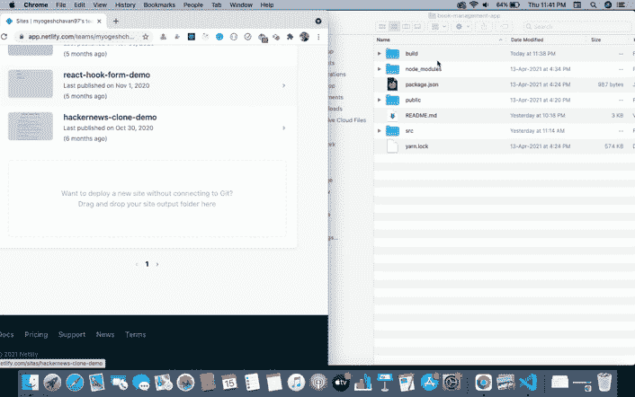

## 如何从 GitHub 存储库将应用程序部署到 Netlify

这是我最喜欢的在 Netlify 上部署应用程序的方式。

因为每当您将任何更改推送到 GitHub 存储库时，它都会自动部署到 Netlify。您还可以看到所有已部署的版本，只需轻轻一点，就可以轻松地回滚到任何先前工作的代码版本。

如果你已经有了一个推送到 GitHub 的存储库，那么你只需要连接它。

登录您的 Netlify 帐户。在仪表板中，点击`New site from Git`按钮。

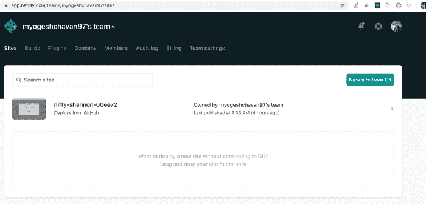

点击`GitHub`按钮连接你的 GitHub 库。

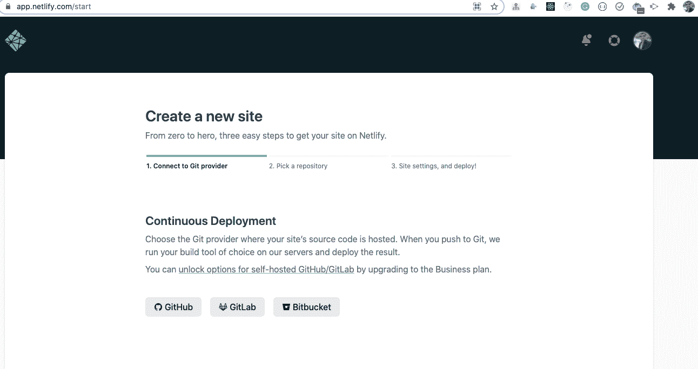

它将打开一个新标签。确保浏览器中启用了弹出窗口。

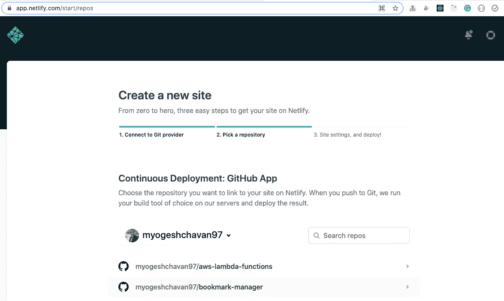

在`Search repos`搜索框中搜索 GitHub 库。如果您的存储库没有显示，请单击页面底部的`Configure the Netlify app on GitHub`按钮。

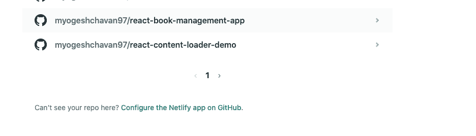

单击后，向下滚动页面，单击`Select repositories`下拉菜单，搜索您的存储库，然后单击`Save`按钮。

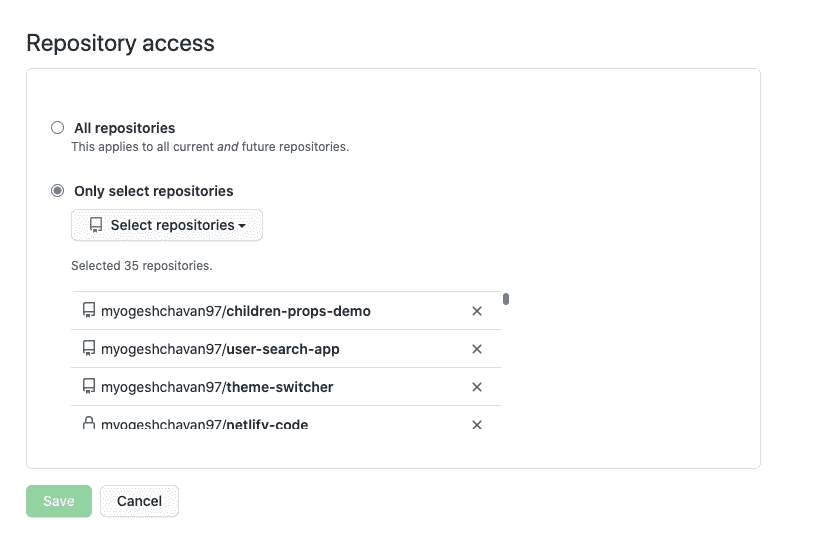

您将被重定向到显示所有可用存储库的上一页。

搜索要部署的存储库。对于本文，我选择了我们在我的[上一篇文章](https://www.freecodecamp.org/news/react-crud-app-how-to-create-a-book-management-app-from-scratch/)中创建的[react-book-management-app](https://github.com/myogeshchavan97/react-book-management-app)存储库。

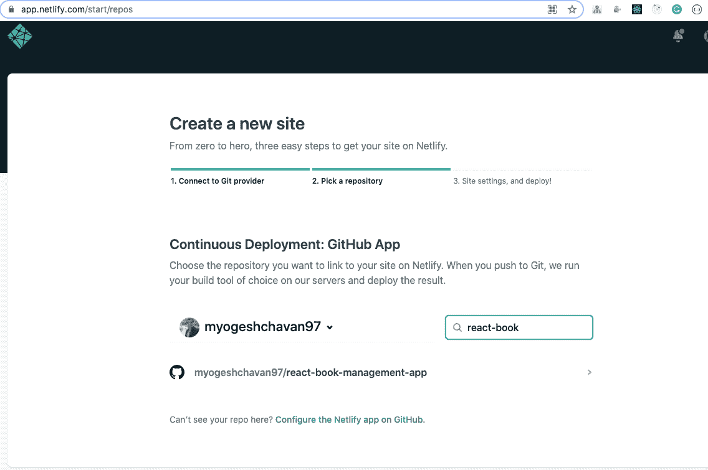

选择存储库后，您将看到以下屏幕:

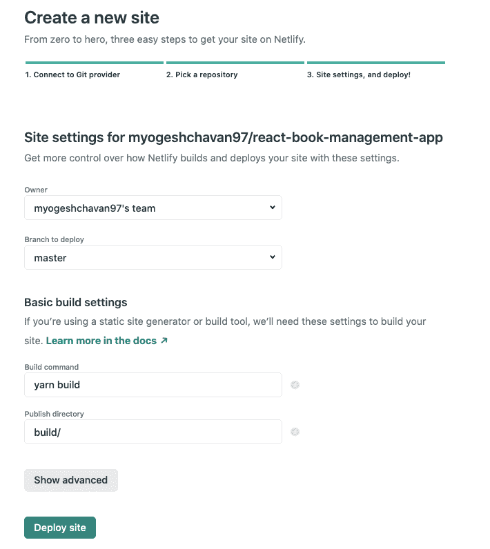

对于这个应用程序，我们不需要做任何改变。

您的`Build command`和`Publish directory`将被自动填充。如果您在`package.json`中有不同的命令来构建您的应用程序，请确保输入这些字段，否则这些字段不会自动填充。

现在，点击`Deploy site`按钮。点击后，您将看到`Site deploy in progress`消息。

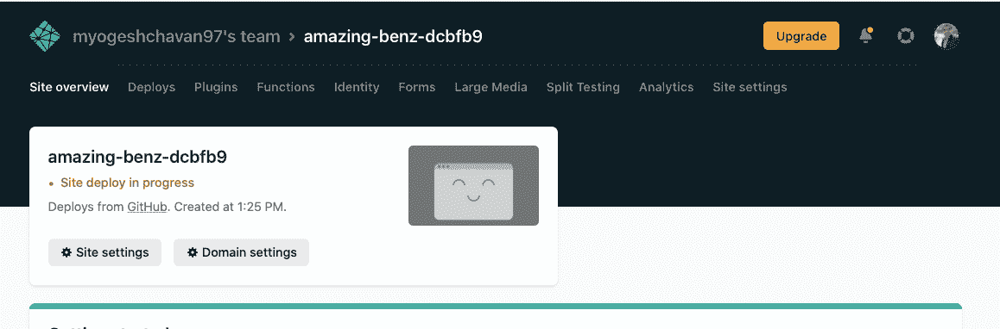

它展开的时候你得等一会儿。部署完成后，您将看到以下屏幕:

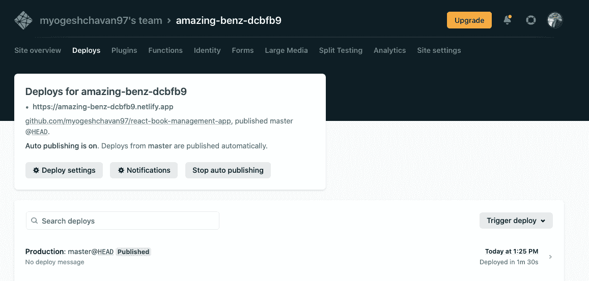

打开新选项卡中的链接，您将看到您的应用程序已实时部署。

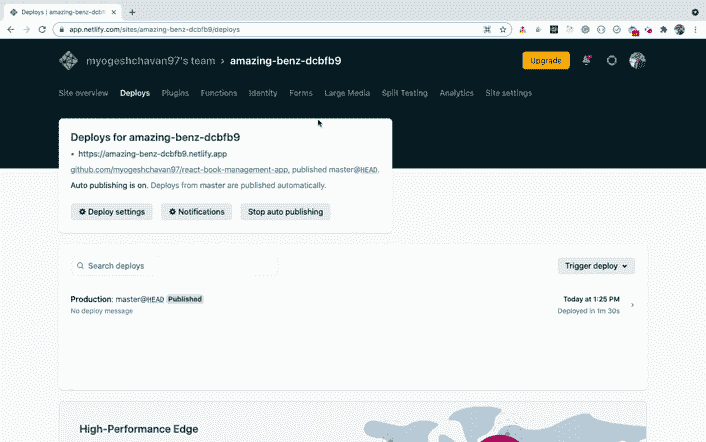

厉害！现在，如果您对源代码进行了任何更改并将该更改推送到 GitHub，Netlify 将检测到该更改，并使用您的最新更改重新部署您的应用程序。

如果你检查这个应用程序，你会发现这个应用程序可以很好的导航，你可以添加/编辑/删除一本书。

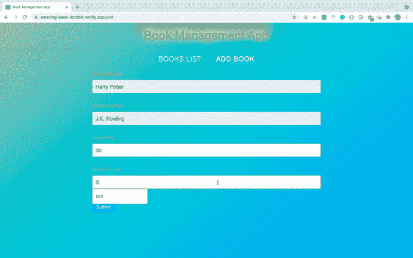

**但是有一个问题。**如果您直接访问`/add`路线或刷新`/add`路线页面，您将得到如下所示的页面未找到错误:

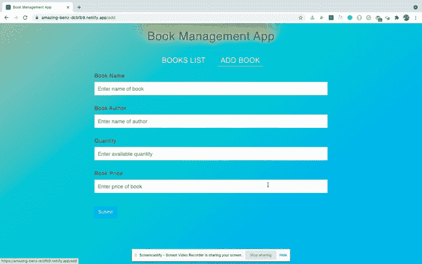

如果您尝试刷新编辑页面路径，将会得到相同的错误。

这是因为当我们访问本地机器上的任何路由时，React Router 都会处理路由。但是当我们在任何服务器上部署应用程序时，直接访问路由会将请求发送到服务器本身(在我们的例子中是 Netlify)。

但是由于服务器端没有`/add`路由处理器，您将看到一个页面未找到错误。但是 Netlify 提供了解决这个问题的方法。

在我们项目的`public`文件夹中创建一个名为`_redirects`的新文件，并在其中添加以下内容:

```
/* /index.html 200 
```

这里，我们告诉 Netlify 将所有路由重定向到`index.html`文件。

`index.html`文件包含我们整个 React 应用程序代码。当 Netlify 在部署应用程序时执行`yarn build`命令时，它会在`build`文件夹中生成。

由于路由是由包含在`index.html`文件中的 React 应用程序处理的，我们的应用程序将不会出现页面未找到的问题。

现在，将更改推送到 GitHub 存储库，这样 Netlify 将使用这些更改再次部署应用程序。

部署后，如果您检查部署的应用程序，您会看到应用程序运行良好，我们没有收到页面未找到错误。

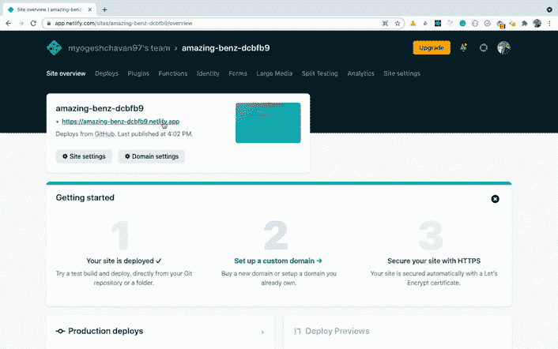

就是这样！我们已经完成了向 Netlify 部署我们的应用程序。

## 如何在 Netlify 中轻松更改网站名称

如果您检查部署站点的名称，您会发现它不容易记住，尤其是如果您部署了许多应用程序。但是 Netlify 提供了一种很容易改变这种情况的方法。

点击显示在`Site overview`部分的`Site settings`按钮。

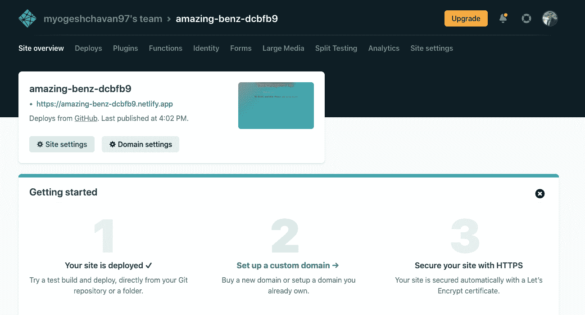

然后点击`Change site name`按钮并输入新名称。点击`Save`按钮，现在您可以使用更改后的名称访问您的应用程序。

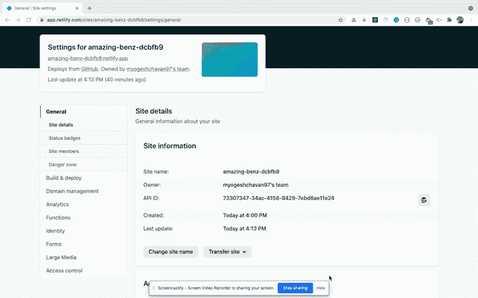

> 我通常喜欢使用与存储库相同的名称，这样，如果您在 Netlify 上部署了很多应用程序，就很容易找到特定的应用程序。

如果您想知道如何将 React + Node.js 应用程序部署到生产中，请查看本文。

### 感谢阅读！

您可以在[这个库](https://github.com/myogeshchavan97/netlify-react-book-management-app)中找到完整的 GitHub 源代码以及这个重定向更改。

**你可以在这里看到部署应用[的现场演示。](https://react-book-management-app.netlify.app/)**

想从头开始详细学习所有 ES6+特性，包括 let 和 const、promises、各种 promise 方法、数组和对象析构、arrow 函数、async/await、import 和 export 等等吗？

查看我的《掌握现代 JavaScript》一书。这本书涵盖了学习 React 的所有先决条件，并帮助您更好地掌握 JavaScript 和 React。

> 点击查看该书[的免费预览内容。](https://www.freecodecamp.org/news/learn-modern-javascript/)

还有，你可以查看我的**免费**[React 路由器简介](https://yogeshchavan1.podia.com/react-router-introduction)课程，从零开始学习 React 路由器。

想要了解关于 JavaScript、React、Node.js 的最新常规内容吗？[在领英上关注我](https://www.linkedin.com/in/yogesh-chavan97/)。

[](https://bit.ly/3w0DGum)