# 在 Google App Engine 上部署 Python webapp 的快速指南

> 原文：<https://www.freecodecamp.org/news/how-to-deploy-your-first-python-webapp-on-google-app-engine-2d487b52796a/>

作者 Karan Asher

# 在 Google App Engine 上部署 Python webapp 的快速指南

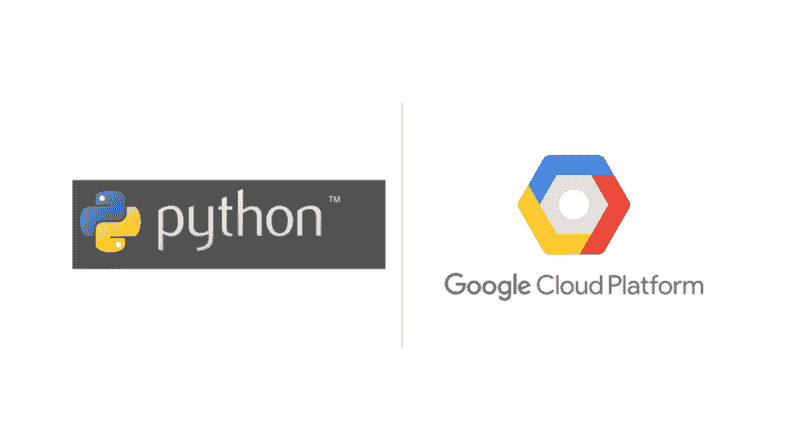

Image credit. [https://www.python.org/,](https://www.python.org/) [https://medium.com/@javidgon/google-cloud-storage-pros-cons-and-how-to-use-it-with-javascript-ea9ce60a94c0](https://medium.com/@javidgon/google-cloud-storage-pros-cons-and-how-to-use-it-with-javascript-ea9ce60a94c0)

最近，基于 web 的应用程序和框架数量的增长令人震惊。随着谷歌、亚马逊和微软等公司提供越来越多易于使用的工具来构建和部署应用程序，使用它们提供的服务和工具比在内部构建和托管更有意义。

Google App Engine 是开始学习 web 开发的好方法。它提供了许多有用的特性，比如分片、自动数据库复制、自动伸缩、memcache 等等。

然而，注册和部署你的第一个测试 hello world 应用程序的过程不是很直观。

在这篇文章中，你将学到一个非常简单易懂的方法来在 Google App Engine 上部署你的第一个 Python webapp。所以让我们开始吧。

### 第一步。下载基本的日常用品

无论您在什么平台上构建产品，在您可以投入使用之前，总有一些日常工作需要完成。在谷歌应用引擎中部署应用也不例外。

1.  下载 [Python 2.7](https://www.python.org/download/releases/2.7/) 但是，添加对 Python 3.x 的支持只是时间问题。您可以查看 App Engine 文档了解最新信息。
2.  下载 [Google Cloud SDK](https://cloud.google.com/appengine/docs/standard/python/download)
    这将允许你将应用分支到你的本地机器上，做出改变(编辑和开发应用)，并将你的应用部署回云端。
3.  在 Google App Engine launcher
    中设置 Python 路径下载 SDK 后，启动 App Engine launcher，转到 Edit - > Preferences，并确保在上面的步骤 1 中设置了 Python 的安装路径。

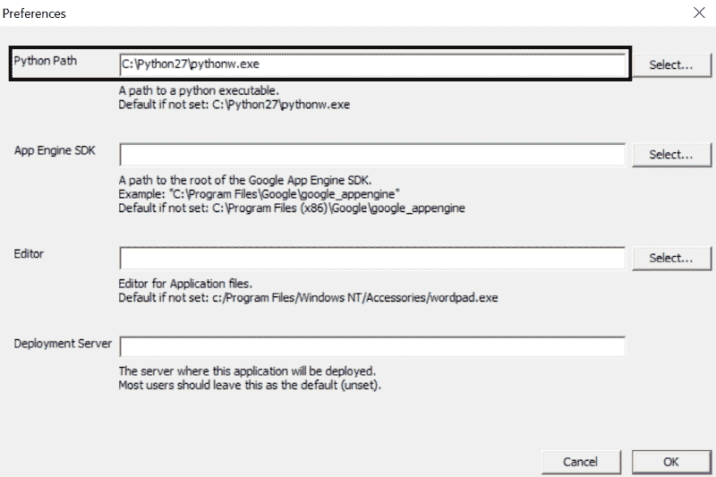

Set the Python path in Google App Engine launcher

这就是你所需要的。您的本地机器现在应该可以构建 webapps 了。

### 第二步。应用引擎注册

这通常是整个设置中最令人困惑的部分。注册时你应该知道的事情:

1.  目前，App Engine 提供一年的免费试用。
2.  该试用包括 300 美元的信用，可在一年的试用期内使用。
3.  您需要添加一张信用卡来注册(用于验证目的)。
4.  注册过程中不会向您收取任何费用。
5.  只要您不超过所提供的信用额度，我们将不会向您收取试用期费用。

注册时，您需要遵循以下步骤:

1.  转到[谷歌云](https://cloud.google.com/)登陆页面
2.  遵循注册流程，转到您的应用引擎仪表盘

注册成功后，大部分艰难的工作就完成了。

### 第三步。创建新项目

下一步是创建一个新的 Python 项目。按照下面的截图创建一个新项目。

启动新建项目向导。

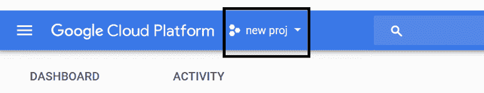

Image courtesy. [https://console.cloud.google.com/home](https://console.cloud.google.com/home)

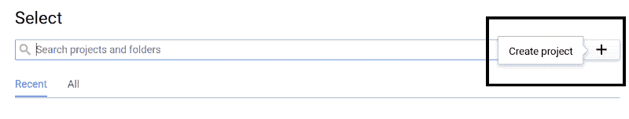

Image courtesy [https://console.cloud.google.com/home](https://console.cloud.google.com/home)

为您的应用程序命名，并记下您的项目 ID。

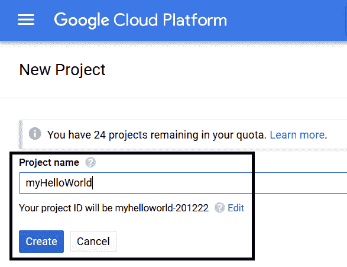

Image courtesy. [https://console.cloud.google.com/home](https://console.cloud.google.com/home)

点击创建按钮，谷歌应该需要几分钟来设置你新创建的应用程序所需的一切。

### 第四步。分叉的应用程序，以开发本地

该过程的下一步是在本地机器上派生应用程序。这将允许您在本地对应用程序进行更改，并随时部署它。

转到 Google App Engine launcher 并创建一个新应用程序。

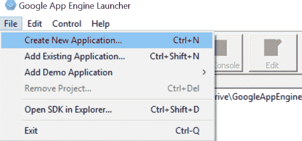

输入您新创建的应用程序的项目 ID。此外，提供您希望在本地存储应用程序的文件夹(本地目标)。确保选择 Python 2.7 作为运行时引擎。

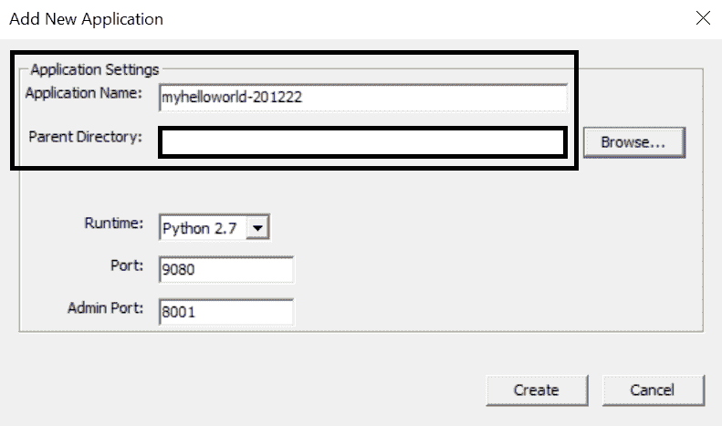

点击 create 按钮，你应该会看到你的应用程序出现在接下来的窗口中。您还应该检查一下，在这个步骤之后，您现在可以在您的本地存储(您在上面的屏幕截图中选择的目录)中看到一些文件。

### 第五步。在本地运行应用程序

在您继续对应用程序进行一些更改之前，检查您是否正确执行了上述所有步骤是很重要的。这可以通过简单地在本地运行应用程序来完成。

选择应用程序，点击窗口上的运行按钮。

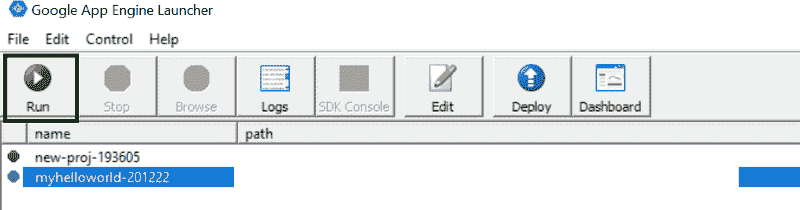

等待几秒钟，直到您可以点击**浏览**按钮。一旦**浏览**按钮变为可点击，点击它。这会将您带到浏览器，您应该会看到 hello world 文本出现在浏览器窗口中。或者，您可以手动转到浏览器，并使用指定的端口来访问应用程序。

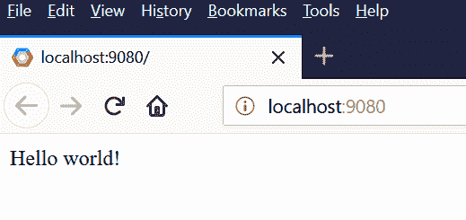

只要看到上面的屏幕，就都设置好了。

### 第六步。了解应用程序结构

终于到了查看运行这个 webapp 的代码行的时候了。在您选择的文本编辑器中打开应用程序文件夹。我推荐[崇高文字](https://www.sublimetext.com/)或者 [VS 代码](https://code.visualstudio.com)。然而，你可以自由选择你喜欢的。

以下是对各种文件的描述。

**app.yaml**

这个文件是一个基本的标记文件，存储关于应用程序的信息(一些元数据)。请务必注意该文件的以下关键部分。

1.  **应用**
    这是你永远不能更改的项目 ID。这是应用程序的唯一标识符
2.  url - > scr ipt
    这是应用程序的主页。换句话说，当您启动应用程序时，该文件将呈现在您的浏览器中
3.  **库**
    您可以在这里包含外部库，以便在 webapp 中使用

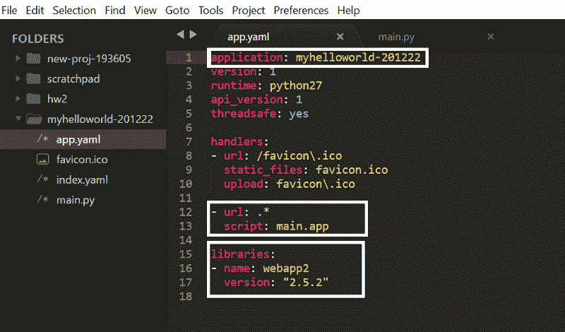

app.yaml file in the webapp folder

**main.py**

这是应用程序的主页(如上所述)。请注意，浏览器窗口中的 hello world 文本(步骤 5)是由下面突出显示的代码引起的。

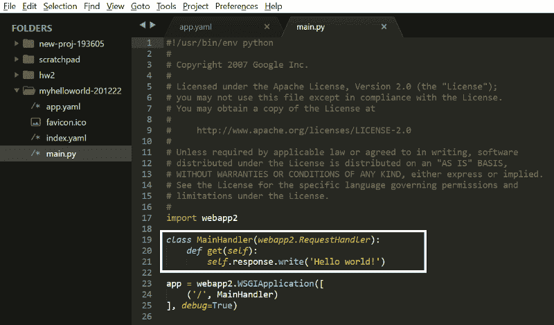

main.py file in the webapp folder

### 第七步。进行更改并部署新应用

如果开发人员不将 hello world 文本更改为其他内容，以确保幕后发生的一切正常运行，那么 hello world 应用程序就不会完整。

继续把上面截图里的文字改成别的。

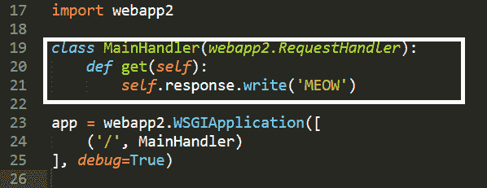

main.py file in the webapp folder

保存更改，转到浏览器并刷新页面。您应该会看到显示文本“喵”的页面。

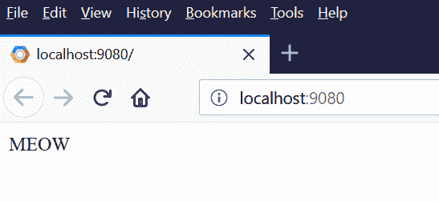

最后，是时候将您的更改部署到云中，使它们可以通过 URL 进行全局访问。进入应用引擎启动器，选择应用，点击**部署**按钮。

这将确保你的应用程序被部署到谷歌云。要检查是否一切正常，请访问下面的 URL:

**https:// <你的投影 ID >。appsp**t . com/

你应该看到和上面完全一样的窗口，除了现在，它是一个全球可访问的 URL。

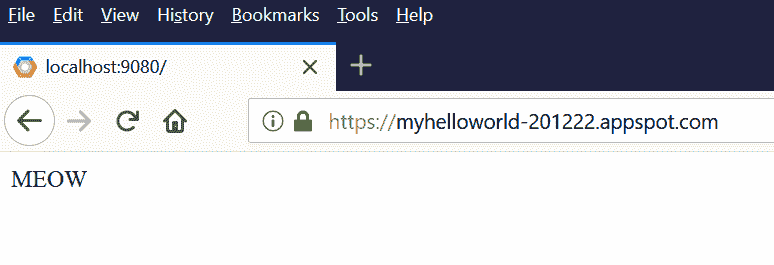

### 第八步。混杂的

恭喜你，你终于在 Google App Engine 上部署了你的第一个 Python webapp。这里有一些其他的要点，你可能会觉得有用。

1.  Jinja 2 是一个令人惊叹的 Python 前端模板库，它可以做一些很酷的事情，比如将对象从 Python 传递到 HTML，使用 for 循环、if 条件等等
2.  这里有一个非常有用的关于 web 开发的 Udacity 课程，我个人觉得它很有用
3.  运行 web 应用程序时查看日志可以方便地进行调试，还可以发现一些动态错误

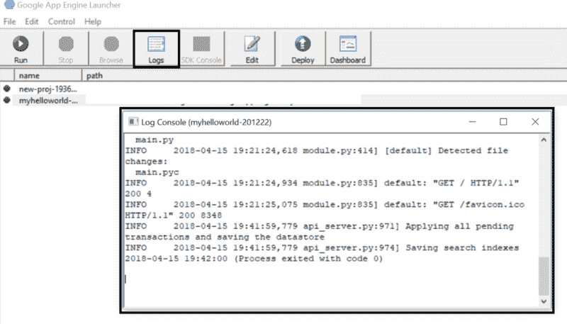

Log console of the webapp

*# untilexttime*。