# 如何在 AWS 上部署 freeCodeCamp 项目——云初学者指南

> 原文：<https://www.freecodecamp.org/news/how-to-deploy-your-freecodecamp-project-on-aws/>

2017 年 6 月的一个晚上，我偶然发现了一个名为[freecodecamp.org](http://freecodecamp.org/)的网站。我当时是一名教师，正在寻找职业改变。但是我认为成为一名程序员是我力所不及的。

毕竟，我不认为自己是数学天才，也没有上过计算机科学的学校，而且觉得自己太老了，不适合从事编码工作。

谢天谢地，freeCodeCamp 帮助我迈出了成为开发人员的第一步，我很快就摆脱了这些自我限制的想法。

现在，作为一名三星软件工程师和三次认证的 AWS 开发人员，我回顾了我在 freeCodeCamp 课程中度过的那些夜晚和周末，并将它们视为我成功工作转型和我作为程序员的成就的主要贡献者。

尽管我的教师之心仍然存在，我还是写了这篇文章来鼓励其他 freeCodeCamp 的学生继续学习，并补充他们的 freeCodeCamp 课程。

熟悉云计算，如 AWS、Azure 或 Google Cloud，是招聘职位中越来越多的要求。

这篇文章将向任何仍在学习 freeCodeCamp 课程的新手简单介绍广阔的云计算世界。我将向您展示如何使用一个 freeCodeCamp 前端项目，并以多种方式将其部署在 AWS 上。

尽情享受吧，谢谢你！

## 先决条件

这篇文章的目的是通过将 freeCodeCamp 课程的[前端开发库项目](https://www.freecodecamp.org/learn/front-end-libraries/front-end-libraries-projects/)部分部署到 AWS 来扩展你的学习。

所以先决条件是:

1.  完成前端库项目挑战之一
2.  拥有一个 AWS 帐户(点击[此处](https://portal.aws.amazon.com/billing/signup#/start)注册)

## 为什么要将项目部署到 AWS？

当你学习 freeCodeCamp 课程并完成前端库项目时，你通过 CodePen 提交这些项目，freeCodeCamp 有一系列的[单元测试](https://www.guru99.com/unit-testing-guide.html)来验证你是否正确地完成了他们的用户故事。

五彩纸屑落下，你看到一些鼓舞人心的短语，你可能会为你的项目感到非常自豪。你甚至可能想与你的朋友和家人分享这一成就。

当然，你可以与他们分享你的 CodePen 链接，但在现实世界中，当一个公司完成一个项目时，他们不会通过 CodePen 提供它，而是部署它。那么，让我们也这样做吧！

简单说明一下:当我说“部署”时，我指的是从本地环境(您的计算机，或者 freeCodeCamp 或 CodePen 编辑器)中获取您的代码，并将其放在服务器上。那台服务器，只是另一台计算机，以这样一种方式联网，让全世界都能访问你的网站。

如果你愿意，你可以在家里安装一台个人电脑并进行适当的联网，让它为你的项目服务。或者，你可以订阅一个[托管](https://www.pcmag.com/picks/the-best-web-hosting-services)公司，让他们为你服务你的网站。

有多种方法来部署代码，但一种非常流行的方法是使用云计算平台，如 Amazon Web Services (AWS)。接下来会有更多。

## 什么是 AWS？对云的简要介绍

亚马逊网络服务(AWS)提供了一个“云计算平台”。这是一个小术语，里面包含了很多东西。让我们打开行李。

AWS 的服务范围从[简单存储文件](https://aws.amazon.com/s3/?nc=sn&loc=1)、[运行服务器](http://aws.amazonaws.com/aws/ec2)、[将语音转换为文本](https://aws.amazon.com/transcribe/)或[文本转换为语音](https://aws.amazon.com/polly/)、[机器学习](https://aws.amazon.com/machine-learning/)、[私有云网络](https://aws.amazon.com/vpc/)，以及大约 200 多种其他服务。

云计算背后的基本思想是获得随需应变的 IT 资源。另一种选择，就像我们之前讨论的那样，是让您拥有这些 IT 资源。

使用云计算平台而不是拥有云计算平台有很多好处，其中一个主要好处是节省成本。

想象一下，要支付运行 AWS 提供的 200 多项服务所需的所有物理 IT 资源。这种前期成本是大多数公司负担不起的，更少的公司能够支付工程师进行配置。

此外，由于资源是按需提供的，云平台允许您比 IT 部门更快地启动资源。

简而言之，有了像 AWS 这样的云计算平台，您可以节省成本和部署时间，还能获得许多好处，其中包括安全性。不用说，云计算是一种新的性感的 IT 方式，AWS 正在引领潮流。

为什么这对你很重要？如果你打算从事开发职业，不管你的重点是什么(后端、前端、web 技术、移动应用、游戏、桌面应用等等)，你都会发现许多招聘信息都提到了云计算平台经验。

所以你越熟悉 AWS，你就越能从其他候选人中脱颖而出。

# 如何使用 AWS S3 部署您的 freeCodeCamp 项目

## 什么是 AWS S3？

在这篇文章中，我们将使用 AWS 上的各种服务来部署您的 freeCodeCamp 前端项目。

我们的第一种方法是通过名为 S3 的 AWS 服务。S3 代表简单储物解决方案。正如你可能从名字中猜到的那样，该服务让你简单地存储东西，更具体地说是**对象**。

你可以找到几小时甚至几天的关于 S3 的教程和课程。虽然从表面上看，它只是一个可以存放物品的地方。对象可以是图像文件、视频文件，甚至是 HTML、CSS 和 JavaScript 文件。

随着你深入 S3，你会了解到 S3 允许你对这些物体做很多事情。但对于我们的项目，我们只想学习如何存储对象，并看看这些更深层次的功能中的一个——使用 S3 作为网站托管服务。

没错，AWS S3 是一项我们可以用来部署网站的服务。

## 如何让您的项目为部署做好准备

在这篇文章中，我将使用[随机报价机](https://www.freecodecamp.org/learn/front-end-libraries/front-end-libraries-projects/build-a-random-quote-machine)项目。我使用的代码来自说明中提供的例子。

我们需要从 CodePen 中取出你的 CSS、HTML 和 JS 代码，并将它们放入文本编辑器中各自独立的文件中。

### 打开您的 IDE(例如，Visual Studio 代码)

在 CodePen 环境中，CodePen 将 CSS 链接到 HTML 代码，将 JS 文件链接到 HTML。在部署到 S3 之前，我们需要考虑这一点，因此我们将首先在本地进行测试。

打开您选择的编辑器，并创建一个新目录(文件夹)来保存您的三个 CodePen 文件。我把我的 **叫做随机报价机** 。接下来，创建三个新文件:

*   index.html
*   样式. css
*   主页. js

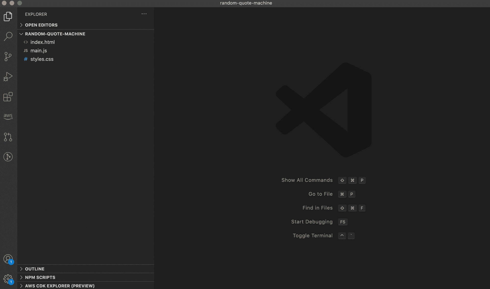

Three empty files: main.js, styles.css, and index.html

继续将 CodePen HTML 文件复制到 index.html，将 CodePen JS 文件复制到 main.js，将 CodePen CSS 文件复制到 styles.css

### 检查您的 标签

CodePen 不需要`<body>`标签，但是添加这个标签是个好习惯。确保你的 HTML 内容有一个。如果你不记得这些在哪里，回头看看你的 fCC 课程。

### 添加<link>和

您现在需要将 styles.css 和 main.js 链接到您的 index.html，因为 CodePen 不再为您做这件事。

在您的`<body>`开始标签上方，添加`<link rel="stylesheet" href="style.css" />`，这将使您在 styles.css 中的 css 生效。

在您的`<body>`结束标签下面添加`<script src="main.js"></script>`，它将把 main.js 文件中的 JavaScript 链接到 index.html。

### 验证您的站点在本地仍能正常工作

是时候测试我们的代码是否有效了。打开 web 浏览器，然后键入`ctrl+o`选择要在浏览器中显示的本地文件。导航到您的文件夹与我们的三个文件，然后双击 index.html 打开它。

如果一切正常，那太好了！但那不是给我的。我使用的代码具有 SASS 样式，我需要对其进行一些调整。

如果您通过 CodePen 导入了任何库，那么这些库将需要被导入，很可能是通过 CDN。简单的 Google 搜索这些库的文档应该可以帮助你找到如何导入它们。

做任何你认为必要的改变来使你的项目正常工作，但是记住，这个练习的目的是学习在 AWS S3 上部署一个网站。因此，如果你被一些小问题所困扰，但是这个网站大部分都能正常工作，继续学习本教程，保持势头，然后在以后解决你遇到的任何 CSS 或 JS 问题。

一旦你的网站在本地运行，即使不是 100%符合你的要求，让我们进入 AWS。

## 如何使用 S3 管理控制台

登录 AWS 后，在顶部搜索栏中输入“S3”，然后选择显示“S3”的选项，而不是“S3 冰川”。

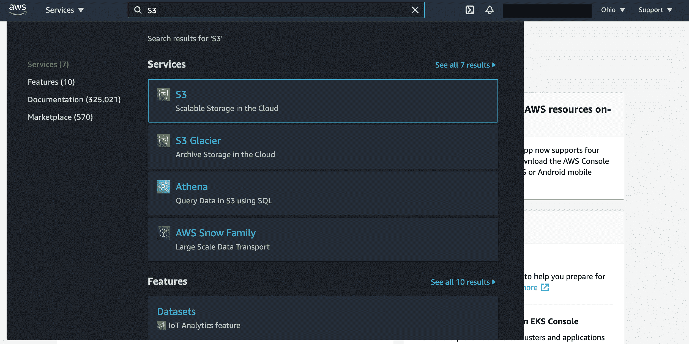

Searching for S3 in the AWS Management Console

或者，您可以展开“服务”下拉列表，而不是搜索栏，来查看所有 AWS 服务产品。不管怎样，让我们点击 S3。

您现在应该会看到 S3 管理控制台。类似这样的…

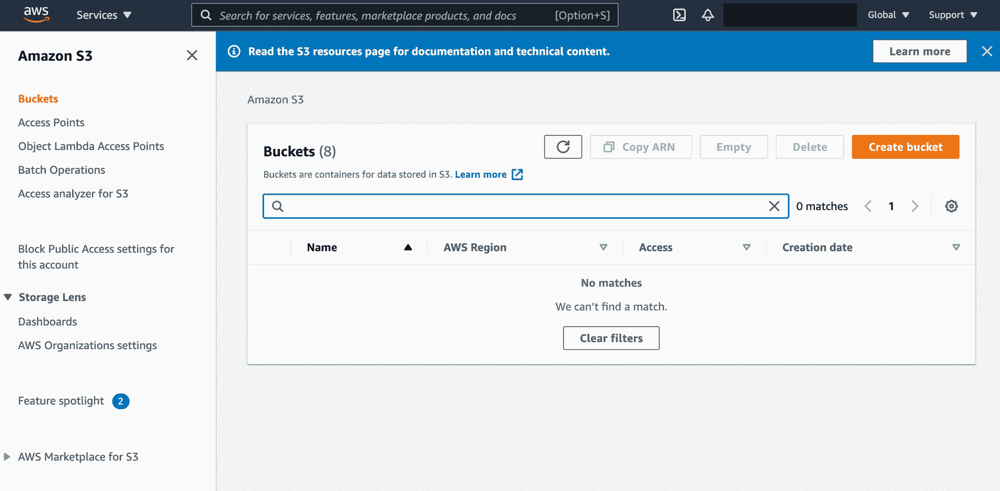

The S3 Management Console

这就是 AWS 所说的管理控制台。它是与 AWS 交互并创建资源和服务的网站界面。

所有的 AWS 服务都有一个管理控制台，但是这个控制台不是您与 AWS 交互的唯一方式。还有一个 [CLI](https://aws.amazon.com/cli/) (命令行界面)，它允许你把你想做的事情写给 AWS。

在 CLI 中，你不需要点击按钮，而是输入你本来要点击的内容(虽然不那么繁琐)。我们现在将继续使用控制台。

在这里，您可以查看您所有的 S3 桶。S3 由桶组成，桶基本上是一个大容器，我们可以在里面放文件。把一个桶想象成你电脑上的一个驱动器(就像你的 C: drive)。从技术上来说，它不是——它是 S3 的一种路由方法——但是现在，以这种方式来看这个桶是没问题的。

### 创建您的 S3 桶

点击**创建桶**。然后，为您的存储桶输入一个唯一的名称(不允许有空格)。

您的存储桶的名称必须是全局唯一的。所以，如果你试图创建一个名为 **test** 的，世界上可能已经有人使用过了，所以它是不可用的。


Entering my new S3 bucket name

输入您的存储桶名称后，向下滚动到名为**Block Public Access settings for this bucket 的部分。**我们要取消选中**阻止 **所有** 公共访问**复选框，然后进一步向下检查以确认出现的警告框。

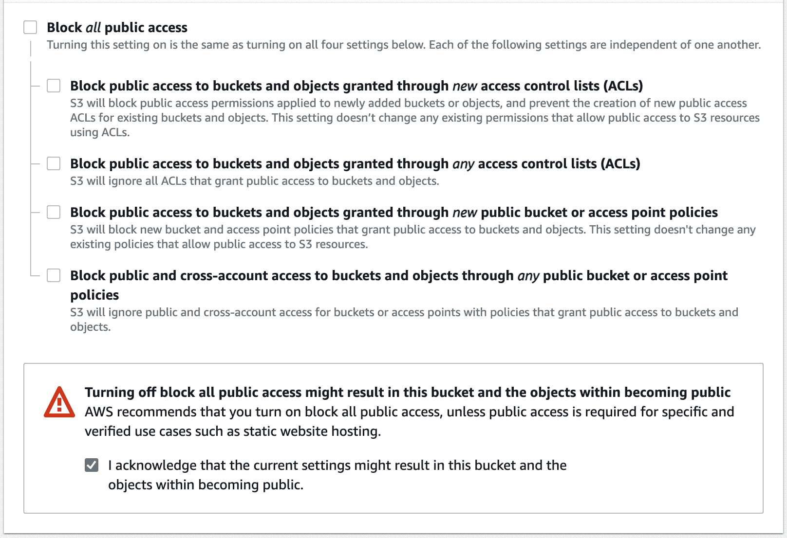

Your settings should match this

AWS 中的安全性和权限是一个冗长的话题，但是，正如您从警告中看到的，您通常不希望解除对文件的公共访问的阻止。

在我们的例子中，我们希望网站访问者的浏览器能够访问我们的 index.html 文件，这样他们就可以看到我们的项目。

我们可以使用其他方法来解除对我们的 bucket 内容的访问，但目前这已经足够实现我们的目标，即向您介绍 S3 并在 AWS 上部署一个项目。

向下滚动到表单的底部。点击底部的**创建存储桶**按钮。如果你的名字是独一无二的，那么恭喜你，你刚刚获得了你的第一个 AWS S3 桶！

停下来想想，在这么短的时间内，AWS 在他们的网络中为您提供了空间来存储无限量的数据，这是非常令人惊讶的。没错，不限！

虽然您的存储桶中单个对象的最大大小是 5tb(祝您好运)，但是您的新存储桶可以容纳您想要的大小。

### 将您的文件上传到您的存储桶

接下来，回到 S3 控制台视图，单击链接到您新创建的 S3 桶。一旦进入，我们要点击**上传**按钮。选择三个文件(index.html、styles.css 和 main.js)。

当您看到他们的名字出现在将要上传的项目列表中时，向下滚动到上传表单的底部。

展开**附加上传选项**，然后向下滚动到**访问控制列表(ACL)。**选中 **Everyone(公共访问)**的 **Read** 框，然后选中下方出现的确认框，就像我们创建 bucket 时一样。

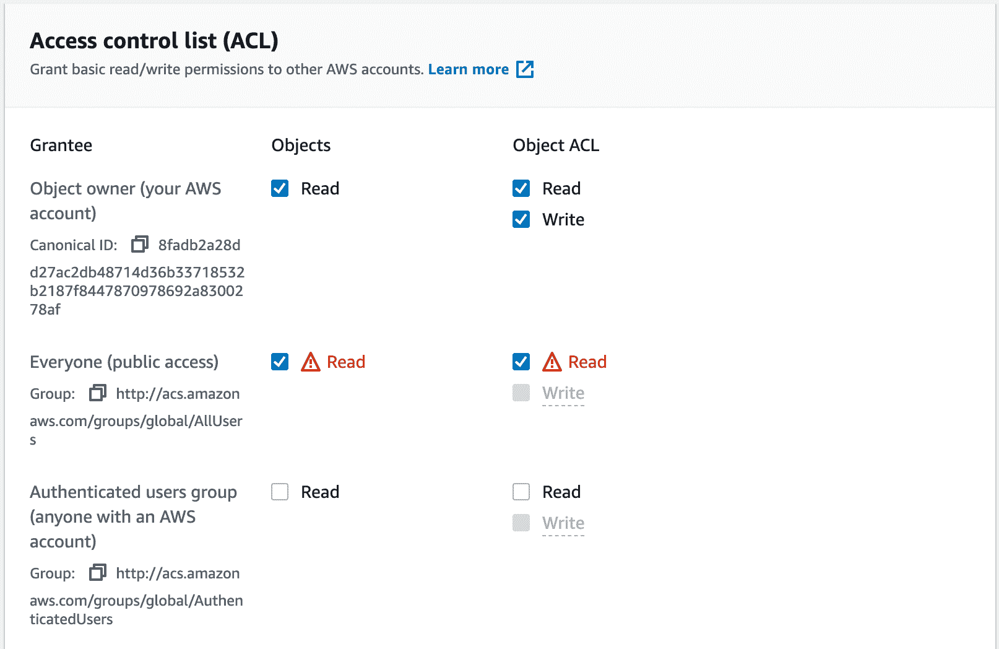

Your selections should look like this

向下滚动剩下的部分，点击**上传**按钮。

### 在 S3 桶上启用托管

现在我们有了我们的 S3 桶，我们有了我们的文件，我们可以公开访问它们，但我们还没有完全完成。

默认情况下，S3 存储桶不会被配置为 web 服务器。大多数时候，公司希望 S3 存储桶的内容保持私密(就像医院存储医疗记录，或者银行保存财务报表)。为了让 bucket 像 web 服务器一样为我们提供访问文件的 URL，我们需要调整一个设置。

回到 bucket 的主菜单视图，点击**属性**选项卡。


Select the Properties tab

向下滚动到底部，直到找到托管的**静态网站，点击**编辑**按钮。将【静态网站托管】的**设置为**启用**，然后在**索引文件**和**错误文件**中键入 index.html**。**然后点击**保存修改**按钮。

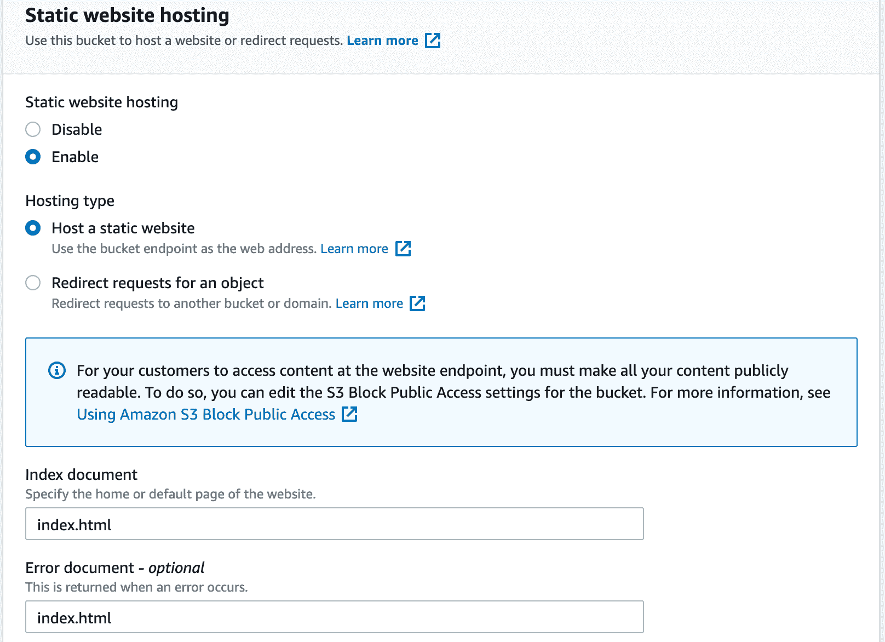

Your selections should match this

您将返回到存储桶的属性选项卡。向下滚动到**静态网站托管**部分，在那里你会找到一个链接。

阅读该 URL 时，您会注意到您的存储桶的名称就在其中。在配置过程中，通过在两个字段中键入 index.html，我们告诉 AWS，当这个 bucket 的 URL 打开时，将使用 index.html 页面进行加载。

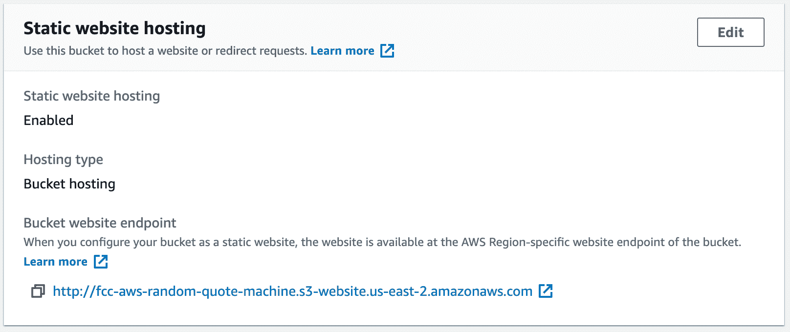

You should see your bucket’s website endpoint now

如果您单击该链接，您的项目现在应该可以查看了。

### 解决纷争

如果您的网站在本地工作，但当您打开 S3 网站端点链接时无法工作，有几个常见问题需要尝试和解决。

首先，确保您选择了在本地工作的相同文件。在 web 浏览器中重新打开本地文件，以确保它们正常工作。如果它在本地工作，但不能通过 S3，尝试重新上传它们，并确保您选择相同的文件。

接下来，转到您的 bucket 的**权限**选项卡，确保您已经将**阻止 **所有** 公共访问**设置为**关闭**。

最后，删除您上传的文件，然后重新上传，确保您选择了上述的 **Read** 复选框以及确认框。

如果您仍然有问题，请随意评论您的问题，我很乐意帮助您。也不要太气馁。AWS 可能需要一段时间来学习，所以如果事情没有在第一时间到位，请放松自己。

## 你做到了！

现在，你不用把 CodePen 的网址分享给你的朋友和家人，你有了自己的 S3 水桶网站的端点来分享。

当然，这仍然不是你自己的个性化领域，但是，嘿，知道你刚刚像成千上万的企业一样部署了一个网站，这仍然很酷。

您现在不仅学习了与 freeCodeCamp 前端库项目相关的前端技能，还通过部署一个网站向云计算迈出了第一步。你应该感到非常自豪！

## 更多关于 S3 的信息

将 S3 桶配置为网站端点只是使用 S3 的众多方式之一。我们还可以使用 S3 来存储我们想要放入应用程序的数据。例如，我们随机报价机上的报价可以作为一个 [JSON](https://www.w3schools.com/whatis/whatis_json.asp) 文件存储在 S3，然后我们的前端可以请求它们。

当它们可以被列在我们的 main.js 文件中时，这似乎是一个奇怪的调整。但如果我们有其他应用程序需要访问这些报价，那么 S3 可以充当它们的中央存储库。

事实上，这是使用 S3 作为应用程序数据存储的最流行的方式。我们还可以使用 S3 的 Glacier 选项来归档我们预计不会频繁访问的对象，这将从标准的 S3 存储桶配置中为我们节省资金。

最后一个想法，虽然不是使用 S3 的最后一种方法，是我们可以将正在运行的应用程序的日志保存到 S3 桶中，这样如果有 bug，我们可以检查这些日志来帮助确定问题的根源。

无论何种用例，S3 的概念都是相同的:我们将对象存储在一个桶中，这些对象具有权限设置，以确定谁可以查看、编辑或删除它们(记住，我们将文件设置为公共可读)。

## 下一个！

如前所述，AWS 有数百个服务，这意味着有时有多种方法来完成一项工作。我们已经介绍了一种托管站点的方法，但是还有两种方法值得注意，它们将帮助您从整体上获得更多 AWS 信息。

# 如何使用 AWS Elastic Beanstalk 部署您的 freeCodeCamp 项目

现在，我们将了解更多关于 AWS 云平台服务的信息，并了解部署您的代码的替代方法，以便您可以体验 AWS 提供的更多功能。

具体来说，我们将介绍几个核心 AWS 服务和资源:ec2、负载平衡器、自动扩展组和安全组。

哇，涵盖的话题可真多。在上面的第一部分中，我们只看了 S3——我们将如何了解所有这些其他服务呢？

谢天谢地，AWS 提供了一项名为 [Elastic Beanstalk](https://aws.amazon.com/elasticbeanstalk/) 的服务，该服务由[引导](https://techterms.com/definition/bootstrap)web 应用程序的部署过程。通过 Elastic Beanstalk 部署您的 freeCodeCamp 项目，您可以快速获得使用这些核心 AWS 服务和资源的经验。

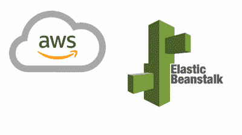

We will use the AWS service called Elastic Beanstalk to deploy

## 在我们跳回 AWS 之前

我们在第 1 部分中讨论过,“部署”代码意味着以服务于项目的方式配置计算机，并使访问者可以访问它。云计算平台的好处在于，如果我们愿意，可以为我们完成服务器的配置。

考虑一下我们在 S3 的部署。我们的文件存储在 AWS 拥有的一台机器上，AWS 负责配置那台计算机以服务于 index.html 的页面，并给我们一个查看项目的端点。

除了告诉 S3 我们的 index.html 文件的名称，我们没有做任何配置，但我们仍然带走了一个已部署的项目和一个查看它的端点。

当我们使用 Elastic Beanstalk 时，它同样会包含 AWS 来为我们处理大量的配置。但是这一次我们也要做一些自我配置。

通过这样做，我们将看到部署 web 应用程序的另一种非常流行的方法。这一次，我们将添加“服务”index.html 的代码，但我们将让 AWS 处理硬件的启动，并为我们提供一个查看项目的端点。

## 我们来配置吧！

我们将添加一些代码到我们的项目，以服务于我们的 index.html。记住，S3 在幕后为我们做了这些。

我已经为您创建了一个 Git 存储库，供您克隆或下载并用于本教程。如果你熟悉 Git，那么可以随意克隆 [repo](https://github.com/dalumiller/fcc-to-aws-part2) 并跳到**粘贴你的代码**。但是如果您不熟悉 Git，那么请按照说明下载这个 repo。

### 下载回购

*   前往[https://github.com/dalumiller/fcc-to-aws-part2](https://github.com/dalumiller/fcc-to-aws-part2)
*   点击绿色**代码**下拉菜单，然后选择**下载 Zip**
*   从压缩的下载文件中解压缩文件

### 粘贴您的代码

在新下载/克隆的文件夹(我称之为`fcc-to-aws-part2`文件夹)中，我们要粘贴您上传到 S3 的`index.html`、`main.js`和`styles.css`文件。

在`fcc-to-aws-part2`文件夹中，有另一个名为`public`的文件夹，其中有空的 index.html、main.js 和 styles.css 文件。继续把你的代码粘贴到这些。

粘贴后，让我们确认到目前为止一切正常。

打开一个新的浏览器标签，然后键入 **ctrl+o** 并导航到`fcc-to-aws-part2/public/index.html`。在新标签页中打开 index.html。您的应用程序现在应该正在运行。

如果不是，停下来并确保将正确的代码粘贴到正确的。html，。js 还有。css 文件。此外，确保您使用的代码与 S3 部署期间的代码相同。

这样一来，我们现在就可以讨论`fcc-to-aws-part2`文件夹中的额外内容了。确保不要对 index.html、main.js 和 styles.css 之外的任何文件进行任何更改

### 使用 Node.js 和 Express.js 进行配置

记得我说过我们这次要做一些配置吗？ [Node.js](http://nodejs.org/) (又名 Node)和 [Express.js](http://expressjs.org/) 是我们用来完成配置的。

freeCodeCamp 有一个关于 Node 和 Express 的[教程，所以如果你想停下来浏览一下，请随意。但是我还将提供一个简短的介绍，解释我们为什么以及如何使用 Node 和 Express。](https://www.freecodecamp.org/learn/apis-and-microservices/#basic-node-and-express)

### 为什么使用 Node？

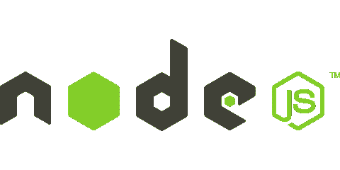

Node.js 是用于服务器端应用程序的 JavaScript 运行时。这是一大堆术语，所以让我们把它分解一下。

“节点是一个 JavaScript 运行时”——在编程的世界里，运行时是一个执行模型。换句话说，它是一个实现如何执行代码的进程。所以，Node，是一个实现如何执行 JavaScript 代码的进程。

当我们有这样的 JavaScript 代码时:

```
console.log("Hello World")
```

节点知道如何处理这些代码。

“…对于服务器端应用程序”——请记住，我们试图将我们的代码部署为由服务器提供服务，而服务器只是一台计算机。此外，请注意，服务器不同于客户端，在网站的情况下，客户端是 web 浏览器。

当您在 web 浏览器中打开项目时，浏览器会处理 index.html、main.js 和 styles.css 文件的读取。没错，浏览器(客户端)知道如何读取和执行 JavaScript 代码，这样当它看到`console.log("Hello World")`时就知道该怎么做了。

我们的 main.js 文件是由浏览器在客户端运行的 JavaScript 代码。但是，Node 是用于服务器端 JavaScript 的。所以，你的浏览器知道如何运行 JavaScript 代码，但是服务于我们网站的计算机如何知道如何运行 JavaScript？节点。

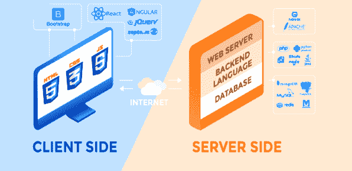

JavaScript can run on the client (ie: web browser) and server

因此，总而言之，“Node 是服务器端应用程序的 JavaScript 运行时”意味着 Node 是实现如何在服务器上执行 JavaScript 代码的进程，而不是像 web 浏览器这样的客户端。

没有节点，计算机/服务器就不知道如何运行 JavaScript 代码。

### 为什么用快递？


Expres.js a web application framework for Node.js

Node 为我们提供了服务器端运行时，即我们可以运行 JavaScript 代码的环境，而 Express 则为我们提供了一个服务于 web 应用程序的框架。

当我们通过 S3 部署时，我们告诉 S3 我们想要服务的文件名(index.html)。现在，Express 将是我们配置我们想要服务的文件的地方。

如果我们有一个不同路径的网站(例如:www.example.com/home,/媒体，/关于，/联系)，那么我们可能有不同的 HTML 文件用于每一个页面。如果网络浏览器需要，我们将使用 Express 来管理这些页面的服务。

例如，当网页浏览器发出请求时，www.example.com/contact,快递会从浏览器收到请求，并用 contact.html 作出响应。

### app.js

现在我们知道 Node 是让我们在服务器上运行 JavaScript 代码的东西，而 Express 是处理来自浏览器的请求的。因此，让我们在`fcc-to-aws-part2`中查看我们的`app.js`文件，并逐行阅读它，以了解我们在项目中添加了什么。

首先…

```
const express = require("express");
```

这声明了一个名为`express`的变量，然后`=`符号表示我们正在给它赋值。但是这个`require(“express”)`是什么？

`require`函数只是 Node 知道的一个函数，当 Node 看到它时，它将在`node_modules`文件夹中查找同名的文件夹。你的`fcc-to-aws-part2`文件夹里有这个`node_modules`文件夹。

一旦 Node 在`node_modules`文件夹中找到`express`，它将从`express`文件夹中导入代码，并将其赋给我们声明的变量。这让我们可以使用来自`express`文件夹的代码，而不必自己编写。将代码导入到我们的代码中就是模块的概念。

模块就是一堆代码。它可以是一行或者更长。因此，`NODE_module`(重点添加到节点)是可以在节点运行时运行的一组代码。我们正在使用`express`模块。

`express`模块就是我们之前讨论过的 Express.js web 应用框架。

我不会深入讨论如何将模块添加到`node_modules`文件夹中，但是现在我们知道，通过声明变量`express`并使用`require(“express”)`语法，我们引入了 Express.js 框架，并通过我们赋予它的变量来访问它。

前四段包含了很多内容，我建议慢下来再读一遍，以确保你真的明白了！

接下来…

```
const path = require("path");
```

啊！这看起来应该很熟悉。我们将引入另一个模块，这次是`path`模块。我们将它赋给变量`path`。

您可能已经注意到我们使用的变量名与模块名匹配的模式。不一定非要那样。我们可以将`path`模块赋给`foobar`变量。但取什么名字更有意义。

`path`模块是做什么的？它是一个模块(只是一束代码)，让我们能够处理文件和文件夹路径。这样，我们可以使用节点理解的 JavaScript 语法来访问服务器上的文件/文件夹。当我们想在项目中引用 index.html 的位置时，这将派上用场。

好吧，继续…

```
const app = express();
```

又是快递？没错。第一次我们只是导入模块，现在我们正在使用它。

要使用 express 框架，我们必须实例化它，这意味着我们必须运行这个 Express 函数`express()`，现在我们将它赋给变量`app`。

"哇，但是 Luke，为什么不把这行代码放在前面那行代码的后面呢？"

好问题。一种常见的模式是在代码顶部导入(或使用`require()`)所有需要的模块，然后在导入完成后使用它们。

现在是大香蕉…

```
app.use(express.static(path.join(__dirname, "public")));
```

哇哦！让我们把这个分开一点。

首先，我们调用一个函数，即`app.use()`函数。这是在告诉我们的 Express 应用程序，我们想在我们的应用程序中使用另一个功能。有道理。

我们告诉 Express 我们想要运行的函数是在`.use()`函数参数内部调用的`express.static()`函数。因此，`app.use()`告诉 Express 我们想在应用程序中使用一些代码，特别是在这里我们想使用`express.static(path.join(__dirname, “public”))`。

现在，`express.static()`是一个我们可以使用的 Express 函数，因为它是我们导入的模块的一部分，并被赋给了`express`变量。

`.static()`函数处理静态文件服务。我希望你竖起耳朵，睁大眼睛！我再说一遍。`.static()`函数处理静态文件服务。上菜！

请记住，在这种部署方法中，我们要处理更多的配置来服务于我们的项目。这是我们用来表示“我想提供一些静态文件”的 Express 函数。静态文件是指我们的 index.html 文件。

所以，`app.use()`说，“嘿，我想在我的函数参数中为这个应用运行一些代码”。具体来说，我们想要运行`express.static()`，它说，“我想要交付静态文件，比如 index.html”，然后它的函数参数告诉我们在哪里可以找到这些静态文件。

所以让我们看看`path.join(__dirname, “public”)`来理解它是如何告诉我们静态文件在哪里的。

早先我们导入了`path`模块，以便能够访问我们的服务器/计算机中的文件。

嗯，我们想访问 index.html 的文件，这是公共文件夹。我们用`path`函数`.join()`来表示“嘿，从我们当前的目录(或者，文件夹)，到公共文件夹去找我要的文件”。这将把 index.html、main.js 和 styles.css 返回到`express.static()`，这将返回到`app.use()`函数，该函数处理要提供的文件(serve！)我们的访客。

现在一起！

`app.use()` =“浏览器请求 app 时，我想运行`express.static()`”

我要发送一些静态文件，它们位于这里…

`path.join(__dirname, “public”)` = 【抓取公共文件夹中的文件】

耶！我们做到了！我们配置了在节点运行时运行的 Express 应用程序，以便在有人访问我们的站点时提供 index.html、main.js 和 styles.css 文件。

但是等等…还有更多:

```
const port = 8080;
app.listen(port);
```

记住,`app`变量是 Express 框架的实例。`.listen()`功能是应用程序告诉计算机，“嘿，在 8080 端口上的任何请求，把它们带给我！”

端口和套接字是一个更高级的话题，所以我们现在不深入讨论。但是只知道一台电脑/服务器有很多端口，这些端口就像接入点，我们在配置 Node/Express app 只监听一个接入点，8080。

最后…

```
console.log("listening on port: " + port);
```

这是 Express 应用程序的标准做法，我们只是在计算机上注销我们正在运行的端口。它为我们提供了一些快速应用程序工作的验证。

干得好！这需要遍历大量的代码。

现在，如果你足够熟悉如何通过终端导航，我们可以在转向 AWS 之前在我们的计算机上本地测试这个 Express 应用程序。在我们去 AWS 之前，确保它在本地工作将有助于我们在 AWS 中出现错误的情况下，因为我们知道错误不可能与我们的 Express 应用程序不工作有关。

### 如何测试我们的 Node/Express.js 应用

如果打开 package.json 文件，您会看到“脚本”部分。这个package.json 文件是我们的节点应用程序的元数据，它还可以包含在“脚本”部分运行的可配置命令。

我包含了“start”脚本，它在节点环境中运行 app.js 文件，然后运行我们刚刚讨论过的 Express.js 代码。这个“开始”脚本是我们如何运行我们的项目。

为了测试这一点，在您的终端导航到我们的`fcc-to-aws-part2`文件夹，输入`npm start`启动应用程序。

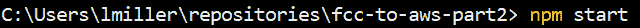

Terminal command to run our app

运行该命令后，您应该会立即看到我们的`console.log()`消息，通知我们该应用程序正在端口 8080 上运行。

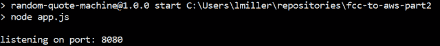

You should see the “listening on port: 8080” message to know it’s running

现在，要查看您的项目，请打开 web 浏览器，在地址栏中输入 localhost:8080，然后单击 enter。您现在应该看到您的项目正在运行！

如果没有，请确保您使用了正确的 index.html、main.js 和 styles.css 文件，并且没有修改`fcc-to-aws-part2`中的任何代码。

### Woohoo!

好了，现在我们已经配置了 Node 和 Express 来服务我们的项目。我们的本地计算机目前充当服务器，但我们希望世界上的任何人都能够查看我们的项目，但他们不能通过我们的 localhost:8080 地址查看。

因此，我们将使用 AWS 为我们托管服务器，将我们的应用程序放在上面，然后让 AWS 管理必要的配置，以生成供世界访问的 URL 端点。这就是 AWS 服务 Elastic Beanstalk 发挥作用的地方。我们开始吧！

## 去 AWS 弹性豆茎

登录 AWS 帐户后，在顶部的搜索栏中搜索 Elastic Beanstalk 服务。在那里，点击**创建应用程序**按钮。

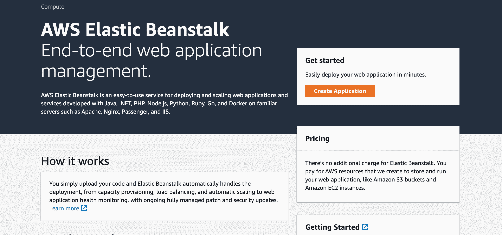

The Main Console page for AWS Elastic Beanstalk

接下来，我们将为我们的 Elastic Beanstalk 应用程序添加名称。

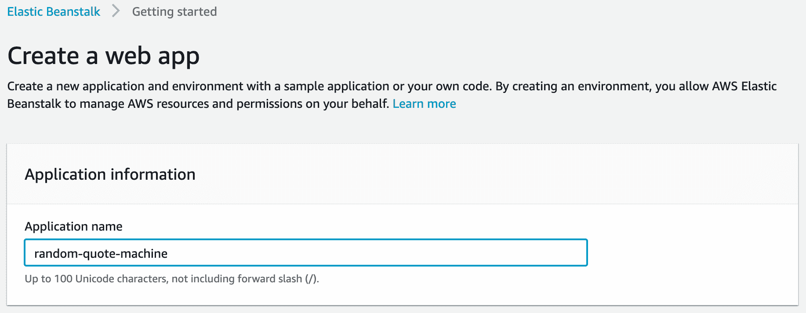

Enter your desired application name

跳过**标签**部分，让我们输入**平台和应用代码**部分的信息。

我们的**平台**是 Node.js，**平台分支**是运行在 64 位亚马逊 Linux 2 上的 Node.js 14(就是告诉我们运行 Node 的是什么样的服务器)，**平台版本**是 AWS 推荐的什么。然后对于**应用代码**，我们要上传我们的代码。

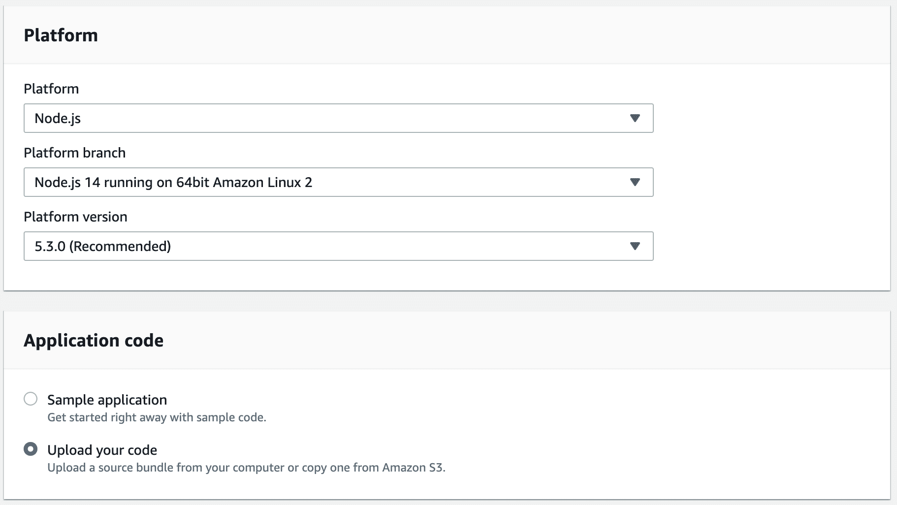

Our settings for the Elastic Beanstalk app

点击**创建应用程序**按钮。

### 上传和部署

在我们点击**上传和部署**按钮之前，我们需要压缩我们的项目。打开`fcc-to-aws-part2` 文件夹，选择其中的所有文件并压缩。不要压缩`fcc-to-aws-part2`文件夹本身——那没用。

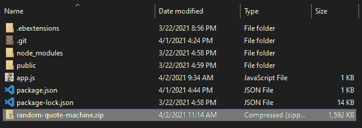

The contents of fcc-to-aws-part2 zipped together, not fcc-to-aws-part2 zipped

现在，在您的弹性 Beanstalk 环境中，压缩您的文件，点击**上传和部署**按钮。选择您的压缩文件。

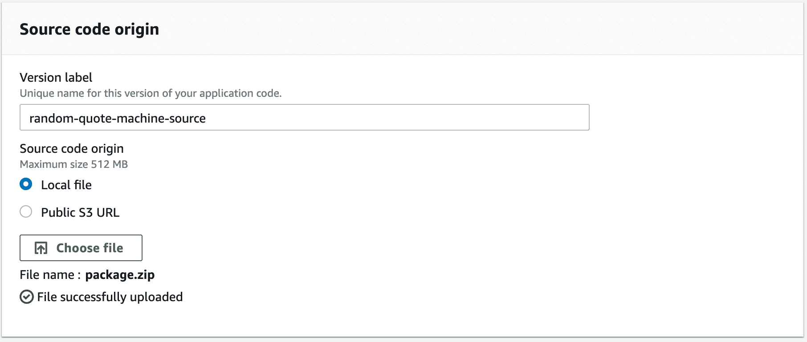

Upload your zipped project

上传代码后，会出现一个黑框，给出一系列日志，这些日志是启动 Elastic Beanstalk 应用程序的步骤。对于每个日志条目，这是一个我们不必做的配置。

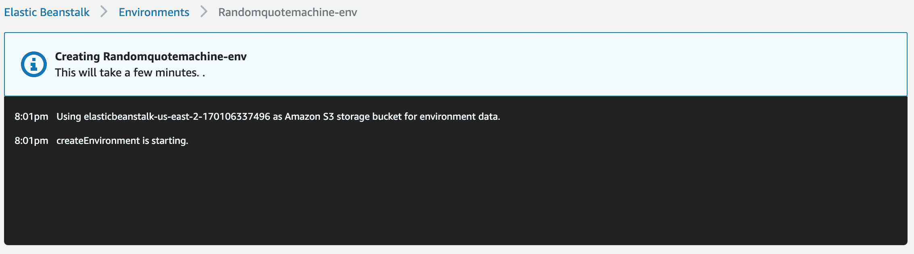

The start of our logs

完成后，您将导航到应用程序的主视图。您将看到您的环境在开始时的健康状态可能是红色的。

不要对此感到惊慌。AWS 现在正在经历我们不想做的配置过程，即启动服务器、创建 URL 端点，然后运行我们的应用程序。这需要几分钟才能完成。

这时，Elastic Beanstalk 正在为我们做所有的配置，让云计算平台变得如此方便！

注意在顶部，您已经有了一个 URL 端点。一旦健康状况有所改善，您应该能够打开该链接来查看您的项目。

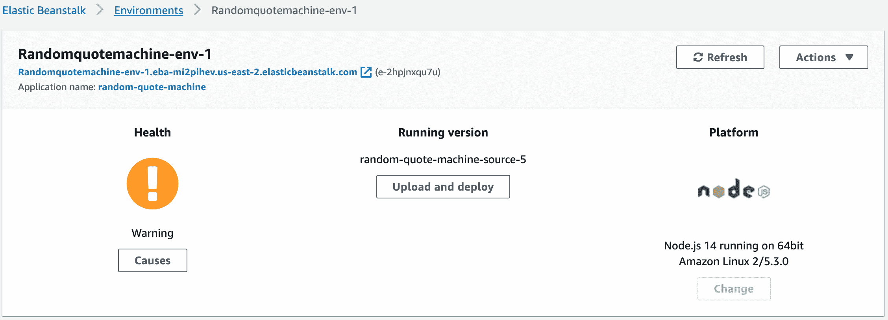

Your url can be found here (under Randomquotemachine-env-1)

如果你的健康状况从来没有先变成橙色再变成绿色，那么一定是出了什么问题。最好的办法是重新下载`fcc-to-aws-part2`，粘贴你的代码，然后重新压缩`fcc-to-aws-part2`的内容，而不是`fcc-to-aws-part2`文件夹本身，并再次上传到 Elastic Beanstalk。

一旦健康状况得到改善，您应该能够打开链接并看到您的项目。更重要的是，现在世界上的任何人都可以通过该链接看到您的项目！

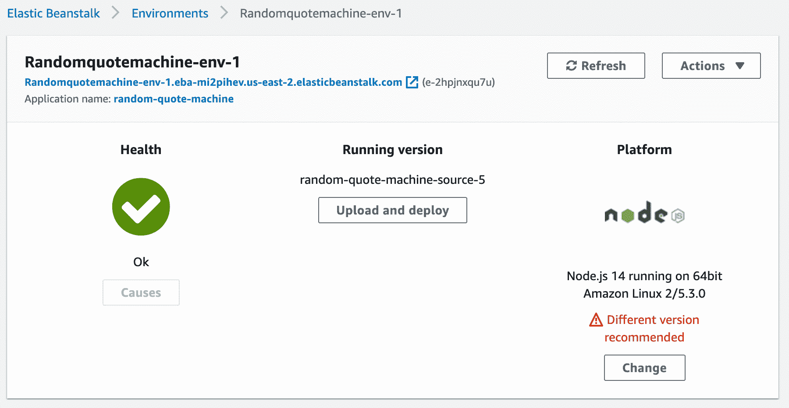

A healthy app, time to go check it out!

## 你做到了！

恭喜你！

我知道这是一个比 S3 部署更长更详细的过程，但你做到了。

这一次，我们通过创建一个 Node/Express 应用程序来为我们的静态文件提供服务，自己承担了一些配置工作，但我们仍然让 AWS 来创建和配置服务器、其环境以及供我们运行和查看项目的端点。

即使我们花时间浏览 Express 代码，部署这个项目所花的时间也是最少的，因为 AWS 为我们自动化了这么多。

我们不必花时间去买一台服务器，在上面安装程序，为它设置一个 URL 端点，或者在上面安装我们的项目。这就是 AWS 等云计算平台的好处。

**注意:**确保停止或终止您的 EC2 实例，或者在您完成后删除您的 Elastic Beanstalk 应用程序。如果你不这样做，无论你的应用程序运行多长时间，你都要付费。

## 弹性豆茎的基础服务

我在本节开始时提到过，Elastic Beanstalk 的美妙之处在于，通过使用该服务，我们实际上获得了许多服务的介绍:EC2、负载平衡器、自动伸缩组，甚至是云监控。

下面是对这些内容的简要解释，以进一步加深您对 AWS 及其服务的了解。

为了更好地了解 Elastic Beanstalk 为我们做的深度配置，请导航到**配置**链接并滚动页面。

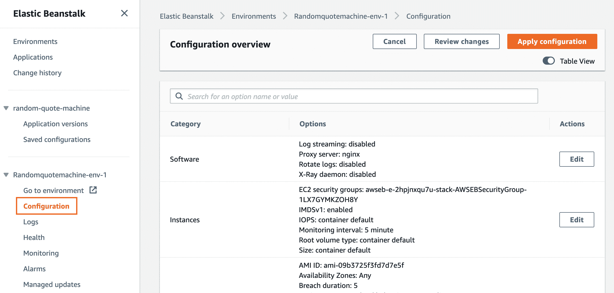

An overview of the configurations Elastic Beanstalk does for us

### EC2

在**配置概述**中有一个类别叫做**实例。**

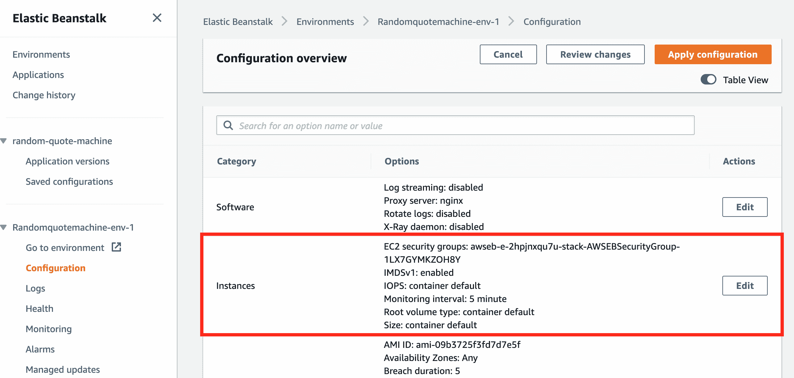

The Instances configuration category

实例是用于服务器或计算机的另一个词。请记住，我们将代码部署到服务器上，AWS 称这些服务器为实例，更确切地说，它们被称为 EC2 实例。

EC2 是 Elastic Computer Container 的缩写，是 AWS 提供的一项服务，可以让您非常快速地启动 EC2 实例。我们可以使用 EC2 快速“启动”服务器，并在上面放置我们想要的任何东西。

在我们的例子中，Elastic Beanstalk 为我们运行了 EC2 服务，并为我们的应用程序启动了一个 EC2 实例。

如果您还在运行您的 Elastic Beanstalk 应用程序，我们可以去看看您的 EC2 实例。在屏幕顶部的 AWS 搜索栏中，输入 EC2 并单击 enter。

您应该看到有一个实例正在运行，就像这样…

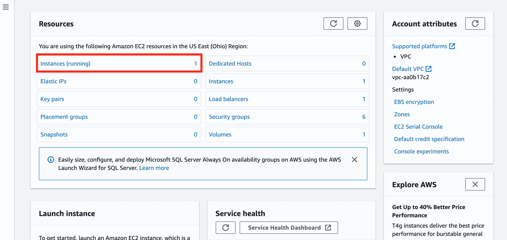

Your EC2 Management Console

如果您点击 **Instances (running)** 链接，您将看到 EC2 实例的细节。这个 EC2 也只是一台运行在 AWS 站点上的计算机，上面有你的代码。EC2 由 Elastic Beanstalk 为我们推出。

### 负载平衡

Elastic Beanstalk 不仅为我们创建了一个 EC2 实例，还为我们创建了一个负载平衡器。在 EC2 管理控制台中，在左侧导航面板上向下滚动到**负载平衡器**并单击链接查看为您创建的负载平衡器。

负载平衡器的目的是在多个目标之间分配传入流量。在我们的例子中，目标是 EC2，但是我们只有一个 EC2 在运行，所以负载均衡器目前并不那么有用。

让我们假设一下，我们的应用程序像病毒一样传播开来，成千上万的人试图访问 Elastic Beanstalk 提供给我们的端点。单个 EC2 实例将被流量淹没。请求会超时，访问者会感到沮丧，我们的站点会受到影响，因为我们没有足够的 ec2 来处理负载。

但是！如果我们有更多的 EC2 实例运行，每个实例上都部署了我们的项目，我们就能够处理病毒式传播。

尽管有多个 ec2 会产生一个问题。我们需要每个 EC2 实例都可以被同一个弹性 Beanstalk 端点访问，这是一个棘手的网络问题。

这就是负载平衡器的用武之地。它为我们的弹性 Beanstalk 提供了一个单一的访问点，然后负载均衡器处理不同 ec2 和 Beanstalk 之间的流量组织。

如果您查看您的负载平衡器**基本配置**，您会看到一个 **DNS 名称**，它看起来很像弹性 Beanstalk 端点。如果你打开它，你的应用程序应该运行。这是因为弹性 Beanstalk 端点实际上指向能够在多个端点之间平衡流量的端点。

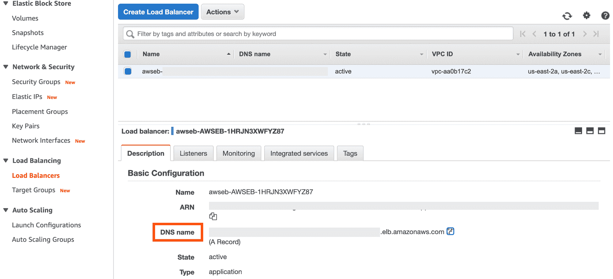

Load Balancer view in the EC2 Management Console

现在，您可能想知道“Luke，我如何让更多的 ec2 启动，这样我就可以利用这个可爱的负载平衡操作了？”很高兴你问了！答案是自动缩放组！

### 自动缩放组

顾名思义，这个 AWS 服务基于一组标准自动伸缩一组 EC2 实例。我们目前只有一个 EC2 实例在运行，这是我们的负载平衡器的目标，但是一个自动伸缩组有可配置的阈值来确定何时添加或删除实例。

要查看您的自动缩放组，请在 EC2 管理控制台的左侧导航中向下滚动到底部，直到找到自动缩放组，然后单击列出的单个自动缩放组旁边的复选框。

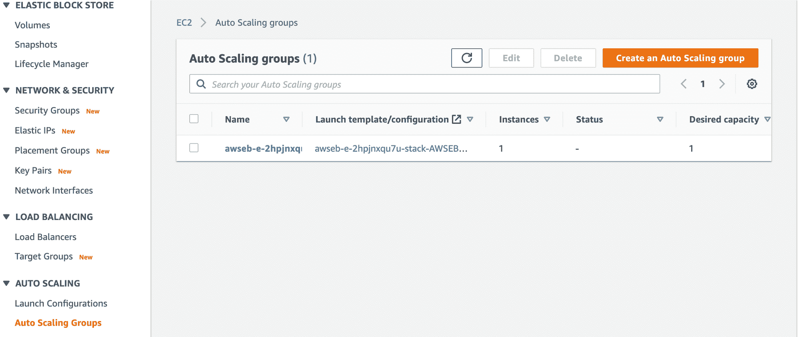

Auto Scaling Groups list in your EC2 Management Console

请随意阅读选项卡中的各种细节，但我想指出几个细节。

首先，单击 Details 选项卡，查看所需的最小、最大容量设置。它应该分别默认为 1、1 和 4。这些值是可配置的，它们是我们告诉 AWS 我们想要运行多少 EC2 实例的方式。

由于 EC2 实例的运行需要资金，公司希望微调添加或删除新实例的频率。我们说我们只需要运行一个，最少运行一个实例，最多运行四个。如果您将所需的值编辑为 2，您将会看到一个新的实例将会启动。

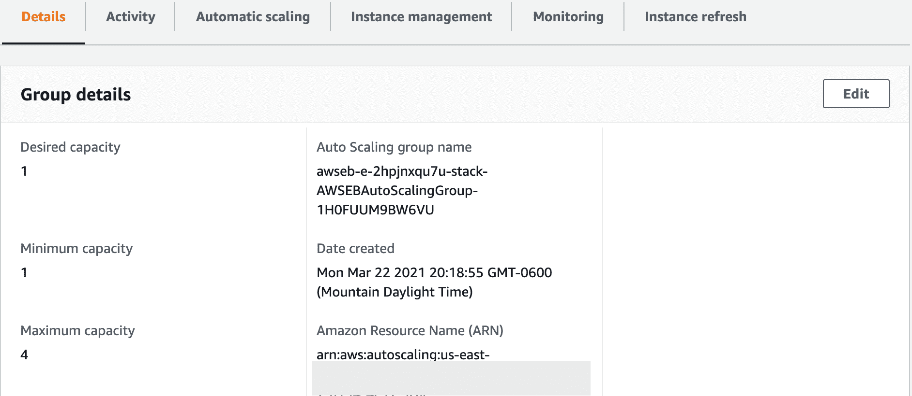

Our Auto Scaling Group capacity settings

但是自动缩放组如何知道何时添加/删除实例呢？单击**自动缩放**选项卡，查看我们当前的配置，以确定何时添加/删除实例。

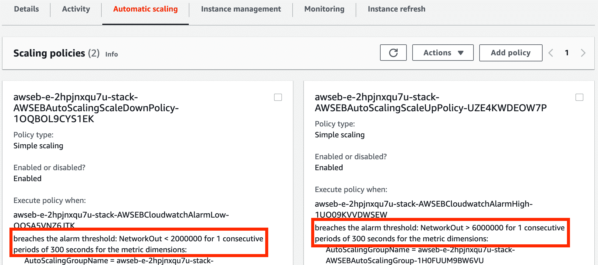

Threshold settings for our Auto Scaling Group

这里我们有两个策略:一个用于向内扩展，一个用于向外扩展。我突出显示了需要达到的当前阈值，以便触发任何一个。

这表示“如果 EC2 实例上的网络问题持续时间超过五分钟，如果我们尚未达到最大容量，则添加一个 EC2”和“如果五分钟内没有网络问题，如果我们尚未达到所需容量，则删除一个 EC2”

就这样，我们的应用程序可以根据我们的自动扩展组的配置进行扩展/缩减。我们的应用程序现在可以处理病毒传播的额外负载！

但是，最后一个问题:自动缩放组是如何知道我们的 EC2 网络错误的？进入，云表。

### 云观察

如果你点击自动缩放组中的**监控**选项卡，你会看到将你带到 CloudWatch 的链接。一旦进入 CloudWatch 管理控制台，您将看到列出了各种 AWS 服务和资源及其相关指标。

浏览列表，你会发现 EC2 和自动缩放组，并监测每个细节。所有这些指标是从哪里来的？AWS 自动为您提供它们，以及这个有用的仪表板，允许我们基于单个指标或复合指标进行一些非常酷的动态联网和编程，如自动扩展。

我们的自动伸缩组可以访问这些指标，并观察 EC2 实例的网络输出指标，以确定是否应该进行伸缩操作。

这是我们从云计算平台中获得优势的又一个例子。

## ElasticBeanstalk 部署概述

我们看了部署应用程序的第二种方法:Elastic Beanstalk。与我们在 S3 的部署相比，这条路线要求我们添加更多的代码来配置我们的 index.html 服务。

我们用了一个 Node.js 的 web 应用框架 Express.js 来服务我们的前端，然后把我们新更新的项目上传到 Elastic Beanstalk。这反过来又为我们推出了无数的 AWS 资源和服务。

我们了解了 EC2、负载平衡器、Auto Scaling Group 和 CloudWatch，以及它们如何通过一个全球可访问的 url 端点协同工作来交付我们的项目。

我们还没有讨论 Elastic Beanstalk 为我们配置和提供的更多设置、服务和资源，但是现在，您已经为了解云托管提供商和一些关键 AWS 服务的优势迈出了良好的第一步。

# 如何使用 AWS Lambda 部署您的 freeCodeCamp 项目

在本文的最后一部分，我们将把代码部署到一个无服务器的环境中。无服务器基础设施正变得越来越流行，比专用的本地服务器甚至托管服务器(如 EC2)更受欢迎。

无服务器路线不仅更具成本效益，而且有助于一种不同的软件架构方法:微服务。

为了了解无服务器世界，我们将通过 AWS 的无服务器服务 Lambda 和另一个 AWS 服务 API Gateway 来部署我们的代码。我们开始吧！

## 什么是无服务器？！

**说，什么？！** 这段时间我们一直在谈论服务器在网络浏览器请求时交付我们的代码，那么 **无服务器** 是什么意思呢？

首先，这并不意味着没有服务器。必须有一个，因为服务器是一台计算机，我们需要我们的程序在计算机上运行。

所以，无服务器并不意味着没有服务器。这意味着您和我，代码部署者，永远看不到服务器，也没有为该服务器设置的配置。服务器属于 AWS，它只是运行我们的代码，不需要我们做任何其他事情。

无服务器意味着对你我来说，实际上没有服务器，但事实上有。

听起来很简单，对吧？确实是！我们不需要配置服务器，AWS 拥有服务器并处理一切。我们只要交出密码。

你可能会问自己，这和 EC2 有什么不同？好问题。

### 配置少了

您还记得我们可以在 Elastic Beanstalk、EC2 管理控制台、自动扩展组和负载平衡器中使用的所有配置选项吗？

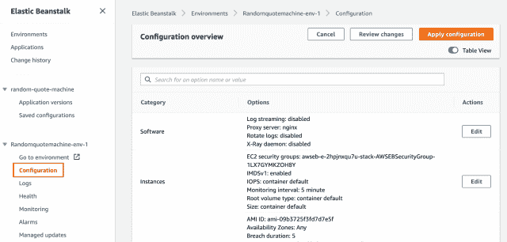

Some of the Elastic Beanstalk configurations available to us

然后，Elastic Beanstalk 使用自己的配置创建了更多的资源，如负载平衡器和自动伸缩组。

好吧，虽然我们 **可以** 配置这些，但是设置起来也很痛苦。更重要的是，它需要更多的时间来设置，这将占用我们开发实际应用程序的时间。

对于 Lambda(一个 AWS 无服务器服务)，我们只需说，“ **嘿，我们想要一个 Node.js 环境来运行我们的代码** ”，然后就没有更多关于服务器本身的配置了。我们可以继续写更多的代码。

### 它更便宜

此外，EC2 只要运行，就会花费我们的钱。现在，终止或暂时停止很简单，可以节省我们的资金，而且通常比购买自己的物理服务器更便宜——但即使没有人试图访问您的网站，它在一天中的任何时候都是要花钱的。

那么，如果有一个选项，只对代码运行的时间收取费用，会怎么样呢？那是无服务器的！

有了 AWS Lambda，我们的代码可以随时运行，它位于服务器上。但是它只在被请求时运行我们的程序，我们只为它运行的次数付费。成本节约是巨大的。

### 微服务架构

因为大多数程序都是在服务器上编写和部署运行的，所以该应用程序的所有代码都被捆绑在一起，这样服务器就可以访问和运行整个应用程序。有道理！

但是，如果你有办法用无服务器的方法运行代码，只运行要求的代码，你可以把一个应用程序分解成许多应用程序。将一个应用程序分解成更小的子应用程序是微服务的理念。

微服务方法的主要好处之一是更新过程。如果我们有一个单一的应用程序(一个在 EC2 上捆绑在一起的应用程序)，并且需要更新一小段代码，那么我们必须重新部署整个应用程序，这可能意味着服务中断。

或者，微服务方法意味着我们只更新处理一小部分代码的小应用程序。这是一种不太突然的部署方法，也是 AWS Lambda 允许我们采用的微服务方法的主要优势之一。

我应该指出，无服务器也有自己的缺点。首先，如果您有一个通过无服务器的微服务架构，那么集成这些微服务以相互通信需要额外的工作，而单片应用程序不需要处理这些工作。

也就是说，这是一种非常受欢迎的方法，并且越来越多地被使用，所以它值得你去了解。

免责声明:从技术上讲，第 1 部分对 S3 的使用是一种无服务器部署，但通常当人们讨论无服务器和 AWS 时，他们谈论的是 Lambda。

## 如何开始使用 AWS Lambda

因此，Lambdas 允许我们执行代码，而不用担心服务器配置或成本。就是这样。它们运行在 AWS 拥有的服务器上，由 AWS 配置，由 AWS 管理，我们从未见过。

在大多数情况下，我们所控制和关心的只是函数。这就是云计算中所谓的 **功能即服务** 。它让我们专注于代码，而不需要考虑基础设施的复杂性。

现在我们知道 Lambdas 只是运行在 AWS 服务器上的函数，我们不需要配置，让我们从我们的开始吧。

### 如何创建我们的λ

前往 AWS Lambda 管理控制台。点击**创建功能**按钮。在下一个屏幕上，我们将从头开始选择**作者**，输入我们函数的名称(也就是我们 Lambda 的名称)，然后选择 Node.js 14.x 运行时。

这就是我们现在需要做的，继续点击右下角的**创建函数**按钮。


Our screen when creating our Lambda function

下一个加载的屏幕将是我们管理 Lambda 的控制台。如果你向下滚动一点，你会发现一个嵌入式代码编辑器和文件系统。以您的 Lambda 命名的目录(又名文件夹)已经存在，还有一个 index.js 文件。点击**文件**，创建一个名为`index.html`的新文件。


You should have an index.js and index.html files

### 调整项目的代码

由于这种部署的性质，我们需要稍微调整一下我们的代码。而不是在我们的 freeCodeCamp 项目的 index.htm**l**中使用`<link href="styles.css" />`标签和`<script src="main.js"></script>`标签来链接我们的。css 和。js 代码添加到我们的 HTML 代码中，我们将把它们直接添加到 HTML 文件中。

如果我们不这样做，那么当我们试图打开我们的应用程序时，它会在不同的 URL 路径上查找这些文件。

要更改 Lambda 中的代码，请执行以下操作:

1.  用`<style></style>`替换你的 index.htm**l**文件中的`<link href="styles.css"/>`行(这应该就在你的`<body>`开始标签的正上方)
2.  打开你的`styles.css`文件，复制所有的 CSS，粘贴到两个`<style>`标签之间(像`<style> **your pasted code** </style>`)。
3.  对我们的`main.js`做同样的事情——移除开口`<script>`标签内的`src="main.js"`。
4.  打开你的 main.js 文件，复制你所有的 js 代码，粘贴到我们的【index.html】*(即:`<script> **your main.js code** <script>`)文件底部的两个`<script>`标签之间*

*一旦完成，在网络浏览器中本地打开你的 index.htm**l**以确保你的项目在继续之前仍然工作。*

### *将我们项目的代码添加到 Lambda 中*

*随着我们更新的 index.html 页面的工作，回到我们的 Lambda 控制台。在那里，将你所有的 index.html 代码粘贴到你在 Lambda 中创建的 index.html 文件中。仔细检查以确保你复制/粘贴了所有的代码。*

### *更新 index.js Lambda 文件*

*好了，我们有了 index.html，但是，就像我们在 ElasticBeanstalk 部署中制作的 Express.js 应用程序一样，我们需要告诉 Lambda 我们想要交付给 web 浏览器的文件在哪里。*

*将以下代码复制并粘贴到您的 Lambda 的 index.js 文件中，然后我们将讨论它。*

```
*`const fs = require('fs');

exports.handler = async (event) => {
    const contents = fs.readFileSync(`index.html`);
    return {
        statusCode: 200,
        body: contents.toString(),
        headers: {"content-type": "text/html"}
    }
};`*
```

*如果您完成了 ElasticBeanstalk 部署，您应该对这段代码的顶部很熟悉。我们正在导入一个名为`fs`的节点模块，它是文件系统的缩写。它让我们遍历我们的文件系统，在我们的例子中，找到我们的 index.html 文件。*

*你会注意到`exports.handler`函数，这是一个给我们的现成函数，这个 Lambda 被配置为寻找这个函数。*

*当这个 Lambda 被触发时(稍后会详细介绍)，它会寻找指定的文件和函数名来运行。当我们点击 **Create Function** 时，它被预先配置为在 index.js 文件中查找`handler`函数。*

*如果我们想的话，我们可以改变它，但是现在知道这个`handler`函数是我们的 Lambda 函数就足够了。*

*该函数读取我们的 index.html 文件，将它赋给一个名为`contents`的变量，然后返回它。*

*它返回的方式是特定于 API 请求的。我们的 Lambda 就是这样被触发的。通过在浏览器中打开项目，浏览器向端点发出 GET 请求，这将触发 Lambda 向浏览器返回 index.html。*

*让我们创建 API 来触发 Lambda 将 index.html 文件返回给浏览器。*

***重要提示**:在我们继续之前，点击**部署变更**按钮。这节省了我们的λ。*

## *AWS API 网关*

*在 AWS 服务搜索栏中，键入 API Gateway，然后打开链接。你现在在 API 网关控制台中，我们想点击**创建 API** 。*

*接下来，选择 REST API 选项并点击 **Build** 。*

*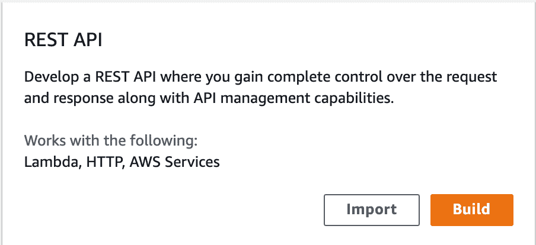

We are building a REST API to trigger our Lambda* 

*填写您的 API 的名称，如果您愿意，还可以添加描述，然后单击**创建**T2 API。*

*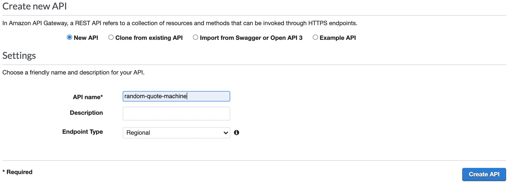

Creating our new API* 

*创建 API 后，您将被重定向到该 API 的管理控制台。现在我们需要做的就是创建一个 API 端点来触发我们的 Lambda。*

### *创建我们的 GET 方法*

*如果你不熟悉 API 方法，它们是描述动作发生的动词。我们的 web 浏览器正在尝试获取 index.html 文件，这个 API 端点将能够在我们的 Lambda 的帮助下获取该文件。*

*因此，我们需要在我们的 API 上创建一个 GET 方法。为此，点击**动作**，然后选择**创建方法**。*

*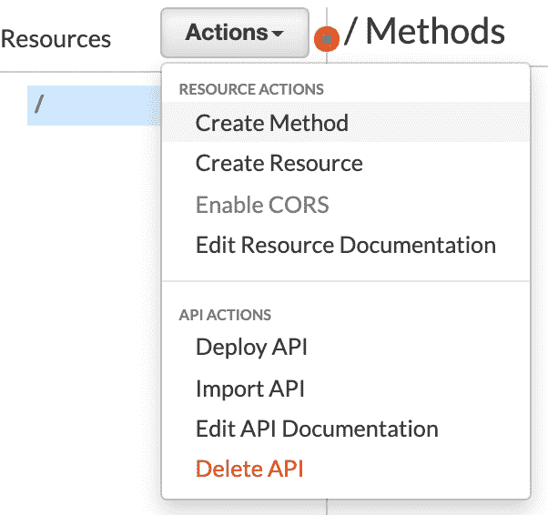

Creating our Method* 

*然后，选择**获取**并点击复选框。*

*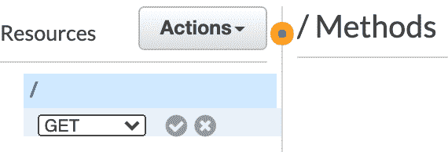

Specifying a GET method* 

### *选择我们的λ作为触发器*

*现在，我们的 API 上有了 GET 方法，我们可以附加一个 Lambda，当这个方法被点击时就会被触发。*

*在资源列表中点击新创建的 GET 方法。然后您会看到一个创建方法集成的表单。这是我们将 Lambda 与这个 API 端点配对。*

*我们的整合应该是:*

*   ***积分类型**:λ函数*
*   ***使用 Lambda 代理集成**:启用*
*   ***Lambda 函数**:你的 Lambda 的名字*
*   ***使用默认超时**:启用*

*

Be sure to select the Use Lambda Proxy Integration* 

*您需要键入 Lambda 的第一个字母来填充它。如果您没有看到它被填充，那么您的 Lambda 可能在不同的 Lambda 区域。*

*在这种情况下，导航到您的 Lambda，在屏幕的右上角查看该地区(如俄亥俄州，即 us-east-2 ),然后在此步骤中再次选择适当的地区。*

*点击**保存**按钮。现在要做的最后一件事是部署我们的 API 网关，以便我们的 GET 方法触发我们的 Lambda 的添加是活动的。*

### *部署 API 网关*

*再次单击 **Actions** 下拉菜单，这是我们用来创建 GET 方法的下拉菜单。*

*选择**部署 API** 选项。*

*在部署阶段下拉列表中，选择**【新阶段】**。*

*输入一个阶段名称，如 **prod** ，如果您愿意，还可以输入一个描述，然后单击**部署。***

*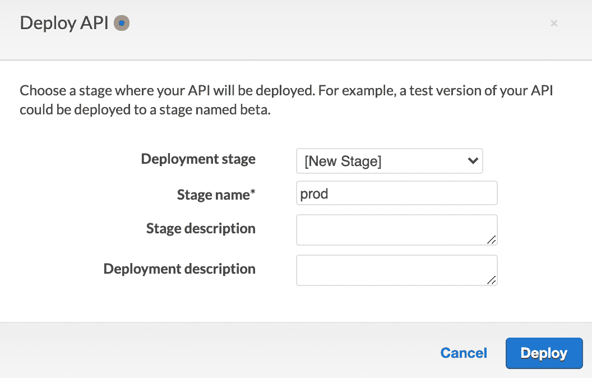

Deploying our API* 

*就是这样！我们完了。现在我们去测试一下。*

## *运行它！*

*就像 S3 和 Elastic Beanstalk 给了我们一个查看项目的端点一样，API Gateway 也给了我们一个——尽管这次我们通过指定 GET 方法和部署阶段的名称来帮助创建端点。*

*要查看您的端点，请在左侧导航菜单中选择**阶段**，然后您应该会在右侧的框中看到您的阶段的名称。展开你的舞台，点击**获取**方法。*

***！！** **确保你点击 GET 方法得到正确的网址！！***

*在右边，你会看到**调用 URL** ，如果你点击它，你会被引导到你的项目。*

*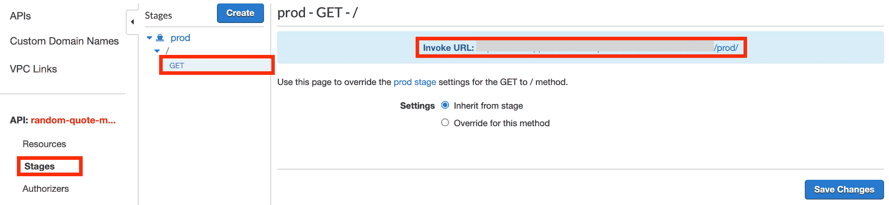

Make sure you are in Stages and click your GET method to view the correct URL* 

*恭喜你！现在，您应该看到您的项目是从使用 AWS 的第三种部署方法启动的。*

*如果您在查看项目工作时遇到问题，请仔细检查以下几点:*

*   *在我们添加了 index.html 并编辑了 index.js 之后，你有没有点击**在你的 Lambda 中部署变更**？*
*   *当我们创建 GET 方法时，您是否点击了**使用 Lambda 代理集成**？(您必须删除该方法并重新创建以确保这一点)？*
*   *你的项目代码是否正确的复制到了`<style>`和`<src>`标签中？*

## *AWS Lambda 的使用案例*

*在我看来，Lambda 是我们可以使用的最通用的 AWS 资源。Lambda 的用例似乎是无穷无尽的。有了它，我们可以:*

*   *交付我们的前端(就像我们刚刚做的那样)*
*   *做实时处理*
*   *上传到 S3 的流程对象(如图像、视频、文档)*
*   *自动化任务*
*   *为应用程序构建无服务器后端*
*   *还有[多](https://aws.amazon.com/lambda/resources/customer-case-studies/) [多](https://docs.aws.amazon.com/lambda/latest/dg/applications-usecases.html)！*

## *结论*

*祝贺您到达本教程的结尾！到目前为止，您应该对主要的 AWS 资源和服务有了基本的了解:S3、EC2、Auto Scaling Group、负载平衡器、API Gateway、CloudWatch 和 Lambda。*

*您在理解如何部署您在 freeCodeCamp 及其他平台上创建的项目方面向前迈进了一大步。我希望这些信息对您有用，如果您有任何意见、问题或建议，请随时联系我们！*