# 如何从 GitHub 将你超级酷的 Node 应用部署到 Azure

> 原文：<https://www.freecodecamp.org/news/how-to-deploy-your-super-cool-node-app-to-azure-from-github-47ebff6c5448/>

作者 rohit rawname

# 如何从 GitHub 将你超级酷的 Node 应用部署到 Azure


你是一名 Nodejs 开发人员吗？他喜欢开发精彩的应用程序，但是需要一个地方来展示它。

你是一个被 Azure 迷住并想尝试一下的人吗？

你也是那个被 Azure 提供的配置淹没的人吗？

良好的..今天我将解释一个非常简单的方法，只需点击几下鼠标就可以让你的应用程序在 Azure 上运行。

> 我发表了一篇关于从 Github 免费向 Heroku 部署“酷节点应用”的文章。但现在我们已经决定建立一个“超级酷”的节点应用程序，我们将使用市场上另一个热门的云服务。

闲话说够了…现在让我们言归正传。

### **步骤 1:创建超级酷节点应用**

让我们首先创建那个超级酷的 Node 应用程序。

在你的本地机器上创建一个文件夹，并给它起一个名字(由你选择)，比如说 MySuperCoolApp。

添加一个名为 package.json 的文件，并粘贴以下内容。这个文件是我们软件包的基本信息。(这也可以通过键入命令 npm init 并接受所有默认设置来创建。)

```
{"name": "supercoolnodeapp","version": "1.0.0","description": "super node app ","main": "app.js","scripts": {"start": "node app.js"},"repository": {"type": "git","url": ""},"author": "","license": "ISC","bugs": {"url": ""},"homepage": ""}
```

需要注意的一个非常重要的变化是这一行:

```
"start": "node app.js"
```

部署完成后，Azure 将运行该命令来启动您的应用程序。

添加文件 app.js，并粘贴以下代码。这将是我们应用的起点。

```
const http = require('http');
```

```
const port=process.env.PORT || 3000
```

```
const server = http.createServer((req, res) => {
```

```
res.statusCode = 200;
```

```
res.setHeader('Content-Type', 'text/html');
```

```
res.end('<h1>Hello World</h1>');
```

```
});
```

```
server.listen(port,() => {
```

```
console.log(`Server running at port `+port);
```

```
});
```

这段代码在本地服务器上打开一个端口，为一些 HTML 提供服务。

请注意这里的**最重要的**代码块:

```
const port=process.env.PORT || 3000
```

当您想要将应用程序部署到云中时，这一点非常重要。应用服务器在云上的一个随机端口上启动。如果您像所有入门指南中一样硬编码一个端口号，并部署到云，则特定的端口号可能不可用。应用程序永远不会启动。所以最好获取云实例分配的端口号，启动 HTTP 服务器。

保存文件并在命令提示符窗口(在文件夹中打开)中运行以下命令:

```
node app.js
```

这样，Node 将启动服务器并显示以下消息:

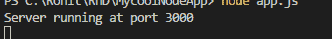

现在，如果我们在浏览器中打开 [http://localhost:3000/](http://localhost:3000/) ,我们会看到:


酷！我们创建了一个简单但超级酷的 Nodejs 应用程序。

### 第二步:推送至 GitHub

现在想把我们的代码上传到 GitHub。这样，我们将能够在任何地方编辑我们的代码，并且将提交的更改立即部署到云中。

让我们通过点击 New Repository 在 [GitHub](https://github.com/) 上创建一个资源库。

给它一个名称和一些描述，然后单击 Create repository:

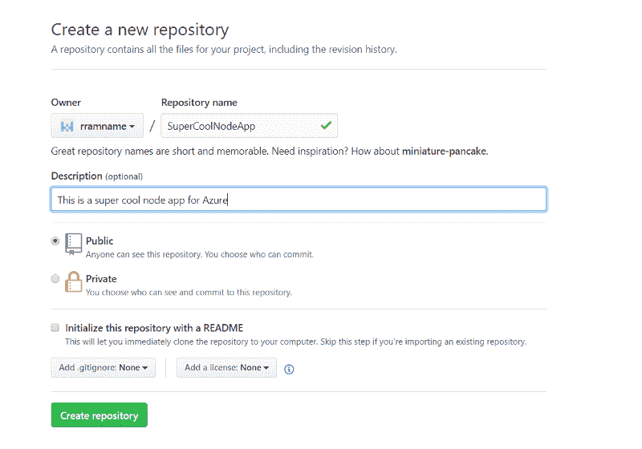

GitHub 会创建一个库，并给你一些可以在本地运行的命令，这样你就可以用你的 GitHub 库克隆你的本地文件夹。

在 package.json 文件所在的应用程序中打开命令提示符。在命令提示符下，按顺序运行以下命令。

1.  在根级别初始化 Git 存储库:

```
git init
```

2.将所有文件添加到本地 Git (staging)中。注意最后一个点:

```
git add .
```

3.将您的更改提交到本地 Git:

```
git commit -m “first commit”
```

4.链接到您的 GitHub 库。(请将 URL 更改为指向您的存储库。)

```
git remote add origin https://github.com/rramname/MySuperCoolNodeApp.git
```

5.推动你的改变:

```
git push — set-upstream origin master
```

您应该会在命令提示符下看到如下消息。


现在，如果您打开 GitHub 并刷新存储库，您应该能够看到代码。

### 步骤 3:现在，让我们把它放在 Azure 上

本练习假设您已经设置了 Microsoft Azure 订阅并准备好使用**。如果你没有，你可以去微软的 Azure [网站](https://azure.microsoft.com/en-us/free/)免费创建一个。它会询问你的信用卡信息。除非您购买了付费服务(本演示不需要付费)，否则不会向您的卡收费。**

打开 portal.azure.com 并使用您的凭据登录。

单击左上角的创建新资源。在搜索框中输入“web app”以获取所需的资源类型，然后点击 Enter。

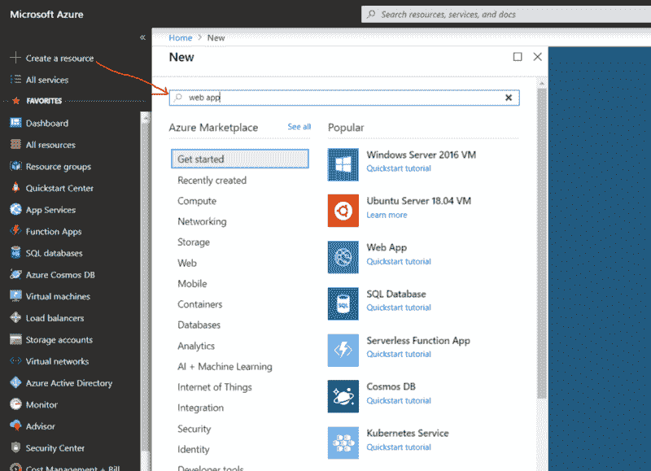

从搜索结果中选择 Web App。

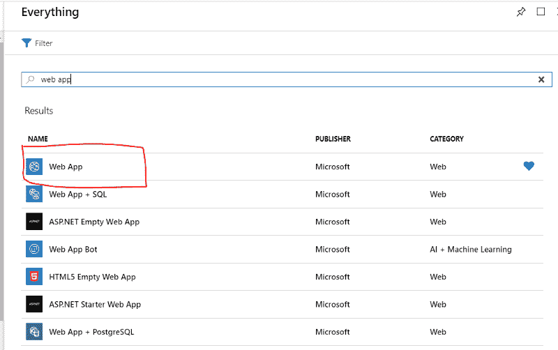

然后单击创建按钮。

我们将被要求提供此应用程序的一些基本信息:

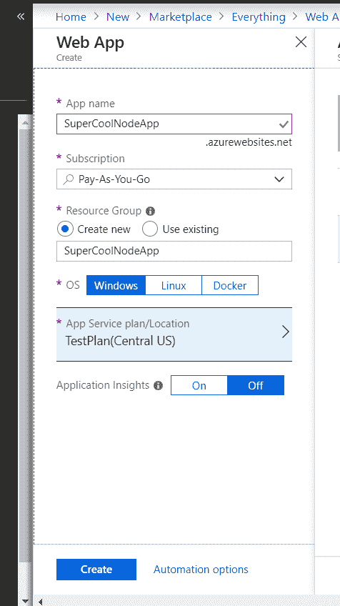

第一个框是您的应用程序的名称。这非常简单，因为它的超冷节点应用程序:)

第二个选择是订阅。我已经注册了“预付费”套餐，因为我已经用完了我的免费试用版。您可以在此选择您的免费订阅计划。

接下来是资源组。这是你在 Azure 上应用的逻辑分组。你可以为此应用创建新的或使用现有的。我为这个应用程序创建了一个新的应用程序，名为 SuperCoolNodeApp。

最后，你必须选择应用服务计划。我已经创建了一个名为 Test Plan 的免费计划。如果您还没有计划，您可以创建一个新计划，但请确保您选择了一个免费版本。选择时，Azure 会自动选择非免费的 S1 层。确保你把它改为免费的演示计划(当然，如果你想要更高的能力，处理能力等，去付费计划。)

点击**创建。**

Azure 会将你创建应用的请求与你选择的服务计划进行排队，并在顶部显示一个小通知。创建一个应用程序应该不会花太多时间。如果您在一两分钟内刷新您的页面，您应该能够看到在所有资源下创建的应用和服务计划。

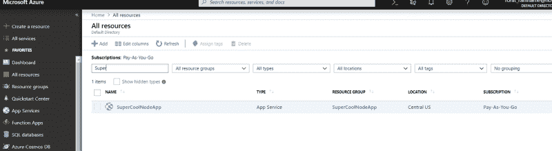

现在，点击它以查看我们刚刚创建的应用程序的详细信息。

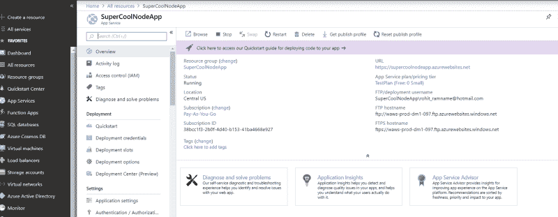

它显示了计划正在运行的订阅，运行状态，订阅 ID，应用程序在“美国中部”托管的服务器上的位置和一些 FTP 细节。但是这里最重要的是 **URL** 。这将是我们在云中的应用程序的 URL。

现在让我们把它拿到那里…

> 小剧透一下，:)在这一节中，我们将为我们的应用程序配置部署策略。

向下滚动并单击部署选项。

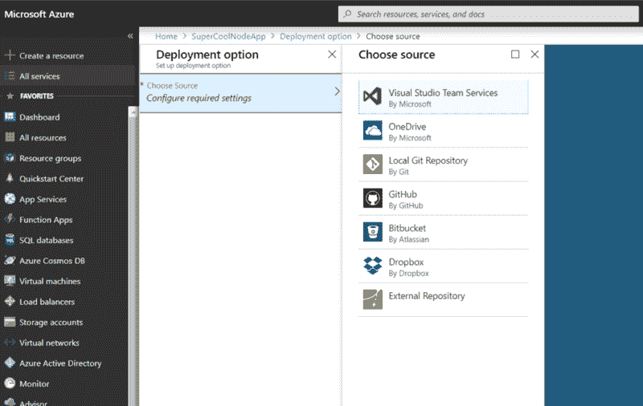

点击配置所需设置，并选择 GitHub。它应该会显示下面的屏幕。

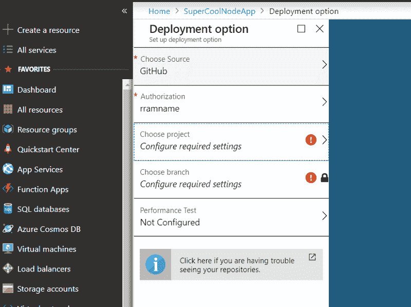

单击选择项目。这应该会显示你的 GitHub 帐户上的所有存储库。

如果你是第一次这样做，你必须向 Azure 提供访问你的 GitHub 账户的授权。

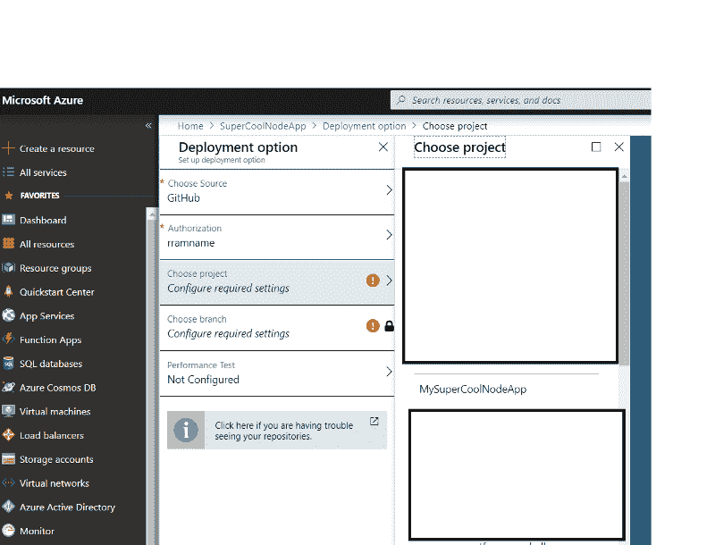

在这里，您将选择您推送到 GitHub 的 MySuperCoolNodeApp。


接下来，我们可以选择要部署的分支。

现在，我只有主人，所以我离开默认的一个。

仅此而已。单击确定。

Azure 将负责部署应用程序。它甚至会向您显示这个小通知，Azure 正在进行这项工作。

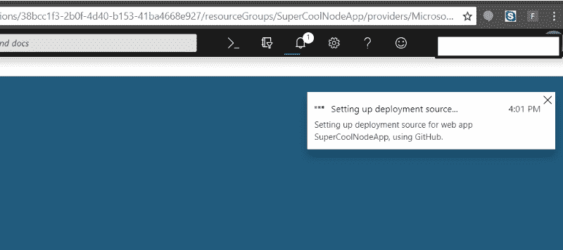

完成后(真的不应该花那么长时间)，再次点击部署选项。您应该能够看到最后一次部署。


如果你点击记录，Azure 甚至会显示部署事件的日志。

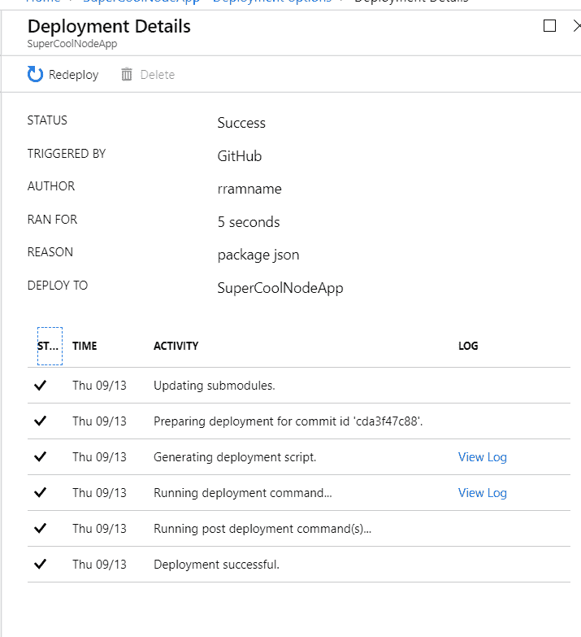

酷毙了。现在，如果你打开你的应用程序，转到概述部分提到的网址[https://supercoolnodeapp.azurewebsites.net/](https://supercoolnodeapp.azurewebsites.net/)，你会看到 Hello World 消息，但你会看到下面的错误。

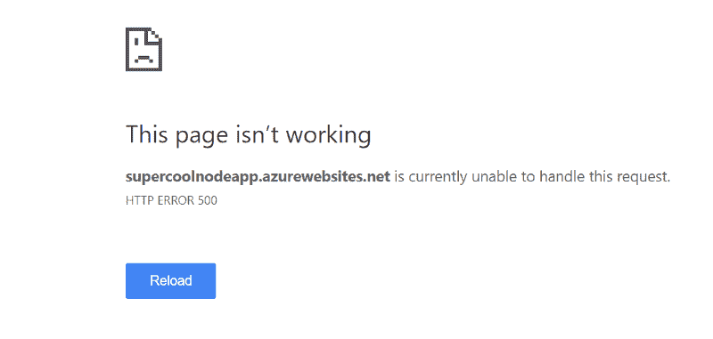

嗯…怎么了？日志显示应用程序已部署，您看不到任何错误，但应用程序不工作。这是一个谜。

你需要在 Azure 门户上做一个小的设置来帮助 Azure 把它当作一个 Nodejs 应用并相应地启动它。

打开应用程序设置，向下滚动到应用程序设置部分，并添加以下条目。

```
App setting name : WEBSITE_NODE_DEFAULT_VERSION
```

```
Value: 8.9.0
```

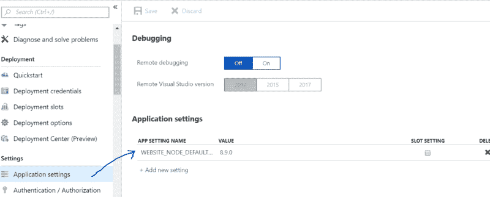

基本就是在告诉 Azure 使用这个节点版本，打开网站。

单击顶部的保存。

现在如果你去 https://supercoolnodeapp.azurewebsites.net/的网址

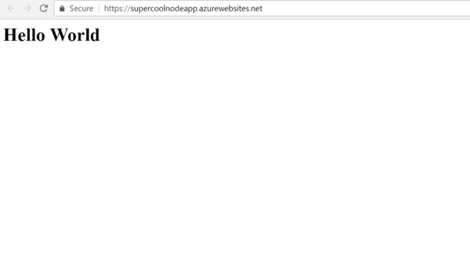

呜哇！！！给你。我们刚刚在 Azure 上运行了超级酷的 Node 应用程序。

恭喜你！！现在，每次你对你的应用程序进行任何更改并推送到 GitHub，Azure 都会捕捉到这些更改并进行持续部署。

页（page 的缩写）如果你曾经开发过比我更酷的应用程序:)，那么请分享。

如果这篇文章对你有帮助，我喜欢这里的掌声，并在 twitter 上联系:)

> 我只在 Twitter 上写编程和技术。

玩得开心！！