# 如何设计形成习惯的购物体验

> 原文：<https://www.freecodecamp.org/news/how-to-design-a-habit-forming-shopping-experience-af7748402e90/>

穆罕默德·比拉尔

# 如何设计形成习惯的购物体验

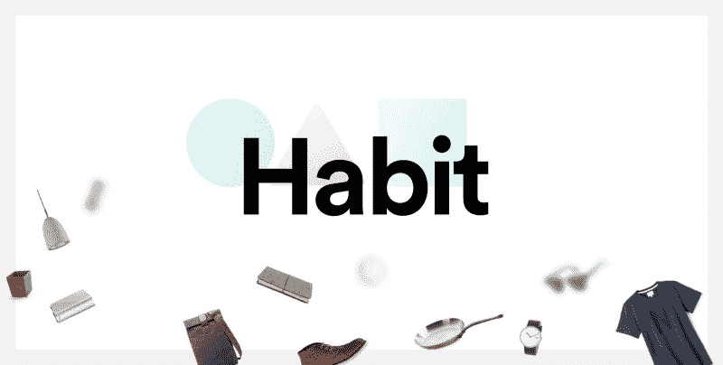

为电子商务设计是一项艰巨的任务。消费者——尤其是印度的消费者——天生对价格敏感。从手机配件到电视机，最便宜的上市胜出。

无论是 Flipkart、亚马逊，还是 Snapdeal，价格都是最重要的。这给忠诚留下了很小的空间。

这给 Flipkart 留下了一个非常有趣的问题需要解决:如何创造忠诚的客户？你如何建立一种购物体验来帮助抑制追求便宜、注重便利的行为？

为了保持业务运营，电子商务平台**依赖于周期性的活动**,包括季节性/节日销售、清仓销售、主题销售等。，卖家达成协议，对他们的物品提供一定的折扣。

将我的组织放在背景中，2015 年 Flipkart 在“大十亿日”期间销售了价值 3 亿美元的商品，这是一个对 Flipkart 的业务非常重要的五天销售活动。在销售的第一个小时，Flipkart 售出了约 50 万件产品，每秒钟有近 140 个订单，遍布印度 3200 个城镇。

但是生活并不总是阳光和彩虹——即使对于电子商务巨头来说也是如此。Flipkart 发现，在这些销售活动结束后，**卸载数量**会立即上升——自 2014 年以来，T2 的平均保留率约为 30%。销售结束后，用户不会经常使用 Flipkart 移动应用，这也暗示了印度移动用户面临的存储限制。他们选择保留脸书、Whatsapp 和 YouTube 等他们更习惯的应用，而不是 Flipkart。

这让我们更深入地了解了不同类别的应用程序在客户忠诚度方面的表现:

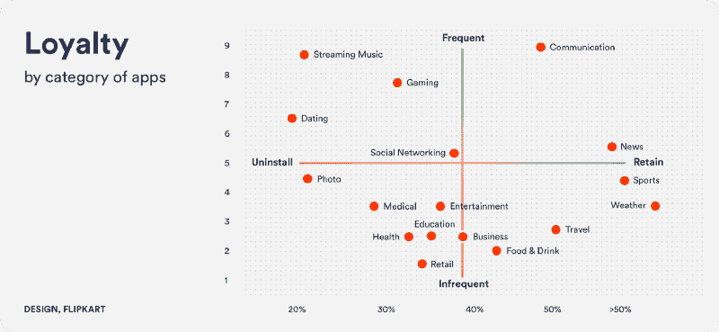

这给了我们两个人(我和 Rahul，他们在 Flipkart 从事这个项目)足够的背景来问自己:**如何打造习惯形成产品？**

### 我们的方法

习惯是很少或没有意识到的行为。研究表明，我们每天所做的大约 40%是出于习惯。视频游戏行业一直在使用`hook`的概念来保持用户对其产品的投入&。

钩子从用户环境中的一个触发器开始。当我们在产品上看到不同程度的通知时，我们就熟悉了**外部触发**。但是形成持久习惯更关键的是**内在触发因素。**

最常见的内部触发因素是情绪上的，而且通常是负面的。所以用户试图通过浏览 Instagram 或在线观看[搞笑](https://www.youtube.com/watch?v=f8uK_mWnbr4)视频来改变这种负面情绪。

我们一天中会不自觉地做很多事情来逃避消极的情绪状态，这就是我们认为可以通过在 Flipkart 上为用户显示相关交易来进行实验的地方。

用户会让步——期待得到**奖励——**，从而参与/ **对产品/应用的投资**。

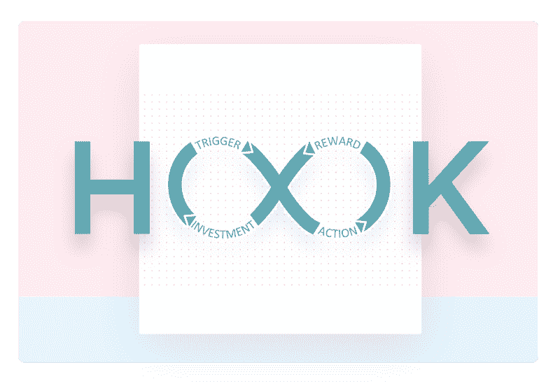

每天早上，当我们醒来时，我们大多数人都会感受到至少一种强烈的情绪:害怕错过。如果你发现自己早上第一件事就是查看电子邮件、脸书或推特，那么这可能就是你内心正在发生的事情。

> 事实上，2013 年, **FOMO(害怕错过)**这个词被收入了《牛津英语词典》。尽管这个术语最近才被加入我们的词典，但体验 FOMO 并不是什么新鲜事。

除了我们的外部触发器之外，我们看到了创建内部触发器和启动挂钩的机会。

### 我们的解决方案

我们试图列出各种可能在购物环境中吸引印度消费者注意力的外部触发因素的原型。为了给外部触发器创建一个媒介，我们必须想出一个 UI 模式来实现这一点。

我们观察到，传统的通知方法可能不会很好地工作，因为它有许多固有的问题，其中包括消费者中日益增加的[通知盲目性](https://leftrightlabs.com/notification-blindness-can-be-deadly/)。

#### 1.每日文摘:`**Infinite VS Finite Feed**`

我们想到构建一个有限数量产品的每日摘要，每天更新一次。这意味着我们不得不远离无穷无尽的产品，这经常让用户陷入**决策瘫痪。**

这意味着我们的推荐引擎必须从头开始重新构建。Flipkart 是一个市场，拥有 80 多个类别的 3000 多万种产品。这种多样性意味着我们需要将这些产品与用户的兴趣对应起来。这让我们面临下一个挑战:相关性。

#### 2.关联

很明显，用相关产品个性化这个有限的 feed 将是我们应用参与的生命线。传统的推荐系统通过结晶使用历史和发现其中的模式来工作。

但对我们来说，这只能部分解决问题。因此，我们采访了一些用户，以了解他们何时以及如何在网上购物。我们了解到，我们的用户购物有两大主题:

1.  **意图:**当有强烈的需求时，用户执行一个狭窄的搜索。这就是我们在捕捉意图和满足需求时，必须使我们的搜索更加客观的地方。
2.  **兴趣:**在这个范围的另一端，有“橱窗购物”用户喜欢的产品。不仅仅是产品——我们生活中的一些主题让我们(有时甚至激发我们)去购物。也许你有健身意识，或者你是一个旅游爱好者，或者你喜欢 Nautica 这个品牌，或者你最近刚为人父母，或者你朋友的婚礼即将到来。这就是我们必须彻底收集用户兴趣的地方。

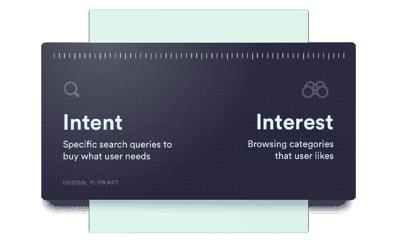

#### 3.物联网

当我们把数以百万计的产品简化成少数几个易于消化的产品时，我们需要考虑如何让用户能够接触到不同类别的产品。在 Flipkart，我们的竞争优势是我们庞大而深入的产品库存。

当我们对用户进行描述时，我们发现购物是按主题进行的(再次强调意图和兴趣)。我们决定为每个产品分配一组元标签，每个标签将是主题相关产品集中的一个节点。

我们没有按类别分组和划分，而是扭转了局面。我们根据不同的主题和故事对产品进行了分类。

该网络可以是有机和无机节点的组合。这意味着向用户推送有趣的基于事件的内容。每个用户的增长都不一样。下面是我们为旅行设计的一个这样的网络。

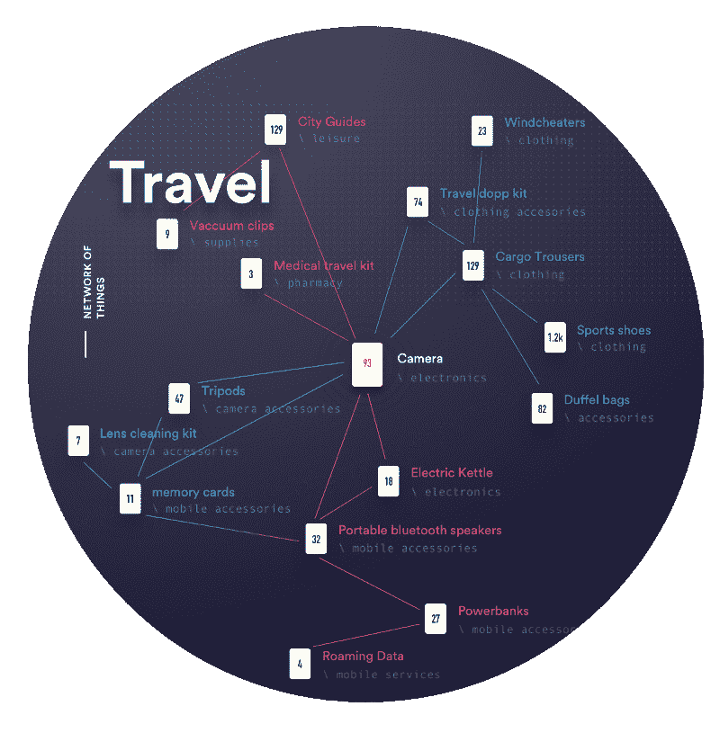

### 设计

在一些白板和各种组件的草图之后，我在 Pixate 上创建交互式原型，同时在 Sketch 上把模拟放在一起。

这里有一个展示设计解决方案的短片:

#### 介绍会；展示会

*   呈现一个应用的 UX 有很多种方式，但我个人觉得围绕一个用户故事的**短视频**是最方便也是最全面的解释形式。
*   写一个**脚本**，它是一组用户故事的合并。花相当多的时间来完善它。让其他利益相关者运行它，以确保视频的主干到位。
*   一旦脚本准备好，开始把**交互原型**放在一起，按照正确的顺序。建议在设备上录制相同的内容，以反映逼真的体验。
*   接下来是**画外音**。与传统的广告画外音相比，我喜欢声音的语气更坦率一些。你可以从[雇一个画外音艺术家](http://www.fiverr.com)

### 草图

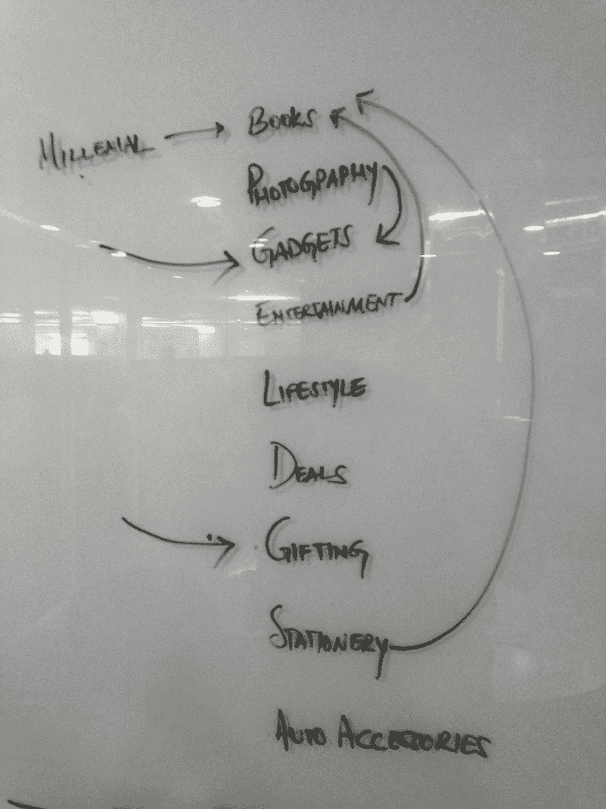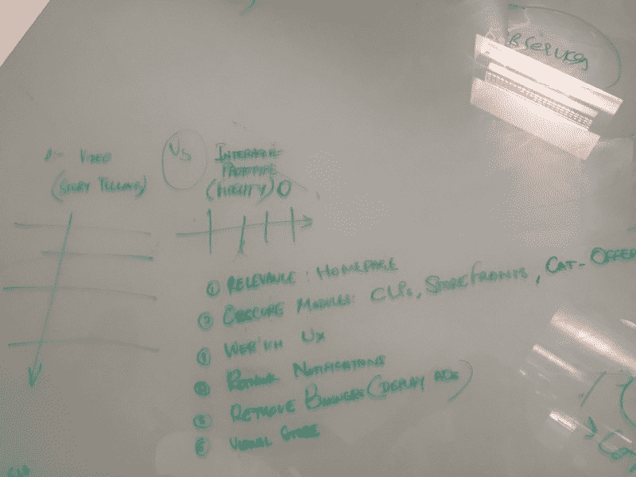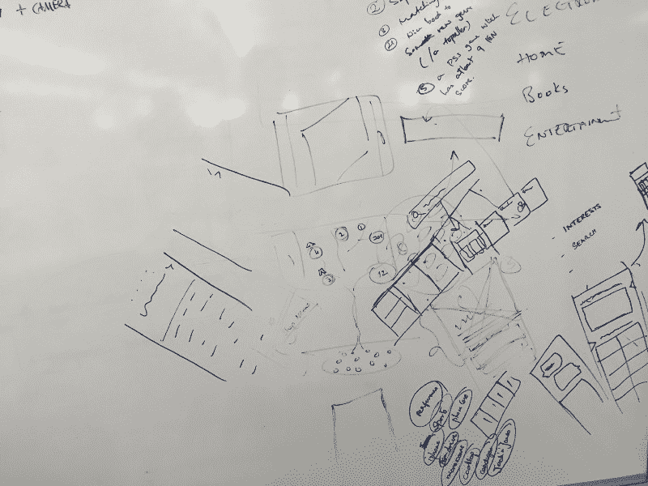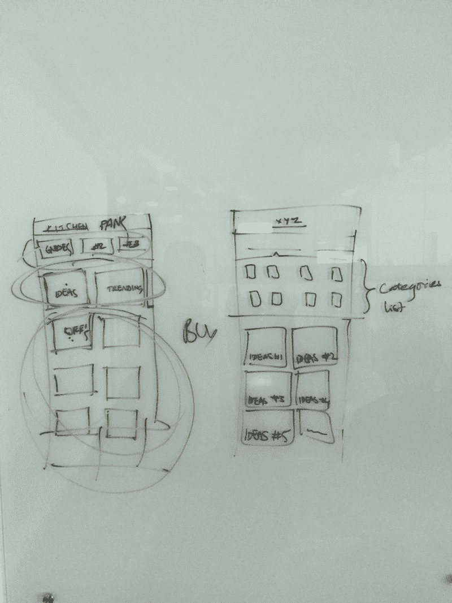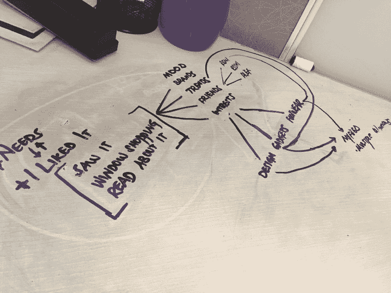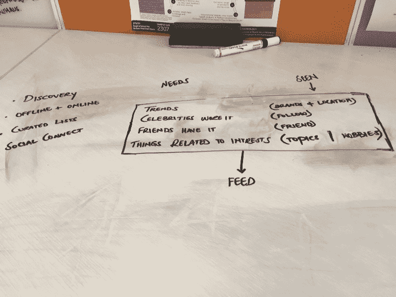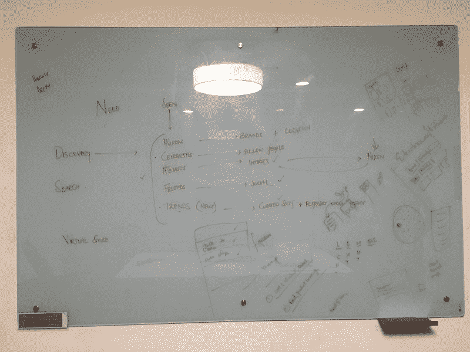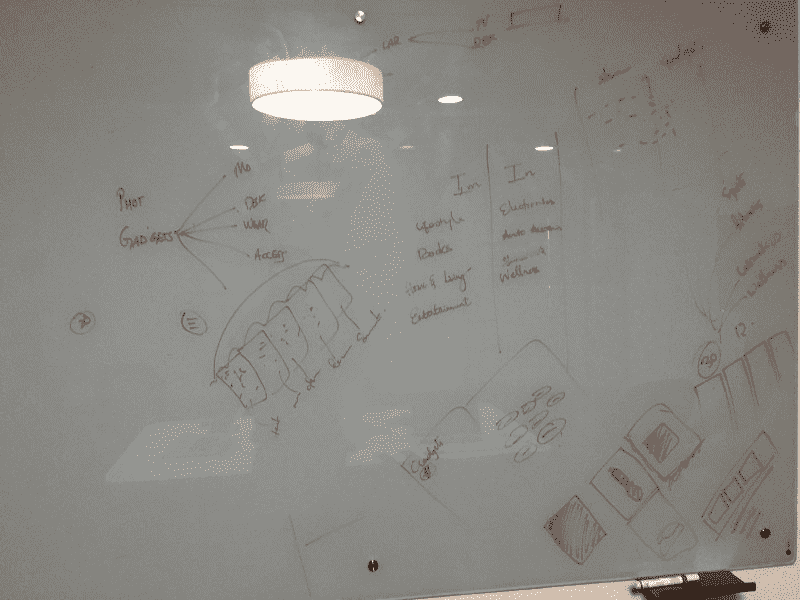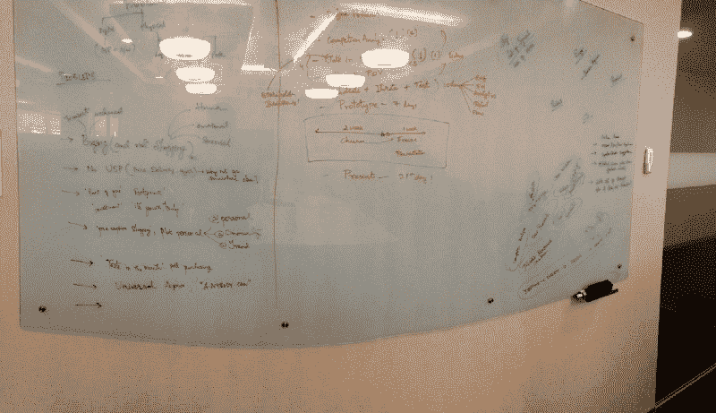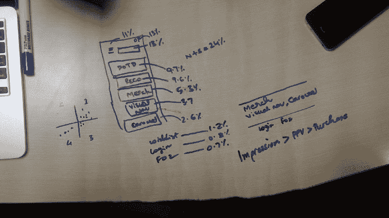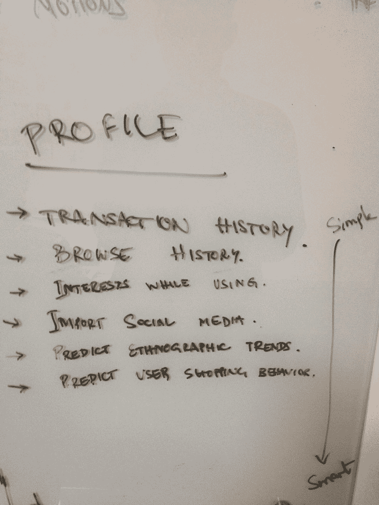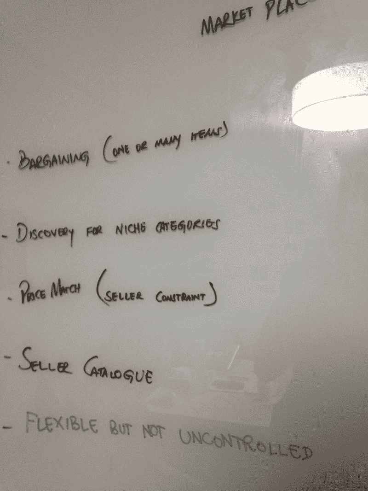

### 用户界面

#### 原型

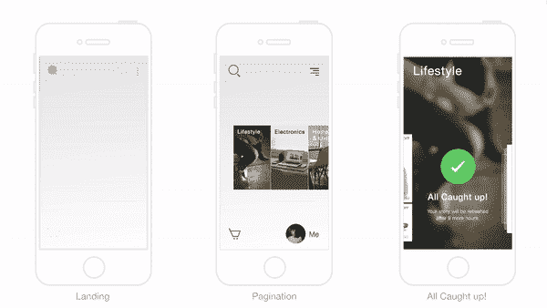

`**Mocks**`

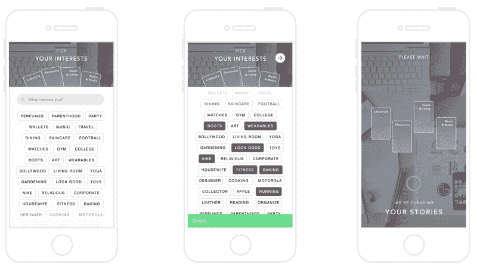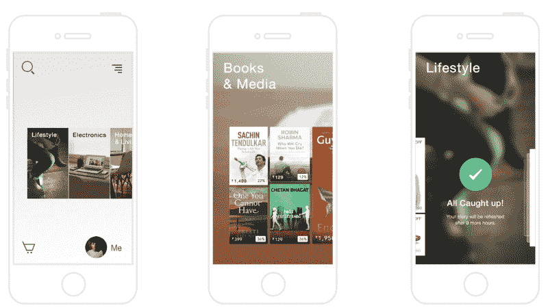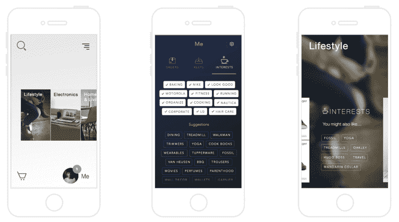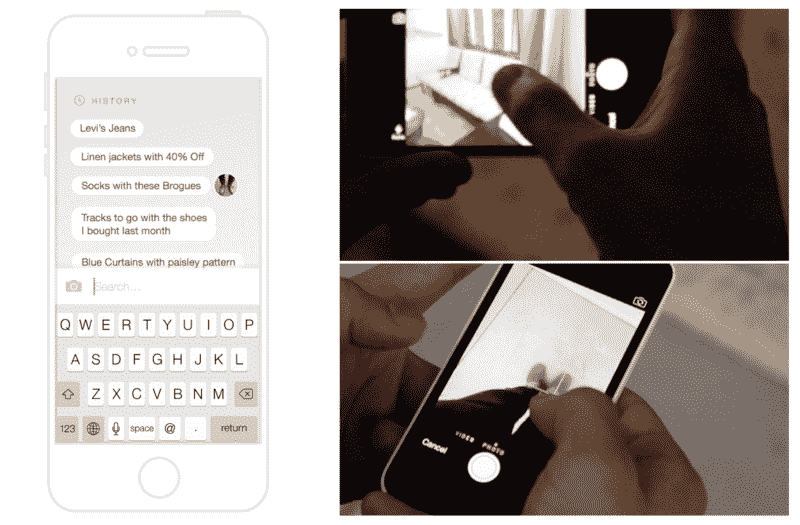

#### 所有这些导致了...

我们在 Flipkart 的各个团队中分享了这一思考过程，以获得反馈，慢慢地，我们看到许多人接受了将电子商务产品化的想法。我们很快就开始了这些努力，在 Flipkart 建立了一个由 4 名设计师组成的团队，专门从事这样的登月项目。

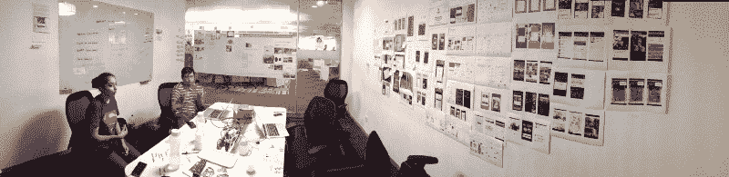

Skunkworks

感谢阅读。

Bilal 是一名来自印度班加罗尔的产品设计师。他非常重视过程驱动的方法来设计解决方案。他一直作为全栈执行人员练习设计，原型是他的强项之一。Bilal 的计算机科学工程学院帮助他进行务实的设计，并与开发人员进行有效的合作。

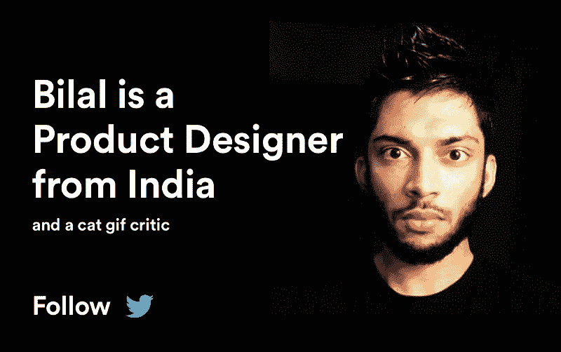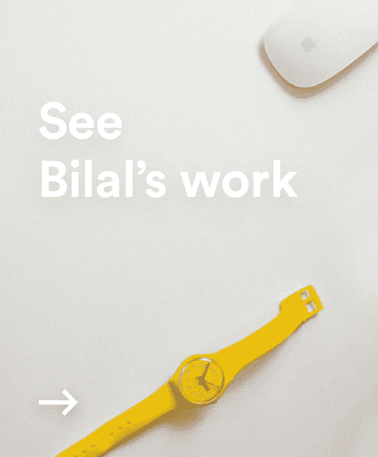