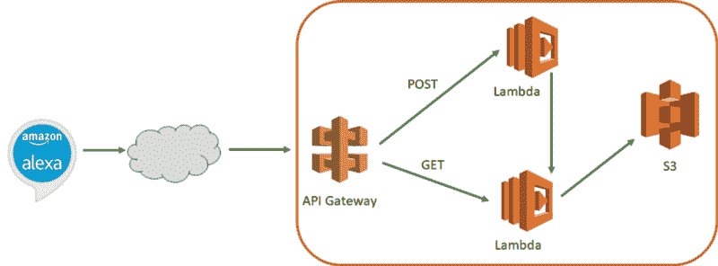
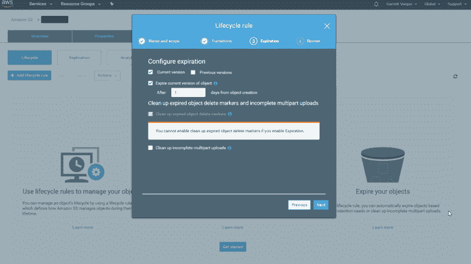
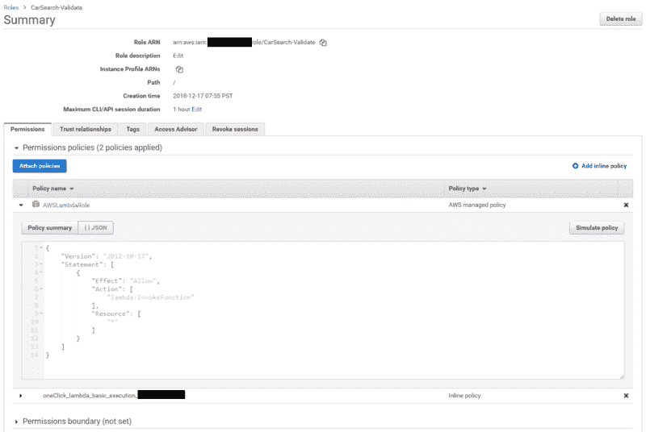
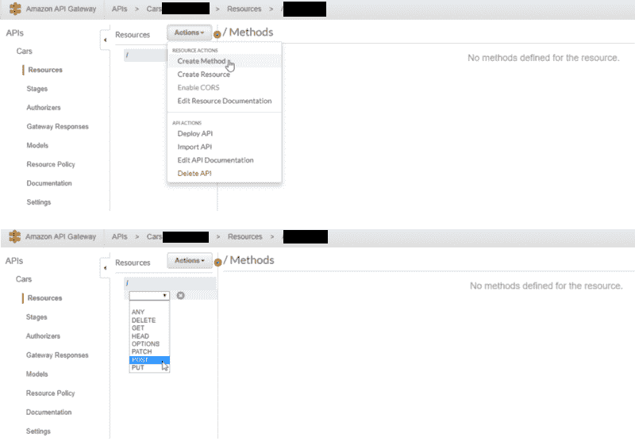
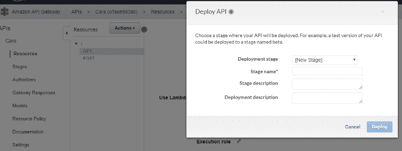

# 如何设计无服务器异步 API

> 原文：<https://www.freecodecamp.org/news/how-to-design-a-serverless-async-api-6cfd68939459/>

加勒特·瓦格斯

# 如何设计无服务器异步 API

我最近举办了一个研讨会，教开发人员如何创建一个 Alexa 技能。研讨会材料围绕一个返回汽车租赁搜索结果的项目。因为我想将学习的重点放在开发对话流上，而不是汽车搜索的机制上，所以我决定将搜索逻辑封装在 API 后面。此外，由于汽车搜索请求可能需要 10 秒或更长时间才能完成，所以我希望调用是异步的，这样我们就可以建立这样的对话:

> “下周末在纽约找车”
> “下周末在纽约旅行，你想要什么尺寸的车？”
> 【一辆小车】
> “有没有具体的公司你想租？”
> “没有”
> “好的，我找到了一辆企业号的小型车，价格是 100 美元……”

异步 API 的实现本身就是一个非常有趣的项目，在这篇博文中，我将告诉你我是如何使用 API 网关、Lambda 函数和 S3 以一种无服务器的方式实现的。

Design for calling an async serverless search

#### S3 水桶

这种体系结构中的 S3 存储桶充当存储搜索结果的缓存，以便以后检索。API 的调用者在开始搜索时会得到一个令牌，基本的设计是将该令牌作为 S3 对象名的一部分，以允许您在后续调用中检索内容。为了防止搜索结果填满存储桶，您可以设置一个适用于 API 结果生命周期的过期策略(例如，您希望异步结果保持有效多长时间？).

请注意，过期策略只能以天为增量进行设置，因此，即使您的结果在 30 分钟后应该被视为过时，使用这种方法，您仍然可以将对象存储至少一天。

您可以将时间戳与对象相关联，并在代码中对其进行检查，以确保如果超过某个时间，结果将被忽略，但对象本身将至少保留一天。

要设置存储桶，请在 AWS 管理控制台中执行以下步骤:

*   从 S3 点击**创建存储桶**
*   输入 bucket 的名称，并记下您在哪个区域创建它(您需要确保您的 Lambda 函数和 API Gateway 都设置在同一个区域)。请注意，S3 存储桶名称是全球唯一的，这意味着很可能会采用“test”这样的名称。您需要选择其他用户以前没有创建过的内容，所以包含您的姓名或当前日期的内容将是一个很好的起点
*   您可以保留具有默认权限且没有版本控制的 bucket——您将显式地授予 Lambda 函数对这个 bucket 的权限，所以不要将其公开给外界(事实上，这将是一个坏主意！)
*   一旦创建了存储桶，点击它并转到**管理**选项卡
*   点击**添加生命周期规则**进入生命周期
*   输入名称，跳过过渡屏幕，在**到期**屏幕上结束
*   因为我们没有将版本控制添加到我们的 S3 存储桶中，所以您只需要为当前版本配置一个到期规则，如下所示

Entering a lifecycle rule to expire objects after a day from your S3 bucket

#### λ函数

我的基本想法是使用 Lambda 函数执行搜索，将令牌返回给调用者，并将结果写入 S3 桶。然后，可以通过后续调用检索结果，传递令牌和任何附加的过滤信息(例如，上面示例中的“小型汽车”)。

然而，我很快意识到我的 Lambda 函数将在我验证输入参数并使用令牌回调后返回，这意味着我无法让它继续运行以将搜索结果写到 S3。

我需要的是一种在获得令牌后继续执行代码的方法，这样我就可以返回到 API 调用方。为此，我创建了**两个** Lambda 函数，一个用于验证参数，另一个用于执行搜索并查找缓存的结果。

第一个函数验证参数，一旦完成，它就异步调用第二个 Lambda 函数开始搜索，然后在第二个 Lambda 函数离开时将生成的令牌返回给调用者。我的`generateToken`函数在我的工作室中使用的令牌只是一个时间戳，因为我没有考虑可伸缩性，但它也可以是 UUID 或其他生成的 ID。

因为这个 Lambda 函数调用另一个 Lambda 函数，所以您需要给它适当的权限来进行这个调用。要做到这一点，请按照以下步骤创建适当的 IAM 角色:

*   在 Lambda 函数中，在执行角色下，从下拉列表中选择**创建自定义角色**
*   这将在一个新的选项卡中启动 IAM
*   从 IAM 角色下拉列表中选择**创建一个新的 IAM 角色**,并为其提供一个名称
*   在 IAM 角色的完整列表中，选择这个新角色并单击**附加策略**
*   筛选出 **AWSLambdaRole** 策略，并将其添加到该角色。或者，您可以修改 JSON，在下面的步骤中创建第二个 Lambda 函数后，通过在 Resource 字段中引用它的 ARN，让它只对第二个 Lambda 函数进行访问

*

Setting the appropriate IAM role for to call a second Lambda function* 

*第二个 Lambda 函数有两个职责——执行搜索并将结果保存到 S3 桶中，以及在使用有效令牌调用时从 S3 桶中检索结果。我本可以分离这个逻辑并创建三个λ函数，但是我觉得在一个地方拥有访问缓存并知道如何编码/解码对象的逻辑是一个更好的设计。*

*因为 API Gateway 允许您映射查询参数，所以您会发现很容易区分调用该函数执行新的搜索和请求它检索搜索结果的情况(我将在后面演示如何实现)。注意，这个函数调用了一个冗长的内部函数`doSearch`,该函数根据前一个函数提供的令牌将结果写入 S3。*

*因为这个 Lambda 函数调用 S3 的读写操作，所以您必须为这个 Lambda 函数设置适当的权限——这与第一个不同。按照相同的步骤创建 IAM 角色，只是这次不是 AWSLambdaRole 策略，而是您想要关联 **AmazonS3FullAccess** 策略——再次可选地提供您想要提供完全访问权限的特定 S3 存储桶的 ARN。*

#### *API 网关*

*有了 Lambda 函数，下一步就是围绕这些函数创建一个 API 网关，这样用户就可以调用 REST API 了。请记住，我想从客户的角度构建的流程是:*

*   *使用所需的搜索参数对 API 进行 POST 调用*
*   *获取令牌作为响应*
*   *询问用户一些额外的问题，以帮助缩小结果范围*
*   *使用令牌和附加的过滤标准调用 API 以获得实际的结果集*

*API Gateway 使您可以轻松方便地根据需要访问 Lambda 函数。*

*第一步是创建新的 API。在 AWS 管理控制台中，您可以导航到 API Gateway 并单击 **Create API** 来创建一个新的 API。一旦给它起了一个名字，就需要创建想要用来访问 API 的方法。在我的例子中，这意味着从**动作**下拉菜单中选择 POST 和 GET 作为新方法。*

*

Creating methods in API Gateway* 

*先说帖子。一旦选择了 POST 方法，就会询问您想要使用的**集成类型**。选择 **Lambda 函数**，然后用您创建的第一个 Lambda 函数填充细节，以验证参数并开始搜索。您不需要将 API Gateway 指向执行搜索的第二个 Lambda 函数，这是由验证函数为您完成的。*

*设置完这些参数后，您将看到完整的 API 流程，以及一个 **TEST** 侧边栏，它将允许您向 API 传递一个测试负载，以查看它是否正确执行。*

*对于 GET 调用，进行类似的操作，不过在这种情况下，您将调用第二个 Lambda 函数传入一个令牌，以便它知道从您的 S3 缓存中检索结果。此外，在这种情况下，您不会传递 JSON 有效负载——而是期望客户在 URL 中提供查询参数。API Gateway 允许您通过映射模板轻松完成这种转换。*

*基本步骤如下:*

*   *在**动作**下拉菜单下添加一个 GET 方法*
*   *将**积分类型**设置为**λ函数***
*   *输入第二个λ函数的详细信息*
*   *创建完成后，单击 GET 方法执行的**集成请求**步骤*
*   *展开**映射模板**部分，点击**添加映射模板***
*   *在编辑框中输入 **application/json** 并点击检查确认*
*   *输入从查询参数到 JSON 请求的映射——您将使用形式为`"field": “$input.params('queryparam')"`的键来完成此操作。这将把名为`queryparam`的查询参数映射到名为`field`的字段*

*这里的好处是，向客户端公开的查询参数不必与 Lambda 函数内部使用的参数同名。例如，在我的例子中，我需要 User、CarSize、SupplierRating 和 UpgradeClass 的参数，但是我将这些参数分别映射到 id、Size、Rating 和 upgrade 以供内部使用。*

*

Mapping URL Parameters to a JSON payload for the GET* 

#### *构建和部署*

*既然已经将 Lambda 函数集成到 API Gateway 中，那么就可以开始构建和部署了。在动作菜单下，选择**部署 API** 。API Gateway 将询问您部署阶段；选择**【新舞台】**创建一个新舞台，并给它起一个类似 Beta 的名字。在您部署 API 之后，API Gateway 会告诉您用于调用 API 的 URL。POST 和 GET 函数使用相同的 URL。很简单，不是吗？*

*

Getting ready to deploy your API* 

#### *包裹*

*我在这里描述的是异步无服务器 API 的基础。我忽略了许多边缘情况和错误处理，以及 API Gateway 中强化 API 的技术，我没有提到这些技术，例如在调用 Lambda 函数之前验证所有必需的参数都已设置，或者需要一个访问令牌，而不是创建一个完全开放的 API。*

*此外，这个用例是针对小型车间环境的。您必须查看您自己的用例，以了解您需要的规模以及这种方法是否适合您。您需要特别注意 Lambda 函数的并发执行设置。例如，如果您试图进行的底层调用需要一分钟的时间来运行，那么即使有 1000 个并发执行的限制，您也只能每秒进行 16 次调用，这对于完整的生产工作负载来说可能是不够的。*

*抛开警告不谈，对于正确的用例，这种方法可以是一种简单而强大的创建异步 API 的方式，而不必建立专用的服务器或缓存解决方案。*