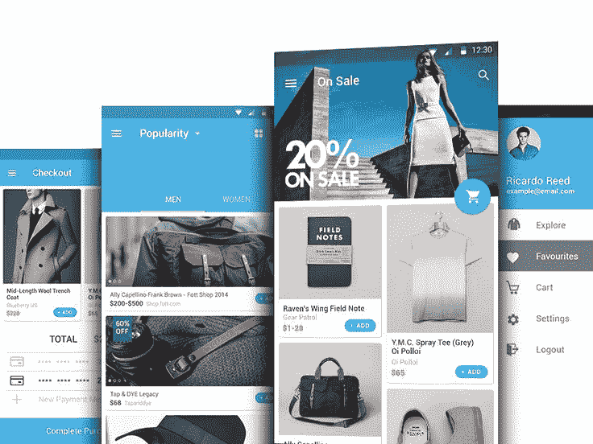
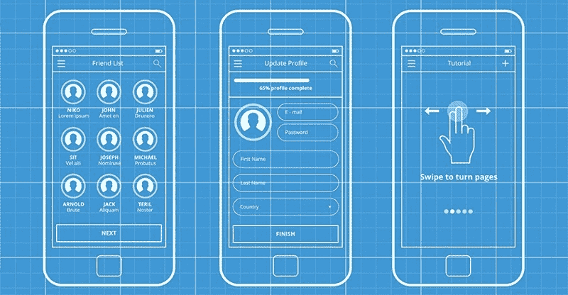

# 如何设计一个成功的电子商务应用程序:UX 从 Wish 学到的经验

> 原文：<https://www.freecodecamp.org/news/how-to-design-a-successful-e-commerce-app-ux-lessons-learned-from-wish-48f21579d94d/>

作者:迪米特罗·布罗夫金

# 如何设计一个成功的电子商务应用程序:UX 从 Wish 学到的经验

购物应用成为现代移动市场上的一颗新星并不令人惊讶。金钱主宰世界，明智消费的能力是一大优势。这正是应用程序所提供的。

让我们从讨论购买者使用移动应用程序时的行为开始。以下是一些统计数据:

*   大约 30%的潜在客户因为不满意的移动体验而感到沮丧并放弃应用程序——这是一个巨大的数字，表明开发和推出应用程序以及维护它是多么重要。
*   90%以上的购买是通过多种设备进行的，这意味着客户在网上商店购物时会切换设备，从一个屏幕切换到另一个屏幕。
*   即使是轻微的延迟也可能降低成功购买的机会。很难相信，但统计数据显示，每延迟 0.1 秒，销售额就下降大约 1%。这证明 app 应该是打磨过的，性能有问题是没有借口的。

目前，移动商务在美国市场的份额约为 45-47%，略低于 50%。这意味着新公司有机会在市场上推广他们的产品和服务。与此同时，这意味着开发者有更多的责任，因为如果他们希望他们的应用成为一个成功的项目，他们必须达到高标准。

### Wish 是怎么繁荣起来的？

在亚马逊、易贝和阿里巴巴占据市场主导地位的时代，你需要拿出一些绝对新颖或完美精致的东西，才能获得一些人气，才能在阳光下为自己争取一席之地。这正是 Wish marketplace 所做的。开发这款应用的团队成功结合了这两个因素。

他们的想法是推出一个互动的愿望清单，同时允许它通过向真实的人出售真实的商品来赚钱。

Wish 目前在美国最受欢迎的购物应用中排名第五，仅次于亚马逊的两个应用易贝和 OfferUp 它已经领先于沃尔玛和 Groupon 等巨头。这是一个突出的成就，我们肯定可以从他们的成功故事中学到一课。让我们仔细看看愿望 app 到底是什么。

这个概念并不真正具有开创性，但正是精致的用户体验让它大放异彩。该应用程序连接了世界各地的客户和商家。目前有超过 1 亿的活跃客户和大约 10 万个商家。Wish 将自己定位为“廉价拍卖”,这就是为什么他们提供比平均市场价格低 50-70%的各种物品。

你还会在目录上发现很多稀有或不寻常的商品；你很难在别的地方找到很多。这些优势结合在一起，使得 Wish 颇具吸引力，尽管有慷慨的折扣政策，也让其合作伙伴赚得盆满钵满。

与其他市场相比，Wish 向零售商收取每笔交易的 15%的费用，这似乎相当苛刻，但作为回报，卖家可以获得一些很酷的功能，让生活变得更轻松，并让他们卖出更多。

那么，Wish 成功的背后有什么秘诀呢？当然，运气和时机在他们的成功中发挥了巨大的作用，但如果我们要选择一些使他们成为现在这样的人的特征，那就是:

*   深思熟虑的战略和商业计划:Wish 的开发者知道，人们几乎肯定会喜欢大折扣，并通过建立直接从工厂发货的分销渠道实现了这一点，没有任何中间人收取他们的佣金。这一举动实际上值得一片掌声，因为这个解决方案是如此优雅。
*   他们的范围从一开始就以智能手机为中心，从一开始就定义了他们的目标受众。这让他们能够在已经知道自己在为谁开发应用的情况下制定策略。这也是明智之举。

好了，现在我们已经看了 Wish，让我们看看如何制作一个像 Wish 这样的应用程序。

### 实现愿望

就像每个应用程序一样，一切都始于我们已经有的想法，然后是设计和标志。我们将把后者留给你，但对于应用程序设计来说，遵循你的平台的规则真的很重要(现在它是 Android 上的浮动按钮的材料设计，以及你的设计对 iOS 的标准苹果应用程序的适应)，或者想出一些全新的和不同的东西。

但是如果你选择了第二种方式，你应该确定你已经具备了成功开发解决方案的条件。如果没有，那么选择一个已经证明有效的方案可能会更明智。

你还需要与商家建立联系，并向他们提供有吸引力的条件，以说服他们加入你的行列。这可能很棘手，尤其是如果他们已经在使用另一个在线市场。虽然这与应用程序开发没有直接联系，但你的营销策略是该项目的主要组成部分之一。

### 先人一步思考，让您的客户生活更轻松

您的客户在下载您的应用程序后必须采取的第一步是注册。这看起来很简单，也不是要求最高的程序，但是并不容易。你应该选择是否加入社交网络或谷歌账户的帮助来进行身份验证。这将使你的客户的生活变得更加容易，但是开发者需要在应用程序中加入适当的方法。这一特性如今非常普遍，这意味着用户非常喜欢它。

你的应用程序还应该分析用户选择提供相关商品的每一点信息。这有助于你从一开始就获得观众的忠诚和认可，这是一种启动你与客户沟通的神奇方式。

你还应该为用户提供一个简单快捷的方法来把商品放在他们的愿望清单上并购买它们。可以有许多不同的方式来做到这一点，例如，用户可以点击他喜欢的图像，或者只是用他自己的话列出一个列表，稍后将由后端逻辑进行处理。

这将有助于你向你的用户展示你关心他们，从而在你的客户群中建立忠诚度。个性化的搜索结果将极大地丰富用户体验。

对你的市场来说，真正的考验将是人们真正开始买东西的时候。你会看到你的支付和运输系统运行得有多好，支付有多安全，以及应该尽快做出什么样的改进。不要担心需要调整或修复某些东西，每个项目都需要维护。不可能马上推出一款理想的 app。只要你和你的客户保持联系，接受反馈，你就没问题。

### 不要害怕创新！

希望我们已经帮助你理解了开发一个像 Wish 这样的应用需要什么——甚至可能更好。这是一个雄心勃勃的项目，但如果你有远见，你会成功的。这里有一些如何让应用程序变得更好的想法:使用虚拟现实技术，让你的客户用他们的智能手机和相机参观临时试衣间，这将是一件很酷的事情。实施起来当然很有挑战性，但是人们会喜欢的。

如果你打算专攻服装，紧跟潮流并让用户组合物品以创造时尚外观也是很棒的。也许你应该实现一个选项来添加人们已经拥有的衣服？我们认为这会非常有帮助！

如果您想立即开始使用您的新应用程序，请今天就[联系我们](https://octodev.net/contact-us/)！ [Octodev](https://octodev.net) 团队将很乐意帮助你建立你梦想中的项目。我们期待着您的回复！

这篇文章最初发表在 [Octodev 博客](https://octodev.net/blog/)上。