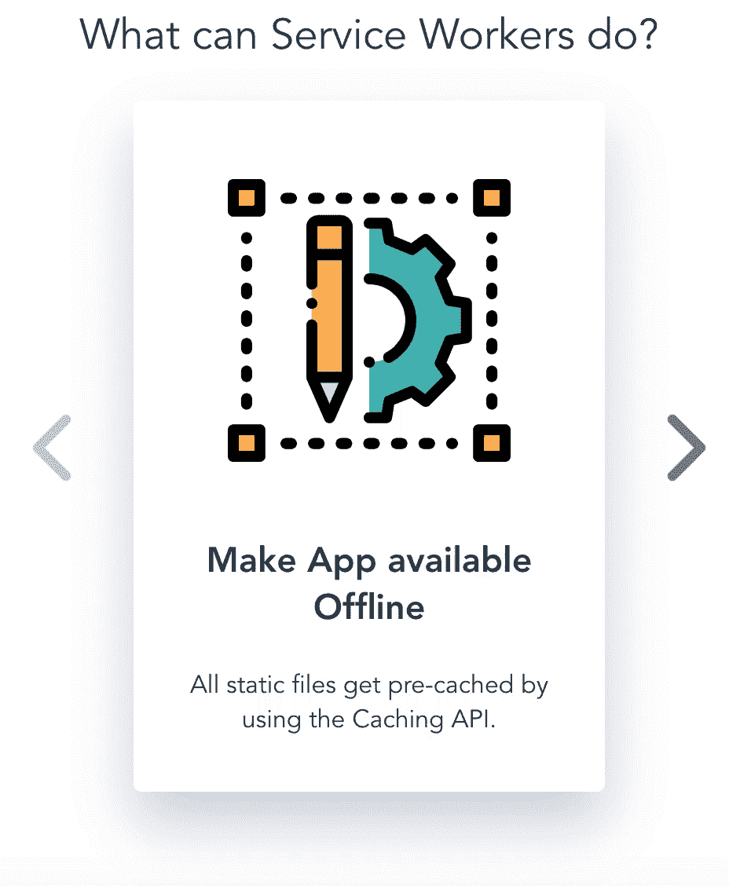
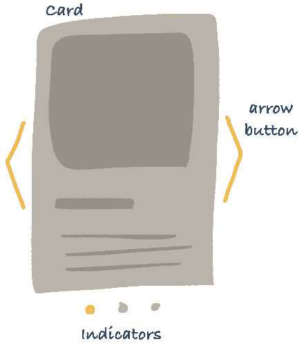
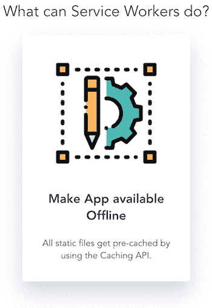
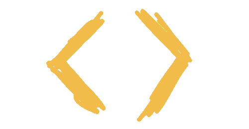
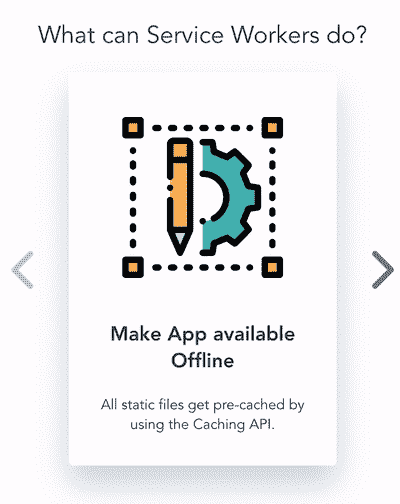

# 如何在 VueJS 中设计和构建一个 carousel 特性

> 原文：<https://www.freecodecamp.org/news/how-to-design-and-build-a-carousel-feature-in-vuejs-125f690a3a9e/>

法比安·欣森坎普

转盘、幻灯片或滑块——无论你如何称呼它——已经成为现代 web 开发中使用的核心元素之一。今天，几乎不可能找到任何网站或 UI 库不附带这种或那种轮播。

为什么呢？其实旋转木马真的配得上它们的受欢迎程度。它们允许用户浏览可用内容，无需垂直滚动或移动鼠标。因此，用户节省了时间，并可以专注于显示的内容，因为传送带将认知负荷保持在最低水平。

这足以成为学习如何在 VueJS 中构建旋转木马的理由！



我所有的教程都围绕着渐进式 Vue 应用。这个也不例外！制作渐进式应用意味着为移动用户提供接近原生应用的 UX，包括出色的性能、推送通知等原生功能、离线体验等等。在一个大多数用户通过移动设备体验网络的世界里，没有理由不开发进步的应用程序！

当然，你仍然可以在任何 Vue 应用程序中使用旋转木马。对于本教程，您也不需要任何 VueJS 或渐进式 Web 应用程序的经验！

您可以在这里找到完整的代码:

[https://github . com/fh48/view-pwa-carusel](https://github.com/fh48/vue-pwa-carousel)

### 我们对旋转木马的愿景是什么？

我们要做的第一件事是了解我们想要构建什么样的组件。



有几个非常简单的方法:

*   **卡片** →它保存每个转盘元件的信息。
*   **转盘→** 保存所有逻辑的父节点
*   **箭头按钮** →帮助在多张卡之间导航。
*   **指示灯** →显示当前可见的卡片数量。

### 初始设置

如果你想学习如何建立一个项目，这一节是给你的。如果您不知道，请继续下一部分。

```
vue init pwa vue-pwa-carousel
```

系统会提示我们选择一个预设，我推荐以下配置:

```
? Project name vue-pwa-carousel? Project short name: fewer than 12 characters to not be truncated on homescreens (default: same as name) vue-pwa-carousel? Project description A simple tax calculator ? Author Fabian Hinsenkamp? Vue build runtime? Install vue-router? No? Use ESLint to lint your code? No? Pick an ESLint preset Standard? Setup unit tests with Karma + Mocha? No? Setup e2e tests with Nightwatch? No
```

在项目的根文件夹中运行`yarn`来安装所有的依赖项。现在我们有了一个项目设置，其中包括构建我们的旋转木马所需的基本技术。此外，它已经包括一个服务工作者，预先缓存我们所有的静态文件，并允许用户访问应用程序，即使他们离线。

您可以通过运行`yarn start`来检查模板应用程序的外观。

为了测试 carousel 在移动设备上的外观，我们需要通过一个公共 URL 向移动设备公开我们的开发构建。有很多方法可以做到这一点，但在这里我们使用`ngrok`，因为它很容易设置，只是做它的工作。

```
yarn global add ngrok
```

接下来，我们需要在两个独立的终端中运行我们的 dev 服务器和 ngrok。

### 让我们建卡吧！


为了节省你对模板应用程序的一些无聊的调整，只需检查这个分支`00_basicSetup`。它包括所有的数据和样式，我们需要使这个应用程序有意义和漂亮。

卡片实际上做一件事:它显示当前选择的数据。在我们的例子中，它是一个*图像*、一个*标题*和一些*文本*。

显然，我们不希望构建多个硬编码内容的卡片。相反，我们希望动态地将数据传递给卡片，并简单地呈现它。

基于这些知识，我们现在可以在`src/components`文件夹中创建我们的`Card.vue`文件。此外，我们已经可以定义基本的 html 结构和名称，以及我们想要传递给卡片的属性的类型。

注意:我们将所有想要在本地显示的图标存储在我们的资产文件夹中。这意味着我们的路径保持不变，但是我们需要动态地改变应该呈现的文件名。因此，所有属性都是类型`String`。

接下来，我们让**卡片**呈现标题和相关文本。因此，我们在 VueJS 中使用最基本的数据绑定方式 mustache 标签。

基本上就是用花括号把变量括起来。数据一进来，`{{headline}}`和`{{text}}`就会被相关的数据对象替换。这总是正确的，当新的数据进来时，在之前已经呈现了其他数据之后也是如此。

动态渲染图像有点复杂。记住，我们不传递实际的图标，只传递它的文件名。

所以我们基本上想把图像作为一个模块来使用，就像其他组件一样。我们可以通过将静态图像导入脚本块并将其赋给一个变量来使用它。然而，我们确实在改变道路。由于我们的应用程序使用 webpack，因此有一种奇妙的速记方法可以动态加载这些内容，如下所示:

```
:src="require(`@/assets/svg/${imgName}`)"
```

`:`语法是将属性动态绑定到表达式的唯一方法。你可能已经见过前缀`v-bind:`，它是`:`的简写。

现在我们的`template`块完成了，如下所示。

为了完成我们的**卡**组件，我们只需要将准备好的样式添加到文件的底部。

```
<style src="../assets/styles/Card.css" scoped>
```

对于这一部分，我们需要做的最后一件事是检查**卡**是否实际工作。

因此，让我们简单地将它添加到我们的`App.vue`组件中。但是，请记住，我们必须在下一部分将组件移动到**传送带**组件中。

我们将以下内容添加到`<templa`te>t 中；App.vue 的脚本> `; block`

多么神奇的结果！特别是，因为我们已经可以动态地改变**卡片**应该显示的内容！



接下来，我们构建**传送带**来拥有一个专用组件来管理基于用户输入显示不同**卡片**的所有逻辑。

如果您想从这里开始或者比较您的实现，请查看分支`01_Card`。

### 让我们建造旋转木马

**传送带**将是我们可重用的父组件。它将封装所有相关的组件和逻辑。

就像之前的卡一样，我们应该专注于以一种能够优雅地处理数据变化的方式来构建组件。例如，它应该能够处理传递给它的不同数量的卡片。

接下来我们将看到这种方法如何转化为代码。首先我们开始创建一个**转盘**组件，并使**卡片**成为**转盘**的子组件。

新组件的模板块托管**卡**，它被包装在两个包装器元素中。我们将在后面看到为什么这些是必要的。

因为我们将把多张卡片的数据传递给 Carousel，所以我们需要指定只呈现`currentElement`。

在下面的`<scri` pt >块中，我们需要定义默认情况下传递的卡片是哪个`s the currentE`元素。

因此，我们最初将`currentElementIndex`定义为`0`。VueJS 附带了一个特性，允许我们动态地计算变量。我们用它来选择最初应该渲染的卡片数据。

现在我们只需要在我们的`App.vue`文件中用**转盘**替换**卡片**。为了让我们的最终页面更有结构和意义，让我们将 carousel 包装在另一个 section 元素中，并将其放在另一个 section 之前。

这是我们的基本实现。它还不完全是一个传送带，但我们将通过添加箭头按钮来改变这一点，以便在我们从`cards`数组传递到**传送带**的对象之间进行切换。

检查`02_Carousel`以查看这一部分的完整代码。如果你继续编码，你会看到下面的内容。

### 让我们构建箭头按钮



现在我们构建 **ArrowButton** 组件，该组件从其父组件接收其方法和箭头图标的类型。实现本身非常困难。

该组件只负责呈现正确的样式和图标。所有与按钮相关的逻辑被添加到**转盘。这样，我们就创建了一个真正通用的组件，我们可以在任何想要使用带箭头图标的按钮的环境中使用它。**

现在，在 **Carousel，**中，我们添加了两种方法来在我们的卡片数据对象之间导航。方法只是`<scri` pt >块中的另一个导出对象。

这些只是将`currentElementIndex`增加或减少`1`。我们使用索引来计算`currentElement`变量，所以每次调用其中一个方法，就会显示下一张卡片。我们还添加了一些限制性条件，因为我们希望传送带不会循环。

现在我们只需要添加**箭头按钮**就基本完成了我们的**转盘**！

这里你可以看到我们如何使用方法和计算值来实现我们的**箭头按钮**。尝试实现**卡**组件下面的第二个。

万一你卡住了或者有些东西看起来不对劲，检查一下`03_ArrowButton`分支。如果一切顺利，你的旋转木马应该如下图所示:



### 让我们建立指标！


我们要添加的最后一个特性是**指示器。**这些帮助用户了解有多少张卡片，以及他们当前正在看哪一张。此外，这些允许用户直接选择单独的卡。

该组件接收三个属性。我们使用数组`elements` 为每个卡片数据对象创建一个`<` *l* i >元素。

`currentElementIndex` 需要添加一个 CSS 类，突出显示与当前卡片相关的指标。此外，它还用于禁用当前卡的按钮。我们防止它被选择的方法是通过 tab 键。这样，我们至少提供了最低限度的可访问性。

`showElement`是用户点击指示器时调用的方法。它是从外部传递的，以尽可能地保持组件的焦点。元素如何显示显然与**指示器**无关。

当我们将**指示器**添加到`Carousel.vue`时，我们为什么为**卡创建两个包装器就变得很清楚了。**语义清晰的 HTML 是至关重要的，尤其是对于高度复杂的大型项目。

你可以在分支`04_Indicators`查看完整的代码。

### 让我们添加滑动

最后但同样重要的是，我们使我们的**转盘**变得便于移动。一个好的渐进式 web 应用不是从缓存静态文件开始的，而是从响应性开始的。

由于小屏幕空间不足，我们隐藏了**箭头按钮**，允许用户滑动以浏览**卡片。**在这里，这些指示器也再次发挥了作用，因为它们在移动设备中作为主要指示器，用户可以通过滑动来查看更多卡片。

因此，我们添加了以下库:

```
yarn add vue2-touch-events
```

接下来，我们向**卡添加新的`v-touch`属性和一个处理程序方法。**这处理了刷卡发出的事件。

### 结论

太棒了，我们成功了！我们的愿景是构建一个封装的、可重用的 **Carousel** 组件，我们做到了！

我们还可以增加一些浏览卡片时的刷卡动画来改善 UX。

感谢阅读！*如果你喜欢这篇博文，在 Twitter 上关注我 [@Fa_Hinse](https://twitter.com/Fa_Hinse) 和* *请鼓掌？*