# 免费课程:从零开始建博客？‍?

> 原文：<https://www.freecodecamp.org/news/how-to-design-and-develop-a-beautiful-blog-from-scratch-a0cd1af46845/>

作者 ZAYDEK

#### 直到…

# 免费课程:从零开始建博客？‍?

#### 这可能比想象的要容易

在我开始写这篇文章之前，我只想分享我正在开发一个产品，我很想收集一些关于如何更好地为 web 开发人员服务的数据。我创建了一个[简短问卷](https://twitter.com/username_ZAYDEK/status/1103914471267790854)在阅读这篇文章之前或之后进行检查。请检查一下，谢谢！现在，回到我们的常规节目。

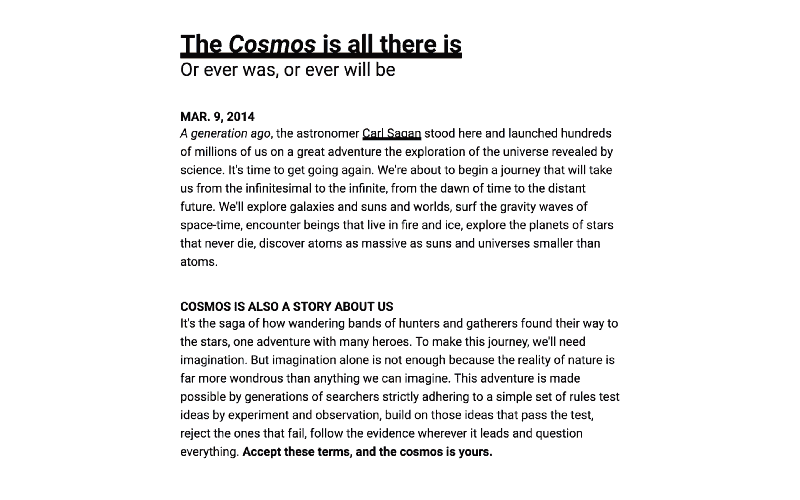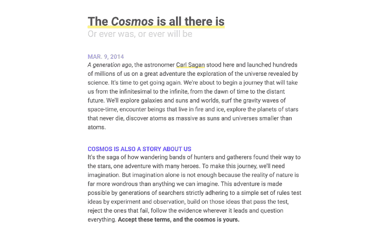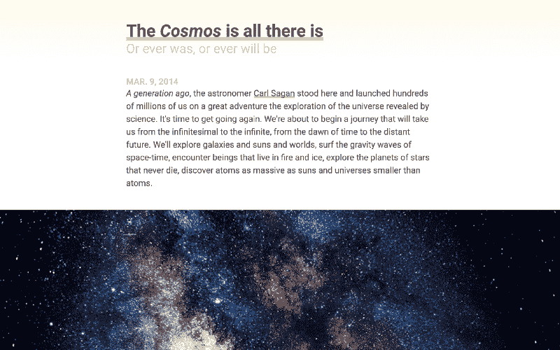

The blog we’ll build. Prefer video? [Click here](https://scrimba.com/g/gbuildablog) to open in Scrimba

如果你和我一样，你对网络和它铺天盖地的影响感兴趣，但是你也淹没在学习 HTML 和 CSS 的大量信息中。问题是，这些语言不同于其他领域，比如文字处理器和编程语言。**网络是另一个世界，**它不是周围最漂亮的东西。

我已经学会了一些网络，我在这里给你一点鼓励，因为，**在一点指导下**，这些领域会比你想象的容易得多。继续阅读，我们将从头开始创建一个漂亮的博客。我们还将学习一些 [CSS 网格](https://scrimba.com/g/gR8PTE)、 [Flexbox](https://scrimba.com/g/gflexbox) ，以及响应式设计。

目标是为你做我为自己做的事；从基本原则开始学习 HTML 和 CSS。

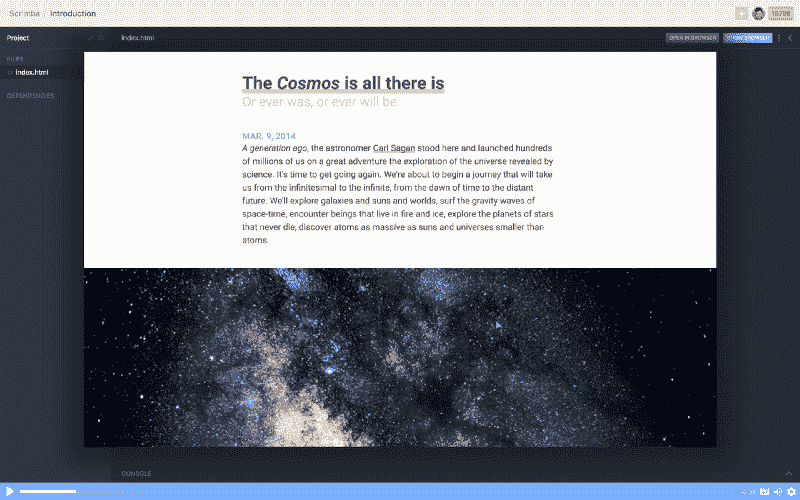

Prefer video? [Click here](https://scrimba.com/g/gbuildablog) to open in Scrimba

#### 我还在 Scrimba 上教授了一门免费的 HTML/CSS 课程，教你如何从零开始创建一个漂亮的博客。[点击这里报名吧！](https://scrimba.com/g/gbuildablog)？

#### Scrimba.com 是一个交互式前端平台，网站被记录为事件，而不是视频，并且可以编辑！？

### 那么 HTML 从何而来？

HTML 是第一个**元**或**标记语言**的后代:GML。千禧一代的读者现在发现 GML 代表了 T4 通用标记语言，但这并不是它的全部。正是 Charles **G** oldfarb、Edward **M** osher 和 Raymond **L** orie 在 IBM 创造了我们现在所知的 **meta** 或**标记语言** 。1996 年，查尔斯·戈德法布写道:

> “我给 GML 起了现在的名字，这样我们名字的首字母将永远证明它的起源。技术转让的一个丑陋的事实是，开发人员在第一次收到研究工作时往往会心存感激，而在漫长的开发周期结束时，他们实际上已经忘记了这一点……”

> —查尔斯·戈德法布，1996 年

GML 后来被标准化，从而成为 SGML。然后，在欧洲核子研究中心工作的蒂姆·伯纳斯·李从 SGML(不，不是机器学习，或者不管潮人怎么称呼它)借用了 ML 来创建 HTML，其中 HT 代表 **H** yper **T** ext。

哇，酷字。据我所知，它起源于一个叫做 HyperCard 的交互式创作环境，来自在苹果工作的 Bill Atkinson。为了更深入的探索，我提交以下视频:

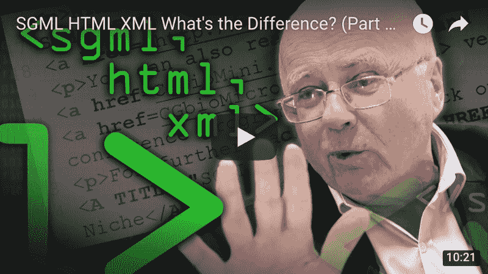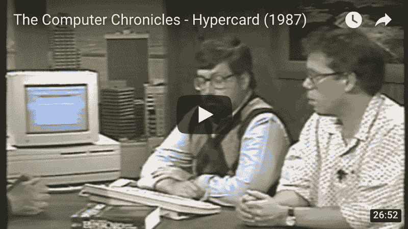

Click either to learn more

所以，让我们回顾一下。HTML 不仅仅是接管了世界。其实 HTML 之前是有一整个世界的。WUT？我知道，我在震惊中颤抖——但我还没有出生——所以，那种世界并不存在。

并且，HTML 欠它的前辈很多。就像我们对父母一样。尽管如此，这就是我们从文本中编写代码的方式。现在，在四节**一分钟**的课中，我将教授 HTML、CSS 和响应式设计的基础知识。

### 4 分钟内完成 HTML 和 CSS

#### 第一分钟:一个网站可以更好地理解为一个网络树

```
<html>    <head></head>    <body></body></html>
```

所有的网站都是这样诞生的。然而——这很糟糕——没有内容。然而，我们从这里开始，因为我们需要首先了解什么是网站。把它想象成一棵树——一棵颠倒的树*——一张网**树** *。*`html`元素是**根，**而`head`和`body`是我们的 web **树**的第一个**分支**:

```
 html <- root   /  \head  body <- branches
```

`head`元素(或**标签**——同)是用于**元数据**，或关于我们网站的信息**。另一方面，`body`元素用于我们网站的内容。因为 CSS 是我们网站的风格，它放在`head`元素中，而内容，比如段落、猫视频(≧∇≦)等等，放在`body`元素中。**

#### 第二分钟:元素或标签有多种外观

```
<element><element>value</element><element attribute="value">value</element>
```

1.  第一个元素是一个**自结束元素**，在这里我们向浏览器传达一些信息，但是它也没有值。这方面的一个例子是`<` br >元素，它插入一个换行符。
2.  第二个元素是一个**公共元素**，在这里我们传递**一个**值作为属于某个元素。比如`<p>hello, worl` d！< /p >是值“你好，世界！”作为属于段落元素。
3.  最后，我们有一个属性为的**元素。属性听起来就像——*该死，是属性*！它赋予元素更多的上下文或意义。属性可以有多个值，元素可以有多个属性。属性-异常。**

```
<element attribute="value" attribute="value value">value</element>
```

现在——我需要提一下——我们不创建 HTML 元素的名称。我们从一些预定义的 [100+元素](https://developer.mozilla.org/en/docs/Web/HTML/Element)的列表中**借用**它们。当然，这使得一些事情变得容易，而一些事情变得非常非常困难，例如记忆！

#### 第三分钟:HTML 和 CSS 如何交流

```
<!DOCTYPE html><html>    <head>        <meta charset="UTF-8">        <style>
```

```
selector { property: value; }
```

```
 </style>    </head>    <body>        <element>value</element>    </body></html>
```

`!DOCTYPE html`指定我们正在编写 HTML 5——这是为了[我们想要避免的所有其他 HTML 版本](https://meiert.com/en/indices/html-elements/)。并且给定具有**属性** `charset`和**值** `UTF-8`的**自结束元素** `meta`，我们的文本以 Unicode 编码。UTF-8 代表**U**nicode**T**transformation**F**format…**8**。现在我们可以写进去了吗？？？？！有一次，爸爸决定在刚发的 *emo* ji 里发短信。

> _ _ (茨) _ /

我们还添加了一个`style`元素，这是 CSS 可用的入口点之一。其中`selector` **选择**一个元素，并用相应的`value`对其应用`property`。我们将在下一分钟探讨这一点以及更多。

我需要再次提到，我们不创建 CSS 属性的名称。我们从预定义的数百个属性列表中[借用。当然，这让有些事情变得容易了，有些事情变得困难得多，比如 _ _ _ _ _ _ _ _ _ _ _ _ _ _！](https://meiert.com/en/indices/css-properties/)

#### 第四分钟:你好，世界！

```
<!DOCTYPE html><html>    <head>        <meta charset="UTF-8">        <style>
```

```
p { color: green; }
```

```
@media (max-width: 8.5in) { p { color: blue; } }@media (max-width: 5.0in) { p { color: red ; } }
```

```
 </style>    </head>    <body>        <p>hello, world!</p>    </body></html>
```

我们的网站不再可怕！我们有的是“你好，世界！”在绿色文本中，如果我们网站的宽度调整到 8.5 英寸或更小，它会显示为蓝色，在 5 英寸或更小的地方，它会显示为红色。这里，我们使用**媒体查询**在某些情况下覆盖 CSS，比如我们网站的宽度。

### 什么是 CSS 重置和调试器？

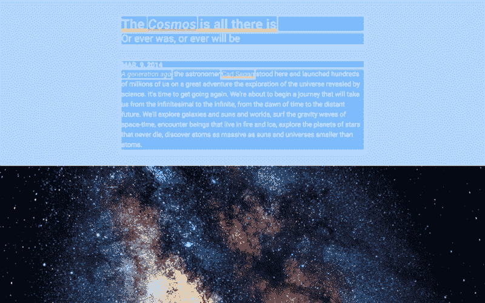

Prefer video? [Click here](https://scrimba.com/g/gbuildablog) to open in Scrimba

我们使用重置来确保我们的设计是一致的，使用调试器来暴露不一致的地方。

我们需要重新设置，因为浏览器固执己见，为我们设置了一些 CSS 属性，我们希望 T2 取消设置。流行的 CSS 重置是存在的，但我们将自己制作。我们需要调试器来轻松维护我们网站的设计。

我们可以创建一个名为`styles`的文件夹来存放我们的重置和调试器:

```
styles/       reset.css       debug.css
```

为了**将**我们的新 CSS 文件链接到`index.html`，我们添加了`link`元素:

```
 …        <meta charset="UTF-8">        <link rel=”stylesheet” href=”styles/reset.css”>        <link rel=”stylesheet” href=”styles/debug.css”>        <style>        …
```

#### 我们的 CSS 重置

在我们想要取消的房产中，这里有一个候选名单:

```
:root { font: 20px/1.2 sans-serif; }
```

```
body, body * {    margin:          unset;    box-sizing:      unset;    padding:         unset;    font-size:       unset;    color:           unset;    text-decoration: unset;}
```

忽略第 1 行。现在—让我们从`body, body * { … }`开始，我们选择`body`和所有带有`*`的`body`元素。星号表示**选择所有孩子**。还记得我们的网络**树**吗？

```
 html   /  \head  body <- selected / \    \…   …    p <- selected
```

`body, body * { … }`正在选择`body`和 *—* 一个`,`表示和— `p`，因为它是`body`的一个孩子。这就是所谓的**父子**关系，其中`body`是父节点`p`是子节点。并且我们告诉那些元素以`unset`共同的属性。我选择的房产只是一个候选名单。这里有一个最著名的 CSS 重置的例子:

```
/* http://meyerweb.com/eric/tools/css/reset/   v2.0 | 20110126   License: none (public domain)*/
```

```
html, body, div, span, applet, object, iframe,h1, h2, h3, h4, h5, h6, p, blockquote, pre,a, abbr, acronym, address, big, cite, code,del, dfn, em, img, ins, kbd, q, s, samp,small, strike, strong, sub, sup, tt, var,b, u, i, center,dl, dt, dd, ol, ul, li,fieldset, form, label, legend,table, caption, tbody, tfoot, thead, tr, th, td,article, aside, canvas, details, embed,figure, figcaption, footer, header, hgroup,menu, nav, output, ruby, section, summary,time, mark, audio, video {    margin: 0;    padding: 0;    border: 0;    font-size: 100%;    font: inherit;    vertical-align: baseline;}/* HTML5 display-role reset for older browsers */article, aside, details, figcaption, figure,footer, header, hgroup, menu, nav, section {    display: block;}body {    line-height: 1;}ol, ul {    list-style: none;}blockquote, q {    quotes: none;}blockquote:before, blockquote:after,q:before, q:after {    content: '';    content: none;}table {    border-collapse: collapse;    border-spacing: 0;}
```

呀！回到*我们的*复位。在顶部我们有`:root { font: 20px/1.2 sans-serif; }`。什么是`:root`？还记得我们的 web**tree**吗？它是**的**根*，*换句话说，**的**元素。这个伪元素属于元素的一个特殊的*类*，称为[伪类](https://developer.mozilla.org/en-US/docs/Web/CSS/Pseudo-elements)，可以用来更好地组织和理解我们的 CSS。

哇哦。难道我们不需要一个`*`到**选择所有子**元素，这样它们的`font`属性就被设置了吗？嗯——很好的问题——一些属性，比如文本属性继承自它们的父属性，而`font`继承了。因此，我们可以在`:root`中设置`font`一次，然后传播给它的所有子节点。属性异常*。*

#### 我们的 CSS 调试器

调试器强调元素的内容和边框:

```
body * {    color:                 hsla(000, 100%, 100%, 0.88) !important;    background:            hsla(210, 100%,  50%, 0.33) !important;    outline: 0.25rem solid hsla(000, 100%, 100%, 0.50) !important;}
```

看哪！在短短的**三**行中，我们的调试器。这个巧妙的技术**覆盖了**的三个常见属性:`color`、`background`和`outline`。我们的颜色是由`hsla()`值组成的，分别是 **h** ue、 **s** 饱和度、 **l** uminance、 **a** lpha 的简称。为了启用我们的调试器，我们链接文件。

如果我们想要**禁用**我们的调试器，我们可以**打错**文件名，以便从我们计算机的文件系统中隐藏它，例如:

```
<link rel=”stylesheet” href=”styles/-debug.css”>
```

或者直接删线。٩(^ᴗ^)۶

我们的调试器使用滑稽的`!important`值来声明*在任何情况下*都不能覆盖这些属性。还记得媒体提问吗？

```
p { color: green !important; }
```

```
@media (max-width: 8.5in) { p { color: blue; } }@media (max-width: 5.0in) { p { color: red ; } }
```

如果我们指定我们的`p`颜色是`!important`，我们的媒体查询将是惰性的，因为它们不太重要。

### 认识 CSS 网格和 Flexbox

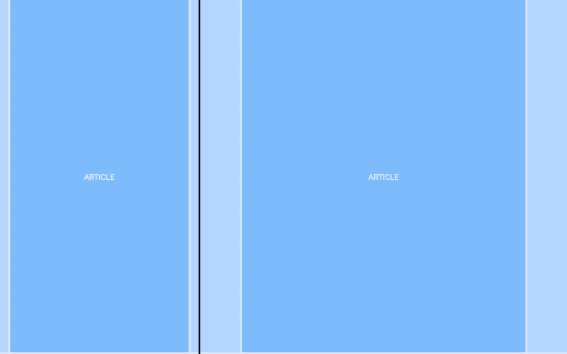

Prefer video? [Click here](https://scrimba.com/g/gbuildablog) to open in Scrimba

我认为在 CSS Grid 和 Flexbox 出现之前，为网络设计是一次英雄之旅。

事实是，网页设计曾经是一种杂耍——我们欺骗浏览器来呈现我们的设计。随着时间的推移，这一点变得不那么真实了。我不信教，但是感谢上帝！—或者，*感谢浏览器工程师！*—因此现在我们可以依靠 CSS Grid 和 Flexbox 来启动我们的设计。

如果你没有意识到，CSS Grid 和 Flexbox 是融入现代浏览器的新技术，将英雄之旅带出网页设计。CSS Grid 和 Flexbox 是朋友——我们将一起使用它们来创建网格中的**网格**和 **flex** 元素。

#### 我们的第一个网格:HTML

```
 …    <body>        <article>            <p>ARTICLE</p>        </article>
```

```
 <article>            <p>ARTICLE</p>        </article>    </body>    …
```

还记得我们的网络**树**吗？

```
 body      /  \article  article    /      \   p        p
```

我们正在创建一个博客，所以每篇文章都可以被看作是一个`article`。我们的`article`包含了`ARTICLE`的`p`，这是我们可以使用的另一个聪明的技巧。使用元素的**名称**作为元素的**值**来帮助我们理解事物在哪里以及是什么。价值观。

#### 我们的第一个网格:CSS

```
 …    <style>
```

```
article {    display: grid;    grid-template-columns: 1fr minmax(0, 8.5in) 1fr;
```

```
 height: 11in; /* temp fix */}
```

```
article * { grid-column: 2 / 3; }
```

```
 </style>    …
```

输入 CSS 网格。首先，**选择了**文章，并应用了三个属性:`display`将元素定义为网格，`grid-template-columns`为模板列，`height`将每个`article`模拟为具有一个页面的高度。然而，`height`是胶水代码，*将被*删除。

让我们关注最重要的两行:

```
article   { grid-template-columns: 1fr minmax(0, 8.5in) 1fr; }article * { grid-column: 2 / 3; }
```

或者，在其他时候:

> 你要有三列，

> 它的中心柱将庇护你的孩子。

首先，如果我们将`grid-template-columns`设置为`1fr 1fr 1fr`，其中`fr`是 **fr** action-unit 的缩写，那么我们的**三个**列将被分成**三个**。然而，我们的中间列有一个`minmax`宽度，这意味着它的**响应**。在小于或等于`8.5in`时，我们的中间列以`100%`宽度呈现，我们的左边和最右边的列消失，因为没有余数。

侧边栏:注意响应式设计并不局限于媒体查询。这是一个我们的设计是**隐式响应**，而不是**显式响应**的例子。这是最好的响应式设计，因为它不是硬编码的。而这也是 CSS Grid 和 Flexbox 如此强大的原因之一。

第二，为了传达`article`的孩子属于中间列，或者**从第二列**开始，**在第三列**结束，我们将`grid-column`设置为`2 / 3`。注意`grid-template-column`和`grid-column`之间的细微差别，无论是**模板列**还是**跨度列**。

CSS Grid 很棒——的确如此——但是现在我们将依靠 Flexbox 来居中我们的`ARTICLE`文本。我们将要做的是创建一个**实用程序类**，这是编写 CSS 的另一个范例。这里，我们利用了这样一个事实，即元素可以有属性来内联样式到`p`元素:

```
<p class=”debug-center”>ARTICLE</p>
```

> HTML 中的 CSS？！

> (≥的°)≥的)和±的

事情是这样的:元素有一个**类**属性。我们不仅可以使用这个属性将 CSS 写入元素，还可以写入一种元素或一类元素。这意味着我们可以跨多个元素重用类，而不管它们是否相似。唉——什么都没有改变——我们还需要在 CSS 中的某个地方创建一个`.debug-center`类。我们的调试器怎么样:

```
…
```

```
.debug-center {    display:         flex;    justify-content: center;    align-items:     center;}
```

注意我们使用一个`.`前缀来区分类和元素。

现在，只要一个元素被我们的`debug-center`类赋予属性，它的文本就会居中。首先，我们将`display`设置为`flex`，使任何元素成为 Flexbox-element，而不是 CSS Grid-element。然后我们将`justify-content`设置为`center`来水平居中**并将`align-items`设置为`center`来垂直居中**。啊啊！****

****想象一下:我们使用 Grid 来布局我们网站的设计，使用 Flexbox 将网格中的元素伸缩到某个期望的位置。****

### ****迭代我们的网格****

****

Prefer video? [Click here](https://scrimba.com/g/gbuildablog) to open in Scrimba**** 

****我们有一个问题:没有`.debug-center` `ARTICLE`拥抱左右墙壁。我们需要的是垂直和水平的排水沟，以便我们的内容可以呼吸。啊啊。否则阅读会变得令人沮丧，并会导致糟糕的用户体验。ヾ( •́д•̀ ;)ﾉ****

****对于垂直填充:****

```
**`article {    padding: 0.5in 0;    …}`**
```

****对于水平填充，我们可以使用填充，两种方式都可以:****

```
**`padding: 0.5in 0.5in;padding: 0.5in;`**
```

****然而，我们希望我们的檐槽具有响应性，所以我们将使用 CSS Grid:****

```
**`article {    …    grid-template-columns: 1fr 0.5in [start] 7.5in [end] 0.5in 1fr}`**
```

****在这里，我们做了三件事:1 .我们将我们的水平檐槽定义为`0.5in`(我保证，这些会变得有响应性！).2.我们的内容列从`8.5in`变成了`7.5in`，总和*仍然是*和`8.5in`。编造标识符`start`和`end`来命名我们内容栏的开始和结束。****

****当我们添加新列时，我们还需要更新`article *`:****

```
**`article * { grid-column: 3 / 4; }`**
```

****但是计算列数并不理想。相反，让我们使用虚构的标识符:****

```
**`article * { grid-column: start / end; }`**
```

****我们在不中断内容流的情况下更新了我们的网格，只要我们继续使用我们创建的`start`和`end`标识符。⊂◉‿◉つ****

****最后——正如承诺的那样——我们需要我们的排水沟有反应。`minmax()`由于这样或那样的原因在这里行不通，所以我们将使用媒体查询:****

```
**`@media (max-width: 8.5in) {    article {        grid-template-columns: 1fr 5% [start] 90% [end] 5% 1fr;    }}`**
```

****现在**在**或**小于** `8.5in`，`article`将使用`%`而不是`in`来划分我们的列，并且最左边和最右边的列将会消失，因为——再次——没有余数。尽管如此，我们还是可以将`padding`设置为`0.5in 5%`来达到同样的效果，那又怎么样呢？请继续阅读！****

### ****再次重复我们的网格****

****

Prefer video? [Click here](https://scrimba.com/g/gbuildablog) to open in Scrimba**** 

****为了理解我们的网格，让我们使用图像来跨越列，在桌面上从`100%`到`8.5in`到`7.5in`，在移动设备上从`100%`到`90%`。然而，对于最后一张图片，底部左边的那张，我们需要在网格中添加更多的列。AF)UBQWF*VBQPWIFB，我说的对吗？****

****不要被吓倒——CSS grid 很棒。让我们再添加两列:****

```
**`article {    …    grid-template-columns:        1fr 0.5in [start] 1.25in 5in 1.25in [end] 0.5in 1fr;}`**
```

```
**`@media (max-width: 8.5in) {    article {        grid-template-columns:            1fr 5% [start] 15% 60% 15%[end] 5% 1fr;    }}`**
```

****我们将我们的内容专栏分成三个专栏:`1.25in 5in 1.25in`。我们还为我们的媒体查询添加了比例百分比:`15% 60% 15%`。计划是让文本跨越我们原来的`7.5in`内容栏，让小图片跨越我们新的`5in`栏。****

****为了添加图像，我们使用了`img`元素及其`src`—source—属性:****

```
 **`…        <article>                                                        </article>        …`**
```

****这些是本地的，也就是说，它们在我们的计算机上。如果它们是远程的，也就是说，在服务器上:****

```
**``**
```

********

****注意每个`img`都有四个类中的一个:`size-*`。因为我们想要的不仅仅是图像，比如视频，来跨越我们网站的网格，所以我们最好使用类来重用 CSS。这些`size-*`类也是实用类，所以改变我们想要的大小很简单。****

****让我们让我们的`size-*`类跨越不同的列集合:****

```
**`.size-1 { grid-column: 4 / 5; }.size-2 { grid-column: 3 / 6; }.size-3 { grid-column: 2 / 7; }.size-4 { grid-column: 1 / 8; }`**
```

****缺少的是我们的`img`没有反应。我们需要:****

```
**`img.size-1, img.size-2, img.size-3, img.size-4 { width: 100%; }`**
```

****因为`img`以实际大小呈现，例如，400 × 400 的图像以 400px 呈现，我们需要用我们自己的:`width: 100%`覆盖该行为。因此，当一个图像被归属于一个`size-*`类时，它可以根据它所跨越的列来调整大小。注意我们不需要设置`height`。****

### ****添加文本元素****

****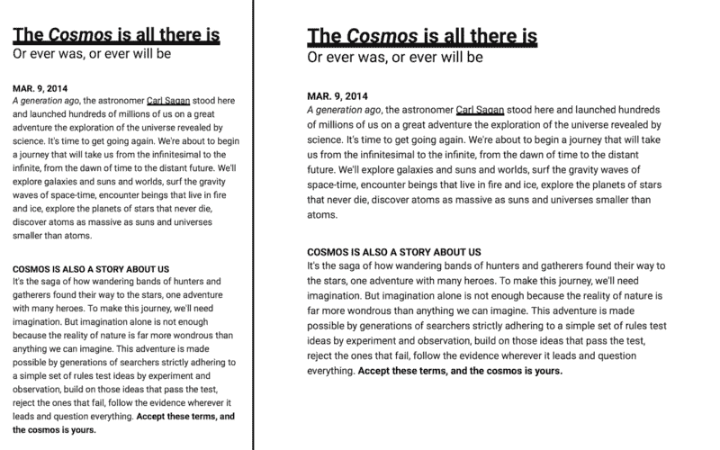********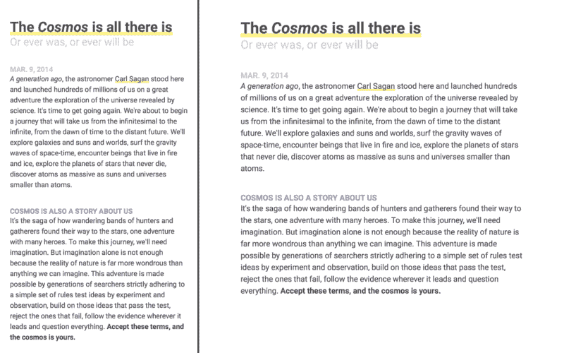

Prefer video? [Click here](https://scrimba.com/g/gbuildablog) to open in Scrimba**** 

#### ****网站和内容链接****

****既然我们对我们的`article`越来越认真，让我们把事情正式化:****

```
 **`…        <article id="the-cosmos"></article>        …`**
```

****现在每篇文章都可以**链接**。**可链接** *？*嗯——网站是**链接**:****

```
**`https://website.com/index.html`**
```

****我们网站的内容，例如`article` s，也可以**链接**到:****

```
**`https://website.com/index.html#article`**
```

****这里的`article`是一个`id`属性的值，类似于链接一个 YouTube 视频中的时间戳(例如，[这个](https://www.youtube.com/watch?v=5TbUxGZtwGI&feature=youtu.be&t=4m7s))。比起建议“从 4 分 7 秒开始”或“从第二篇文章开始读”，我们可以在网站中链接内容，就像视频中的时间戳一样。****

****为了链接网站或内容，我们使用了`a`元素和`href`属性:****

```
 **`…        <article id="the-cosmos">            <a href="#the-cosmos">The Cosmos</a>        </article>        …`**
```

****文本“宇宙”现在链接到文章的开头:`#the-cosmos`。****

******这种链接的思想(链接网站和网站中的内容)是 HTML 的要点之一。** HyperCard 掌握了这一点，但不是链接网站和内容，而是对想法和联想感兴趣。当时是 1987 年， [HTML 是在 1989 年](http://info.cern.ch/Proposal.html)首次提出的。看几秒钟我之前发布的视频——这里我链接了一个时间戳:****

#### ****文本元素****

****让我们添加标题、出版日期、强调文本和链接:****

```
**`<article id="the-cosmos">`**
```

```
 **`<h1><a href="#the-cosmos">The Cosmos is all there is</a></h1>    <h2>Or ever was, or ever will be</h2>`**
```

```
 **`<time datetime="03-09-2014">MAR. 9, 2014</time>    <p><em>A generation ago</em>, the astronomer <a href="https://en.wikipedia.org/wiki/carl_sagan">Carl Sagan</a> stood here and launched hundreds of millions of us on a great adventure the exploration of the universe revealed by science. It's time to get going again. We're about to begin a journey that will take us from the infinitesimal to the infinite, from the dawn of time to the distant future. We'll explore galaxies and suns and worlds, surf the gravity waves of space-time, encounter beings that live in fire and ice, explore the planets of stars that never die, discover atoms as massive as suns and universes smaller than atoms.    </p>`**
```

```
 **``**
```

```
 **`<h3>COSMOS IS ALSO A STORY ABOUT US</h3>    <p>It's the saga of how wandering bands of hunters and gatherers found their way to the stars, one adventure with many heroes. To make this journey, we'll need imagination. But imagination alone is not enough because the reality of nature is far more wondrous than anything we can imagine. This adventure is made possible by generations of searchers strictly adhering to a simple set of rules test ideas by experiment and observation, build on those ideas that pass the test, reject the ones that fail, follow the evidence wherever it leads and question everything. <strong>Accept these terms, and the cosmos is yours.</strong>    </p>`**
```

```
**`</article>`**
```

****这些是我们的私人天体物理学家尼尔·德格拉斯·泰森的 2014 [宇宙:时空漫游](https://en.wikipedia.org/wiki/cosmos:_a_spacetime_odyssey)的开篇台词，这是卡尔·萨根 1980 年[宇宙:个人旅行](https://en.wikipedia.org/wiki/cosmos:_a_personal_voyage)的重新想象。没有那个-fi 就是科幻。而且是 2019 年更新！****

****上面我们介绍了几个元素:`h1`、`h2`、`h3`、`time`、`strong`、`em`。****

1.  ****`h1`–`h6`元素为 **h** 引线。****
2.  ****`time`元素**时间**戳我们的文章。我们可以为元素添加任何我们想要的值，因为计算机会读取`datetime`属性的值，它应该是[机器可读的](https://en.wikipedia.org/wiki/iso_8601)。****
3.  ****`strong`元素用于**强**文本，`em`元素用于*强调文本*。还有，`h*`元素是**强**。****

****请注意，`h*`和`p`元素会从一行中断到下一行，或者**会阻塞**，而`time`、`strong`和`em`元素不会。这是因为浏览器将`h*`和`p`元素的`display`设置为`block`，将`time`、`strong`和`em`元素的`display`设置为`inline`。****

#### ****ems 和 ems****

****当阻止元素从一行到下一行还不够时，我们使用换行符，这样更容易区分元素，就像填充或装订线一样。我们可以在这里使用`br`元素，但是**我们最好使用无关的 CSS 而不是无关的 HTML** 。****

****下面是如何在`h2`和`p`元素之后，将内容分两个换行符:****

```
**`h2, p { margin-bottom: 2.4rem; }`**
```

****2.4 雷姆？****

****记得我们的重置吗？我们将`font`设置为`20px/1.2 sans-serif`。我当时并没有解释它——很遗憾——但是`2.4`是在`1.2`行高处的两行换行，例如，单行文本。可读性更强的文本可以是`1.5`，双倍行距的文本可以是`2`。****

*****咳咳*什么是 rem？****

*****咳咳咳*那什么是 ems 呢？****

****`rem`是**根**并且都是乘数。`1rem`是`20px`，`1em`是父母的`font-size`。如果我们在`ems`而不是`rems`中定义我们的换行符，并将`h2`和`p`设置为不同的`font-size`，它们的换行符将会不同！因此**一致的**换行使用`rem` s，**不一致的**换行使用`em` s。****

****这是一个强大的想法——编写 CSS，使设计与*连接*。有了这个启示，我觉得更明智的做法是到不要用规则而是用关系来思考 CSS **。因此，如果我们在某个地方做出改变，我们就可以在任何地方做出改变。******

> ****…在某个地方做出改变…****

> ****…处处做出改变…****

********************

A real Apple emoji. It had a [Press Release](https://www.apple.com/newsroom/2017/07/apple-previews-new-emoji-coming-later-this-year/)**** 

#### ****响应式响应设计****

****如果我们用`rem` s 和`em` s 写 CSS，用媒体查询来改变`:root`的`font-size`会怎么样？然后一切 *—* ，我是说*一切—* 都会按比例调整大小。我们甚至可以更进一步，针对多种宽度进行多种媒体查询:****

```
**`@media (max-width: 8.5in) { :root { font-size: 18px; } }@media (max-width: 5.0in) { :root { font-size: 16px; } }`**
```

****令人惊讶的是，我们不仅仅是覆盖了**a** 属性*，*我们还覆盖了`rem` s 和`em` s 的**属性**，我们现在可以编写 CSS，它不仅是响应式的，而且是对我们响应式设计的响应。这可能是整篇文章中最重要的一句话:****

> ****我们可以编写不仅仅是响应性的 CSS，而是对我们的响应式设计做出响应。****

****这不仅仅是酷，这是我们*应该*写 CSS 的方式。网站往往很糟糕，我认为这可以归结为:**当我们写 CSS 时，我们应该写在设计系统中，而不是筒仓代码**。当我们使用`rem` s 和`em` s 串联到媒体查询时，*就是*一个设计系统，代码不是孤立的。****

#### ****样式文本****

****对于风格的热爱，再补充一些:****

```
**`h1   { font: 700 2.0rem/1.2 …; color: hsl(000, 000%, 33%); }h2   { font: 400 1.5rem/1.2 …; color: hsl(000, 000%, 33%); }time { font: 700 1.0rem/1.2 …; color: hsl(250, 100%, 83%); }h3   { font: 700 1.0rem/1.2 …; color: hsl(250, 100%, 67%); }p    { font: 400 1.0rem/1.5 …; color: hsl(000, 000%, 33%); }`**
```

****正如我们之前看到的，属性可能会有人手不足的情况；`padding: 0.5in`，相当于`padding: 0.5in 0.5in`。这里，我们用`font`来组合`font-weight`、`font-size`和`line-height`。在`font`之后，我们有带有`hsl`值的`color`，就像我们调试器中的`hsla`值一样。****

****一个未解决的问题是我们的`a`元素。在我们的重置中，我们取消了`color`和`text-decoration`的设置，使得链接不加选择地脱离文本。我们取消设置这些属性，因为`text-decoration: underline`太微妙了。所以我们可以给他们一个强有力的强调:****

```
**`a { box-shadow: inset 0 -0.25em hsl(55, 100%, 75%); }`**
```

****我们反转`box-shadow`来创建元素内部的下划线。如果我们设置了没有负值的`inset`,我们的下划线将会是一个上划线。我们也使用`em`，因此下划线与其`font-size`成比例。这是一个我们想要不一致的缩放比例的例子，就像我们的换行符一样。****

****除此之外还有更多*`box-shadow`:[点击了解更多](https://developer.mozilla.org/en-US/docs/Web/CSS/box-shadow)。*****

### *****最后一步:渐变*****

*****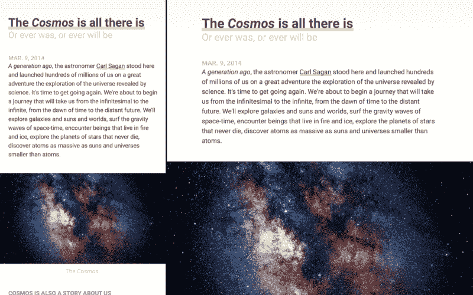

Prefer video? [Click here](https://scrimba.com/g/gbuildablog) to open in Scrimba***** 

******哇呜！我们所需要的是给读者一个**提示**，告诉他们`article`在哪里开始和结束。否则，每个`article`的末端会感觉像是一个无止境的延续，这会导致糟糕的用户体验。所以我们需要给读者一点提示……(◔̯◔)******

*****我提议的很简单:从每个`article`元素的顶部延伸到其`h2`元素的底部的渐变。我们可以用`em` s 来写我们的渐变，这样当我们的网站改变大小时，我们的渐变也会随之改变:*****

```
***`article {    …    background: linear-gradient(hsl(55, 100%, 96%), white 6.83em);}`***
```

*****这里我们定义了一个颜色到白色的渐变，并使用了`6.83em`，所以我们的渐变并没有扩展整个`article`，而是在`h2`元素的底部结束。然而，确切的值取决于。*****

*****你可以通过数学计算来确定尺寸，例如`6.83em`，但是另一个技巧是设置顶部颜色的尺寸，例如`hsl(55, 100%, 96%) 6.83em`。一旦**等于**或**大于**底部颜色的尺寸，它将显示为一条线而不是渐变，这使它变得直观。*****

### *****恭喜？*****

*************************

The blog we built! Prefer video? [Click here](https://scrimba.com/g/gbuildablog) to open in Scrimba***** 

*****恭喜你！٩(˘.˘)۶，你已经步入了一个急需更好的设计师和工程师的世界。有了 CSS Grid、Flexbox、响应式设计和浏览器级调试器，web 开发变得前所未有的容易。*****

#### *****别忘了 Scrimba 上有一门免费课程，我会教你如何从零开始制作同一个网站。[点击这里报名吧！](https://scrimba.com/g/gbulma)*****

**********