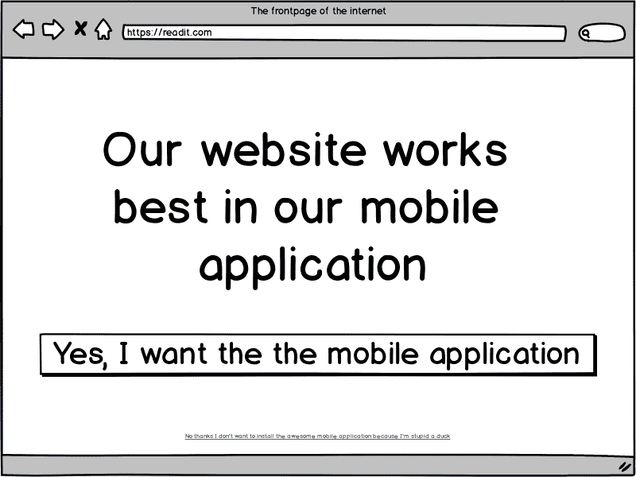
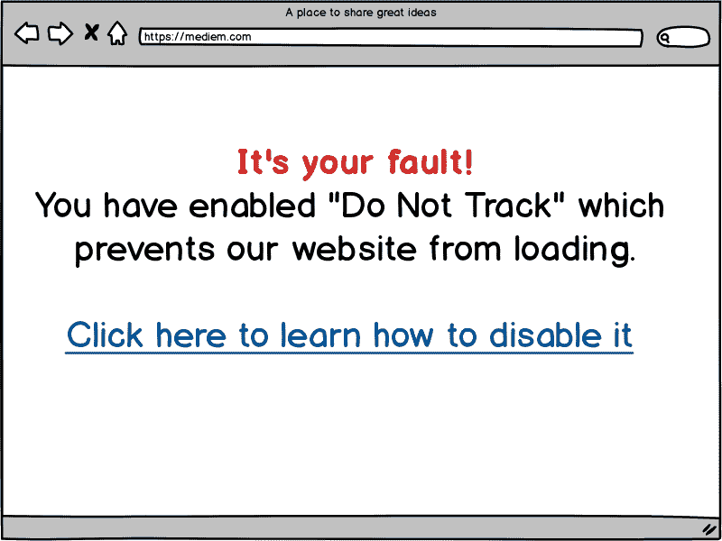
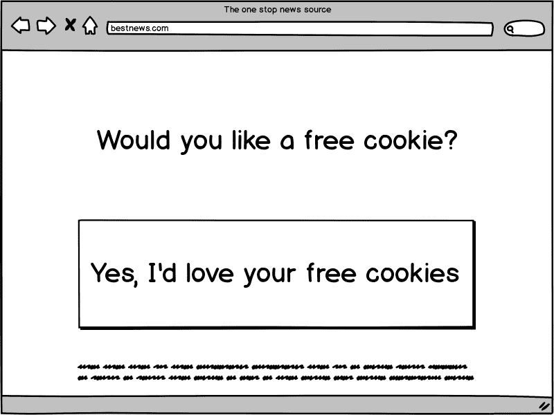
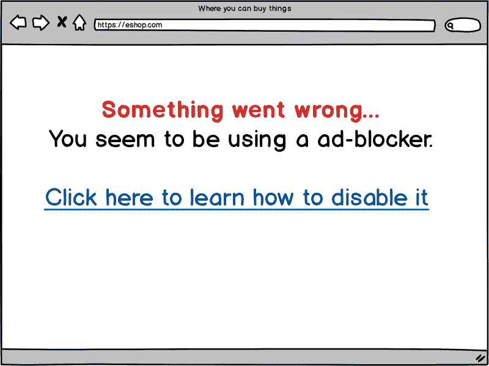
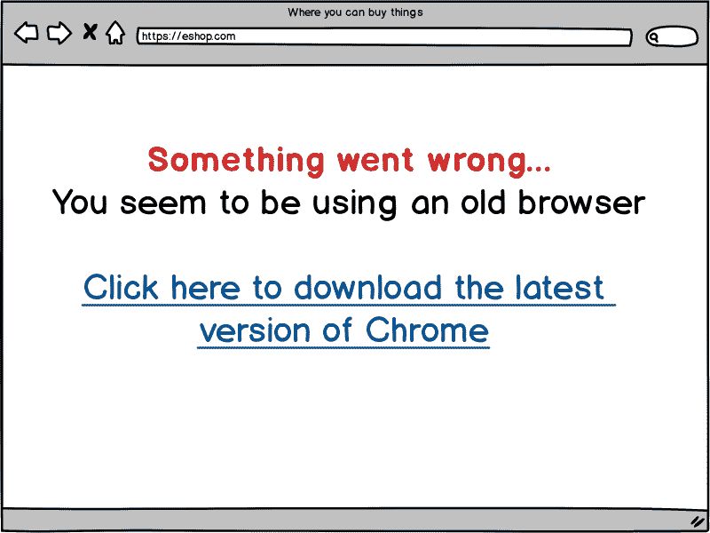
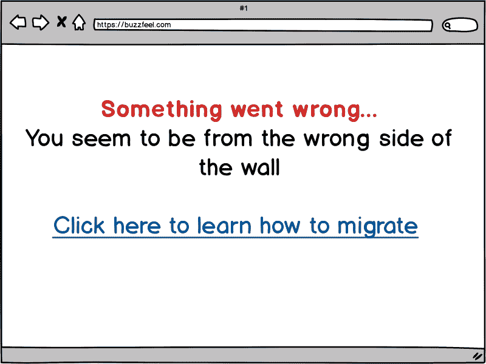
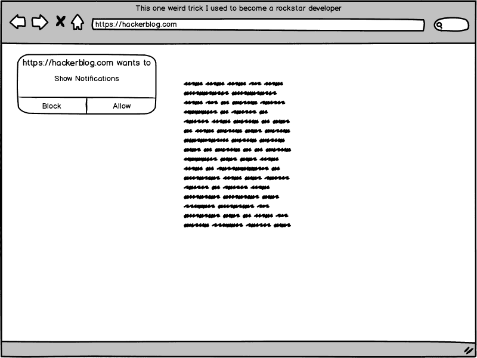
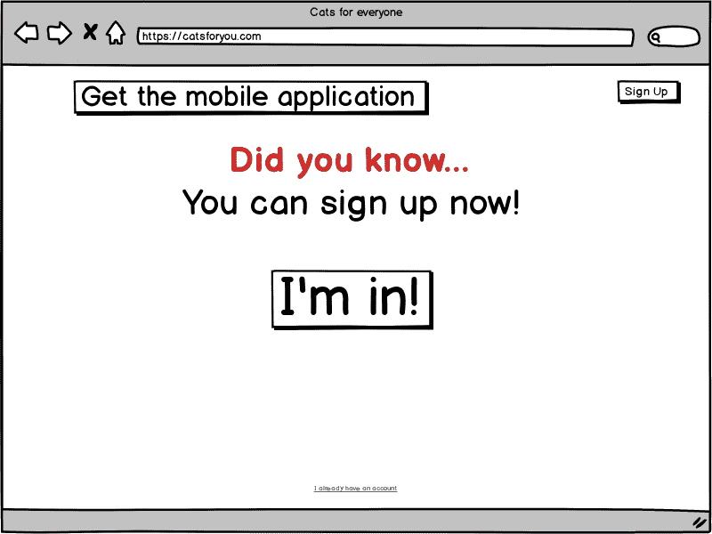
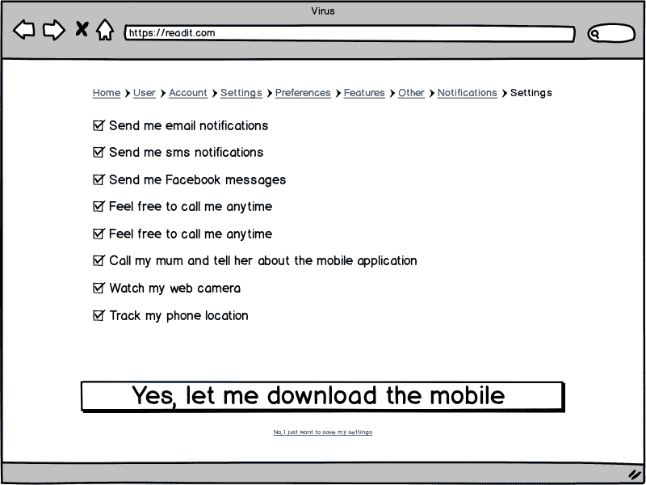
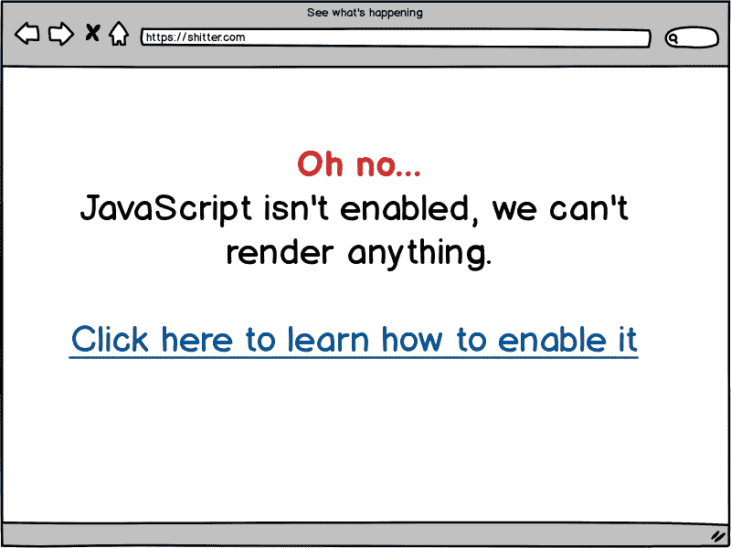

# 《2019 年网络设计指南》一点也不讽刺

> 原文：<https://www.freecodecamp.org/news/how-to-design-for-the-web-in-2019/>

早在 2018 年，我就写过关于如何为现代网络设计的文章。但是网络发展很快，所以那些指导方针已经过时了，因为更多的现代约定已经成为主流。

让我们来分解并浏览一下为 2019 年的**现代 web 设计的最重要的设计原则。**

### 让用户知道你有一个移动应用程序

这一条仍然是最重要的原则，这不是没有道理的。高薪的焦点小组显示，当用户在他们的网络浏览器中访问你的网站时，第一件事就是安装一个移动应用程序。

实现这一点的最好方法是显示一个模态对话框，提示他们安装它。

作为一个可选步骤，您可以添加一个按钮或超链接来关闭所述对话框。但是使用一些隐晦的文字是很重要的，最好是用让用户感到羞耻的措辞来遵守。

**提示**:如果你没有一个真正的移动应用程序，你可以让一个实习生把你的网站打包在一个禁用安全的 webview 中，然后发送出去！

### 实施不跟踪策略

如今，许多现代浏览器都支持名为“DNT”的 HTTP 报头，它代表“请勿跟踪”。该报头意在表示用户不希望被跟踪。不幸的是，这在一些浏览器中是默认启用的，比如[Brave(JavaScript 的创始人 Brendan Eich 制作的一款开源广告拦截浏览器)](https://brave.com/cas860)。

然而，不要担心，因为一切都没有失去！我们发现大多数用户会在提示时删除这个标题。为了解决这个问题，我们建议您提供一份指南，说明如何在出现标题时禁用它。

**提示**:不要在指导用户如何禁用****的指南上给出禁用提示，因为转换率很低。****

### ****实施 Cookie 策略****

****曲奇同意书令人困惑。虽然在大多数情况下这不是必需的，但在合理使用 cookie 的情况下，最好是提示用户同意，这样我们就可以跟踪一切，而不用担心后果。****

********

****提示:即使我们不需要 cookiess，也不要提供没有启用 cookie 的页面。这意味着我们可以跟踪更少的个人信息，因此我们可以出售更少的用户信息。****

### ****阻止广告拦截器****

****广告拦截器无处不在，真的会损害你的利润，所以显而易见的预防措施是拦截广告拦截器。****

********

****Chrome 正在阻止广告拦截器，所以如果用户使用像 Brave 这样的浏览器，我们就可以说用户的浏览器不够现代。****

********

******提示**:不要告诉任何人 [Brave，这是一款基于 Chromium 的开源浏览器，内置广告拦截功能](https://brave.com/cas860)。****

### ****阻止非美国国家和设备****

****在纸杯蛋糕国家，GDPR，环节税和 Huwaei 禁令之间，我们还没有完全搞清楚，最好的办法是阻止他们所有人，以避免任何和所有的责任。****

********

******提示**:你可以……****

### ****最大化您的布局****

****800 像素宽布局的日子一去不复返了。现代显示器倾向于宽屏，因此请确保在布局中充分利用整个宽度。****

********

****提示:研究表明，不能关闭的模态对话框表现更好。****

### ****使用通知****

****现代浏览器支持通知，所以启用它们是必须的。但是作为后备，也自动为用户订阅时事通讯、sms 通知和/或电子邮件通知。****

********

****提示:当你有新版本的移动应用时，使用这些通知来告诉用户。****

### ****提示用户****

****有时用户会忘记他们可以注册。一定要定期提醒他们，并突出注册链接或按钮。****

********

******提示**:当用户将要离开网站或鼠标光标离开网站时，也提示用户。****

### ****允许用户选择退出****

****非常重要的是，我们是用户友好的，而不是侵扰。这意味着我们必须让用户退出我们的持续提示和模态对话框。****

****这里的最佳实践是将选择退出设置放在用户容易发现的地方——通常在“帐户首选项”页面中。****

********

### ****使用 JavaScript****

****众所周知，所有网站都需要 JavaScript。****

****虽然你可能会想，“哦，这只是纯文本和几个模态。”但是将来呢？到那时，将会有更多的模态，我现在就向你保证。****

****当这种情况发生时，你会后悔没有使用运行在无服务器云上的最新框架，使你的网站成为一个同构的应用程序。****

********

******提示**:不要用 JavaScript 渲染这个页面。****

* * *

****还不是 web 开发人员？别担心——你已经有资格阅读这篇文章了。****

****已经是一名[网络开发者了？在这里购买 C 编程语言书籍，在你还能离开的时候离开！](https://amzn.to/2OKhVsg)****