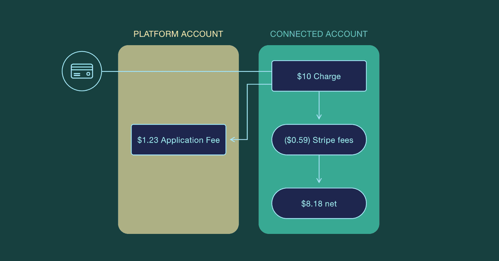
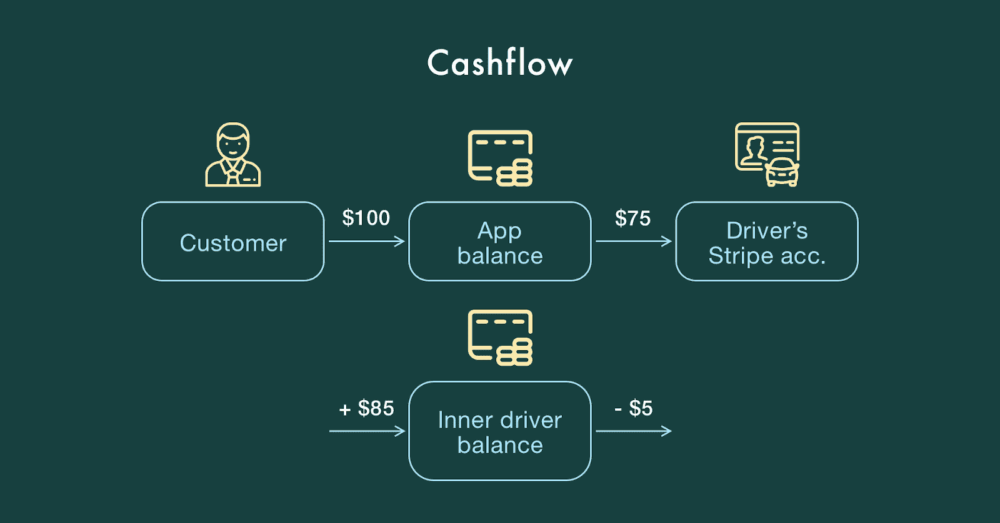

# 如何在 Stripe 上设计支付逻辑(并应用它)

> 原文：<https://www.freecodecamp.org/news/how-to-design-payment-logic-on-stripe-and-apply-it/>

支付逻辑是任何货币交易产品的核心。毕竟，一个设计良好的支付架构，如果测试得当，可以在未来节省大量时间。

但掌握使用流行支付网关的最高水平可能需要太长时间。

为了帮助你，我写了这篇关于在 Stripe 上设计支付逻辑的指南。它包括用例、项目示例和一些带有代码样本的理论。

本指南主要面向 QA 工程师，因为它有助于理解如何测试基于 Stripe 的支付逻辑。但是不要掉，pm 和开发者。我们也有很多有趣的细节给你。

## Stripe 如何工作

让我们从基础开始，回顾一下条纹支付方案。


Payment scheme for Stripe

这一方案适用于在网站上或通过移动应用购买内容的用户。访问者不需要注册和添加链接信用卡到他们的个人资料 Stripe 允许无缝地为内容付费。

他们只需输入信用卡信息，神奇的事情就发生了:

1.  凭据被发送到条带。
2.  条带化对数据进行令牌化，并将令牌返回给后端。
3.  后端产生费用。
4.  数据被再次发送到 Stripe，并与支付系统共享详细信息。
5.  支付系统对 Stripe 作出响应，并声明是否一切正常。或者报告问题。
6.  Stripe 向服务器响应事务的状态。

如果一切顺利，用户就获得了内容。如果没有，则显示一条错误消息。

此外，使用 Stripe 有两个必要条件:

*   你有银行账户
*   您是 25 个受支持国家之一的居民

### 将卡连接到条带

将您的产品用户与 Stripe 客户联系起来是在服务器端进行的。看起来是这样的:

1.  信用卡凭证去 Stripe(来自 app 或网站)；
2.  Stripe 返回一个令牌，然后它进入后端；
3.  后端将其发送回条带化；
4.  Stripe 检查该客户是否存在(如果存在，则添加该卡，如果不存在，则创建新客户并添加该卡)。

添加的第一张卡是默认的支付方式。Stripe 将使用它进行交易。

### 使用条带帐户连接

如果你正在开发一个像优步一样的点播应用，并希望用户从中获得报酬(像优步的司机)，让他们先创建一个账户。

有三种类型的条带帐户:

*   **标准**。具有所需凭据的现有帐户。由用户注册，由 Stripe 和银行验证。
*   **快递**。实现轻松登录:您自己创建一个帐户，用户填写详细信息。在美国境内工作。
*   **习俗**。具有最高级别的灵活性，允许您修改多个参数。反过来，平台负责与用户的每一次互动。

## 条带核心功能

还是关于 Stripe 如何工作的话题，我建议看一下它的特性。

### 费用

Stripe 有两种收费方式——**直达**和**目的地**。

**直接充电**

让我们回到优步模型。该平台向乘客收取一定的费用，这些钱直接进入相关账户，支付给司机。直接收费意味着司机支付所有费用。此外，优步还收取固定百分比的费用。



**目的地费用**

这种情况下，平台支付所有费用，你获得净值。首先，金额进入您平台的 Stripe 账户，然后自动转账给合作伙伴(驱动程序)。

### 授权和捕获

Stripe 支持两步支付，使用户能够先授权收费，然后再收取费用。发卡机构保证授权支付和所需金额冻结在客户的卡上。

如果在此期间未获得费用，授权将被取消。

**在优步，它是这样工作的:**一个骑手在预订旅程时会看到旅程的大概费用。如果他们同意，这笔钱会冻结在他们的卡上，直到他们结束旅行。

当他们结束旅程时，优步计算出最终价格，并从卡上扣钱。

这就是产品所有者选择 Stripe 进行 P2P 支付应用开发的原因。因为在点对点交易中，信任是最重要的。

最后，我想提一下另外三个条纹特征。

**转移**。转账从平台账户到供应商。例如，优步的司机将条纹账户与他们的个人资料联系起来以获得报酬。

**订阅量**。这个特性非常灵活，使用户能够设置时间间隔、试用期，并根据自己的需要调整订阅。

**退款**。如果买家想要拿回他们的钱，Stripe 用户可以很容易地向客户的卡退款。

## 处理条带对象

接下来，我们将移动到条纹物体。下面是我承诺的代码示例。

### 源对象

下面是源对象的清单。

| 钥匙 | 价值 |
| --- | --- |
| 顾客 | 客户的条带 id |
| 身份证明（identification） | 添加的卡的 stripe_id |
| 最后 4 个 | 添加的卡的最后 4 个数字 |
| 品牌 | 信用卡公司(Visa，AE) |
| exp _ 月，exp _ 年 | 卡的到期日期 |

该对象保留有助于完成收费的支付方法。还可以将源对象与用户链接起来。这使得他们可以在那里存储所有的支付方式。

测试时，确保支付方式与返回值一致是至关重要的。为此检查**最后 4 个**和**预期月/年**。

如果源对象与客户相关联，并且您想要确保它属于正确的人，请检查**客户 id** 。
这里有一个 JSON 的对象:

```
{
        "id": "card_1CboP4CLud4t5fBlZMiVrzBq",
        "object": "card",
        "address_city": null,
        "address_country": null,
        "address_line1": null,
        "address_line1_check": null,
        "address_line2": null,
        "address_state": null,
        "address_zip": null,
        "address_zip_check": null,
        "brand": "Visa",
        "country": "US",
        "customer": "cus_D1s9PQgvr6U46j",
        "cvc_check": "pass",
        "dynamic_last4": null,
        "exp_month": 4,
        "exp_year": 2024,
        "fingerprint": "soMjdt25OvcMcObY",
        "funding": "credit",
        "last4": "4242",
        "metadata": {},
        "name": null,
        "tokenization_method": null
      }
```

### 客户对象

再次从清单开始。

| 钥匙 | 价值 |
| --- | --- |
| 捐款 | 订阅列表 |
| 身份证明（identification） | 客户条带 id |
| 默认 _ 源 | 默认卡的条带 id |
| 来源 | 来源列表 |

客户对象存储付款方式，包括默认方式。并包含有关用户及其订阅的信息。

它还会召回用户的信用卡和主要的付款方式。您可以根据此数据手动向用户收费。

与订阅相同–Stripe 管理订阅并自动提取费用。

```
{
  "id": "cus_D1s9PQgvr6U46j",
  "object": "customer",
  "account_balance": 0,
  "created": 1528717303,
  "currency": null,
  "default_source": "card_1CboP4CLud4t5fBlZMiVrzBq",
  "delinquent": false,
  "description": null,
  "discount": null,
  "email": null,
  "invoice_prefix": "4A178DE",
  "livemode": false,
  "metadata": {},
  "shipping": null,
  "sources": {
    "object": "list",
    "data": [
      {
        "id": "card_1CboP4CLud4t5fBlZMiVrzBq",
        "object": "card",
        "address_city": null,
        "address_country": null,
        "address_line1": null,
        "address_line1_check": null,
        "address_line2": null,
        "address_state": null,
        "address_zip": null,
        "address_zip_check": null,
        "brand": "Visa",
        "country": "US",
        "customer": "cus_D1s9PQgvr6U46j",
        "cvc_check": "pass",
        "dynamic_last4": null,
        "exp_month": 4,
        "exp_year": 2024,
        "fingerprint": "soMjdt25OvcMcObY",
        "funding": "credit",
        "last4": "4242",
        "metadata": {},
        "name": null,
        "tokenization_method": null
      },
      {
        "id": "card_1CcC3uCLud4t5fBlW2UMknUW",
        "object": "card",
        "address_city": null,
        "address_country": null,
        "address_line1": null,
        "address_line1_check": null,
        "address_line2": null,
        "address_state": null,
        "address_zip": null,
        "address_zip_check": null,
        "brand": "Visa",
        "country": "US",
        "customer": "cus_D1s9PQgvr6U46j",
        "cvc_check": "pass",
        "dynamic_last4": null,
        "exp_month": 4,
        "exp_year": 2024,
        "fingerprint": "soMjdt25OvcMcObY",
        "funding": "credit",
        "last4": "4242",
        "metadata": {},
        "name": null,
        "tokenization_method": null
      }
    ],
    "has_more": false,
    "total_count": 2,
    "url": "/v1/customers/cus_D1s9PQgvr6U46j/sources"
  },
  "subscriptions": {
    "object": "list",
    "data": [],
    "has_more": false,
    "total_count": 0,
    "url": "/v1/customers/cus_D1s9PQgvr6U46j/subscriptions"
  }
}
```

### 收费对象

收费对象的清单:

| 钥匙 | 价值 |
| --- | --- |
| 目的地 | 收款人条纹账户 |
| 身份证明（identification） | 收费条带 _id |
| 数量 | 以美分为单位的付款金额 |
| 金额 _ 退款 | 退款金额(美分) |
| 顾客 | 付款人的客户标识 |
| 捕获 | 真-付款，假-授权 |

*   **金额**–在测试过程中，您应该经常检查所充的金额。它可以是美分、欧分等等。
*   **amount _ referred**–如果交易的全部金额(或部分金额)被退款，则该字段的值不为零。
*   **客户**–您客户的 id
*   **捕获的**–表示交易的状态。钱可以存在用户的信用卡上，也可以被收取。
*   **目的地**–目的地密钥将存储您已转账至的用户的 Stripe 账户。

```
"fingerprint": "soMjdt25OvcMcObY",
    "funding": "credit",
    "last4": "4242",
    "metadata": {},
    "name": null,
    "tokenization_method": null
  },
  "source_transfer": null,
  "statement_descriptor": null,
  "status": "succeeded",
  "transfer_group": null
}
```

**退款对象**

退款对象嵌入在收费对象中，以防付款的任何部分(或全部)被退还给买方。

| 钥匙 | 价值 |
| --- | --- |
| 状态 | 成功/待定/失败 |
| 身份证明（identification） | 退款条 _id |
| 数量 | 以美分为单位的付款金额 |

```
{
  "id": "re_1CcY10CLud4t5fBlN23KtYq7",
  "object": "refund",
  "amount": 999,
  "balance_transaction": "txn_1CcY10CLud4t5fBlhlmzzJuK",
  "charge": "ch_1CcD7dCLud4t5fBlC1srZNIB",
  "created": 1528892634,
  "currency": "usd",
  "metadata": {},
  "reason": null,
  "receipt_number": null,
  "status": "succeeded"
}
```

**传送对象**

| 钥匙 | 价值 |
| --- | --- |
| 反转 | 反向转移对象列表 |
| 身份证明（identification） | 转移 id |
| 数量 | 以美分表示的支付金额 |
| 目的地 | 收款人的关联账户 |
| 颠倒的 | 假币交易，真币反转 |

转账对象保存与从平台余额到其他账户的转账相关的信息。比如支付给平台的合作伙伴——优步司机。

请注意，所有的交易都应该在数据库中登录。这样，在测试过程中，您将看到传输 id。转到条带并检查以下内容:

*   **金额**–支付给收款人的金额
*   **目的地**–获得付款的用户的条纹账户
*   **反转**–如果您需要取消交易，该键作为一个指示器。如果交易成功，它显示一个假值。真-如果反过来
*   **撤销**–存储对象列表，以防传输的任何部分被撤销

```
{
  "id": "tr_1CcApyCLud4t5fBlZyx5mEPI",
  "object": "transfer",
  "amount": 250,
  "amount_reversed": 0,
  "balance_transaction": "txn_1CcApyCLud4t5fBlfA5cgXBz",
  "created": 1528803538,
  "currency": "usd",
  "description": null,
  "destination": "acct_18bAS3KcT341ksb9",
  "destination_payment": "py_1CcApyKcT341ksb9VawxIJdS",
  "livemode": false,
  "metadata": {},
  "reversals": {
    "object": "list",
    "data": [],
    "has_more": false,
    "total_count": 0,
    "url": "/v1/transfers/tr_1CcApyCLud4t5fBlZyx5mEPI/reversals"
  },
  "reversed": false,
  "source_transaction": null,
  "source_type": "card",
  "transfer_group": null
}
```

**余额交易对象**

| 钥匙 | 价值 |
| --- | --- |
| 类型 | 交易类型(收费、退款、转账) |
| 身份证明（identification） | 退款条 _id |
| 数量 | 以美分为单位的支付金额(注意+/-符号) |
| 可用 _ 开 | 收款人可以获得资金的日期 |
| 费用 | 条纹费金额 |
| 费用 _ 详细信息 | 费用对象列表 |
| 网 | 净收入/支出额 |
| 状态 | 操作的当前状态 |

该对象存储有关应用程序余额的任何更改的数据。您实际上不需要测试这个对象。而是为了了解费用从何而来。

*   **金额**–以美分为单位的付款金额
*   **available _ on**–发送给合作伙伴的资金将会及时到位，这个键告诉他们确切的时间
*   **费用**–条纹费的金额
*   **fee _ details**–费用对象列表，并说明为什么收取费用
*   **净额**–净收入金额
*   **状态**–操作成功的状态
*   **类型**–对象的类型(收费、退款、转账)

转账余额交易代码示例:

```
{
  "id": "txn_1CcApyCLud4t5fBlfA5cgXBz",
  "object": "balance_transaction",
  "amount": -250,
  "available_on": 1528803538,
  "created": 1528803538,
  "currency": "usd",
  "description": null,
  "exchange_rate": null,
  "fee": 0,
  "fee_details": [],
  "net": -250,
  "source": "tr_1CcApyCLud4t5fBlZyx5mEPI",
  "status": "available",
  "type": "transfer"
}
```

收费的余额交易代码示例:

```
{
  "id": "txn_1CbrRTCLud4t5fBlhRfMLdq1",
  "object": "balance_transaction",
  "amount": 10000,
  "available_on": 1529280000,
  "created": 1528728983,
  "currency": "usd",
  "description": "Charge user asdf11@example.com for instructor sodom@example.com lesson id: 77",
  "exchange_rate": null,
  "fee": 320,
  "fee_details": [
    {
      "amount": 320,
      "application": null,
      "currency": "usd",
      "description": "Stripe processing fees",
      "type": "stripe_fee"
    }
  ],
  "net": 9680,
  "source": "ch_1CbrP3CLud4t5fBlztHMxVzv",
  "status": "pending",
  "type": "charge"
}
```

**认购对象**

| 钥匙 | 价值 |
| --- | --- |
| 计划 | 订阅规则:金额、间隔、试用天数 |
| 身份证明（identification） | 订阅条带 id |
| 申请费用百分比 | 订阅收取%的费用 |
| 演员表 | 自动收费或发送发票 |
| 计费 _ 周期 _ 锚 | 下一个订阅周期的时间 |
| 当前周期开始当前周期结束 | 当前认购期的时间范围 |

*   **application _ fee _ percent**–应用程序收费总额的百分比，其余部分由内容所有者支付
*   **计费**—负责计费流程的进行——自动或手动(通过发票)
*   **billing _ cycle _ anchor**–包含下一次支付续订费用的到期日
*   **current _ period _ start&current _ period _ end**–客户认购的有效期
*   **计划**–存储订阅计划的对象，包括一组规则(支付金额、间隔、试用天数等)

```
{
  "id": "sub_D2JskPBqcW24hu",
  "object": "subscription",
  "application_fee_percent": null,
  "billing": "charge_automatically",
  "billing_cycle_anchor": 1528820423,
  "cancel_at_period_end": false,
  "canceled_at": null,
  "created": 1528820423,
  "current_period_end": 1531412423,
  "current_period_start": 1528820423,
  "customer": "cus_D2Jsi3JgT5zPh1",
  "days_until_due": null,
  "discount": null,
  "ended_at": null,
  "items": {
    "object": "list",
    "data": [
      {
        "id": "si_D2Js7N4mYxzAaY",
        "object": "subscription_item",
        "created": 1528820424,
        "metadata": {
        },
        "plan": {
          "id": "ivory-express-917",
          "object": "plan",
          "active": true,
          "aggregate_usage": null,
          "amount": 999,
          "billing_scheme": "per_unit",
          "created": 1528819224,
          "currency": "usd",
          "interval": "month",
          "interval_count": 1,
          "livemode": false,
          "metadata": {
          },
          "name": "Ivory Express",
          "nickname": null,
          "product": "prod_D2JYysdjdQ2gwT",
          "statement_descriptor": null,
          "tiers": null,
          "tiers_mode": null,
          "transform_usage": null,
          "trial_period_days": null,
          "usage_type": "licensed"
        },
        "quantity": 1,
        "subscription": "sub_D2JskPBqcW24hu"
      }
    ],
    "has_more": false,
    "total_count": 1,
    "url": "/v1/subscription_items?subscription=sub_D2JskPBqcW24hu"
  },
  "livemode": false,
  "metadata": {
  },
  "plan": {
    "id": "ivory-express-917",
    "object": "plan",
    "active": true,
    "aggregate_usage": null,
    "amount": 999,
    "billing_scheme": "per_unit",
    "created": 1528819224,
    "currency": "usd",
    "interval": "month",
    "interval_count": 1,
    "livemode": false,
    "metadata": {
    },
    "name": "Ivory Express",
    "nickname": null,
    "product": "prod_D2JYysdjdQ2gwT",
    "statement_descriptor": null,
    "tiers": null,
    "tiers_mode": null,
    "transform_usage": null,
    "trial_period_days": null,
    "usage_type": "licensed"
  },
  "quantity": 1,
  "start": 1528820423,
  "status": "active",
  "tax_percent": null,
  "trial_end": null,
  "trial_start": null
}
```

## 用例

最后，我们转向用例。因此，让我们看看如何使用 Stripe 构建业务逻辑。

### 捐款

**案例**:用户每月支付 5 美元获取内容。它的作者赚了整体成本的 80%。客户有五天的试用期。

**如何让它工作:**

1.  创建分条订阅计划，指定费用、应用费用百分比和间隔。
2.  集成 webhooks，让服务器了解用户何时订阅，何时付费。
3.  集成电子邮件，向用户发送发票/收据。
4.  当用户购买订阅时，Stripe 从那一刻开始倒数五天，然后进行收费。
5.  作者拿到钱，平台拿到它的费用。

**费用** : 2.9% + 30 美分

### 内容购买

**案例**:用户在网站或移动应用上购买内容。

**如何让它工作:**

1.  顾客对卡进行令牌化。
2.  后端收费。
3.  如果收费成功，平台的商业逻辑允许客户获得内容。

**费用**:收费的 2.9%+30 美分。

### 点播平台(优步)

**案例**:客户支付顺风车费用，平台收取 20%，司机拿 80%。

**前提条件**:

*   驱动程序链接了一个帐户
*   用户添加了一张卡

在这种情况下，您需要在骑手完成付款后自行创建转账。

首先，在他们预订旅程时授权付款，并在旅程结束时获得付款。

接下来，为司机创建一个转账——总额的 80%。付了条纹费，剩下的就是净收入了。

**费用为** : 2.9% + 30 美分

### 按需平台#2

类似优步的应用程序非常适合展示 Stripe 的工作原理。这是另一个用例。

**案例**:客户为服务付费，平台收取 20%，司机拿 80%。此外，司机可以支付 5 美元的优先预订权。

如果司机链接了他们的帐户，并且骑手添加了信用卡，则有效。

*   **变体#1。**你向司机收取 5 美元(在优先选项的情况下)，授权客户付款，在旅程结束时进行抓拍，为司机转账。剩下的留着。在这种情况下，每次收费你要支付 2.9%的费用+ 30 美分。
*   **变式 2。**你可以通过在你的平台上创建内部货币化来跳过费用。当你从客户那里拿到钱的时候，你计算司机的分成，把那些资金转到内部余额。



Cashflow

## 最后

如您所见，支付逻辑的实现及其测试并不像看起来那么难。您需要做的就是以正确的方式处理条带对象。并弄清楚如何在您的平台上使用 Stripe。

我希望当你开始设计基于条纹的支付逻辑及其测试时，这个指南能派上用场。