# 如何设计可怕的图形

> 原文：<https://www.freecodecamp.org/news/how-to-design-terrible-graphs-3b213d909387/>

作者:米歇尔·琼斯

# 如何设计可怕的图形

#### 警告:包含图形暴力

图表用于以直观、概括的格式呈现信息。它们可以用来代替桌子。如果使用成功，图表可以减少句子中使用的数据量和复杂性。希望这篇文章给你额外的工具来决定使用(不使用)什么图形。

在图形设计领域工作最努力最久的人是**爱德华·塔夫特**。我在参考资料中包含了他的网站的链接。

了解我的人也知道两个关键信息。我讨厌饼图，也讨厌制作拙劣的条形图。我从公开的报告中选取了图表来说明我的观点。我还从不同的学科中提取了例子，以表明糟糕的图表设计无处不在。

最后，我特意选择了图表设计者身份不明的报告，或者有多个作者的报告。本文的目的不是点名羞辱个人，设计者通常在出版批准过程中没有多少发言权。经理和/或同行评审员认为这些图形可以使用。

### 饼图


[This is a highly informative pie chart.](https://www.flickr.com/photos/53149458@N08/14124697651)

#### 简单的饼图

饼图的目的是显示互斥的、相关的类别如何贡献关于该类别的信息。

让我们从一个简单的例子开始。下面是一个饼图，只包含两个类别:男性和女性。饼状图通常用于显示性别比例，例如在报告调查结果时。

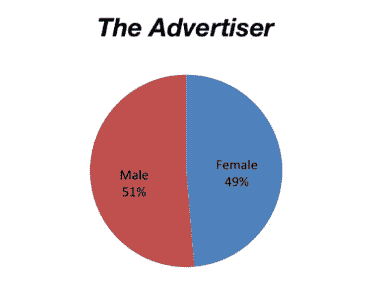

[Proportion of authors reviewed in that newspaper, 2013.](http://thestellaprize.com.au/the-count/the-stella-count-2013/)

但是为什么要使用饼图来进行二进制分类呢？再次重申，这些类别是互斥的。我们可以说 49%的书评都是女性作者写的。51%是男性作者，这很容易假设和计算。

该网站的重点是强调缺乏对女性作者书籍的评论。如果你点击这个链接，你会看到一系列 14 张饼状图，2013 年 Stella Count 评估的每份报纸都有一张。即使是大屏幕，你也要滚动才能看到所有的内容。月度饼状图的类别颜色颠倒了——很难跟踪这么多图表的一致格式！

我认为这些信息用柱状图展示会更好。为此，我使用了 [R](https://cran.r-project.org/) 。我调用过的包是 [**ggplot2**](https://cran.r-project.org/web/packages/ggplot2/index.html) 和 [**ggridges**](https://cran.r-project.org/web/packages/ggridges/index.html) 。已经使用了 ggridges 来循环这两种颜色通过这些条。我认为与每个条形只有一种颜色相比，颜色循环提高了图形的可读性。有一个我无法解决的小问题，颜色向底部循环，所以我用`FillValues`强制颠倒了两个条的顺序。

```
FemaleAuthors <- data.frame(Publication=c("The Advertiser", "The Age", "Australian Book Review",                                                 "The Australian Financial Review", "Books+Publishing",                                                 "The Courier-Mail","The Daily Telegraph", "Good Reading",                                                 "The Monthly","Sunday Age","Sunday Tasmanian",                                                 "The Sydney Morning Herald","The Weekend Australian",                                                "The West Australian"),                            PropOfFemales=c(49,42,47,15,61,41,46,49,41,49,49,43,35,58))FemaleAuthors <- FemaleAuthors[order(-FemaleAuthors$PropOfFemales, -FemaleAuthors$Publication),]FemaleAuthors$FillValues <- c(rep(c("A","B"),5),"B","A","A","B")
```

```
library("ggplot2")library("ggridges")ggplot(data=FemaleAuthors,aes(x=reorder(Publication, PropOfFemales), y=PropOfFemales, fill=FillValues)) +  geom_bar(stat="identity",            colour="black", width=1) +  scale_y_continuous(breaks=seq(0, 70, by=5),                     limits=c(0,70),                     expand=c(0,0)) +  scale_fill_cyclical(values=c("plum3","orchid2"))+  labs(x="Publication", y="Proportion of books reviewed \nwith female authors")+  coord_flip() +    theme(panel.grid.minor.y=element_blank(),         panel.grid.major.x=element_line(color="gray"),        panel.background=element_blank(),         axis.line = element_line(color="gray", size = 1),        axis.text=element_text(size=10),        axis.title=element_text(size=15),        plot.margin=margin(5,5,5,5),        legend.position = "none")
```

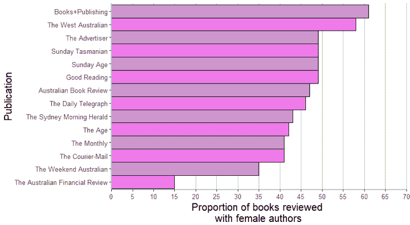

My preferred presentation for that type of data.

这 14 个饼状图中的重要信息——女性作者在报纸书评中的表现——现在一目了然。

为了便于解释，我用粉红色的阴影对条形进行了颜色编码。(是的，这是一种刻板印象，但粉红色表明这是女性的结果)。交替的颜色使眼睛更容易沿着每一条线追踪。我用递减的女性代表来绘制数据，加强了斯特拉计数的观点。

虽然无法从图表中读出准确的比例，但每 5%的网格线提供了一个数字的感觉。重要的数字可以在文中提及。

#### 更复杂的饼图

下面的饼状图有很多切片，与基因表达有关。只有三个切片大到足以容纳文本。每个类别都标有各自的比例。

一类是“杂项功能”，不包含改变的基因，显示在饼状图的旁边。它在太空中盘旋。但是，因为该函数位于紫色部分的旁边，所以快速浏览一下就会发现它与该部分相关。“核酸调控”一行显示了实际的类别，但并非所有切片都有链接类别的线条。

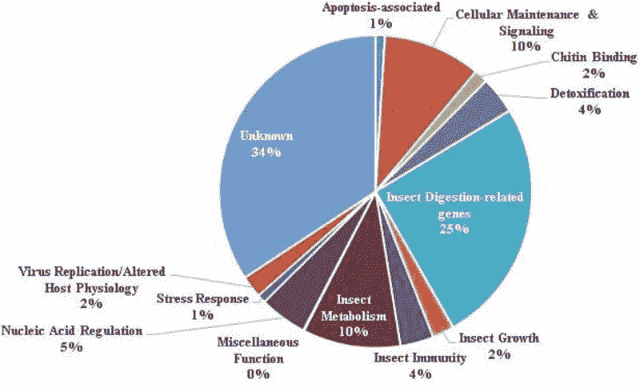

[Pie charts are also found in academic papers.](http://www.mdpi.com/2075-4450/4/3/506/htm)

同样，我可以构建一个条形图，因为所有的数据都包含在原始图形中。使用 R 和 [**RColorBrewer**](https://cran.r-project.org/web/packages/RColorBrewer/index.html) 包获得比 Set3:

```
GeneExpressionProfile <- data.frame(AlteredGenes=factor(c("Apotosis-associated","Cellular Maintenance & Signalling",                                                          "Chitin Binding","Detoxification","Insect Digestion-related",                                                          "Insect Growth","Insect Immunity", "Insect Metabolism",                                                          "Miscellaneous Function","Nucleic Acid Regulation",                                                          "Stress Response","Virus Replication / Altered Host Physiology",                                                          "Unknown")),                                    PercentAltered=c(1,10,2,4,25,2,4,10,0,5,1,2,34))GeneExpressionProfile <- GeneExpressionProfile[order(-GeneExpressionProfile$PercentAltered),]library("ggplot2")library("ggridges")library("RColorBrewer")ggplot(data=GeneExpressionProfile,aes(x=reorder(AlteredGenes, PercentAltered), y=PercentAltered, fill=AlteredGenes)) +  geom_bar(stat="identity",            colour="black", width=1) +  scale_y_continuous(breaks=seq(0, 50, by=5),                     limits=c(0,50),                     expand=c(0,0)) +  scale_fill_manual(values=colorRampPalette(brewer.pal(12,"Set3"))(13)) +  labs(x="Gene Group", y="Proportion of altered genes \nacross the genes studied")+  coord_flip() +  theme(panel.grid.minor.y=element_blank(),         panel.grid.major.x=element_line(color="gray"),        panel.background=element_blank(),         axis.line = element_line(color="gray", size = 1),        axis.text=element_text(size=10),        axis.title=element_text(size=15),        plot.margin=margin(5,5,5,5),        legend.position = "none")
```

生成以下条形图

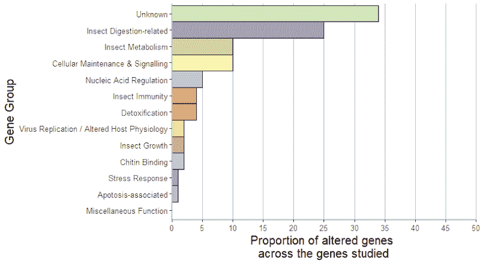

I think this is easier to interpret.

### 条形图

如你所见，我真的很喜欢条形图。然而，有许多方法可以降低条形图的可解释性。这些是堆积条形图。

#### 堆积条形图

一种堆积条形图使用比例，因此每个条形图内部的每个分量总和为 100%。这些在视觉上可能很复杂，而且图表中的信息对读者来说并不总是清晰的。

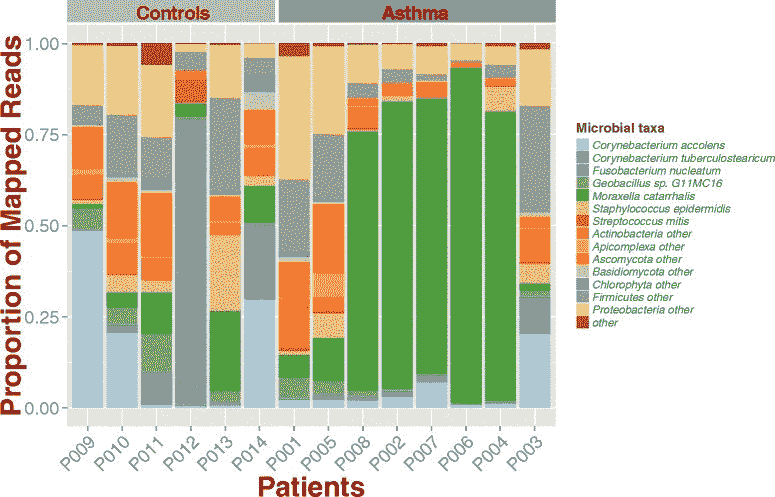

[This is a very complicated stacked bar chart.](https://www.researchgate.net/figure/Microbial-composition-of-asthma-and-control-samples-Stacked-bar-chart-shows-different_fig3_281004993)

此外，因为所有的条形都被强制为相同的长度，所以构成比例的数字之间的差异被掩盖了。然后，比较各条线的相对比例可能会产生误导。

如果结果与十分之三的人有关，那么占一根棒线 30%的因素可能就没什么意思了。如果同样的百分比是基于 200 个人，我们对重要性的理解就会改变。

下面是另一个不太复杂的例子。这个图形有两个主要问题。首先，条形包括百分比。这是承认人们不能从条形部分的长度来解释数值。如果你点击(标题中的)链接，你会发现在图表下方的同一页上列出了**所有**年的**所有**百分比。

为什么这样不好？图表中的所有信息都在正文中重复了。为什么包括条形图？

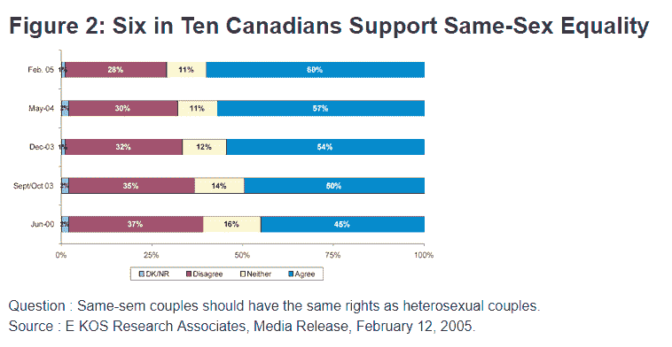

[O Canada, quite literally.](http://www.justice.gc.ca/eng/rp-pr/jr/jr13/fig5l.html)

在小节中使用数字似乎是相对常见的。下面还有一个例子。这里，他们在每个部分都使用了由浅到深的配色方案。我认为渐变色会使图表更难阅读。当条形没有堆叠时，渐变配色方案也很难理解。

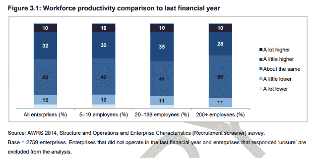

[Example from Australia.](https://www.fwc.gov.au/documents/awrs/awrs-first-findings.pdf)

另一种类型的堆积条形图是条形部分呈现真实值的条形图。这导致不同高度的条。好处是我们可以看到实际数字。然而，图表仍然包含大量信息，只有类别中最大的变化是明显的。

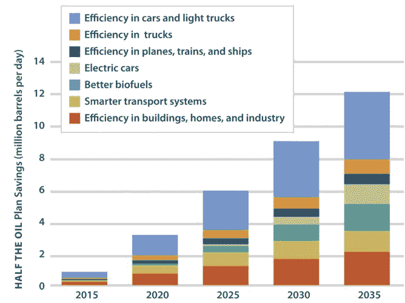

[Stacked bar chart that isn’t rescaled to proportions.](http://www.hybridcars.com/how-green-cars-can-help-americas-presidents-keep-their-promises/half-the-oil-savings-over-time-bar-graph/)

### 特别提及:三维图形

我把这些放在一个单独的部分，以表明 3d 对于图表来说不是一个好的决定。

#### 三维饼图

唯一比二维饼图更糟糕的是三维饼图。

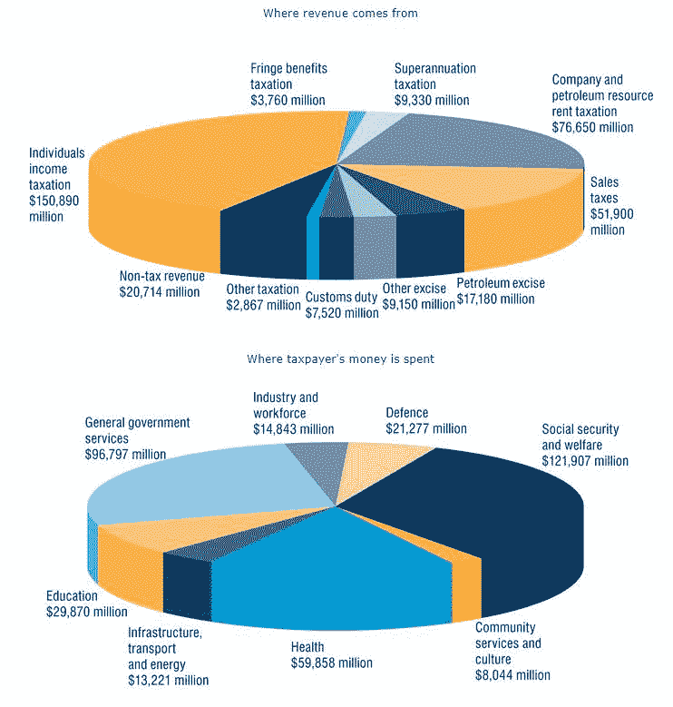

[Having two of them together is not twice as informative.](http://www.budget.gov.au/2011-12/content/overview/html/overview_46.htm)

这些碎片的相对大小更难解释。因为图表是在二维空间中，所以切片变得不准确。让我们以下面的图表为例。在每个例子中，我都四舍五入到最接近的百万。

将“社会保障和福利”(1.22 亿美元)与“健康”(6000 万美元)进行比较。医疗部分看起来只有社会保障和福利部分的一半吗？

将“一般政府服务”(9700 万美元)与社会保障和福利部分进行比较。一般政府服务大约是社会保障和福利支出的 4/5，但饼状图使它们看起来数额差不多。

类别的排序也不清楚。它们不是按大小顺序排列的。它们不是按字母顺序排列的。

解决方法是什么？同样，对于二维饼图也是如此。如果类别很少，条形图是更好的数据表示形式。

让我们用 [R](https://cran.r-project.org/) 来看看底部的饼状图在条形图中是什么样子。我使用 **ggplot2** 包来绘图，使用 **stringr** 包来处理轴标签上的文本换行。

我喜欢 ColorBrewer 调色板中 Set3 的颜色顺序和组合。我还通过移除背景颜色和无关的网格线来消除图表中的混乱。我已经按金额降序排列了支出类别。我将 y 轴文本换行，以提供更好的 y 轴宽度与内部绘图宽度之比。传说已经被查禁了。我已经扩展了图表的右边外缘，所以最终的 x 轴值不会被截断。

```
TaxExpenditure <- data.frame(Expenditure.Type=c(factor("Industry & workforce", "Defence", "Social security & welfare",                                                "Community services & culture", "Health", "Infrastructure, transport & energy",                                                "Education", "General government services")),                             Expenditure.Amount=c(14.843, 21.277, 121.907, 8.044, 59.858, 13.221, 29.870, 96.797))
```

```
library("ggplot2")library("stringr")ggplot(data=TaxExpenditure,aes(x=reorder(Expenditure.Type, Expenditure.Amount), y=Expenditure.Amount,                                fill=Expenditure.Type)) +  geom_bar(stat="identity") +  scale_y_continuous(breaks=seq(0, 125, by=25),                     limits=c(0,125),                     expand=c(0,0)) +  scale_x_discrete(labels=function(x) str_wrap(x, width=20))+  labs(x="Expenditure type", y="Expenditure ($millions)")+  scale_fill_brewer(palette="Set3") +  coord_flip() +  theme(panel.grid.minor.y=element_blank(),         panel.grid.major.x=element_line(color="gray"),        panel.background=element_blank(),         axis.line = element_line(color="gray", size = 1),        axis.text=element_text(size=10),        axis.title=element_text(size=15),        plot.margin=margin(5,15,5,5),        legend.position = "none")
```

结果图如下所示。与饼状图相比，支出的相对差异更容易看出。

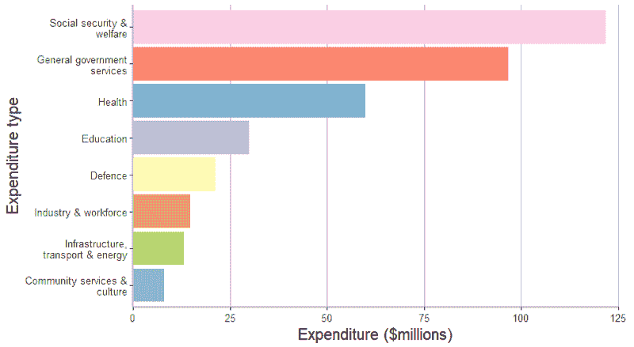

#### 三维爆炸饼图

朋友不会让朋友创建三维爆炸饼图。

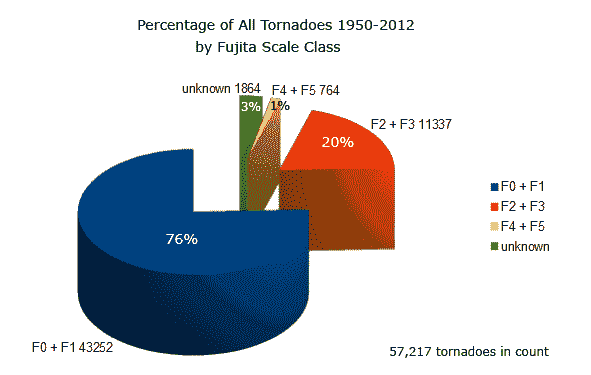

[This one has a legend, although the slices are labelled.](http://www.tornadoproject.com/cellar/fscale.htm)

#### 三维条形图

众所周知，三维条形图很难正确解释，因为它们试图将三维压缩到二维空间中。由于零平面的定位，下面的例子特别复杂。

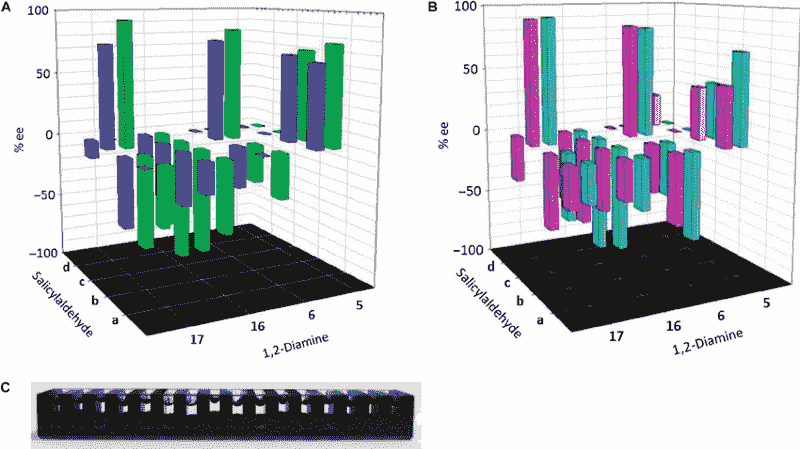

[Source](https://www.researchgate.net/figure/Three-dimensional-bar-graph-for-data-from-miniaturized-ISES-for-the-Co-salen-array-A_fig2_280076489).

### 关于更好的图表的更多建议

#### 不要使用模式

在图表中使用颜色/灰度比使用图案更好。图案，如交叉影线，使图形更难阅读。

示例 1:

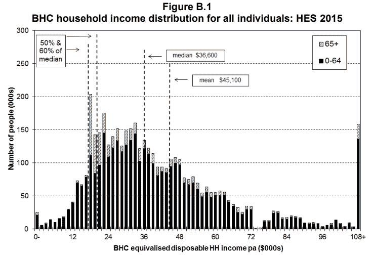

[Lots of bars, lines, text boxes, and diagonal stripes.](https://www.msd.govt.nz/documents/about-msd-and-our-work/publications-resources/monitoring/household-income-report/2017/2017-incomes-report-wed-19-july-2017.pdf)

示例 2:


[This is a chart using mock data, but the point is clear.](https://blogs.sas.com/content/graphicallyspeaking/2017/10/30/fill-patterns/)

#### 使用合适的配色方案

不同的配色方案可用于图表。不是所有的都是好的。


[I’m not sure why SAS included this capability.](http://support.sas.com/kb/43/770.html)

#### **使用合适的轴标尺**

你的数轴应该从零开始。如果你的数字很大，用一个合适的数量级来表达，例如用百万美元或数千小时作为基数。

如果你的图表显示类别值之间的差异很小，考虑为什么图表是必要的。

你想显示每年的变化吗？如果是这样的话，你可以用图表来表示从一年到下一年的百分比变化，而不是用图表来表示原始数据。

您是否希望强调某个特定因素在一段时间内的影响？一种选择是绘制该因素的图表，而不绘制其他内容。

#### 类别排序很重要

没有一个规则适用于确定类别的顺序。我在示例中使用的一个选项是高度。您将如何决定您的订单:

*   最高到最低？
*   按类别字母排序？
*   其他订单？

您使用的顺序取决于客户从图表中需要的主要信息。

#### 仔细检查你的图形的准确性

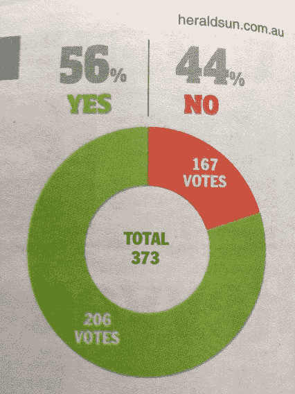

It’s more like 55/45, but no idea how the coloured areas can be so incorrect.

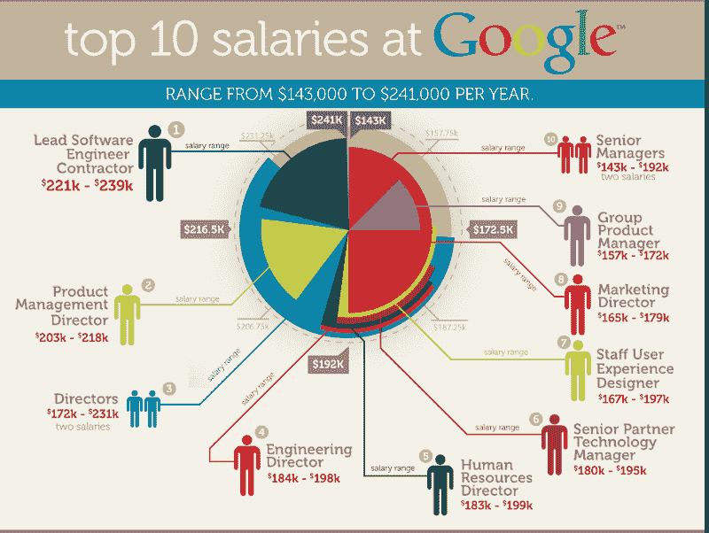

[I have never seen a layered pie chart before.](http://www.jobvine.co.za/what-does-it-take-to-get-a-job-at-google/)

#### 考虑使用误差线

下图来自一项研究，该研究使用计算机化的刺激，检查了 THC 对受试者反应时间和反应准确性的影响。

他们在每项测量中都包含了误差线，所以我们一眼就能看出受试者组之间是否有任何结果不同(安慰剂对 THC)。只使用了灰度配色方案，非常有效。

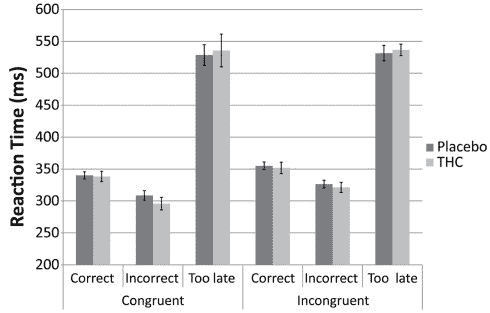

[Simple bar chart conveying a lot of information.](https://www.researchgate.net/figure/Bar-graphs-showing-average-Reaction-Time-for-congruent-and-incongruent-trials-for_fig1_51760950)

### 创建更好图表的资源

创造更好的图表和图形的大师是爱德华·塔夫特。他所有的书都是艺术作品，但对于数字的呈现，我推荐[量化信息的可视化展示](https://www.edwardtufte.com/tufte/books_vdqi)。

我觉得特别有用的一个博客是 [FlowingData](http://flowingdata.com/) 。即使你没有成为该网站的(付费)会员，内森也是一位多产的出版商，你可以从他的帖子中获得灵感。其中一些帖子是他制作的图形，其他的是他从其他地方获得的精心设计的图形。

*免责声明:在本文的制作过程中，没有任何实际的图表受到损害。*