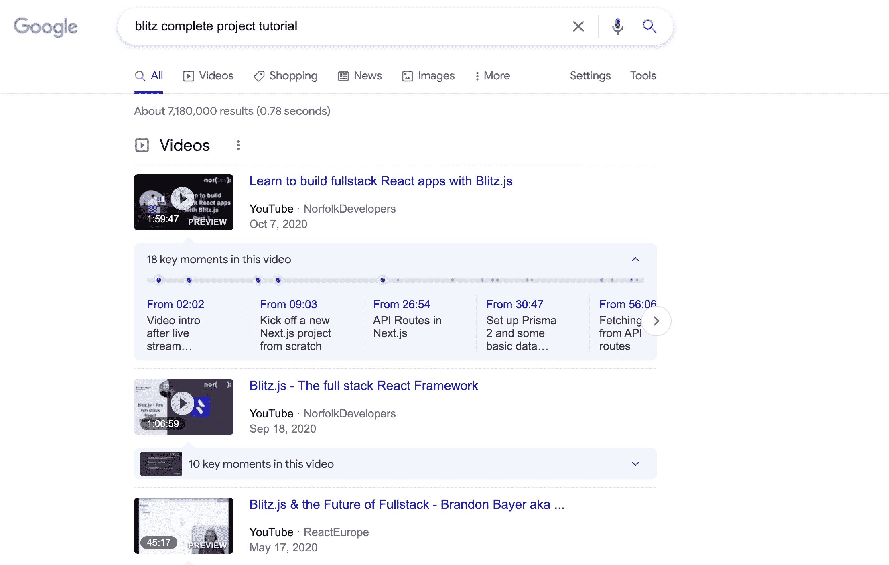

# 如何为任何技术堆栈设计自己的学习计划

> 原文：<https://www.freecodecamp.org/news/how-to-design-your-own-learning-plan-for-any-tech-stack/>

作为一名开发人员，开始新的职业生涯最困难的事情之一是弄清楚你应该学习什么——然后将其转化为有效的计划。

有如此多的资源可供学习，所以缺乏信息不是问题。

问题是双重的:

首先，很难收集所有这些信息，并将其转化为系统学习你想学习的内容的连贯计划。

第二，很难弄清楚如何利用所有这些资源并真正从中学习，而不是永远困在教程地狱里。

困难在于，我们被一步一步的教程和课程所吸引，如果没有计划，就很难摆脱它们，做自己的事情。

本指南旨在帮助你学习如何制定自己的学习计划，这样你就可以利用教程和课程，同时仍然能够打破既定的道路，开始打造自己的学习计划。

仅仅通过一遍又一遍地学习教程和课程是不可能真正学会编码的。

在某些时候，你必须走出他们提供的舒适区，自己做一些事情。

我的希望是，这个指南将作为一个过渡援助，引导你创造自己的学习道路，而不是告诉你到底该做什么。

## 循序渐进的心理陷阱

在我们进入实用方法之前，我们需要谈谈为什么人们会陷入教程地狱，以及如何摆脱它。

对大多数人来说，这个过程大概是这样的:

你通过教程，感觉很好。您正在轻松地浏览教程，从头开始构建一些东西。

也许你会遇到一些小问题，但是没有什么是你不能很快解决的。

你经历了其中的一些，在这个过程中建立了一些小的项目。

然后你开始自己建造一些东西，却立刻碰壁了。

在你感觉你忘记了刚刚学过的所有东西之前，你几乎不能开始这个项目。

你会觉得自己是从零开始的。就像你花时间学的东西都被扔出窗外了。

你觉得你没有学到东西，所以你找到了更多的教程，认为你需要他们在你自己构建东西之前学到更多。

如此循环往复。

事实上，你很快就停止了挣扎。

学习不仅仅发生在教程中。学习发生在大多数人放弃并回到教程的时候。

那场斗争。那种你什么都不知道的感觉。这是学习过程的第一步。

不要逃避它。向它倾斜。

这很难做到。回到教程中去很舒服也很容易，因为完成它们感觉很好。它让你觉得你在学习。

但这是一个危险的陷阱，因为一旦你不再舒适并开始努力建立自己的东西，真正的学习就开始了。

所以在我们进入设计你自己的学习计划的实际步骤之前，请理解这一点并为此做好准备。

没有捷径，没有简单的逐步解决办法。你只需要接受你将要挣扎和困惑，不知道自己在做什么。

这是过程的一部分。

那是真正的学习发生的地方。

拥抱它，度过它。这种从零开始构建其他地方都不存在的东西的成就感是值得的。

当你想找一份专业开发人员的工作时，它会让潜在的雇主和客户眼前一亮。

## 如何决定学什么

我喜欢例子和看到概念的具体实现。因此，在本指南中，我将谈论一个概念，然后举一个例子，说明我为一个我已经感兴趣了一段时间的技术堆栈设计学习计划的过程: [Blitz.js](https://blitzjs.com/) 。

为了决定你想学什么，你可以考虑几个不同的标准。

这些将取决于你在职业生涯中的位置。

如果是刚入门，我推荐选择就业潜力大的栈。

现在，我建议对此做出反应。

如果你已经熟悉 React，我会去学习一些 Web3 和区块链。

我的职业生涯已经进行了 7 年，现在我的主要兴趣是探索不同的新兴堆栈，以提高我的工作效率。对我来说，这意味着我对 Blitz.js 感兴趣。

我喜欢拥有一个与 Rails 理念相同的堆栈的想法，但它是建立在 React 和 Next.js 之上的。

你可能刚刚开始，所以你主要对学习如何用 React 构建东西感兴趣，这样你就可以得到你的第一份工作。

这因人而异，但学习计划设计的组成部分是相同的。

## 初次接触技术堆栈

学习任何新堆栈的第一步是简单地了解它的基本工作原理。最好从 stack 提供的官方入门教程开始。

大多数堆栈都会有类似于[闪电战](https://blitzjs.com/docs/tutorial)或[反应](https://reactjs.org/tutorial/tutorial.html)的入门教程。

但是如果他们没有，你可以在谷歌上搜索一下你的堆栈的初学者教程。

在你浏览完官方教程后，浏览一下文档。不要试图通读文档，只需浏览和浏览就能获得高层次的概述。

阅读本教程还有一个额外的好处，那就是让您了解一些堆栈的生态系统。

几乎你使用的所有东西都至少需要某种其他的工具来使用。

浏览教程和文档将帮助你最初接触到这些，这将有助于下一步。

## 研究支持组件

现在我们已经完成了初始曝光。我们熟悉框架的基本概念，并且在很高的层面上知道它在技术上是如何工作的。

下一步是研究我们在构建一个完整的项目时可能想要使用的不同支持组件。

所以在研究 Blitz 时，我注意到他们有给 Blitz 应用程序添加某些功能的方法。

例如，他们有一个 Tailwind CSS 的配方，这是一个我以前使用过的 UI 系统，但我想更精通它。

因此，我将把它添加到支持组件列表中。

现在还不要担心学习它，只需要保留一个你想研究的其他支持技术的列表。

我还将 Prisma 和 Render 添加到该列表中，因为 Prisma 是 Blitz 使用的数据库系统，Render 是推荐的部署工具之一。

这就是我现在要在我的支持组件列表中列出的所有内容，但这是一个非常短的列表，因为 Blitz 被设计为一个一体化框架。

如果您正在学习一些更基础的东西，比如 React，您可能会有一个潜在的永无止境的支持组件列表。

目前，只需保留一份你想了解更多不同技术的列表，并对其进行分类。

例如，如果您选择 React，您可能想要学习 Chakra UI、Gatsby 和 Strapi CMS，以便构建 JAMstack 站点。这些将是添加到支持组件列表中的好东西。

请记住，我们还没有深入到这些，因为这将是太多了。我们只是列出一份清单，以便日后研究。

## 构建一个完整的项目

现在是时候找一个课程或教程，使用你选择的技术从头开始构建一个完整的项目了。

这是为了让你了解所有东西是如何组合在一起的，并开始理解你所研究的不同组成部分是如何创造出有价值的东西的。

试着找到一些利用你已经找到的部分或全部成分的东西。

如果你找不到一个把它们都用上的，也不用担心，没关系。我们真的只是想找到一个学习的来源，让我们在构建一个完整的项目时看到这个堆栈是什么样子的。

谷歌是你的朋友，你所在的任何团体或社交媒体网站也是如此。我在谷歌上搜索了“blitz complete project tutorial ”,找到了几个看起来很有希望的项目。

如果你选择 React 作为你的堆栈，我强烈推荐来自 [Wes Bos](https://wesbos.com/courses/) 和 [UI.dev](https://ui.dev/courses/) 的课程。他们都专注于创建完整的项目，并且对我们在这里讨论的学习很有帮助。

## 从零开始建造一些东西

这部分很重要。完成教程后，停止。在你从零开始构建一些东西之前，不要再做任何教程或课程。

现在我们进入最难的部分，但是真正的学习发生的部分。

把你所学的一切应用到你自己的建设中去。

将参考资料作为参考，但仅限于构建自己的东西。

还记得我们之前说过的陷阱吗？不要陷入其中。

在斗争中不断前进，提高你的调试和研究技能。

利用你对所研究的不同工具的熟悉，慢慢地从零开始拼凑一个项目。

让它完整。添加一个 UI 框架，让设计看起来相对好看。添加一些 CI/CD 和基于 Git 的自动化部署。让它变得可用。

如果有些工具你希望你找到的教程/课程曾经使用过，或者甚至有些你有兴趣了解更多，那就使用它们。

让你的项目与课程不同，这样你就能学会如何自己拼凑东西。

编写一些测试，添加一些 CI/CD 工作流，并部署它。

例如，Wes Bos 有一个利用 Sanity CMS 和自定义范围 CSS 的主 Gatsby 课程。

也许您对构建 JAMstack 站点感兴趣，所以您决定学习该课程。

学完这门课程后，你可以尝试用 Tailwind 和 Strapi 来构建自己的 JAMstack 网站。

重点是建立一些独特的和你自己的东西，在你需要的时候参考你已经复习过的内容。

你是如何想出建造东西的主意的？尽量保持简单，解决一个你特别面临的小问题。

如果你没有个人网站，你可以学习 JAMstack 来建立它。

也许你的一个朋友或家人有一个小爱好或业务，他们一直想要一个网站，JAMstack 还有另一个很好的用例。

也许你因为缺乏工具而一直在努力让自己的生活发生某种改变，那么你可以建立一个工具来帮助解决这个问题。

我的第一个个人项目是我做的一个叫 TinyThought 的应用。这是一个简单的 Laravel 应用程序，它帮助我每天写一句话，这样我就可以养成这个习惯。

为了学习闪电战，我想我可能会做一些类似的事情来跟踪我的力量训练进度。

我正在实施[小习惯](http://tinyhabits.com/)方法，以便与做俯卧撑、深蹲和引体向上保持一致。

因此，我可能会创建一个简单的跟踪应用程序，让我可以跟踪我完成这个习惯的日期以及我做了多少练习。

## 写下来

然后写下你是如何建造它的。

写作很重要。

写作会巩固你的学习，比其他任何事情都更能帮助你清楚自己的过程。

要真正巩固学到的东西，把它教给别人。

因此，当你在构建你的定制项目的过程中，写下你所学到的一切，你所面临的挑战，以及你的构建过程。

你可以创建一个系列或一个长的、有深度的帖子，并将其发布到 DEV.to、freeCodeCamp 或你自己的博客上，供其他人学习。

如果你更喜欢视频，你可以制作一些视频放到 YouTube 上。内容的最终形式并不重要，只要你在教授过程的同时尽可能地让它清晰。

教别人是巩固你自己的学习并确保你真正理解你在做什么的最好方法。

## 冲洗并重复

现在冲洗并重复这个过程，学习你想学的每一项新技术。

这将巩固你的知识，同时建立你的投资组合和网上存在。

一旦你把这个过程记下来，每次你想学习新东西的时候就会变得越来越容易。当你想学习一个新的堆栈时，我强烈建议你遵循类似的过程。

你做得越多，你学到的就越多，你的作品集和技能证明也会越来越多。作为一名专业开发人员，这就是你如何将学习编码运用到工作中的方法。

关于如何开始和发展一个成功的开发职业的更多可操作的信息，请查看我的免费 10 天电子邮件课程，[启动你的开发职业](https://launchyourdevcareer.com)。这是一个循序渐进的指南，指导你如何找到开发人员的第一份工作。

我们将讨论如何建立在线形象、网络、建立令人印象深刻的投资组合等等，所有这些都旨在帮助您作为一名开发人员开始并发展一个成功、充实的职业生涯。