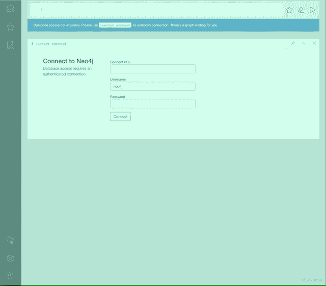

# 如何在 JavaScript 中检测用户偏好的配色方案

> 原文：<https://www.freecodecamp.org/news/how-to-detect-a-users-preferred-color-scheme-in-javascript-ec8ee514f1ef/>

奥斯卡·哈尼

# 如何在 JavaScript 中检测用户偏好的配色方案

在最新版本的 macOS (Mojave)和 Windows 10 中，用户已经能够启用系统级黑暗模式。这对本机应用程序来说效果很好，也很容易检测到。

网站一直是奇怪的应用程序，由网站出版商决定用户应该使用什么样的配色方案。有些网站确实提供主题支持。对于用户切换，他们必须找到它的配置，并手动更新每个网站的设置。

有没有可能让这种检测自动完成，并让网站呈现一个尊重用户偏好的主题？


Light vs Dark theme in Neo4j Browser

### CSS 媒体查询'`prefers-color-scheme'`草稿

有一个 CSS 媒体查询草案第 5 级，其中指定了[首选颜色方案](https://drafts.csswg.org/mediaqueries-5/#descdef-media-prefers-color-scheme)。这意味着检测用户是否要求系统使用浅色或深色主题。

这听起来像是我们可以合作的事情！我们需要及时了解草案的任何变化，因为它可能会在任何时候发生变化，因为它只是一个…草案。`prefers-color-scheme`查询可以有三个不同的值:`light`、`dark`和`no-preference`。

### 截至 2019 年 3 月的网络浏览器支持

当前的浏览器支持是非常有限的，并且在任何厂商的任何稳定版本中都不可用。我们只能在 [Safari 技术预览版 12.1](https://developer.apple.com/safari/technology-preview/) 和 [Firefox 67.0a1](https://www.mozilla.org/en-US/firefox/67.0a1/releasenotes/) 中享受这个。最棒的是有支持它的二进制文件，所以我们可以使用它并在 web 浏览器中试用它。对于当前的浏览器支持，请查看[https://caniuse.com/#search=prefers-color-scheme](https://caniuse.com/#search=prefers-color-scheme)。

### 为什么只有 CSS 检测是不够的

到目前为止，我看到的常见方法是使用仅 CSS 方法，并在匹配媒体查询时覆盖特定类的 CSS 规则。
类似这样的事情:

```
/* global.css */
```

```
.themed {  display: block;  width: 10em;  height: 10em;  background: black;  color: white;}
```

```
@media (prefers-color-scheme: light) {  .themed {    background: white;    color: black;  }}
```

因为这对于许多用例来说都很好，所以有一些样式技术并不像这样使用 CSS。例如，如果 [styled-components](https://www.styled-components.com) 用于主题化，那么当主题改变时，JS 对象被替换。

访问首选方案对于分析和更可预测的 CSS 覆盖以及更细粒度地控制哪些元素应该应用主题和不应用主题也很有用。

### 初始 JS 方法

我在过去了解到，如果媒体查询匹配，可以通过将元素的 CSS `content`设置为一个值来进行媒体查询检测。这绝对是一个黑客，但它的工作！

大概是这样的:

因此，当用户加载 CSS 并且媒体查询匹配上述配色方案之一时，`html`元素的`content`属性值被设置为“亮”或“暗”。

那么问题是，我们如何读取`html`元素的`content`值？

我们可以使用 [window.getComputedStyle](https://developer.mozilla.org/en-US/docs/Web/API/Window/getComputedStyle) ，像这样:

这工作得很好！这种方法对于**一次性读取**来说很好，但是它不是反应式的，并且会在用户改变他们的系统配色方案时自动更新。要进行更新，需要重新加载页面(或者每隔一段时间进行上述读取)。

### 反应性 JS 方法

如何才能知道用户什么时候改变了系统配色？有我们能听的事件吗？

有啊！

在[现代网络浏览器](https://caniuse.com/#feat=matchmedia)中有 [window.matchMedia](https://developer.mozilla.org/en-US/docs/Web/API/Window/matchMedia) 可用。

`matchMedia`的伟大之处在于，我们可以为它附加一个监听器，当匹配发生变化时，这个监听器就会被调用。

如果媒体查询开始匹配或停止匹配，将使用包含信息的对象调用侦听器。有了这些信息，我们可以完全跳过 CSS，直接使用 JS。

这种方法在受支持的网络浏览器中工作得非常好，如果不支持`window.matchMedia`，就退出。

### 反应钩

因为我们在 [neo4j-browser](https://github.com/neo4j/neo4j-browser) 中使用 React，所以我把它写成了一个自定义的 React 挂钩，以便在我们所有的应用程序中重用，并适合 React 系统。

这比第一个简短的概念证明中的代码要多一点。我们有更好的错误检测，并且当钩子卸载时我们也删除了事件监听器。

在我们的用例中，用户可以选择用其他东西覆盖自动检测的方案(例如，我们提供了一个概述主题，经常在做演示时使用)。

然后在应用层像这样使用它:

最后一部分取决于在应用程序中如何创建主题。在上面的例子中，主题数据对象被传递到一个上下文提供程序中，这个上下文提供程序使这个对象在整个 React 应用程序中可用。

### 最终结果

这里有一个最终结果的 gif，你可以看到，它是即时的。



### 最后的想法

这是我们在 Neo4j 的 UX 团队在所谓的“实验室日”期间做的一个有趣的实验。该规范的早期阶段和(因此)缺乏浏览器支持并不证明它可以成为任何产品。但是支持可能会来得更早。

此外，我们也运送一些基于电子的产品，那里有一个`[electron.systemPreferences.isDarkMode()](https://github.com/electron/electron/blob/master/docs/api/system-preferences.md#systempreferencesisdarkmode-macos)`可用...

### 关于作者

Oskar Hane 是 [Neo4j](https://neo4j.com) 的团队领导/高级工程师。
他从事 Neo4j 的多个终端用户应用程序和代码库的工作，并撰写了两本技术书籍。

在推特上关注奥斯卡:[@奥斯卡哈内](https://twitter.com/oskarhane)