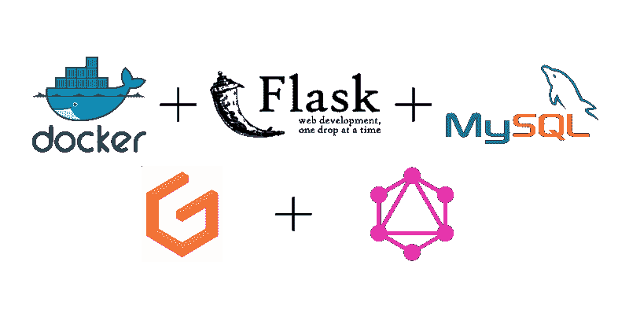

# 如何开发烧瓶、GraphQL、石墨烯、MySQL 和 Docker 初学者工具包

> 原文：<https://www.freecodecamp.org/news/how-to-develop-a-flask-graphql-graphene-mysql-and-docker-starter-kit-4d475f24ee76/>

作者:Max Goh

到目前为止，我主要是从零开始开发新的 [Flask](http://flask.pocoo.org/) 项目。由于大多数项目都倾向于由相似的文件夹结构组成，在一段时间内重复设置相同的基础项目变得非常平凡。

我使用 Docker 已经有一段时间了，借助它的功能，我们能够创建…