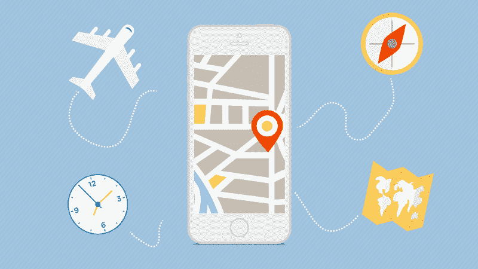
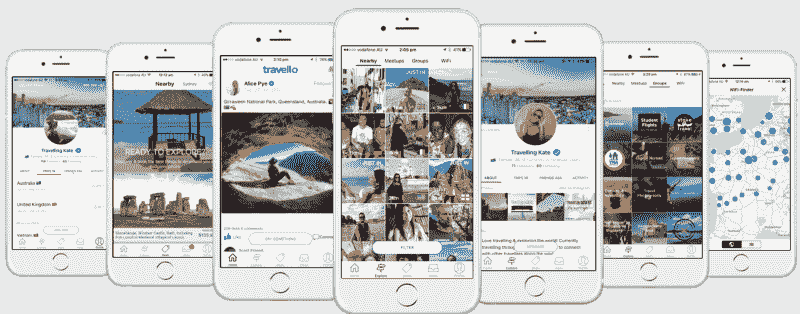
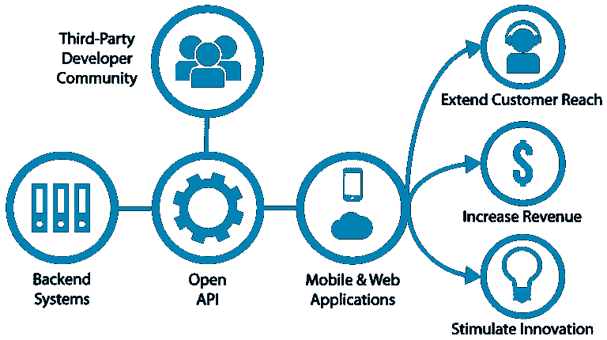
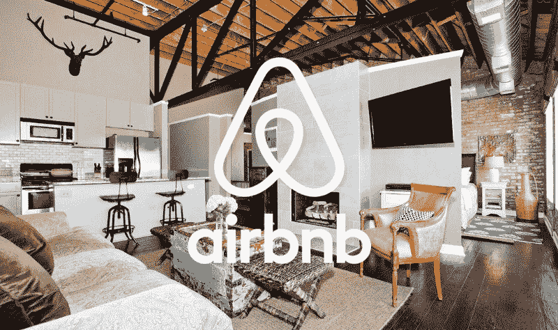

# 如何开发出像 Priceline、Expedia、Airbnb 这样成功的旅游 App

> 原文：<https://www.freecodecamp.org/news/how-to-develop-a-successful-travel-app-like-priceline-expedia-and-airbnb-9ac8c7d41cfc/>

作者:迪米特罗·布罗夫金

# 如何开发出像 Priceline、Expedia、Airbnb 这样成功的旅游 App

旅游业是一个巨大的商业领域，包括许多组成部分:旅行社、保险公司、酒店、餐馆等等。

移动设备在这一领域的重要性怎么估计都不为过——人们需要在远离电脑、无法亲临办公室的时候获得高质量的服务。这是移动应用真正大放异彩的地方。

### 为什么要推出旅游应用:数字世界的新地标

在深入主题之前，让我们先来看看[数字](https://www.statista.com/):

*   2009 年，全球下载量约为 25 亿次。
*   2011 年达到 31 亿。
*   我们可以预计，到 2017 年底，这一数字将超过 70 亿，是六年前的两倍多。

在网上购物方面，智能手机即将取代笔记本电脑和个人电脑。如果你的业务与该领域相关，但由于某种原因，你仍然没有自己的移动应用程序，那么是时候考虑一下了。

对于旅游公司和在线零售商来说，移动商务应用的优势是显而易见的。它有助于促进销售，提高服务质量，并使客户对品牌及其产品更加忠诚。

移动旅游应用包括:

*   谷歌和苹果地图
*   旅游规划者
*   显示附近 WiFi 热点的应用程序
*   让你无论去哪里都能预订酒店和机票的应用程序
*   可以为有特殊需求的人找到服务的应用程序

为你的用户推出一款真正有用的应用是超越竞争对手的一个好方法。让我们看看这些事实。

今天几乎每个人都有一部智能手机。65%的旅行者更喜欢在移动应用程序的帮助下计划他们的旅行。

Trips app by Lonely Planet

大多数商人(实际上大约 70%)通过手机应用程序预订机票和酒店。

大约 80%的旅游公司、酒店和航空公司在应用发布后从品牌曝光、收入增加和其他因素中获利。

每个游客肯定都希望有一个应用程序，让他能够轻松地导航到他们去的任何地方。旅行移动应用程序可以包括字典、地图和不同名胜(咖啡馆、餐馆、博物馆等)的指南。大约 75%的旅行者在旅行中至少使用一个移动应用程序。

目前，35%的旅行者为他们的旅行或即将到来的假期下载应用程序。使用该应用程序的另一种方式是立即或在旅行后分享印象。在社交网络时代，超过一半的游客会在网上发布他们的度假照片。

旅游移动应用在下载量最多的应用中排名第七。

统计数据显示，该应用程序的推出可以提供新的方法来增加你的收入，使品牌更受欢迎，建立一个忠诚的客户群等等。

当然，一个应用程序必须有一个伟大而有价值的想法，并且是精心设计和开发的。通过这种方式，移动应用程序可以为您的业务带来巨大优势。

### 一个平庸的应用程序和一个好的应用程序的区别是什么？

用户想要使用的理想旅游应用是什么？这是一个很容易理解和进入的应用程序。它肯定会让他们的旅行更加舒适，并允许人们与其他游客和公司交流。

这些标准使一个应用程序真正有帮助，减少旅行者的压力，并使观众更加忠诚。

这里有几个小贴士，可以让你制作出一个现代的、有吸引力的旅游应用，让你真正盈利:

1.  确保你知道你的目标受众是谁。为你的用户建立一个形象，并努力使应用程序更好地为他服务。如果你的公司主要与企业家和高管合作，那么为商务旅行推出一款应用是有意义的，也许是简单易行的机票和酒店预订、更快捷的机场登记或旅行规划。
2.  让你的应用程序易于使用和用户友好。如果你的主要功能是搜索最好的酒店优惠并立即预订，那么完成注册的时间应该不会超过几次点击。
3.  让用户与您分享他们的反馈。在应用程序中嵌入一个按钮，将他们带到一个板块，在那里他们可以发表评论，讨论应用程序的优缺点等等。这样的功能可以让你了解你的观众和他们的需求，并了解你可以做得更好。
4.  与用户保持联系，并确保你与他们保持一致的沟通。
5.  让你的应用程序离线友好。如果你的应用程序即使在用户关闭移动网络的情况下，仍然能够通知用户他们的签到或其他信息，这将是你的一大优势。
6.  将脸书、Instagram 或 Twitter 等社交网络整合到你的应用中。

目前，旅游应用的受欢迎程度正在上升，所以你的主要目标是推出一款能够吸引并留住大量受众的应用，这些受众可以被货币化。

在第一阶段，商业专业知识是绝对必要的。你应该分析市场和你的对手。找出你的目标受众是什么样的，了解他们想看什么。

定位和命名也很重要，这才是最吸引眼球的。之后，你需要做应用程序开发的所有脏活累活，创造一个好的设计。

最后一个阶段是应用测试。使用尽可能多的智能手机型号，以防止窃听器潜入。

### 实现 API

如果你经营一家旅行社，并且你正在寻求进入移动应用市场，你可以在 popular services 找到一个合作项目，并利用它们成为你的优势。例如，如果你将一个[Booking.com API](https://www.programmableweb.com/api/bookingcom-content)集成到应用程序中，你的客户将能够直接从一个菜单预订世界各地的酒店。这是为你的用户提供更多机会的好方法。

API 使用是一个很好的开始方式，并且有很多这样的方式。每个项目都有自己的条件、利润和工作方式。让我们来看看其中的一些:

1.  [Booking.com](https://www.booking.com/)合作伙伴计划在 100 多万个地方提供超过 2300 万间酒店客房。
2.  Expedia API 提供对 321，000 家酒店和 400 多家航空公司的访问，但仅限于美国。
3.  [Skyscanner](https://www.skyscanner.com/) 合作伙伴关系允许您的客户直接在您的网站上搜索和预订航班。Skyscanner 还可以预订机票、酒店和租车。

您还可以利用提供建议的服务，例如:

1.  [Google Places](https://developers.google.com/places/) 拥有超过 9500 万个名胜和公司。
2.  [脸书景点](https://www.facebook.com/places/)通过 Factual 使用其图形 API 和数据来帮助搜索感兴趣的地方。
3.  Yelp API 为你提供评论、照片和数据列表。Yelp 是美国市场的绝佳选择。
4.  CityGrid 的 API 接口包括超过 1800 万个美国本地列表。如果你的用户与 CityGrid 互动，你甚至可以赚钱，这要感谢他们的“付费场所”计划。
5.  猫途鹰应用程序接口提供了一个巨大的数据库，这个数据库是由用户创建的，随后是这些地方的照片、评论和评级。

### 向最优秀的人学习，不断创新！

你还可以通过研究其他成功运行的项目，了解如何开发更好的应用程序。

以下是一些你可能会感兴趣的例子:

### 爱彼迎（美国短租平台）

租赁服务是世界上最受欢迎的房地产平台之一。它可以让你直接与公寓业主沟通，而不必向代理支付服务费。

目前，全球 34，000 个城市有超过 700，000 种选择。搜索引擎会帮你在城市的某个地方找到公寓或者找到一些服务。

在你预订房间或公寓之前，你可以联系房主，讨论每一个细节，观察照片，研究以前客户的反馈。这项服务还允许你出租自己的公寓来赚钱。一切都可以通过智能手机或平板电脑进行控制。

### 价格热线

一个[应用](https://www.priceline.com/)，显示附近有哪些酒店。对于不期而至，不提前搜索酒店的人很有帮助。它显示了价格、反馈和销售额。Priceline 还能让你找到租车站、公共汽车和火车时刻表等等。

### Expedia

这是一款[应用](https://www.expedia.com/)，可以为你计划行程、预订航班和酒店。有关于你什么时候到达，什么时候离开等等的全部信息。它还为您提供所有可用的反馈和评级。

因此，旅游移动应用程序开辟了多种方式，使您的业务增长和变得更大。推出成功的移动应用并与受众保持联系以提高服务质量的公司，有更多的机会在行业中取得成功。

我们真诚地希望我们的文章能对你有所帮助，如果你想推出自己的应用程序，或者只是想了解一些关于移动旅行应用程序的新知识。如果你想构建自己的应用程序， [Octodev 团队](https://octodev.net/)将很乐意在整个过程中为你提供帮助和指导。

这篇文章最初发表在 [Octodev 博客](https://octodev.net/blog/)上。