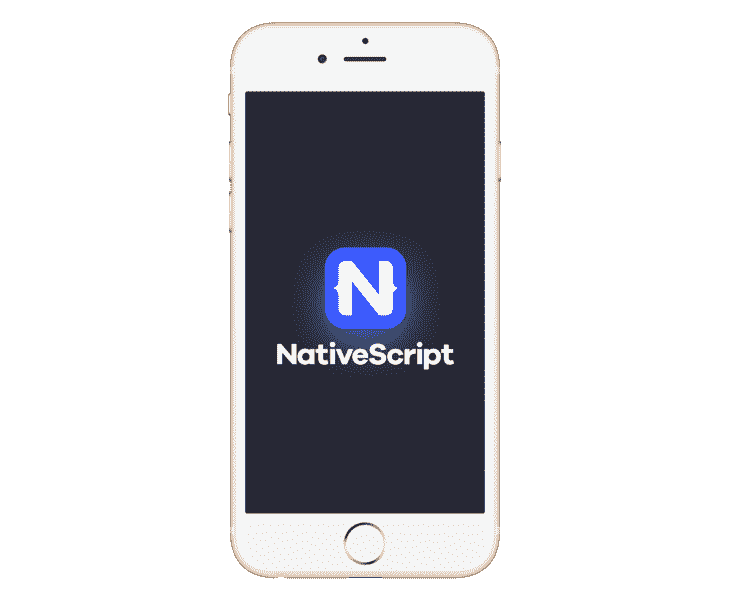
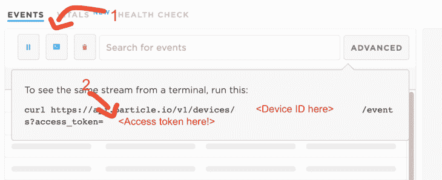

# 如何使用 NativeScript 开发粒子物联网应用

> 原文：<https://www.freecodecamp.org/news/how-to-develop-particle-iot-apps-using-nativescript/>

如果你正在开发任何类型的物联网产品，你不可避免地需要某种类型的移动应用。虽然[有简单的方法](https://www.jaredwolff.com/create-a-cross-platform-app-using-blynk/)，但它们并不用于生产。

在本教程中，我们将讨论粒子应用程序开发的基础知识。您将了解到许多您可以利用的应用程序框架。此外，还有一些库、技巧和工具可以让您的生活变得更加轻松。

## 应用框架

有时候，在本地编写多个应用程序几乎是令人恼火的。你看，斯威夫特(还是客观 C？)和 Java 乍一看都不可怕(嗯，可能 Obj-C 除外？).但是当你资源有限时，你必须想出一个新的策略。这就是应用程序框架的用武之地。

这些框架允许应用开发者编写、构建和测试跨平台的应用。在某些情况下，框架会将你的应用程序转换成本地代码。这意味着它们运行起来和用 Swift 或 Java 编写的一样快一样好。

我做了调查，截至 2020 年 1 月，以下是一些最受支持的框架:

*   [框架 7](https://github.com/framework7io/framework7)
*   [颤动](https://flutter.dev/)
*   [原生脚本](https://www.nativescript.org/)
*   [反应式](https://github.com/facebook/react-native)
*   [离子型](https://github.com/ionic-team/ionic)
*   [科尔多瓦](https://cordova.apache.org/) / [PhoneGap](https://phonegap.com/)
*   [流星](https://github.com/meteor/meteor)
*   [Xamarin](https://dotnet.microsoft.com/apps/xamarin)

这个清单会持续几天。

我过去使用过一些这样的框架。我已经建立了一个流星应用程序，它(令人惊讶地)工作。但是最后我不得不选择一个。我带了什么？

**NativeScript。**

在很大程度上，NativeScript 的文档和入门体验非常棒。你不仅可以在模拟器中预览你的应用程序，还可以将它直接加载到你的手机上！



NativeScript 很酷的一点是它支持 TypeScript。TypeScript 是 JavaScript 的超集，具有一些额外的 wiz-bang 特性。

与其他语言不同，JavaScript 在技术上没有类型。如果你做过粒子开发，你可能知道什么是类型。我们正在谈论`int`、`String`、`float`等等。也就是说，它们是确保 JavaScript 代码保持一致的指令。

NativeScript 也兼容大多数主流的 JavaScript web 框架。这包括 [Vue。Js](https://vuejs.org/) 和[角度](https://angular.io/)。

到目前为止，我只注意到了一个主要的缺点:移动预览模式(`tns preview`命令)对本地库来说不是很好。如果你有一些特定于本机平台的库，你将不得不使用模拟器或设备(如果你有的话)。

如果你干劲十足，并且你想让 T1 用他们各自的语言开发多个应用程序，那么你就有更大的动力。与上述框架相比，它有一个优势:可靠的粒子 SDK。

## 可用的库和 SDK

Particle 竭尽全力让应用程序开发变得更加简单。这要归功于他们自己的 SDK 中的大量开发工作。是的，您必须编写手动 HTTP 请求处理程序的日子已经一去不复返了。

以下是 iOS 和 Android SDKs 的链接:

*   [iOS](https://docs.particle.io/reference/SDKs/ios/)
*   [安卓](https://docs.particle.io/reference/SDKs/android/)

虽然我们在这里不会涉及它们，但它们反映了您可以使用 [Cloud API 进行的所有潜在调用。](https://docs.particle.io/reference/device-cloud/api/)

说到云 API，Particle 也开发了一个 [Node.js](https://docs.particle.io/reference/device-cloud/api/) 库。可以想象，您可以将它用于您的服务器端代码或基于 JavaScript 的应用程序框架。遗憾的是，它不适用于 NativeScript。使用 [WebView](https://www.tutorialspoint.com/android/android_webview_layout.htm) 的框架应该更加兼容。

在本教程中，我们将主要关注云 API。这样你就对整个系统有了很好的了解。这看起来有点吓人，但是如果你做得对，你会很快掌握它的窍门。

## 进行 API 调用

在 NativeScript 中，你不能使用像`[request](https://github.com/request/request)`这样的库。(这恰好是库粒子自己的 [DMC](https://github.com/dmiddlecamp) 用于[CLI](https://github.com/particle-iot/particle-cli)——DMC 如果你正在读这篇文章，嗨！)你必须使用提供的 [HTTP](https://docs.nativescript.org/ns-framework-modules/http) 模块。

如果你一直滚动到那页的底部[，你会看到一个完全成熟的`POST`例子。我将在这里复制它，但有一些粒子特定的变化:](https://docs.nativescript.org/ns-framework-modules/http#http-post)

```
// Create form post data
var data = new FormData();
data.append("name", "update");
data.append("data", "It's hammer time!");
data.append("private", "true");
data.append("access_token", _token);

// Configure the httpModule
return httpModule
    .request({
        url: `https://api.particle.io/v1/devices/events`,
        method: "POST",
        content: data
    })
    .then(
        response => {
            const result = response.content.toJSON();
            console.log(result);
        },
        e => {
            if (e) console.log(e);
        }
    ); 
```

以上是 DeviceOS 中相当于`Particle.publish`的一个例子。让我们分解零件。

首先，Particle 的 Web API 的一个主要问题是数据格式。我最初预计他们会使用 JSON，但是我大错特错了。实际上*阅读了*的文档后，我意识到大多数 POST 请求实际上都是`application/x-www-form-urlencoded`。这意味着当您提交数据时，这相当于在 HTML 表单上点击提交按钮。

幸运的是，有一种简单的方法可以在 Node/JavaScript 中组装表单数据。我们可以使用`FormData()`对象。看看上面。在`data.append`调用中应该有一些熟悉的参数名。

`"name"`指您要发布到的事件的名称。

`"data"`指您正在发布的字符串格式的数据。

决定你是否想要将这些数据传播到整个粒子世界，或者仅仅是你的小角落。

`"access_token"`是一个令牌，您可以生成它来进行这些 API 调用。但是如果没有令牌，你就死定了。

### 获取令牌

我们从哪里得到这种难以捉摸的`access_token`？

起初我不知道。

我在控制台中创建了一个 OAuth 用户和密码。那会导致一个死胡同。摆弄不同的 API 调用和设置。没什么。然后它像一吨重的砖头一样击中了我。每个设备页面上的 curl 请求都附有一个`access_token`！

打开任何设备，点击*事件附近的小控制台按钮。*将弹出一个带有说明和网址的弹出窗口。复制`access_token=`后的文字。那是你的`access_token`！见下文:



您可以使用此令牌调用粒子 API。这可以是订阅、发布、写入函数、读取变量等等。

### 通过命令行

这很好，但你怎么能以编程的方式生成一个呢？一种方法是使用命令行。

`particle token create`是您需要了解的命令的名称。当您运行它时，会提示您登录。(如果您使用授权码，也请输入您的授权码。)然后命令行会吐出一个闪亮的新的`access_token`你可以和 API 一起使用！

### 通过 API 本身

如果你猜不到，`particle token create`是一个原始 API 调用的[前端。您也可以直接进行这些 API 调用。这是它在 NativeScript 中的样子。](https://github.com/particle-iot/particle-cli/blob/20d02afc7b72ade0e79d4f4ec724ec6cce9fff1b/src/lib/api-client.js#L192)

```
// Create form post data
var data = new FormData();
data.append("username", "jaredwolff");
data.append("password", "this is not my password");
data.append("grant_type", "password");
data.append("client_name", "user");
data.append("client_secret", "client_secret_here");

// Configure the httpModule
return httpModule
    .request({
        url: `https://api.particle.io/v1/oauth/token`,
        method: "POST",
        content: data
    })
    .then(
        response => {
            const result = response.content.toJSON();
            console.log(result);
        },
        e => {
            if (e) console.log(e);
        }
    ); 
```

这个调用*可能*会变得更复杂。大多数情况下，如果您有双因素授权设置。当你弄清楚这一切的时候，一切都是值得的。毕竟，如果没有必要，没有人愿意手动创建 auth 令牌！

现在，您可以从您的设备上读写了。不过有一件事可能会让你犯错。对于普通的 HTTP 客户端来说，订阅事件可能会很麻烦。以至于如果你试图用 NativeScript 的 HTTP 客户端做这件事，它会锁定，永远不会返回。幸运的是，有一种方法可以处理这些特殊的 HTTP 调用。

## 服务器发了什么？

服务器发送事件(简称 SSE)是 HTTP/S 订阅功能。它允许您连接到 SSE 端点并持续监听更新。这是一种类似于公司用于推送通知的网络技术。虽然它需要一些额外的功能...

### 上交所图书馆

在绞尽脑汁寻找之后，我偶然发现了`nativescript-sse`。它看起来很简单，我可以立即开始使用。然而，当我尝试使用它时，出现了更多的问题。

首先，你不能在`tns preview`模式下使用这个库。另一种方法是将 iPhone 连接到电脑上，使用`tns run ios --emulator`或`tns run ios`。非仿真器命令将自动交付您的原型应用程序。

**附注:**我已经用 Xcode 设置了我的手机。在`tns run ios`能够找到并部署到您的手机之前，您可能必须自己完成此操作。

其次，一旦我让库工作，我注意到我会得到一些非常讨厌的错误。每当来自粒子的新信息出现时，错误似乎就会发生。

原来 iOS 的底层 Swift 库[已经在去年解决了这个问题。](https://github.com/inaka/EventSource/issues/89)所以我决定自己想办法升级 NativeScript 插件。我就不多说了，这可能是一种痛苦，有一个学习曲线！

幸运的是，经过一些黑客攻击，我得到了一些工作。关于如何编译插件的更多说明在[自述文件](https://github.com/jaredwolff/nativescript-sse)中。或者，你可以在库的[发布页面下载一个预建的。](https://github.com/jaredwolff/nativescript-sse/releases/tag/v4.0.3)

将`.tgz`文件下载到您喜欢的任何地方。然后，可以使用`tns plugin add`添加。完整的命令如下所示:

```
tns plugin add path/to/plugin/file.tgz 
```

您可以通过运行`tns plugin list`来检查以确保库已安装

```
**jaredwolff$ tns plugin list
Dependencies:
┌─────────────────────┬──────────────────────────────────────────────────────────────────────────────────┐
│ Plugin              │ Version                                                                          │
│ @nativescript/theme │ ~2.2.1                                                                           │
│ nativescript-sse    │ file:../../Downloads/nativescript-sse/publish/package/nativescript-sse-4.0.3.tgz │
│ tns-core-modules    │ ~6.3.0                                                                           │
└─────────────────────┴──────────────────────────────────────────────────────────────────────────────────┘
Dev Dependencies:
┌──────────────────────────┬─────────┐
│ Plugin                   │ Version │
│ nativescript-dev-webpack │ ~1.4.0  │
│ typescript               │ ~3.5.3  │
└──────────────────────────┴─────────┘
NOTE:
If you want to check the dependencies of installed plugin use npm view <pluginName> grep dependencies
If you want to check the dev dependencies of installed plugin use npm view <pluginName> grep devDependencies** 
```

安装完成后，调用这个库需要几个步骤。这里有一个例子:

```
import { SSE } from "nativescript-sse";

sse = new SSE(
            "https://api.particle.io/v1/events/blob?access_token=<your access token>",
            {}

// Add event listener
sse.addEventListener("blob");

// Add callback
sse.events.on("onMessage", data=>{
	// TODO: do stuff with your event data here!
	console.log(data);
});

// Connect if not already
sse.connect(); 
```

首先，您需要导入并创建一个库实例。创建实例时，必须输入要使用的 URL。

在这种情况下，我们将做相当于`Particle.subscribe()`的事情。它应该类似于上面的内容:`https://api.particle.io/v1/events/<your event name>?access_token=<your access token>`。

将`<your event name>`和`<your access token>`替换为您的活动名称和新创建的代币！

然后你设置库来监听你关心的事件。在这种情况下`blob`是我最关心的事件。

然后确保您配置了一个回调！这样，当`blob`到来时，你就可以访问数据。我已经做了一个`TODO`记录，你可以在那里访问这些数据。

最后，您可以使用`.connect()`方法进行连接。如果您没有连接，SSE 将不会打开会话，您将不会从 Particle 获得任何数据。

代码的位置由您决定，但是从示例来看，在您的模型的`constructor()`中似乎是一个好位置。([https://github . com/Jared Wolff/native script-SSE/blob/master/demo/app/main-view-model . ts](https://github.com/jaredwolff/nativescript-sse/blob/master/demo/app/main-view-model.ts))

### 其他示例

如果你想知道如何在其他地方使用 SSE，我有另一个很好的例子:粒子的 CLI。

Particle 使用`[request](https://github.com/request/request)`库来处理应用中的 SSE 事件。无论何时调用`particle subscribe blob`，它都会调用代码内部的`getStreamEvent`。你可以在这里查看[。](https://github.com/particle-iot/particle-cli/blob/master/src/lib/api-client.js#L862)`request`库有更多关于流媒体的信息[这里](https://github.com/request/request#streaming)。

## 更多资源

这只是与粒子的 API 连接的冰山一角。Particle 有一些很棒的文档(一如既往),你可以去看看。以下是一些重要的链接:

*   [API 文档](https://docs.particle.io/reference/device-cloud/api/)
*   [Javascript SDK](https://docs.particle.io/reference/SDKs/javascript/)
*   [iOS SDK](https://docs.particle.io/reference/SDKs/ios/)
*   [Android SDK](https://docs.particle.io/reference/SDKs/android/)

## 结论

在这篇文章中，我们讨论了应用框架、NativeScript、NativeScript 插件和服务器发送的事件。加上所有与粒子相关的东西，这样你就可以将你的 NativeScript 应用程序连接到粒子的 API。

我希望这个快速教程对你有用。如果您有任何问题，欢迎留言或给我发消息。也一定要看看我的[新发布的指南](https://www.jaredwolff.com/the-ultimate-guide-to-particle-mesh/)。它有像这样的关于粒子生态系统的内容。

下次见！

**本帖原创自**[**https://www . jaredwolff . com/how-to-develop-particle-IOT-apps-using-nativescript/**](https://www.jaredwolff.com/how-to-develop-particle-iot-apps-using-nativescript/)