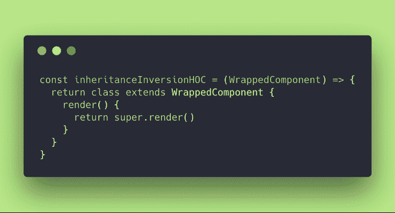
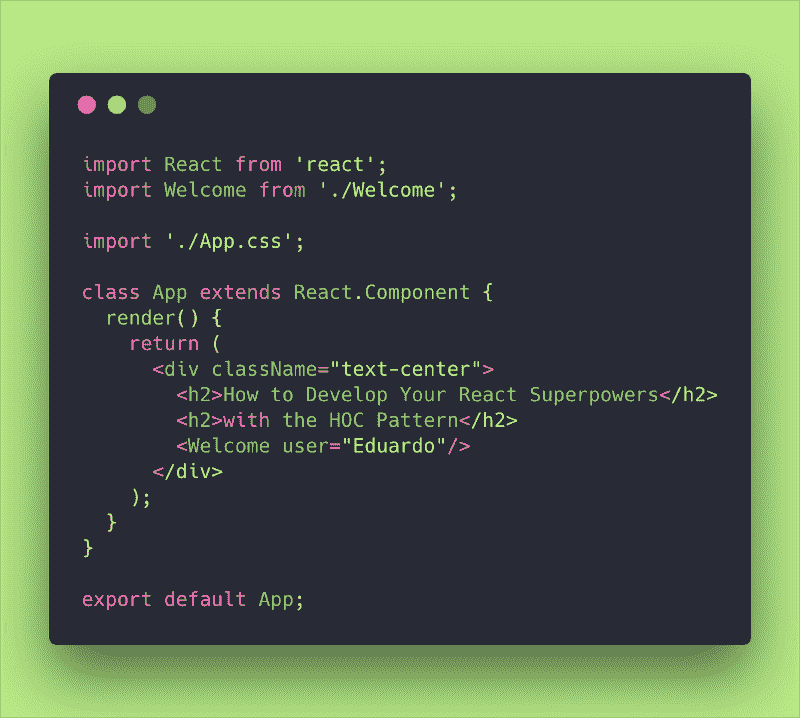
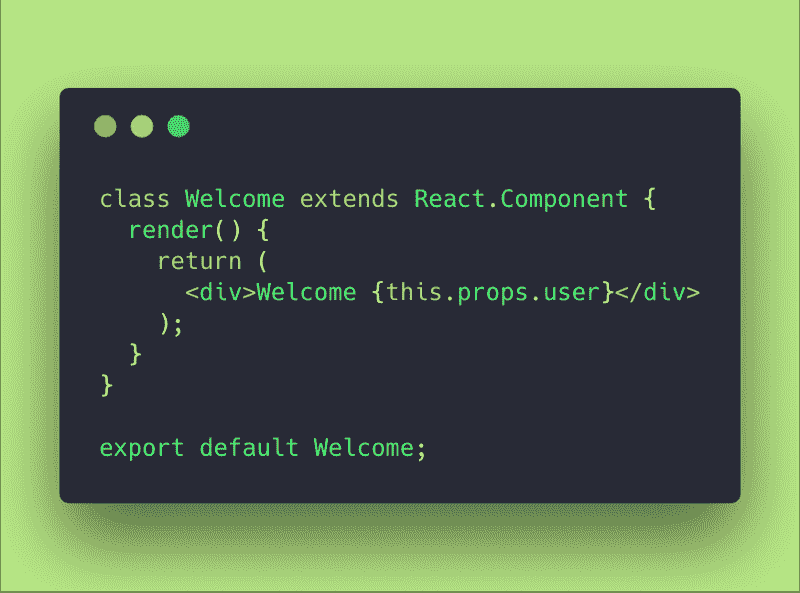
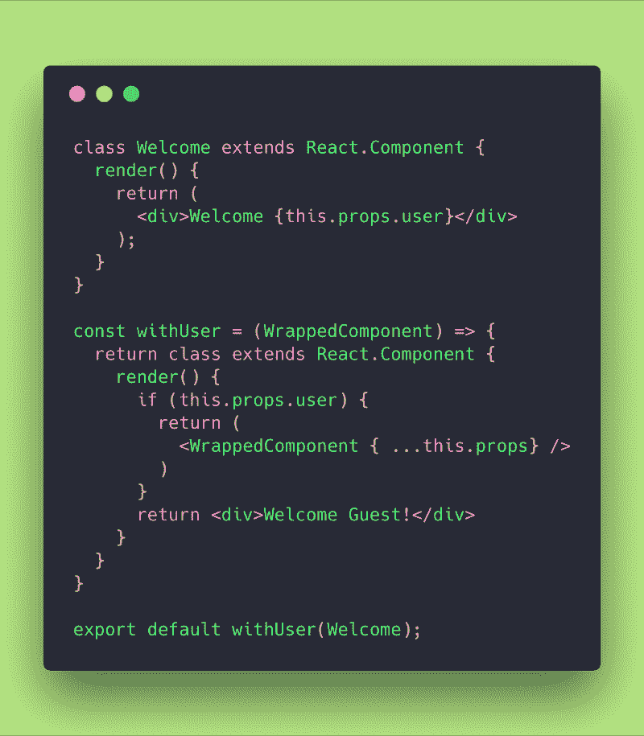
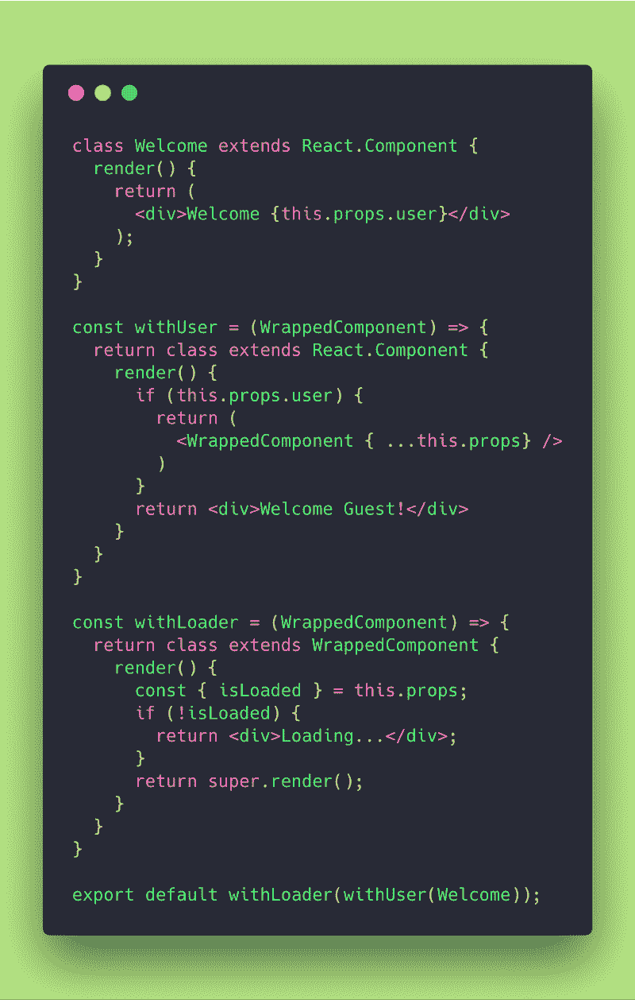

# 如何用特殊模式发展你的反应能力

> 原文：<https://www.freecodecamp.org/news/how-to-develop-your-react-superpowers-with-the-hoc-pattern-61293651d59/>

嘿大家好！？我希望你有一个快乐、幸福的圣诞节和快乐的新年！

2018 年已经结束，我有理由以一篇关于高阶器件的文章开始新的一年！

我已经答应你写它，因为当我们谈到渲染道具和容器模式时，我们已经接近了这个主题，所以深入一点并注意它是有意义的！

就我个人而言，这不是我最喜欢的模式之一，但它是一个了解、掌握和挂在你的工具带上的强大工具。

请记住，你不应该过度使用它。几乎所有可以封装在 HOC 中的东西都可以使用 render props 模式实现——查看我关于 render props 的文章[这里](https://medium.freecodecamp.org/how-to-develop-your-react-superpowers-with-the-render-props-pattern-b74e68c6d053)——反之亦然。

### 01.什么是高阶分量？

高阶组件(HOC)是 React 中重用组件逻辑的一种高级技术。hoc 不是 React API 的一部分。这种模式源于 React 的本质，即组合优先于继承。

JavaScript 是一种非常适合函数式编程的语言，因为它可以接受高阶函数。高阶函数是可以将另一个函数作为参数和/或返回一个函数作为结果的函数。

同理，**高阶分量**是**取(包装)一个分量并返回一个新分量**的函数。

高阶函数允许我们抽象动作，而不仅仅是值。

hoc 常见于第三方 React libs，如 Redux 或 React Router。我敢打赌，你已经使用了其中的一些，也许没有意识到。

React 中高阶组件的主要用途是在组件之间共享通用功能，而无需重复代码。

### 02.高阶组件的类型

基本上有两种主要类型的特设实现:**道具代理**和**继承反转**。

#### 道具代理(ppHOC)

道具代理 hoc 的基本表达如下:

propsProxyHOC (standard implementation)

它只不过是一个函数 propsProxyHOC，它接收一个组件作为参数(在本例中，我们将参数称为 WrappedComponent ),并返回一个包含 WrappedComponent 的新组件。

请记住，当我们返回 WrappedComponent 时，我们还会传递 HOC 收到的 props。这就解释了这种类型的名称: **props proxy** 。

当我们返回包装的组件时，我们有可能操纵道具和抽象状态，甚至将状态作为道具传递给包装的组件。

您还可以用其他 JSX 元素包装包装的组件，根据您的应用程序需求更改其 UI。

Props 代理 hoc 适用于以下情况:

1.  操纵道具
2.  通过引用访问实例(小心，[避免使用引用](https://reactjs.org/docs/refs-and-the-dom.html))
3.  抽象状态
4.  用其他元素包装/组合包装组件

#### 继承反转(iiHOC)

反向继承 hoc 的基本表达如下:

inheritanceInversionHOC (standard implementation)

在这种情况下，返回的类**扩展**wrapped component。它被称为继承反转，因为它不是 WrappedComponent 扩展某个增强器类，而是被动扩展的。这样他们之间的关系似乎是**逆**。

继承反转通过 *this* 给予了对 WrappedComponent 实例的特殊访问，这意味着你可以使用状态、道具、组件生命周期和**甚至渲染方法**。

反转继承 hoc 适用于以下情况:

1.  渲染劫持
2.  操纵状态

### 03.弄脏我们的手

好了各位。为了说明上面提出的一些概念，让我们来做一些代码。

如果你以后想玩我们正在做的代码，你可以从我的这个 [repo](https://github.com/evedes/higher-order-components) 中把它拉过来？。

让我们尝试实现一个组件，它根据登录到系统的用户返回欢迎消息。

main App.js component

我已经调整了我的 App.js 组件，以显示一些文本并呈现一个名为 Welcome 的组件，我将这个组件传递给 prop 用户。

好，我们可以用这样一个简单的组件来实现:

Welcome Component

但是…

如果没有用户登录，我希望组件返回 Welcome Guest，该怎么办？

嗯……我可以在同一个 Welcome 组件中这样做，用一个简单的 if 来检查用户本身是否存在，如果不存在，就返回“Welcome Guest”。

但是，假设我想封装该逻辑，以便与多个/不同的欢迎组件一起使用。

因此，我们应该做一个 Props Proxy HOC:

propsProxy HOC

我们在这里做了什么？我们保持了 Welcome 组件的简单性，并创建了一个名为 withUser 的 JavaScript 函数，它获取 Welcome 组件(WrappedComponent)作为参数，并检查 prop 用户是否存在。如果没有，它只是返回一个简单的“欢迎客人！”消息。

这很有用。假设您有 30 个不同语言的欢迎组件(这是一个愚蠢的例子，但是它说明了将逻辑封装到一个 HOC 中的重要性)。

很好，现在我们有一个特设来检查是否有用户登录，否则它抛出一个欢迎客人的消息！

现在让我们想象一下，用户信息来自外部 API(例如 Auth0 ),并通过管理应用程序状态的 Redux reducer 进入我们的前端应用程序。

因此，在检查是否有用户之前，我们需要检查数据是否加载到系统中！

哇！这样，我们可以在数据未加载时显示加载消息！

所以…对于这个用例，我想我们要做一些渲染劫持和渲染另一件事，如果数据没有加载。

为了渲染劫机，我们需要使用一个起重机。哇！这么巧！那么让我们开始吧，把这两个 hoc 组合在一起，好吗？这会重重地打在钉子的头上。

propsProxy + inheritanceInversion HOCs composed

注意我们做了什么:

我们创建了一个 withLoader iiHOC，它扩展了 WrappedComponent。这样它可以访问它的道具并触发不同的渲染。

在这种情况下，我们得到的是 isLoaded 属性，如果它没有被加载，我们只是返回一个加载消息！否则，我们让 WrappedComponent 通过简单地返回 super.render()来呈现。

在 export 语句中，我们只是组合了两个 JavaScript 函数，比如 f1(f2(f3))。仅此而已！

有一些工具可以用更漂亮的方式编写函数，但那是另一篇文章的另一个故事了！

### 04.最后但并不是最不重要的

我试图用简单的例子让你尽可能清晰地掌握概念。

我给你的建议是，如果你没有掌握这些概念，请把我的回购[拉过来](https://github.com/evedes/higher-order-components)玩一会儿。

检查代码，并尝试逐行理解它。

做这种抽象需要一些时间来习惯和适应，所以不要因为 HOCs 而失去动力或注意力。

正如我之前所说的，我们在这里做的一切都可以通过渲染道具或容器模式来实现，所以没有必要选择一两个这样的封装来完成干净的代码！

我希望你读这篇文章的时候和我写的时候一样开心！如果你真的喜欢，请给我一些掌声(请不要少于 50 分)？永远记住“坚强起来，坚持下去！”

另外，如果你想要更深入和复杂的解释，请随意阅读我添加到下面参考书目部分的链接？

### 05.文献学

1.  [React 文档](https://reactjs.org/docs/getting-started.html)

2.雄辩的 Java 脚本

3.[深度反应高阶组件](https://medium.com/@franleplant/react-higher-order-components-in-depth-cf9032ee6c3e)

非常感谢！

evedes, Dec 2018