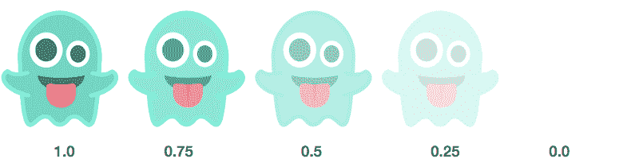
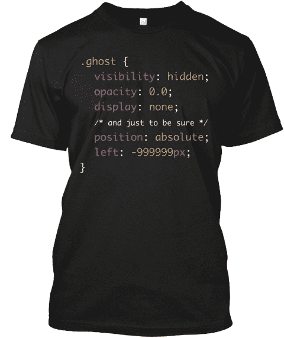

# 如何让 HTML 彻底消失

> 原文：<https://www.freecodecamp.org/news/how-to-disappear-completely-2f23ddb14835/>

有时候我们都想消失。HTML 元素也不例外。有时他们想躲一会儿。不要完全停止存在——只是让事情保持低调。

令人欣慰的是，当谈到让 HTML 元素消失时，CSS 提供了多种选择。

### 隐形的 CSS

让我们用类“ghost”来隐藏一个 HTML 元素。

```
//index.html
```

```
<div class=”ghost”>  <p>I’m friendly!</p></div>
```

```
//style.css
```

```
.ghost {
```

```
}
```

### 坏像素

默认情况下，HTML 元素是可见的。他们默认的 **visibility** CSS 属性是 **visible** ，但是你可以翻转脚本，然后:

```
.ghost {
```

```
 visibility: hidden;
```

```
}
```

现在幽灵被隐藏了，但是它仍然会占据页面上的空间。

### 无影无踪

如果你想让某些东西看不见，并且不占用任何空间，你也可以使用 CSS **display** 属性。

开发人员通常使用 display 属性来决定 HTML 元素应该显示为块元素还是行内元素，但它也可以完全隐藏元素:

```
.ghost {
```

```
 display: none;
```

```
}
```

与**可见性:隐藏**不同，使用**显示隐藏的元素:无**不会占用页面上的任何空间。

### 透明的灵魂



Going, going, gone.

你也可以使用 **opacity** CSS 属性使一个元素透明到不可见。

```
.ghost {
```

```
 opacity: 0.0;
```

```
}
```

像 **visibility: hidden，opacity: 0.0** 会在 HTML 元素所在的地方留下一个空白。记住，使用所有这些技术，元素仍然是 DOM 的一部分——只是普通用户在浏览器中看不到它。

### 快跑！跑得远远的，远远的！

隐藏一个元素的最后一种方法是将它移出页面很远，以至于你需要极大地缩小才能看到它。

为此，首先使用 **position** CSS 属性给元素一个在页面上的**绝对**位置(相对于其他 HTML 元素的**相对**)。

然后，您可以将元素从页面上移动任意大的像素:

```
.ghost {  position: absolute;  left: -999999px;}
```

你为什么要这么做？嗯，这对你的内容的可访问性有好处。屏幕阅读器——视力受损的人用来浏览互联网——可以获取这些内容，而其他人不会知道这些内容在那里。

为了获得最佳效果，请将这些不可见的元素放置在左侧，而不是顶部或底部，这样会混淆屏幕阅读器。

### 万圣节扮鬼

当你把所有这四种技术放在一起，你就有了一件相当酷的[省力的万圣节服装](https://www.freecodecamp.com/shop):



我在奥斯汀的设计师和露营者韦斯·瑟兰的帮助下做了这个。

本周末之前，你可以[挑选一件男式和女式尺码的。](https://www.freecodecamp.com/shop)

我只写编程和技术。如果你在推特上关注我，我不会浪费你的时间。？