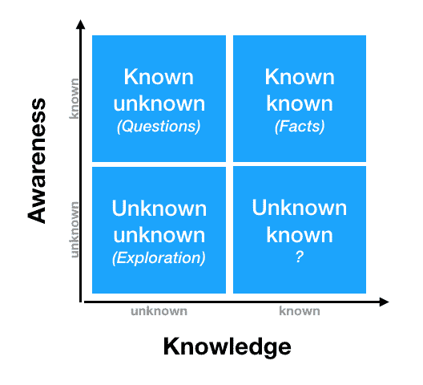
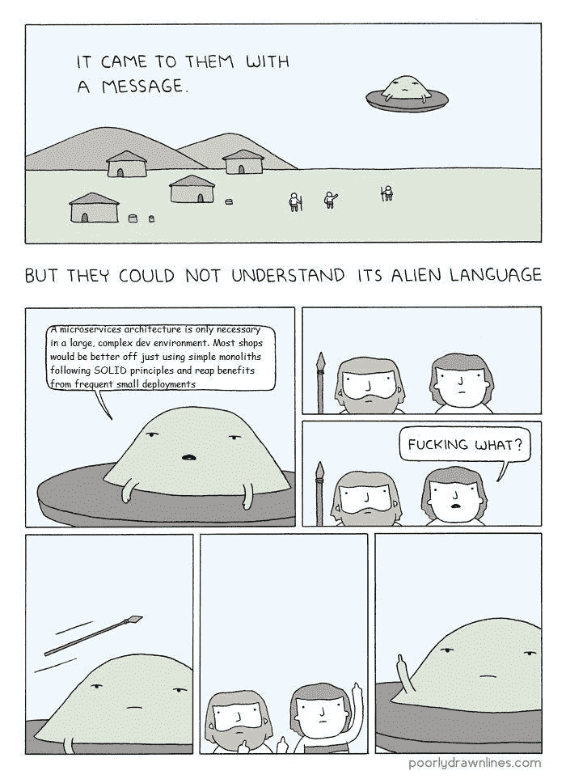
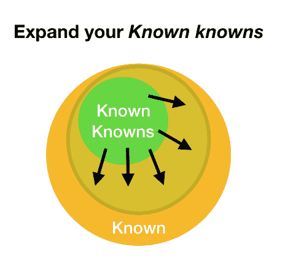
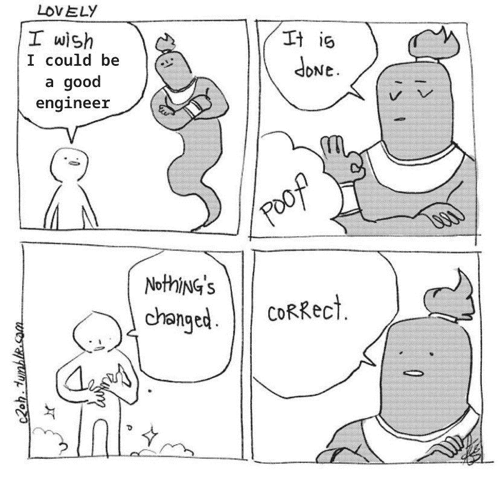

# 如何发现你未知的知识

> 原文：<https://www.freecodecamp.org/news/how-to-discover-your-unknown-knowns/>

## 已知的已知，未知的已知和未知的未知

近 20 年前，时任美国国防部长的唐纳德·拉姆斯菲尔德说:

> “有些事情我们知道自己知道。有已知的未知。也就是说，有些事情我们现在知道我们不知道。但也有不为人知的未知。有些事情我们不知道我们不知道。”

这句话通常用于进行风险管理分析，即将到来的障碍分为三类:

*已知的已知* —我们知道(即意识到)我们知道的事情。这些风险较小，因为它们是我们有信心的事实。

*已知未知*——我们知道(即意识到)我们不知道的事情——它们意味着风险，但既然我们知道它们，我们就可以衡量风险，了解它，并进行更多的调查，以使这成为已知的*。*

*未知的未知的* —我们不知道(即不知道)我们不知道的事情。这些可能是最危险的，因为它们包含了我们不知道的东西，因此无法计划、分析或采取行动来减轻它们。你必须做一些彻底的探索来发现你不知道的事情。

如果你这样说，可能会有点混乱，所以让我们用图表来表示:

但是等等……那些*未知的已知*呢？这是唐纳德·拉姆斯菲尔德没有讨论的东西，但可能是最有趣的。

## 你不知道的事情你知道

*未知的已知*象限经常被忽视或误解。我很容易理解为什么人们看不到它的重要性，只是把它称为一个无意义的矛盾——一个人怎么可能不知道他们已经知道的事情？

事实证明，你的知识是基于许多你没有意识到的东西——本能、直觉或其他你认为微不足道的因素。

想想你的母语。你可以很容易地把任何想法表达成一个准确的句子。由于英语不是我的第一语言，我不得不学习了好几年。我必须学习成千上万的单词来扩大我的词汇量，学习名词、动词、形容词之间的区别以及如何用它们来造句。我必须学会现在简单时、现在进行时和过去完成时之间的区别。即使知道何时使用“on”、“in”或“at”对我来说仍然是一个挑战。如果英语是你的母语，你可能甚至没有意识到所有这些规则，你年轻的时候学过，只知道如何正确使用它们。因此，你也可能没有意识到当别人试图说英语时所面临的挑战。

## 如果你忽略未知的已知会发生什么？

到目前为止，我们只是试图理解这些*已知的未知*是什么*、*，但还没有详细说明这些为什么重要。忽视*已知的未知*会导致事实(你知道的)和你的意识(你不知道的)之间有问题的不协调。忽视它们是有害的，会导致一些情况，你们中的一些人非常清楚:

### “冒名顶替综合征”

几年前，我听说了“冒名顶替综合症”,我立刻联想到了它。我总是试图和比我聪明的人在一起，这样我就能学习和进步。问题是，我总是怀疑自己的知识，觉得有一天他们会揭露我的“秘密”，并意识到我并不像我自称的那样好。我害怕有一天他们会要求用更好的人来取代我。到目前为止还没有发生(而且我希望这个帖子不会给他们什么疯狂的想法？).

在过去的几个月里，很难避免无意中看到一篇文章、一次演讲或一个博客没有提到*冒名顶替综合症*。每个人都喜欢谈论它，分享他们的个人故事，并为自己是患有这种综合症的特殊群体的一员而自豪。嗯…你猜怎么着，几乎我们所有人都有。问问你的 20 个朋友，他们是否觉得自己不够好，或者是否怀疑过自己的成就——我保证几乎所有人都会有同感。

如果是这样，真的是综合症吗？也许那些总觉得自己最适合这份工作的人患有“过度自信综合症”。

很抱歉戳破了你的幻想，让你觉得自己并没有想象中的那么“独特”。如果你问我，你就像其他人一样，不知道自己知道什么，也不欣赏自己拥有的技能。如果你已经完成了某件事，或者人们认为你擅长某件事，那么你可能就是。如果你觉得自己只是运气好，或者周围的人没有发现你的欺诈行为，那么你可能在看待自己的技能和知识的方式上有问题。这种错觉意味着你的*未知已知*区域正在接管已知已知区域。你有很多知识(这些知识让你成功),但缺乏意识让你觉得自己像个骗子，并且蒙蔽了你的视野，以至于你再也看不到自己身上的积极品质。

### 理解差距

几年前，我试图向一名年轻学生解释我在工作中所做的事情——“我们为中小型企业开发了一款文件同步和共享产品。我们有现成的 SaaS，但客户也可以购买 S3 存储并在内部安装”。虽然对于在云领域有入门级经验的人来说，这些听起来可能微不足道，但这位学生看着我，就像是车灯前的一只鹿。更糟糕的是，他还尴尬得一个字都听不懂。

老实说，我不怪他们，因为他们不可能知道。这让我意识到，事实上，在那种情况下，我就是问题所在。假设这些术语只是常识，我就忽略了我的未知知识。

值得注意的是，你不知道的知识并不局限于术语。当你与毕业生或经验较少的工程师(或其他在你的领域中经验较少的人)交谈时，你可能会发现他们也缺乏如今在你看来完全“基础”的知识。

即使与更有经验的专业人士一起工作，我们有时也不会给出足够的背景或遗漏足够的细节。在我的领域，我一次在某些功能上工作几个月，采用特定的团队术语并吸收个性化的团队实践。当我和其他同事(尤其是那些不在我团队中的同事)交谈时，我完全不知道这些知识，并认为他们都会凭直觉理解我的团队是如何工作的。

这些类型的理解差距往往会导致错位，因为每个人都倾向于以不同的方式解释隐含的细节。更多地意识到这样的小细节，并且更加明确地表达它们，可以减少混乱，并创造更好的团队一致性。

### 感觉自己成长不够

在我职业生涯的开始，一切都是新的，我觉得我每天都在学习新的东西。在某个时候，我开始感觉我的学习曲线在慢慢缩短。最终，我没有每天学习新的语言或编码技术，因为我已经熟悉了操作模式…事实证明我错了。

事实上，我每天都学到很多东西。作为一名高级软件工程师，我做了更多需要“软技能”的工作，比如沟通、规划和团队参与。当我只是简单地思考我所学到的东西时，很难记住这些技能。

但即使是我学到的“硬技能”也很棘手，容易被忽视:当我回顾过去几个月时，我可能只记得我学过 GoLang，但如果我深入挖掘，我会发现所有其他偷偷摸摸的未知知识，这些知识是将我的职业生涯推进到下一个水平的关键因素。

## 是时候沿着黄砖路走了

在《绿野仙踪》的故事中，多萝西遇到了想要一个大脑的稻草人、想要一颗心的铁皮人和需要勇气的胆小的狮子。他们一起走，经历许多冒险，通过利用彼此的优势克服挑战。当他们回到绿野仙踪时，他向他们解释说，他们一直在寻找的属性就在他们身上。在我看来，黄砖路上的旅程只是扫清了他们的盲点，帮助他们看到了他们未知的知识。

现在轮到你了。

## 怎么打你的黄砖路？

既然你已经理解了未知知识的重要性，重要的是你要意识到这并不需要进一步的探索和分析。你所需要做的就是通过将隐性知识转化为显性知识，给予它应有的关注。求助于你的直觉和无意识的信念；挖掘你的本能，并把它们塑造成你可以让世界其他地方知道的东西。这样做，你不仅能更好地与他人交流你的想法和知识，还能帮助自己最终提高对你的*未知知识*的认识，从而更好地做好你的工作。

你也明白，把一个*未知的已知*转换成一个*已知的已知，*并不需要你学习任何新的东西——你需要做的只是把它叫出来，把隐含的已知变成显式的已知。将你的直觉、无意识的信念和本能转化为你可以写/谈论的东西，这不仅有助于你与他人交流和分享你的知识，还可以帮助你意识到你所知道的事情，从而成为一名更好的专业人士。

那么你能做些什么来揭示你的*未知的*？

## 揭示你未知知识的实用方法

Photo by [Nine Köpfer](https://unsplash.com/@enka80?utm_source=unsplash&utm_medium=referral&utm_content=creditCopyText) on [Unsplash](https://unsplash.com/search/photos/discover?utm_source=unsplash&utm_medium=referral&utm_content=creditCopyText)

### 多写点

一个博客，一份草稿，或者只是一份包含你做出某个决定的理由的文件(例如，为什么你更喜欢方案 A 而不是方案 B)。你会惊讶地发现，你那些看似简单的想法，在你写下来之后，要深刻得多。

> 就我而言，就在几天前，我想到了未知的已知。我关于这个话题的文章不超过 5 行(实际上我只是想发关于这个话题的推特，但是我没有推特:)，但是正如你所看到的，事实上远不止这些。

### 寻求公开演讲的机会

大声说出来，与他人分享你所学到的东西。不要认为你说的任何事情都是微不足道的。我听过的最好的演讲不一定是那些研究一个主题领域 20 年的人，而是那些提出全新观点的人。请记住，你可以就任何你想要的话题进行五分钟的谈话，因为对你来说似乎“容易”的事情，在对别人说话时需要更多的上下文。

> 不一定要在你能想到的最大的会议上。从和你的团队谈 5 分钟开始——我相信你至少有一件事要和他们分享。你会惊讶地发现，有多少次我的同龄人告诉我，他们无法就一个他们认为无关紧要的话题进行深入的讨论。他们看完幻灯片后要求 10 分钟，为了安全起见，我给他们安排了 15 分钟。大约花了 20 分钟，直到我不得不阻止他们；)

### 指导他人

帮助别人会给你提供急需的证据，证明你没有给自己足够的信任。接受指导将帮助你认识到你能提供多少，以及你的知识对他人有多么有益。你可能没有所有问题的答案，这没关系，但永远不要低估你在黄砖路上挑选的小技巧和窍门的价值。

当你帮助别人的时候，你终于明白你没有给自己足够的信任。你会对许多你没有想到的事情感到震惊，这些事情现在可以帮助他人成长和学习。你可能没有所有问题的答案，这没什么，但是你一定可以用你在这个过程中学到的技巧来帮助他们。你也可以帮助他们分析情况的方式，或者你遇到障碍时的思考方式。

如果碰巧你对成为一名全职导师没有信心，那就从小事做起。在你的工作场所帮助新员工，或者当地大学的几个学生。我可以保证，像这样的小举动会让你立刻收获果实。

### 跟踪你学到的东西

每周或每月花几分钟写下你学到的东西。是的，即使是那些最初看起来微不足道的事情。不要过分强调突出的成就，而是要多注意那些较小的成就。这可能是你学到的一条新的捷径，或者是如何写好电子邮件的新策略。在工作中与你的经理分享你的清单，或者在每周例会上与你的团队一对一地分享。任何事情都值得被列举和欣赏，不管它有多小。

### 不要忽视积极的反馈

你可以从别人那里学到很多关于你自己和你能力的东西。最好的学习方法是向你的经理或队友寻求反馈。人们经常关注负面评论，但这不是你应该关注的全部。当你收到反馈时，一定要给你的优点和积极的品质留出空间。这些可以帮助你更好地理解你的知识，并揭示你所取得的进步。你甚至可能了解到，你认为自己不擅长的事情，被其他人视为你的优势之一，或者说是你未知的知识；)

### 表达感激之情

当有人欣赏你的工作或称赞你时，说谢谢。不要太谦虚，不要试图解释为什么它没有那么难，或者低估你的成就——只要感谢他们。如果有人努力认可你的成就，他们一定有充分的理由。

from [https://twitter.com/cszhu](https://twitter.com/cszhu)

## 最终，这是你的路

你不必遵循上面列出的每一个步骤。每个人的路看起来都不一样。铺好自己的路，走自己的路。人们很容易忘记走自己走过的路，所以不时地试着意识到自己未知的知识，并把它们变成已知的知识。

* * *

感谢您花几分钟时间。欢迎在 [Twitter](https://www.freecodecamp.org/news/how-to-discover-your-unknown-knowns/www.twitter.com/akiriati) / [Linkedin](https://www.linkedin.com/in/akiriati/) 上加我，或者评论如下

-阿龙

*特别感谢:*

*   *[Rina Artstain](https://twitter.com/rinaarts) *校对、审阅本文并给出令人惊叹的技术反馈**