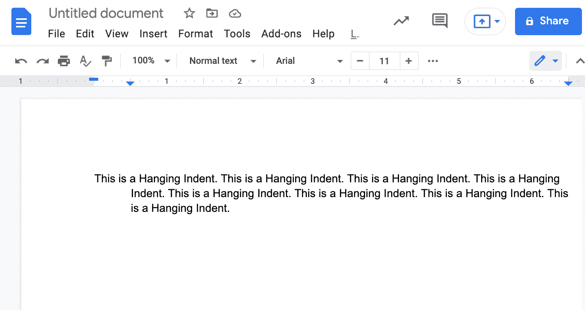
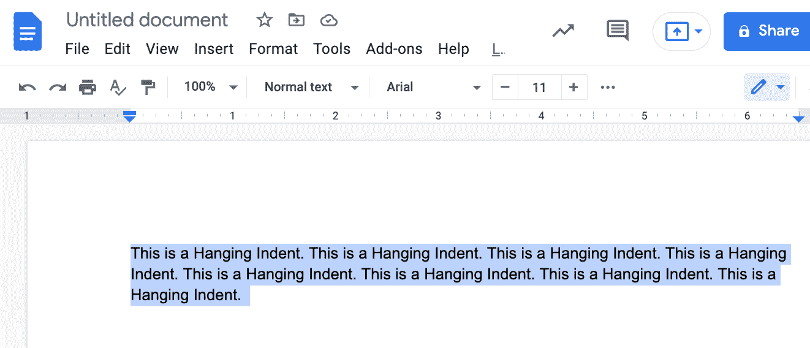
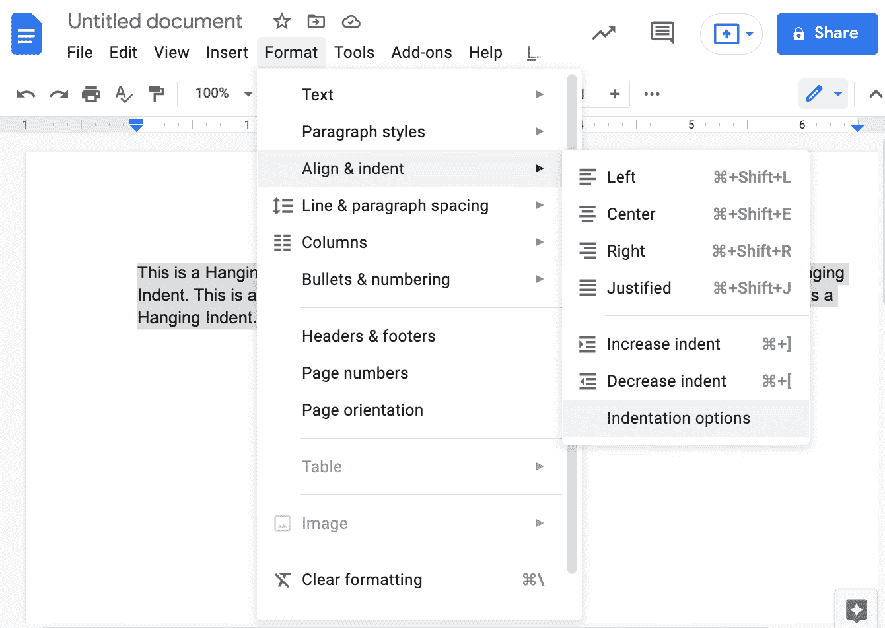
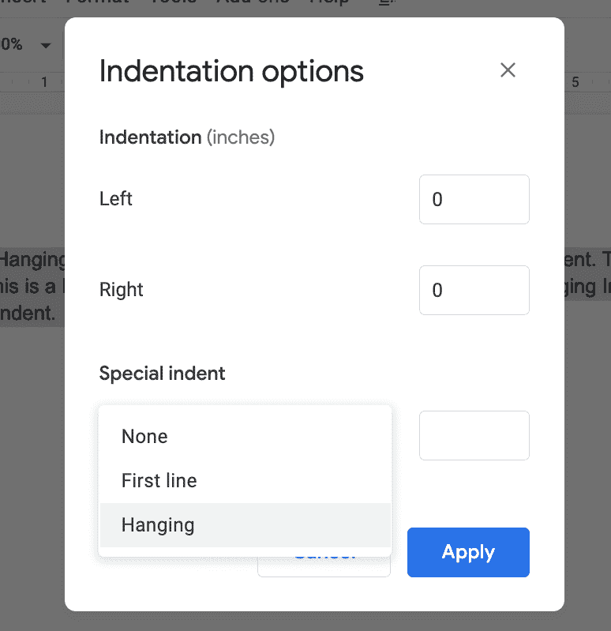

# 如何在谷歌文档中进行悬挂缩进

> 原文：<https://www.freecodecamp.org/news/how-to-do-a-hanging-indent-in-google-docs/>

悬挂缩进是使文档看起来更专业的一种简单方法。谷歌文档内置了创建这个的功能。

### 什么是悬挂缩进？

悬挂缩进是一种缩进类型，其中段落的第一行不缩进，但同一段落中的后续行缩进。

下面是悬挂缩进的一个示例:

在 Google Docs 中，您可以通过以下简单步骤创建悬挂缩进:

**第一步**:选择想要格式化的文本。您可以通过三次点击段落来完成此操作。

**第二步**:点击“格式”菜单。然后选择“对齐和缩进”。然后选取“缩进选项”

**第三步**:从这个菜单中，您可以选择“悬挂”如果需要，您可以指定要缩进多少。对于本教程，我将该值保留为默认值 0.5。

转眼间。你有一个看起来很复杂的段落，使用了悬挂缩进。

我希望这对你有所帮助。如果你想学习更多的编程和技术知识，可以试试 [freeCodeCamp 的核心编码课程](https://www.freecodecamp.org/learn)。它是免费的。

谢谢，祝你有美好的一天。