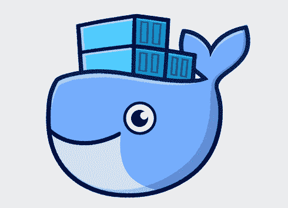
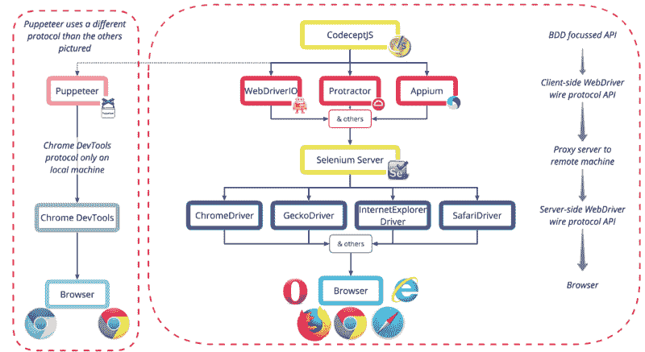
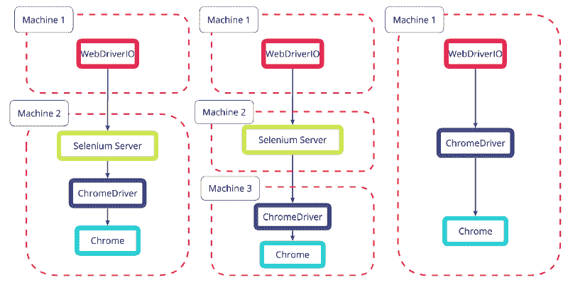
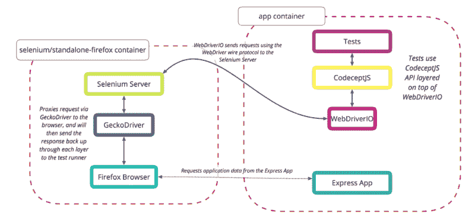
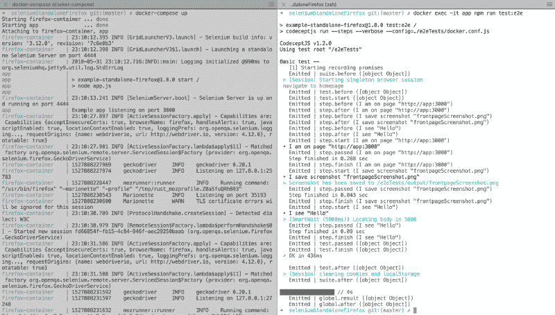

# 如何对您的端到端验收测试进行分类

> 原文：<https://www.freecodecamp.org/news/how-to-dockerize-your-end-to-end-acceptance-tests-dbb593acb8e0/>



[Source](https://www.docker.com/what-docker)

本文是一个“如何”使用 Selenium Docker 映像以及 CodeceptJS 和 Express 服务器的指南。

其中，我们将涵盖:

*   什么是 E2E 验收测试？
*   为什么要用 Docker？
*   松散耦合的测试工具
*   测试工具的层次
*   创建测试项目

### E2E 验收测试

[验收测试](https://en.wikipedia.org/wiki/Acceptance_testing)是典型软件开发过程中的一个[阶段](https://www.tutorialspoint.com/software_testing_dictionary/acceptance_testing.htm)。它包括测试产品是否满足所有的需求规格，以及它是否被“接受”为可以交付。这通常是将产品发布到生产之前的最后一个测试阶段。这可能包括基于用户的验收测试，基于业务的验收测试，甚至是 alpha/beta 测试。

端到端 (E2E)测试是验收测试的一种实现。这是验收测试的一种*方法*，但是这两个术语不是同义词。它允许从头到尾测试应用程序的流程，以查看它是否按照设计执行。在 web 应用程序的情况下，它将涉及确定用户场景和测试用户将按顺序采取的每个步骤。如果场景没有成功完成，测试就会失败。

有各种工具可以自动化这个过程，模拟用户与应用程序的交互。

### 为什么是 Docker？

创建和运行 E2E 测试通常被认为是一个古怪而复杂的过程。它需要大量的设置，当在不同的机器上或在 CI(持续集成)环境中运行时，仍然很容易失败。为本地测试和 CI 测试安装和维护不同的浏览器和 web 驱动程序需要时间。即使完成了，也可能因为一些简单的问题而失败，比如开发者本地机器上的[屏幕分辨率，或者 CI 中的](https://medium.com/@garrensmith/consistent-selenium-testing-with-docker-f2d5a24a1bc5)不同。

Docker 的标准优势也适用:不必处理操作系统兼容性或安装依赖项。要运行 Selenium 服务器，您需要安装 Java([或者至少显式地启动/停止](https://engineering.thetrainline.com/dockerize-your-webdriverio-environment-to-run-everywhere-4f98e7a1d80e))。要运行 Express，你需要 Node.js，对于 Chrome，你需要 Chrome 本身和 ChromeDriver。

当使用 Docker 时，这些依赖性被消除了。您只需使用已经包含这些内容的不同容器，无论它们在哪个机器上运行，它们的功能都完全相同。当您想到将 Docker 构建到您的 CI 中是多么容易时，将您的测试过程 Docker 化就成了一个显而易见的选择。

### 松散耦合的测试工具

当编写 E2E 测试时，有几个可用的框架，对于一个新手来说，很难知道选择哪一个并投入时间。如果你选错了，你会浪费很多时间。

这就是 [CodeceptJS](http://codecept.io/) 出现的原因。CodeceptJS 是一个测试框架，采用场景驱动、[行为驱动的开发](https://en.wikipedia.org/wiki/Behavior-driven_development) (BDD)方法，API 语言易于非工程师理解和使用。然而，也许更重要的是，它是后端不可知的。它是在几个流行的测试库(例如 WebDriverIO 或 Puppeteer)之上编写的，它的单个高级 API 可以与您选择的任何一个进行通信。《T4》的创作者相信

> 您的测试不应该绑定到您的执行引擎。无论你选择硒或木偶你的测试应该看起来几乎一样。如果你(后来)感觉到一个引擎的局限性，你可以很容易地将你的测试切换到另一个。

### 测试工具的层次



Some of the different products available at each layer of simulating user interaction with a browser

让我们采用自下而上的方法来看看每一层是如何建立在最后一层之上的。

首先值得一提的是 Selenium ，这是一个长期运行的项目，有一组常用的工具，今天它由 Selenium WebDriver、Grid、Server 和 IDE 组成。在创建这些工具的过程中，他们制定了许多行业标准，这些标准通常以他们所来自的 Selenium 产品命名，容易引起混淆。这可以在“Selenium WebDriver”和在其开发过程中建立的“WebDriver wire protocol”中看到。那些适用的将在下面更详细地示出。

#### 浏览器

任何网络浏览器:Chrome、Firefox、Internet Explorer、Safari、Opera 等等。在文档中通常被称为“用户代理”。

#### W3C 的 WebDriver 有线协议

WebDriver wire 协议是一种与 web 浏览器交互的平台和语言中立的方式。它在请求/响应对中使用 JSON over HTTP 定义了一个公共的 RESTful web 服务。它允许从外部操纵 DOM 元素，同时还允许导航到网页、用户输入、JavaScript 执行等等。

这个协议最初是由 Selenium 为 Selenium WebDriver 编写的，现在已经到了编辑起草阶段，成为正式的 W3C 标准。

其他协议确实存在，但这里不会详细讨论。所有的解释都假设后端实现了 WebDriver wire 协议。

另一个值得注意的协议是由[木偶师](https://github.com/GoogleChrome/puppeteer)使用的 [Chrome DevTools 协议](https://chromedevtools.github.io/devtools-protocol/)。木偶师不使用 Selenium 服务器，并且捆绑了一个用于本地使用的 [Chromium](https://www.howtogeek.com/202825/what%E2%80%99s-the-difference-between-chromium-and-chrome/) 的最新版本。如果你想在 Docker 中运行 puppeter，你可以使用 [CodeceptJS 图像](https://codecept.io/docker/)(随 puppeter 和 Nightmare 一起提供)或者按照官方指南创建一个能够支持它的[自定义图像](https://github.com/GoogleChrome/puppeteer/blob/master/docs/troubleshooting.md#running-puppeteer-in-docker)。

#### web 驱动程序浏览器

这些是 WebDriver wire 协议的浏览器特定实现，例如 Chrome 的 [ChromeDriver](https://sites.google.com/a/chromium.org/chromedriver/home) 或 Firefox 的 [GeckoDriver](https://github.com/mozilla/geckodriver) 。每一个都作为独立的[服务器](https://github.com/SeleniumHQ/selenium/wiki/JsonWireProtocol#server)来接收来自[客户端](https://github.com/SeleniumHQ/selenium/wiki/JsonWireProtocol#client)的请求，在那里使用 WebDriver API(通常在那里进行测试)。为了与预期的浏览器通信，必须安装正确的网络驱动程序实现**。**

#### 硒服务器

如果测试在定义它们的同一台机器上运行，那么所使用的客户端 WebDriver API 实现(如下所述)可以直接与浏览器 WebDriver 通信，并且不需要 [Selenium 服务器](https://www.seleniumhq.org/docs/03_webdriver.jsp)。

然而，如果测试要在不同的机器上运行，无论是在 CI 中，在跨多台机器或虚拟机(VM)的 [Selenium Grid](https://www.guru99.com/introduction-to-selenium-grid.html) 设置中，在远程测试平台上，如 [BrowserStack](https://www.browserstack.com/start#os=Windows&os_version=7&browser=IE&browser_version=11.0&zoom_to_fit=true&full_screen=true&resolution=responsive-mode&url=https%3A%2F%2Fwww.skyscanner.net%2Ftransport%2Fflights%2Fedi%2Fde%3Fmigrate%3Dtrue&speed=1) 或 [SauceLabs](https://saucelabs.com/) ，还是在 Docker 中，那么就要使用 Selenium 服务器。它充当代理，将来自客户端 WebDriver API 的请求转发到正确的浏览器 WebDriver，并从浏览器传回响应。



As we’ll see later, ‘machine’ can also be swapped for ‘container’

#### 客户端 WebDriver 实现

多种工具实现了客户端 WebDriver wire 协议。在这里，该协议可以被视为通过上述各层向浏览器发送请求的 API。许多使用该协议的工具都是完整的框架，比如 [WebDriverIO](http://webdriver.io/guide/getstarted/modes.html) ，它们包含了自己的测试运行程序。

其他实现包括:最初的[Selenium web driver、量角器、Appium 等等。](https://www.swtestacademy.com/selenium-testing-selenium-history/)

每个库都旨在实现相同的结果，但是关注点和 API 实现略有不同。这可以像[量角器的](http://www.protractortest.org/#/tutorial) `browser.get(url)`对[web drivero 的](http://webdriver.io/api/protocol/url.html) `browser.url(url)`一样简单。

#### 一个 API 来管理它们

如本节开头所述，这就是 CodeceptJS 发挥作用的地方。它将其他客户端 WebDriver 协议(或其他)实现称为“ [helpers](https://codecept.io/helpers/WebDriverIO/) ”，并允许您在使用一种 API 语言时指定您喜欢的助手。CodeceptJS 并不关心所选择的助手使用的是哪种协议。

WebDriverIO、木偶师、量角器、梦魇和 Appium 都是当前可用的助手。

在 CodeceptJS 中，无论选择哪个助手，前面的命令都是`I.amOnPage(url)`。这意味着，如果您想将您的后端切换到其他受支持的助手之一，您的测试将不必重写。如果你愿意的话，可以通过定制类来覆盖或者添加默认的 API 方法到 T2。

### 创建测试项目

由于有这么多层，这听起来很复杂，但在 CodeceptJS 的初始化脚本和 Docker 图像之间，我们可以很快有一个工作示例。

#### 我们将生产什么



Two containers will be used for now, though this can be extended

我们将用 CodeceptJS 编写一个简单的测试，指定一个 WebDriverIO 后端助手，它将与独立的 firefox Docker 容器中的远程浏览器进行通信。我们将使用 Express“hello world”应用程序，但这可以由您希望的任何应用程序替换。



Soon only two commands will be needed to run the Dockerized app and all test suites

一旦我们设置好了一切，我们将能够只运行两个命令来运行测试:

*   `docker-compose up --build`
*   `docker exec -it app npm run test:e2e`

通过在两个并排的终端窗口中运行，我们可以看到容器的运行和测试的实时执行。

#### *先决条件*

*   [Docker](https://store.docker.com/search?type=edition&offering=community) ，无论你在哪个机器上开发。
*   您还可以安装 [Node.js、& npm](https://nodesource.com/blog/installing-nodejs-tutorial-mac-os-x/) 进行本地开发和调试，但这些也可以完全在 Docker 中运行。

#### 文件结构

我们将产生下面的文件结构。你可以在 Github 上看到一个[的工作示例。](https://github.com/dominicfraser/CodeceptJSDockerExamples/tree/master/seleniumStandaloneFirefox)

```
|-- .gitignore 
|-- output/
|-- Dockerfile
|-- app.js
|-- docker-compose.yml
|-- package.json
|-- package-lock.json
|-- e2eTests/
    |-- common_test.js
    |-- docker.conf.js
```

#### 属国

首先，我们将创建我们的 [package.json](https://docs.nodejitsu.com/articles/getting-started/npm/what-is-the-file-package-json/) ，其中 Express 作为依赖项，CodeceptJS 和 WebDriverIO 作为开发依赖项。

```
{
  "name": "example-standalone-firefox",
  "version": "1.0.0",
  "description": "Example of Dockerizing E2E testing",
  "scripts": {
    "start": "node app.js",
    "test:e2e": "codeceptjs run --steps --verbose --config=./e2eTests/docker.conf.js"
  },
  "dependencies": {
    "express": "^4.16.3"
  },
  "devDependencies": {
    "codeceptjs": "^1.2.0",
    "webdriverio": "^4.12.0"
  }
}
```

我们还包含了两个脚本，一个运行我们将添加的 Express 应用程序(`npm run start`)，另一个运行我们的 CodeceptJS 测试(`npm run test:e2e`)。

```
codeceptjs run --steps --verbose --config=./e2eTests/docker.conf.js
```

`--steps`非常适合在测试运行时在终端中显示输出，而`--verbose`进一步扩展了细节层次。`--verbose`可能不需要作为标准，但有助于了解示例是如何工作的。`--config`向我们展示了后端配置文件的路径，在这里保存在一个单独的`e2eTests`目录中。

#### 我们的应用

接下来我们需要一个 app 来测试。为此，我们将从`app.js`开始运行 Express " [hello world](https://expressjs.com/en/starter/hello-world.html) "应用程序。

```
const express = require('express');

const app = express();

app.get('/', (req, res) => res.send('Hello World!'));

const server = app.listen(3000, () => {
    const port = server.address().port
    console.log(`Example app listening on port ${port}`)
 })
```

您可以在浏览器中使用`npm run start`查看，然后转到`localhost:3000`。

#### 测试配置

CodeceptJS 需要两个文件，一个配置文件和一个测试文件。测试文件非常简单:它测试应用程序是否可以访问，保存一个截图，并检查页面上是否可以看到文本“Hello”。

```
Feature('Basic test');

Scenario('navigate to homepage', I => {
  I.amOnPage('http://app:3000');
  I.saveScreenshot('frontpageScreenshot.png');
  I.see('Hello');
});
```

我们将使用多个 Docker 容器的第一个迹象显示在这里使用的是`app:3000`而不是`localhost:3000`。`localhost`只能从单个容器内理解。如果一个命令正在从另一个容器运行(在这个例子中是由我们的第二个 Selenium 容器中的 Firefox 运行)，那么它需要一个更明确的引用。我们可以直接使用第一个容器的 IP 地址，但是使用容器的名称更容易阅读。

在这种情况下，`app`将是运行应用程序的容器的名称，因此我们可以使用`app:3000`。如果你还不明白，不要担心，看看我们的`docker-compose.yml`是如何构建的会有所帮助。

我们还需要一个主[配置](https://codecept.io/configuration/)文件。这个可以用 JSON 或者 JS 写，但是这里我们用 JS。让我们来看看这个:

```
exports.config = {
  tests: './*_test.js',    // how to know which files are test files
  output: './output',      // where to save screenshots
  helpers: {
   WebDriverIO: {               // which backend helper to use
     url: 'http://app:3000',    // a base URL to start on
     host: 'firefox-container', // identifying where selenium runs
     browser: 'firefox',        // a series of config options
     smartWait: 5000,              
     waitForTimeout: 10000,
     desiredCapabilities: {        // for a demo app we do not want 
         acceptInsecureCerts: true,   to worry about SSL certs
     }
   },
  },
  name: 'codeceptjs-docker',
};
```

#### 设置 Docker

回头参考上面“我们将生产什么”部分中的图表，我们可以看到我们将使用两个 Docker 容器。他们必须意识到对方并且能够交流。一个包含我们的应用程序和测试，一个包含 Selenium 服务器、GeckoDriver 和 Firefox，这样我们就不需要在本地机器上安装 Firefox。

Docker Compose 是一个“定义和运行多容器 Docker 应用程序”的工具它用[命令](https://docs.docker.com/compose/reference/overview/) `docker-compose up`启动 Docker 容器，用`docker-compose down`停止它们。如果正在使用用户定义的 Dockerfile，则第一次运行`docker-compose up`或对 Dockerfile 进行更改时，使用`--build`来构建。`docker-compose.yml`是定义`up`命令将做什么的文件。

我们的下一步是创建这个`docker-compose.yml`。它严重依赖于缩进。

```
version: "2"        // which version of compose syntax you are using
services:
  app:
    container_name: app  // explicit so we can use this for app:3000
    build: .             // a self defined Dockerfile, see below
    ports:               // exposes port 3000 (where express runs)
      - "3000:3000"         to other containers, and to our local       
    depends_on:             browser
      - firefox-container
    volumes:             // maps so changes to these can be seen
      - ./e2eTests:/e2eTests
      - ./package.json:/package.json
      - ./package-lock.json:/package-lock.json
      - ./.gitignore:/.gitignore
      - ./app.js:/app.js

  firefox-container:      // we'll look at this below
    container_name: firefox-container
    image: selenium/standalone-firefox:3.12.0-americium
    volumes:
      - /dev/shm:/dev/shm
    ports:
      - "4444:4444"
```

对于我们的 Selenium 服务器、驱动程序和浏览器，我们使用可从公共 [Docker Hub](https://hub.docker.com/) 获得的名为[Selenium/standalone-Firefox](https://hub.docker.com/r/selenium/standalone-firefox/)的预定义映像。我们指定我们想要哪个版本，3 . 12 . 0-镅。如果我们没有指定这个，默认情况下将使用最新的图像(这不是一件坏事)。正如[建议](https://github.com/SeleniumHQ/docker-selenium#running-the-images)的，我们将其配置为共享主机内存，以防止浏览器运行崩溃，并暴露端口 4444，默认的 Selenium 端口。我们还将其映射到本地机器上的端口 4444，允许我们在浏览器中访问`localhost:4444/wd/hub/static/resource/hub.html`。

对于我们的`app`容器，我们不只是使用别人构建的图像，而是编写 docker 文件来指定我们的应用程序是如何构建的。与`selenium-firefox`容器一样，我们公开了一个端口，在本例中是 3000，因为这是 Express 默认运行的位置。通过使用`3000:3000`映射，我们能够在应用程序在 Docker 中运行时访问`localhost:3000`,在我们的本地浏览器中看到它。

我们的 Dockerfile 使用公共的`node:carbon`映像作为基础，设置工作目录，将一些文件从我们的本地机器复制到容器，运行`npm install`以便容器拥有所有需要的依赖项，然后运行我们指定的`npm start`命令。

```
FROM node:carbon 
WORKDIR ./ 
COPY ./package.json ./package-lock.json ./app.js ./ 
RUN npm install 
CMD [ "npm", "start" ]
```

这意味着当运行`docker-compose up --build`时，它将遵循这些步骤，导致我们的应用程序准备就绪并在端口 3000 上运行。

**注意**:只有在第一次运行`docker-compose up`时，或者对我们的 docker 文件或其中执行的步骤进行了更改时，才需要`--build`标志。例如，如果我们在`package.json`中添加了另一个依赖项，那么如果我们不重建我们的映像，Docker 就不会知道，因为`npm install`是在 Docker 文件中运行的。

#### 运行测试

我们现在有了一个简单的应用程序、为它编写的测试，以及一个 Docker Compose 配置，它将运行我们的应用程序、Selenium 服务器和 Firefox。

我们可以使用`docker-compose up --build`来启动所有这些。

要在正在运行的 Docker 容器中运行命令*，可以从另一个终端窗口使用`docker exec`。格式是:*

`docker exex <flags> <container_name&g`t；<命令>

我们将使用的命令是:

`docker exec [-it](https://docs.docker.com/engine/reference/commandline/exec/#options) app npm run test:e2e`

我们现在可以看到我们的测试正在运行，并且看到执行的每一步！从这里我们可以扩展我们的测试，添加额外的测试(文件名以`_test.js`结尾)，并使用同样的两个命令来运行它们。不需要更多的设置。

您现在有了一个易于扩展的 E2E 测试设置，无论它运行在哪台机器上，都可以以相同的方式运行。它是用开发人员和非开发人员都能容易理解的 API 命令编写的。现在剩下的就是决定你的应用程序应该支持哪种行为，并测试它！

### 最后的话

SeleniumHQ 还生成 Docker [图像用于 Chrome 测试](https://github.com/SeleniumHQ/docker-selenium#standalone-chrome-and-firefox)，以及使用 Selenium Grid 一次运行多个 Chrome 和 Firefox 实例的图像。

CodeceptJS 在 Docker 中也有运行 CodeceptJS 的[指令，这样就不需要在你的 app 中指定为依赖了。](https://codecept.io/docker/)

在我写的标题为 [*亚马逊弹性容器服务初学者指南*](https://medium.freecodecamp.org/amazon-ecs-terms-and-architecture-807d8c4960fd) *的文章的第一部分，可以看到一个关于 Docker 如何工作的更技术性但仍是初级的描述。*

感谢阅读？

*更新:*
我最近写了[定制 CodeceptJS e2e 测试](https://codeburst.io/customising-codeceptjs-e2e-tests-1a2bf5f32f51)给那些寻找复杂应用测试后续步骤的人。

#### 资源

*   CodeceptJS Docker 示例的 [Github](https://github.com/dominicfraser/CodeceptJSDockerExamples)
*   [CodeceptJS 快速入门指南](https://codecept.io/quickstart/)
*   [Selenium WebDriver 架构](https://www.youtube.com/watch?v=cDwNfAEo0lA)
*   [Selenium WebDriver 流程](https://seleniumjava.com/2015/09/13/how-does-selenium-webdriver-work/)