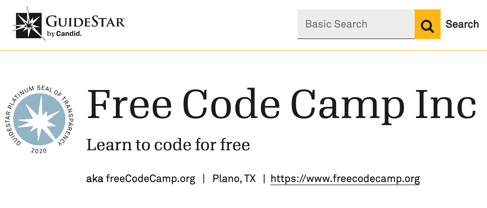
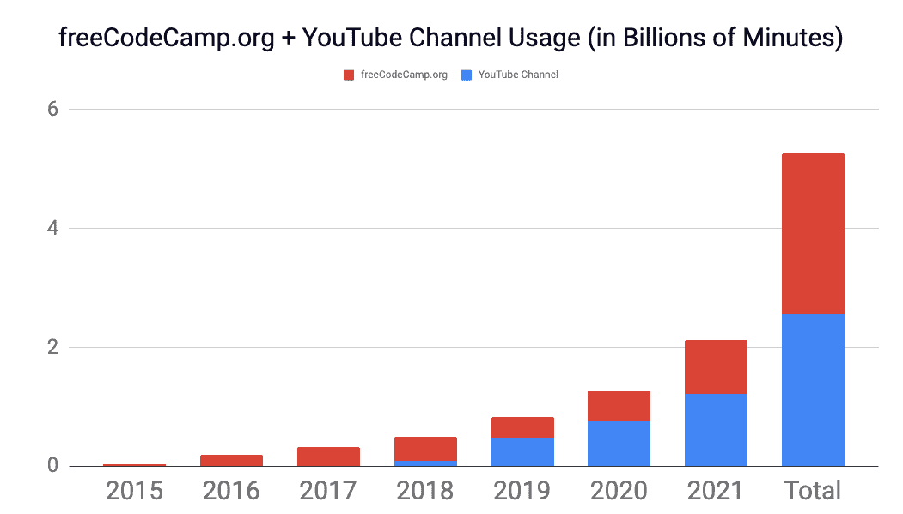

# 如何向 freeCodeCamp.org 捐款——捐赠和支持使命的方式

> 原文：<https://www.freecodecamp.org/news/how-to-donate-to-free-code-camp/>

freeCodeCamp.org 是一个 501(c)(3) [捐助者支持的公共慈善机构](https://www.freecodecamp.org/donate/)。

我在 2014 年建立了 freeCodeCamp 网站的第一个版本。现在每天有超过 50 万人使用免费代码营。

我们小小的非营利组织能够帮助如此多的人，要感谢科技的巧妙运用和数千名志愿者的帮助。

在这篇简短的文章中，我将告诉你如何通过捐赠来支持我们的使命。我会给你所有你需要的信息。

### freeCodeCamp.org 有多透明？

非常。我们有来自 GuideStar.org 的白金透明度评级。

您可以[在此](https://s3.amazonaws.com/freecodecamp/Free+Code+Camp+Inc+IRS+Determination+Letter.pdf)下载我们的 IRS 决定信。

你可以[在这里](https://freecodecamp.s3.amazonaws.com/freeCodeCamp+2019+f990.pdf)下载我们最新的 990(年度税务报告)。



A screenshot from nonprofit transparency site GuideStar.org

### freeCodeCamp 的效率如何？

freeCodeCamp 的预算比大多数类似的非营利组织要少得多。部分原因是我不擅长筹款。我们还没有引进专业的筹款人。相反，我只是什么都自己做。

我这样做是不是很傻？也许吧。但我可以看着你的眼睛，告诉你所有的钱都去了哪里，因为我亲自监督一切。

我还可以告诉你，在每年仅几十万美元的预算下，我们已经帮助了数百万人。



Both the freeCodeCamp.org website and our community YouTube channel have been steadily growing each year since 2015\. In 2021, we provided more than 2 billion minutes worth of instruction. (That's 4,000 years of helping people learn to code.)

### 人们支持 freeCodeCamp 最常见的方式是什么？

你可以[建立一个简单的 5 美元/月的捐赠给我们的非营利组织](https://freecodecamp.org/donate/)。我们是一个非常注重捐赠效率的非营利组织，您捐赠的每 5 美元都将帮助我们为世界各地的人们提供超过 250 个小时的学习时间。

每个月都有 7000 多位好心人这样支持我们。

取决于你在世界的哪个地方，每月 5 美元可能看起来不多。但它确实增加了，这种每月的方法使我们的非营利组织更容易预算其使命。

### 怎样才能一次性捐款？

如果你喜欢一次性捐款，只要你有闲钱，你就可以支持 freeCodeCamp 的使命。你可以使用[这个链接，通过 PayPal](https://paypal.me/freecodecamp) 捐赠任何你认为合适的金额。

### freeCodeCamp 接受比特币或其他加密货币的捐赠吗？

是的，我们欢迎你的加密货币捐赠。请给 quincy@freecodecamp.org 发电子邮件，他会给你一个钱包地址，你想捐哪种货币都可以。

### 我能邮寄一张实物支票吗？

是的，我们欢迎支票。您可以将它邮寄给我们:

```
Free Code Camp, Inc.
3905 Hedgcoxe Rd
PO Box 250352
Plano, TX 75025
```

### 我如何设置雇主赠送的匹配礼品或工资扣除额？

这因雇主而异，我们的非营利组织已经被列入许多大型捐赠匹配数据库。

一些人可以志愿参加免费代码营，他们的雇主通过每小时捐赠固定的数量来匹配。其他雇主将匹配捐赠者的捐赠，达到一定的数额。

如果你需要这方面的帮助，请直接给我发电子邮件:quincy@freecodecamp.org。

### 我如何能建立一个捐赠礼物给 freeCodeCamp.org？

这将是一个巨大的帮助。由于这是一个更加手动的过程，我可以亲自帮助您完成。请直接发电子邮件到 quincy@freecodecamp.org 给我。

### 我怎样才能建立一个给 freeCodeCamp.org 的遗产礼物？

我们将很荣幸将这样的礼物用于帮助世界各地的人们学习编码。取决于你住在哪里，这也可能是免税的。

你可以把这种语言，或者类似的东西，加到你的遗嘱里:

> 我将[金额为 _____ 美元(或其他货币)或我剩余财产的百分之 _ _ _ _]赠予 freeCodeCamp.org(Free Code Camp，Inc .税务识别号 82-0779546)，这是一家根据美国特拉华州法律成立的慈善公司，目前位于美国得克萨斯州普莱诺市 3905 Hedgcoxe 路，邮政信箱 250352，邮编 75025)，用于其一般慈善目的。

我要感谢维基媒体基金会为我们提供了这种正式的语言。

同样，如果你对这个过程有任何疑问，请发电子邮件到 quincy@freecodecamp.org 给我。

### 我如何能捐赠股票给 freeCodeCamp.org？

我们欢迎你的股票捐赠。请直接给我发电子邮件，我可以帮助你，并分享我们的非营利组织的经纪账户详情:quincy@freecodecamp.org。

### 我能得到一张捐款收据以便我能从我的税金中扣除我的捐款吗？

绝对的。只需将您交易的收据发送到 donors@freecodecamp.org，并告诉我们您需要收据和任何特殊说明，我们将为您回复收据。

### 我设置了每月捐款，但我需要更新或暂停每月定期捐款。我该怎么做？

只要把你每月的捐款收据寄给 donors@freecodecamp.org，告诉我们你想要我们做什么。我们将为您处理此事，并给您发送确认信息。

### 关于向 freeCodeCamp.org 捐赠，我还能了解到什么？

我想就这些了。我不是一名职业非营利高管——我是一名教师，在教学过程中，我仍在学习很多这方面的知识。

如果你想以其他方式支持我们的非营利组织和它的使命，这里没有列出，或者如果你有任何问题，请发电子邮件到 quincy@freecodecamp.org 给我。

我很荣幸你们对 freeCodeCamp.org 的信任，让我成为全球开发者社区的好管家。我们会认真对待所有捐款，以及您对我们非营利组织的任何疑问。愿和平与你同在。